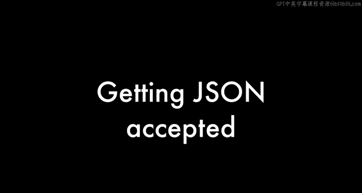

# 091：JSON发展史专访 🗂️

在本节课中，我们将跟随道格拉斯·克罗克福德的讲述，了解JSON数据格式的诞生背景、设计理念及其如何从JavaScript的一个特性演变为全球通用的数据交换标准。我们将重点关注其核心设计决策和成功的关键因素。

---

## JSON的发现与命名

上一节我们介绍了课程背景，本节中我们来看看JSON的起源。道格拉斯·克罗克福德在2001年发现了JSON，但他并不声称自己发明了它。

*   JSON是世界上最受喜爱的数据交换格式。
*   它早已存在于自然界中，克罗克福德只是发现了它，并认识到了其价值。
*   他为其命名、撰写描述并展示了其优点，但并非发明者。
*   他后来发现，其他人在2000年也产生了同样的想法。
*   使用JavaScript作为数据交换格式的最早实例可追溯到1996年的网景公司。

这是一种存在已久的想法。观察其他数据表示形式，例如NeXT和后来苹果公司使用的属性列表，除了少数表面变化，它们本质上也是JSON。因此，这种数据表示方式似乎是必然的，至少对于旨在被编程语言消费的数据而言是如此。而最终，所有数据都是如此。

---

## 从JavaScript到语言无关

克罗克福德最初从JavaScript开始，但他的第一个应用是促进用JavaScript编写的程序与用Java编写的服务器之间的通信。

他认识到，尽管JSON诞生于JavaScript，但它可以且应该是语言无关的。因此，他尽可能地简化它，剔除多余部分，试图为如何结构化数据并通过网络传输制定最简单的规范，这最终被称为JSON。

---

## 标准化之路：创建json.org

在2001年，克罗克福德所在的公司State Software开发了一个可通过未经修改的网页浏览器交付应用的平台，即今天所说的Ajax。在当时，这是一个激进的想法。

作为描述的一部分，他们会提到使用JSON在前后端之间通信。然而，潜在客户常以“这不是标准”为由拒绝使用，尽管JSON是ECMA-262标准的一个真子集。

为了让人们能使用JSON，克罗克福德决定将其“制造”成一个标准。他购买了`json.org`域名，建立了一个网页，并宣布它是一个标准。他并没有去游说行业或政府，仅仅是通过一个简单的网站，多年来人们逐渐发现并意识到它的便利性，从而开始采用它。

---

## JSON vs. XML：设计哲学与优势

克罗克福德一直不理解XML用于数据交换的一个基本模式：发送查询到服务器，返回一个XML文档，然后必须再对其查询才能取出数据。

他认为，为什么不直接以一种我能立即识别和使用的形式给我数据呢？这就是JSON的主要优势。虽然花括号比尖括号更好，但最终这些都不重要。重要的是，JSON所代表的数据结构与编程语言中的数据结构完全相同。

在Ajax被提出时，其中的“X”本意是XML。但聪明的开发者很快意识到XML太复杂，他们不想用。其中一些人发现可以用JSON代替，这要容易和快速得多。于是他们开始这样做。

当时还有其他一些XML的替代方案被考虑，但JSON是唯一一个专门为Ajax设计的。克罗克福德在设计JSON时最大胆的决定，就是不为它添加版本号，因此没有修订机制。我们被固定在了它当前的形式上。而这结果成了它最好的特性，因为它旨在成为一个底层的基础设施，是构建一切的基础，类似于语言中的字母表。字母表很少改变，JSON也应如此。

---

## JSON的未来与不变性

克罗克福德预计，也许有一天我们会发现JSON确实无法很好地处理某些重要事物，例如循环结构（图）。虽然可以在JSON中表示图，但这需要额外的交互和更多工作。

如果未来我们决定不想做这些额外工作，我们不会去扩展JSON，而是会**替换掉JSON**。即使在那之后，所有仍在使用JSON的既有开发成果将继续工作，因为**JSON永远不会改变**。这种不变性是其作为可靠基础设施的核心价值。

---

## 总结

本节课中我们一起学习了JSON的发展历史。我们了解到JSON并非被发明，而是被发现和标准化的。其成功的关键在于**语言无关的简洁设计**、**与编程语言数据结构的天然契合**，以及克罗克福德做出的**不加版本号**这一关键决策，从而确保了其作为数据交换基础标准的**长期稳定性和可靠性**。JSON的故事展示了简单、专注的设计如何能产生深远的影响。