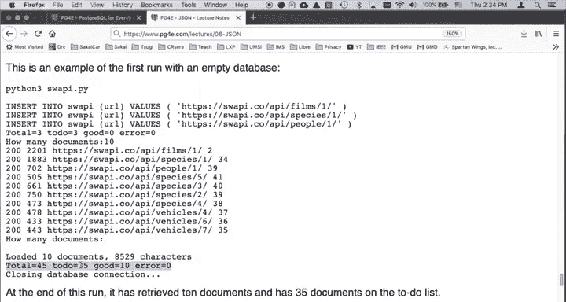
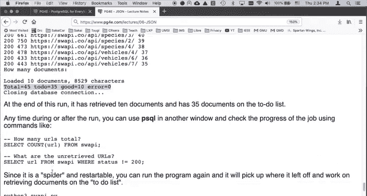
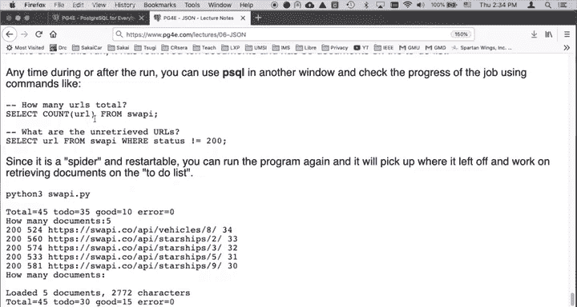
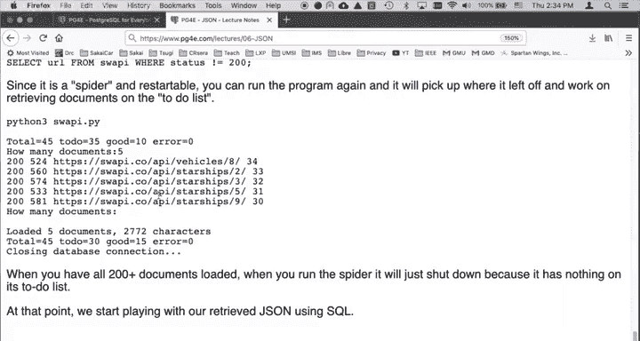

# 095：JSON API接口应用 🚀

在本节课中，我们将学习如何编写一个Python程序，从在线API（特别是星球大战API）获取JSON数据，并以一种“网络爬虫”的方式，将数据存入PostgreSQL数据库。我们将构建一个维护待抓取URL列表的应用，并最终使用SQL查询和分析获取到的JSON数据。

## 概述

上一节我们介绍了JSON的基本操作。本节中，我们将看看如何从外部API动态获取JSON数据，并将其存入数据库。这个程序的核心思想是模拟一个简单的网络爬虫：从一个已知的URL开始，解析其内容，发现新的链接，然后继续抓取，直到完成所有任务。

## 数据库表结构

程序使用一个比之前更复杂的表来管理抓取任务。以下是该表的核心字段：

*   **id**: 主键，用于唯一标识每条记录。
*   **url**: 我们抓取的目标网址。
*   **status**: 抓取状态，例如是否已成功获取。
*   **json**: 存储从API获取到的原始JSON数据。
*   **created/updated**: 记录创建和更新时间戳。

这个表的设计使得程序能够跟踪哪些URL已经处理，哪些还在等待队列中。

## 程序运行逻辑

以下是程序运行的基本步骤：

1.  **初始化**：程序启动时，会向数据库的待处理列表（`to-do list`）中插入几个已知的起始URL。
2.  **循环抓取**：
    *   程序从待处理列表中取出一定数量（例如10个）的URL。
    *   向这些URL发送HTTP请求获取数据。
    *   如果请求成功（状态码为200），则将返回的JSON数据存入数据库，并将该URL标记为已获取。
    *   解析刚获取的JSON文档，从中提取出新的、尚未处理过的URL链接，并将它们加入待处理列表。
3.  **状态报告**：每次循环后，程序会报告本次加载的文档数量、成功获取的字符数以及当前待处理列表中还剩多少任务。
4.  **持久化与恢复**：所有状态都保存在PostgreSQL数据库中。这意味着你可以随时停止程序，稍后重新启动。程序会检查数据库，从上次停止的地方继续抓取，而不是从头开始。

## 查看与操作数据

程序运行时，你可以同时使用其他客户端（如`psql`命令行工具）连接到同一个PostgreSQL数据库，实时查看抓取进度和数据内容。

当所有文档（大约200多个）都抓取完成后，我们就可以利用PostgreSQL强大的JSONB功能，通过SQL语句对抓取到的星球大战数据（如电影、角色、生物等信息）进行查询、建立索引和深入分析。

## 总结

本节课我们一起学习了如何构建一个从JSON API接口抓取数据的应用。我们了解了如何设计数据库表来管理抓取任务，实现了包含URL发现机制的爬虫逻辑，并利用了数据库的持久化特性来实现任务的中断与恢复。最终，我们获得了一个充满JSON数据的数据库，为后续使用SQL进行数据检索和分析打下了坚实的基础。