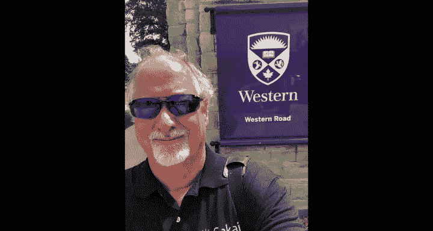

# 111：加拿大安大略省基奇纳办公时间

## 概述

在本节课程中，我们将跟随查克博士来到加拿大安大略省的基奇纳市。他将介绍自己正在进行的工作，并邀请几位正在学习“Python for Everybody”系列课程的学生分享他们的学习经历和感受。

## 查克博士的介绍

大家好，我们现在在加拿大安大略省的基奇纳市。我在这里与一家名为“Desire2Learn”的学习管理系统供应商合作，帮助他们实施一个名为“学习工具互操作性”的协议。这个协议实际上是自动评分器将成绩发送回Coursera平台的方式。

接下来，我想让你们认识几位正在学习本课程的同学，他们可以谈谈对课程的看法，并告诉我们他们的名字。

## 学生分享

以下是几位学生的自我介绍和学习心得。

*   **塔西亚和萨尔瓦**：你们好。我已经完成了“Python for Everybody”的前四门课程，正在等待顶点课程。希望一切顺利，谢谢。
*   **路易斯**：大家好，我是路易斯。我刚完成“Python for Everybody”的前两门课程，非常兴奋能跟随查克博士和整个社区学习Python。我期待继续通过Coursera的课程学习。谢谢你们从多伦多赶来。
*   **吉格尔**：大家好，我叫吉格尔。我正在学习“Python for Everybody”课程，已经完成了前两门Python课程，并且非常兴奋地准备开始第三门以及顶点课程。谢谢约翰。
*   **赫尔曼**：大家好，我是赫尔曼。我正在Coursera上学习“Python for Everybody”课程，目前正在进行第三门课。这真的很令人兴奋。
*   **戴夫**：大家好，我是戴夫。我刚刚完成了“Python for Everybody”和“Web Design for Everybody”课程，并且很期待当Django课程上线时去学习。

## 查克博士的后续计划与总结

很好。我不知道下次会在哪里见到你们。秋季学期即将开始，我将在校园里教授一门Django课程，我希望将来能把它发展成为“Django for Everybody”系列课程。因此，在接下来的时间里，我将会忙于构建自动评分器之类的工作，为我的Django课程做准备。希望能在不久的将来，在下次的办公时间活动中见到你们。

在本节课中，我们一起了解了查克博士在基奇纳的工作项目，并聆听了多位“Python for Everybody”课程学习者的真实分享，感受到了在线学习社区的活力与学习者们的热情。