# 115：将书籍数据导入Elasticsearch 📚➡️🔍

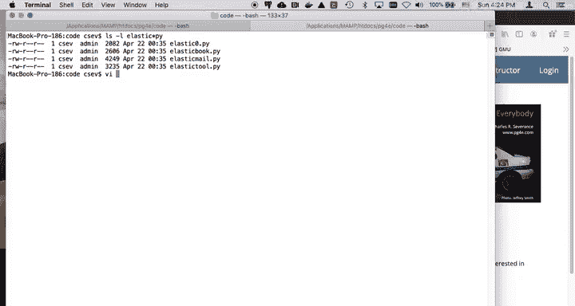

## 概述

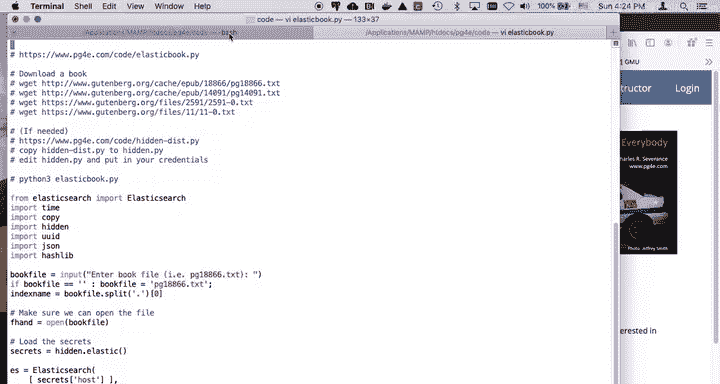

在本节课中，我们将学习如何将一本来自古登堡计划的书籍文本数据，通过Python脚本解析并导入到Elasticsearch搜索引擎中。我们将详细讲解脚本的每一部分，包括如何建立连接、解析文本、生成唯一标识符以及执行批量导入操作。

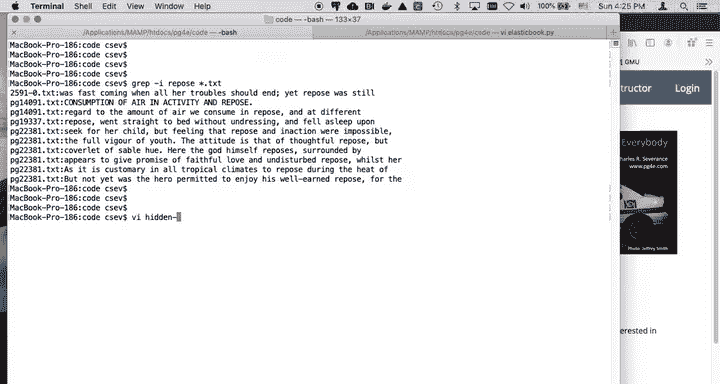

---

## 建立连接与配置

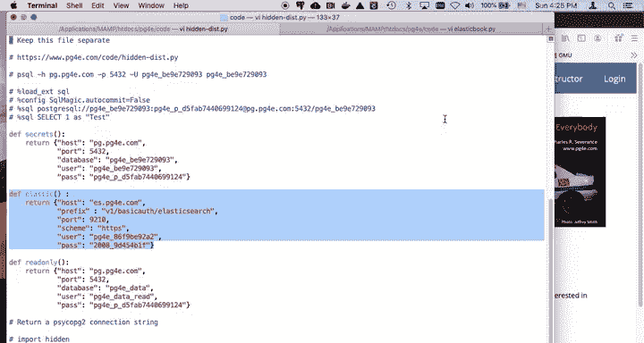

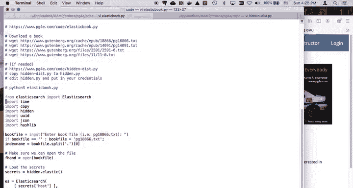

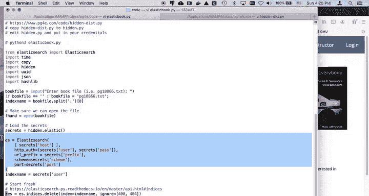

首先，我们需要建立与Elasticsearch服务的连接。这要求我们预先配置好认证信息。

以下是配置认证信息的步骤：
1.  创建一个名为 `hidden.py` 的文件。
2.  在该文件中，设置你的Elasticsearch连接凭证，包括主机地址、用户名和密码。
3.  在主脚本 `elasticbook.py` 中导入这个配置文件。

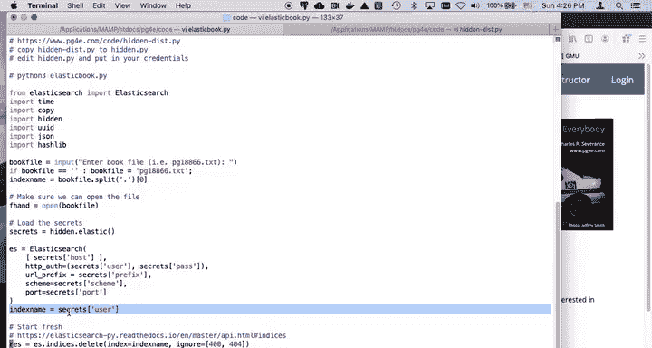

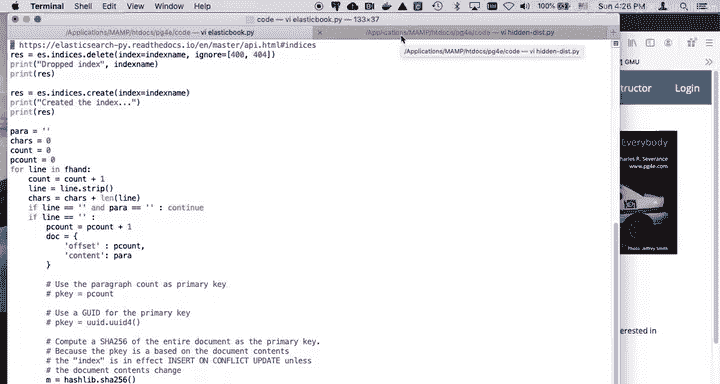

```python
# hidden.py 示例内容
elastic_host = 'your_elasticsearch_host'
elastic_user = 'your_username'
elastic_pass = 'your_password'
```

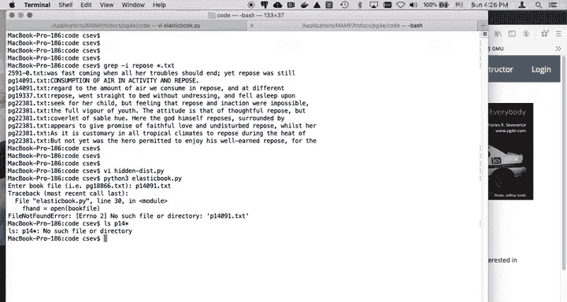

在 `elasticbook.py` 脚本的开头，我们导入这些配置并创建Elasticsearch客户端实例。

```python
import hidden
from elasticsearch import Elasticsearch

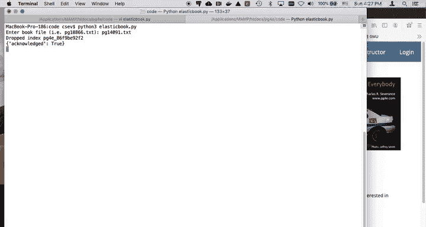


# 从配置文件获取凭证
secrets = hidden.elastic()
es = Elasticsearch(
    [secrets['host']],
    http_auth=(secrets['user'], secrets['pass']),
)
indexname = secrets['user']  # 使用用户名作为索引名
```

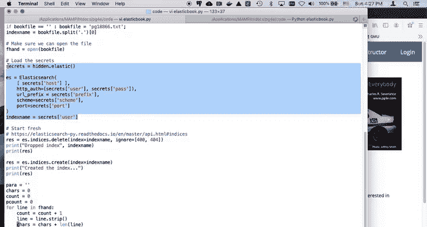

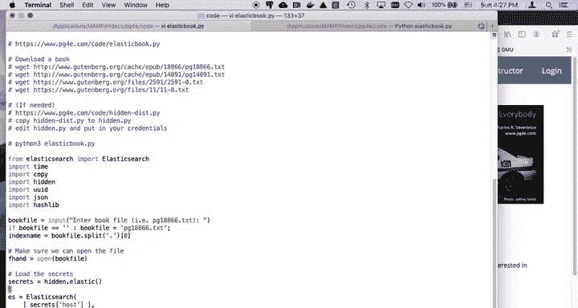

---

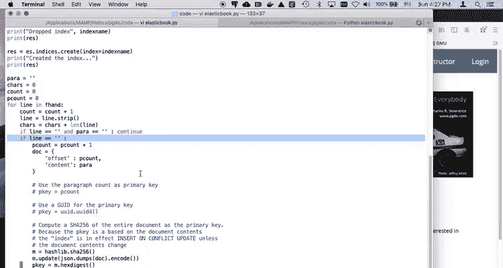


## 解析书籍文本

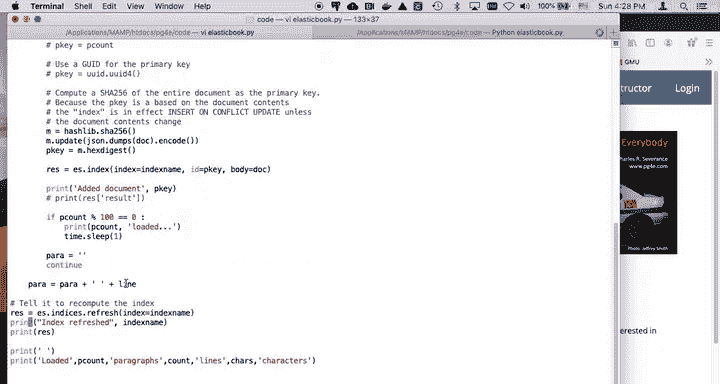


上一节我们介绍了如何建立连接，本节中我们来看看如何解析原始的书籍文本文件。脚本的核心功能是读取一个文本文件，并将其内容按段落分割。


脚本会逐行读取文件，寻找空行作为段落的分隔符。在遇到空行之前，它会将连续的非空行拼接成一个完整的段落。


以下是解析逻辑的关键代码片段：
```python
paragraph = []
count = 0
for line in fh:
    count += 1
    line = line.strip()
    if line == '' and len(paragraph) > 0:
        yield (count, ' '.join(paragraph))
        paragraph = []
    else:
        paragraph.append(line)
if len(paragraph) > 0:
    yield (count, ' '.join(paragraph))
```


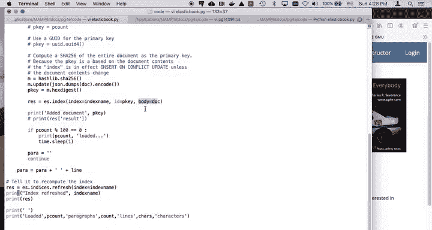

---

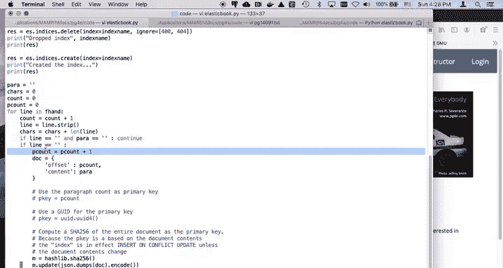

## 生成文档与唯一ID

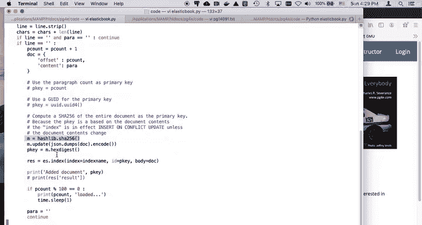

在将每个段落作为文档存入Elasticsearch之前，我们需要为每个文档生成一个唯一的标识符（ID）。这类似于数据库中的主键。

我们选择使用SHA-256哈希算法，根据段落的内容生成一个唯一的字符串ID。这样做的好处是，如果两段文本内容完全相同，它们将拥有相同的ID，从而避免在索引中存储重复的段落。


以下是生成ID并构建文档的代码：
```python
import hashlib

for para, content in enumerate(paragraphs):
    # 构建文档字典
    doc = {
        'offset': para,
        'content': content
    }
    # 生成基于内容的SHA-256哈希值作为ID
    m = hashlib.sha256()
    m.update(content.encode())
    pkey = m.hexdigest()

    # 将文档存入Elasticsearch，并指定ID
    res = es.index(index=indexname, id=pkey, body=doc)
```


---

## 执行导入与索引刷新

在批量导入大量数据时，Elasticsearch默认会延迟更新索引以提高性能。这意味着刚插入的数据可能无法立即被搜索到。

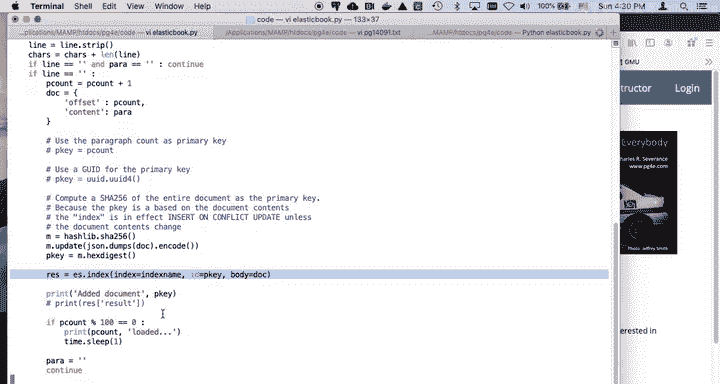

为了确保所有文档都已成功建立索引并可供查询，我们在导入循环结束后，手动触发一次索引刷新操作。

```python
# 强制Elasticsearch立即刷新索引，使新文档可被搜索
res = es.indices.refresh(index=indexname)
print("Index refreshed", res)
```

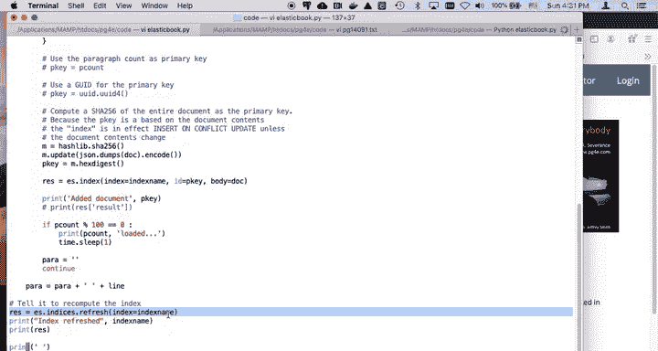

> **注意**：在生产环境中，频繁地手动刷新索引可能会影响性能。通常只在需要立即查询新数据时才进行此操作。

---

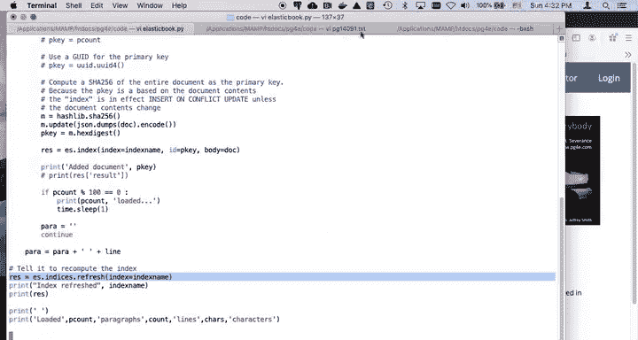

## 验证导入结果

数据导入完成后，我们可以使用一个简单的工具（如示例中的 `elastictool.py`）来验证数据。

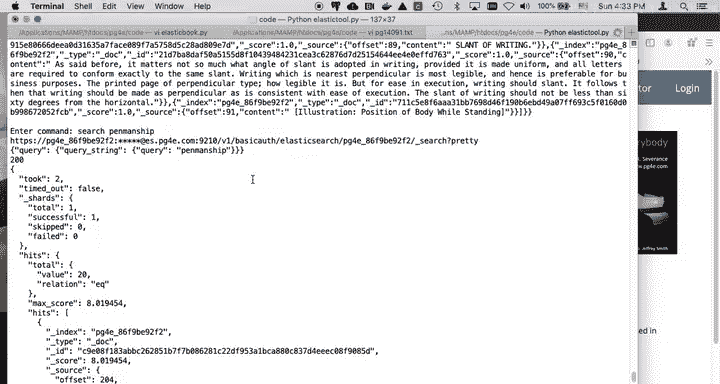

以下是几个基本的验证命令示例：
*   **查询所有文档**：`match all`
*   **搜索特定词汇**：`search penmanship`
*   **通过ID获取单个文档**：`get [具体的文档ID]`

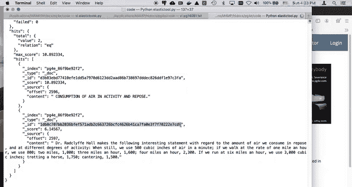

通过这些操作，我们可以确认数据已正确导入，并且Elasticsearch的搜索功能正常工作。

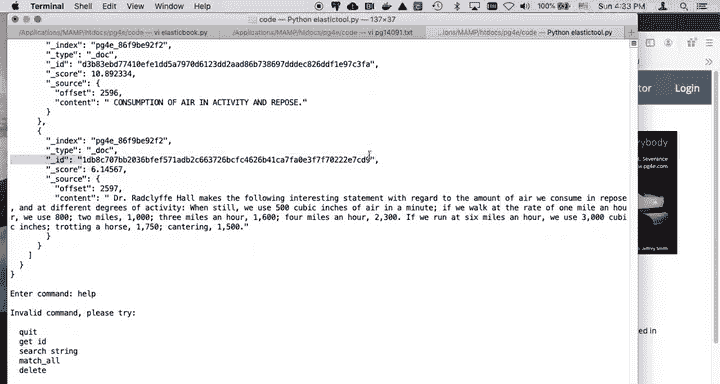

---

## 总结

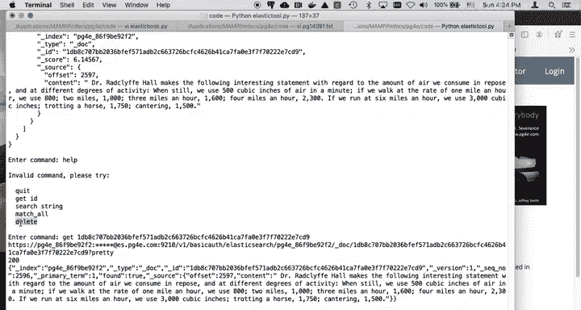

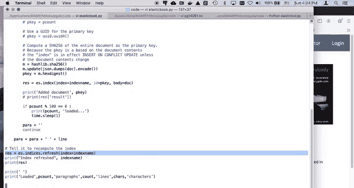

本节课中我们一起学习了将书籍文本数据导入Elasticsearch的完整流程。我们首先配置了连接信息，然后编写了解析文本、按段落分割的逻辑。接着，我们使用SHA-256哈希为每个段落生成唯一ID，并将其作为文档存入Elasticsearch。最后，我们通过手动刷新索引确保数据立即可用，并演示了如何验证导入结果。这个过程展示了如何将非结构化的文本数据，有效地组织并导入到强大的搜索引擎中，为后续的全文检索和分析打下基础。