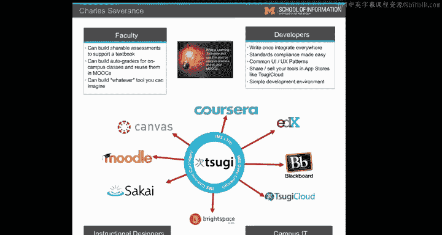

# 119：凤凰城办公时间

在本节课中，我们将回顾一次在亚利桑那州凤凰城举行的办公时间活动，并聆听几位课程学员的自我介绍与学习心得分享。

---

## 活动开场

大家好，我是Chuck。这里是又一次办公时间。我们正在Coursera大会现场。你们可以看到我们戴的这副从Coursera大会上得到的非常酷的眼镜。和往常一样，我们举行了一次办公时间，有一些学员到场。我想让他们做个自我介绍，并随心所欲地和大家说几句话。那么，我们开始吧。

---

## 学员分享

以下是到场学员的自我介绍。

**John：**
大家好，我叫John。我在这里想告诉大家，不要害怕Python。它真的很有趣，也真的很好玩。

**Jennifer：**
大家好，我是Jennifer。我上完了Chuck博士的所有课程。你们应该坚持下去，这些课程非常棒。

**Mark：**
大家好，我叫Mark。我上过Chuck教授的互联网历史课程，非常喜欢。请继续努力，我认为这是一个非常棒的项目，你们会喜欢的。

**Alex：**
大家好，我叫Alex。这是我第一次上Coursera的课程，我真的很喜欢。我的目标是有一天成为一名医学科学家。我认为，编程和计算机编程在未来10到20年，会变得像我们这代人现在打字一样普遍。所以，到目前为止，这真是一次很好的体验。

**Byron：**
我叫Byron。我上过Python入门课程，它太棒了。我想我唯一要说的就是：加油，密歇根大学！97届的，是吗？哦，加油密歇根！

---

## 活动尾声

看，我们又遇到了密歇根大学的校友。我们之间有一个共同的暗号，那就是“加油，密歇根！”。好的，就是这样。我的下一站是阿拉巴马州的伯明翰。所以，我可能会在阿拉巴马州的伯明翰见到你。那么，干杯，网上见。再见，各位，打个招呼，再见。

---

## 总结

本节课中，我们一起回顾了在凤凰城举行的办公时间活动，并聆听了多位学员的真诚分享。他们来自不同背景，但都通过课程获得了积极的学习体验，并鼓励大家坚持学习。这体现了学习社区的互助精神。