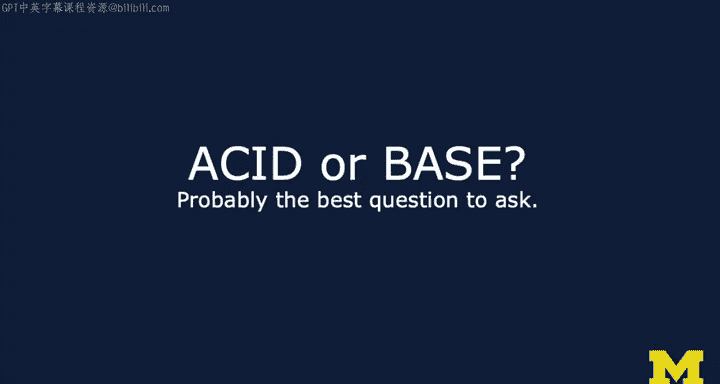
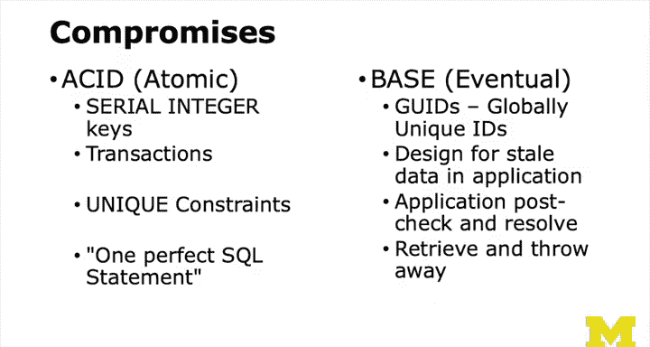

# 密歇根大学《给所有人的PostgreSQL课（数据库设计、SQL、JSON和NLP、ES）｜PostgreSQL for Everybody》中英字幕 - P102：1_SQL与NoSQL技术讲座.zh_en - GPT中英字幕课程资源 - BV1tj421U7GK

Hello and welcome to our lecture on database architectureectures。If you've taken any classes for me。

 you've seen this slide whenever I' talking about relational databases。

 whether it's mySQL or SQL light， or even Postgres in an earlier class。Every time I give this slide。

 there's this little part inside of me that like sort of breaks my heart because I'm trying in the beginning to give you a set of rules that are simple and easy to understand and database normalization is a very hard concept。

And so I'm。I'm oversimplifying here， this notion of don't replicate data is most of the time。

And the reason I just in the beginning say it's all the time is because most people when they first start out。

 don't need to know that you can replicate data if you feel like it because it's not true。

 you don't replicate data if you feel like it but sometimes you are forced by the size of your application and the scale of your application to do the replication and so it's usually true and I'll honestly say 95 out of 100 times that people say。

 know I'm just going to replicate data， they're doing it for the wrong reason and that's because they're being lazy and they're not really trying and they don't want to understand data normalization。

 so don't replicate data until you fully understand database normalization。So a lot of this。

Evolving database architecture is captured in the sort of no SQL movement， you know。

 is SQL the right answer or is there something else。

 is there something that is better than SQL that's going to be super cool and whatever and。

There is so much in technology， this sort of wheel of what's new。

 some people like say it's this tech circle where you just rediscover something they did 15 years ago and so no SQL in a way is kind of like just storing stuff on disk rather than in a database which of course is also on disk but storing stuff in files and you know honestly in 1996 we wrote a lot of web applications that did nothing but store everything in files and then we realized they didn't scale and for things like transactions and money and said you just couldn't do it in files because you're rewriting the whole file too often and then you started writing index it's like then you need transactions so。

So there's no SQL in a sense， was a movement that kind of came in you know， 2010，2013。

 It says like SQL is bad， it's too constricting look at this cool thing I found。

 And the answer is no， we all found that 20 years ago and then we decided it wasn't such a bad idea。

 So this is really not the right question is whether or not SQL is a good idea or not because SQL is just like a。

A shape， it's a syntax that we use to communicate。A better question almost is whether or not it's relational。

You know， is this a set of rows and columns and against the relational to remember is the connection between a row and a column。

 that's the relationship， not just rows and columns， that's a spreadsheet， it a rows and columns。

Is it that or are there a set of documents with key value pairs in those documents。

 and that is the nonrelational way of thinking about it， that they're not really columns。

 they're sort of one blob of text inside that blob of text， there's a whole bunch of。

Key value pairs and these days， this isn't even a good sort of way to split the market。

Really the way to split the market I think in a healthy way is to use the term acid or base this is the best question to ask and it is a question that is more about the underlying truth of how databases work and less about the syntax of it or the storage tricks that happen to be used by it and so so's this is nice a nice true technical difference between some of the。

Old traditional databases like Postgress and the new databases like Mongo or Cassandra。

And so let's look at the acid and the base acronyms， they're both a little bit contrived。

 although the acid is much older the base is sort of like a more recently convenient thing。

 so acid stands for atity， consistency， isolation and durability。

It can really be summed up with these databases go to great extent to ensure that if there is some value at a row column thing that has a 42 and if。

 if everyone is simultaneously looking at that it says 42 no matter who's looking at it and that's over time and if it changes。

 then all of the viewers of that information， so it's simultaneouslyultaneous writers and simultaneous readers。

If everyone's trying to write at it and everyone's trying to read at it at a given moment in time。

Maybe a millisecond later it's different， but at a given moment time everyone is seeing the same thing and that's the consistency when you make a change it's isolated from the other changes。

 you you know a one writer might set it to two and one mind writer moment later said it to four that's okay as long as it was two and then it was four。

 not like two for two for a little while again， four for a little while， etc cea。

 and that's the isolation that everything you do happens and then when it's done。

 it's done and it doesn't seem to move backwards in time。Durability just means that it stays there。

 so base， which is the more contrived， it's really eventual consistency is the operative concept here。

Bace means like it's pretty much there， you know， it's not as picky as the acid and state is soft。

 I know， but eventual consistency means that if there is a value somewhere in this blob of stuff of X in it and somebody somebody sets it to one and everyone looks at it and it's a1 and then sets it to two for a while who depending on who's looking at it。

 it might either be a one or a two。But then eventually gets a two。

So if you wait long enough this system will sort of percolate the change from the one to the two through everywhere and all of the readers will eventually see the two。

 it's not that it's not consistent， it's that eventually it's consistent。

 it's not guaranteed to be consistent and so you might be a reader and you might say what is it。

 it's a one， what is it it's a two and then you might even ask again， what is it and it get a one。

 but eventually after like five minutes， it's a two。

Okay so that's the basic idea and so here is a diagram of this where we have one writer that's going to this x has a value of 42 inside of the black box that is a database by the way even though some of you may be colorblind this is in red and blue for acid in bass but the color doesn't mean anything that's just kind of cute so we've got a value inside of the system of X which has a value of course of 42 and thenpe here comes a dog hi dog are you just listening and hearing me give lectures and so you decide to come in okay you can lay down there for a while sorry that was my dog hey Shelby how are you doing I have to put a picture in of you how cute you are。

So I start giving a lecture and the dog decides to come in。And so here we go。

 we've got one writer that's going to set it to 10 and one's going to set it to 20 simultaneously。

 meaning they're just racing towards this data。And you' got a set of readers that are asking what is the current value of x and they're seeing 42 at this point the writers have not done anything and so what happens at some point is the database decides probably by arrival or anything it doesn't matter because at these two things don't know what time it is but at some point it picks something and it says okay this transaction is going to happen and while it's making those changes and to the extent where it has to inform all the readers。

 it says I'm blocking the x equals 10 for as long as it's going to take until everyone who reads it is going to see a 20。

 meaning you're watching it's 1010 I mean 42， 42， 4220。And it stays 2020202020 it doesn't go 42， 20。

 4220 it's consistent when it changes to 20 it changes to 20 and doesn't bounce back and forth and then once that is finished it's not like we're prohibiting it from ever being changed again。

 we just then let that one through and then the readers。

Whatever it has to do so that everyone sees it 2020 20， 20， 10，10，10，10，10， not 2010， 2010， okay。

 so you get it。So that's acid and it's all about sort of like setting this barrier and stopping transactions from coming in once a transaction is made it into kind of the inner circle of this thing and putting up this little wall that stops things from coming in。

The key to base or eventual consistency systems is they are much more scalable because they spread the data out using many copies they're replicated and this is the oh don't replicate the idea of don't replicate is so that that asset can work so if you have one number it's really one place in the database and it's not 42 places。

 but if you have multiple servers， you could have1000 different servers and have100 copies of X and then your readers can like just read Willy nilly your readers can read Willy nilly So the thing we've introduced here in this base style is we have kind of a timest and so we have many copies of x we have three copies of x of a value 42 at time  zero right Now the key thing here is this is eventually consistent X has been 42 for a long time and all the copies of x or 42 and all the copies of x are 42 at times zero So no matter how many readers you have you say what's x they're all going see。

42。Okay， they're all going to see 42。 now ins coming in is racing。

 there's multiple riders that are going to try to set x to 10 and set x to 20。

Now the key is is that in a base style database， any of these systems can be the one that receives the request to change x to 10。

And so it changes its copy of X。To 10， but it also has to mark the time that it happened because you're going to see because we got racing happen right so we set x to 10 and we know that x in this middle system is 10 at time1。

And so if you're asking now what is X Well， depending on which of those three systems you see。

 you might see 42 or you might see 10 or you might see 42 and if you ask again。

 you don't if you keep asking and we're sort of stop this in time， you might see， oh，40 it's 42。 Oh。

 let us ask again， it's 10 Oh， no， it's not I ask again is 42。

 So this is the inconsistent moment where depending on the reader。

 the same reader Now if it's kind of cached and sticky and all that， you might see it did not change。

 but the point is as you technically could see in the outside world of watching。

X is either 42 or 10 and the 42 ones don't know that they're invalid at this point now they're like if it was a cash。

 there'd be invalid， we can't afford that kind of coordination at this point。

 we can't get them all simultaneously to change because there's 10。

000 of them right they're all over the internet and there's 10，000 of them。

We'll get there so at this point x is in an inconsistent state。

 different viewers will see different values of x， one viewer can see x flipping back and forth between two values。

And then the next thing that happens is actually before anything else happens。

 x equals 20 finds its way to another server。And it's not going to that same server because there's 10。

000 of them and so this second server， the third server at the bottom now has x with a value of 20 at time2。

Now we're done here and so the problem is is that if you're a viewer。

 you might see 42 or 10 or 20 and a single viewer might see it sort of flipping between 1020 and 42。

 you' just like what is it oh it's 42 it's 10 it's 20 it's 42 it's 1 it' 20 it could go back and forth because again the routing of the re request might go to any of these three while it's in this inconsistent state we paused it and it's an inconsistent state and away we go we got to fix it because we do have to have eventually consistent so more time passes in the middle server says。

 you know what I'm going to start telling everybody about my great news that I have a new value for x at time1 and it sends it to the bottom server and it's like well sorry Mr。

 Middle server we have a time two value so you're no good so we'll just throw away your requested update it's like okay and at this point again we have a three possible values of x at any given moment。

The middle server decides to talk to the server， which had a 42 at time  zero and is like， yeah。

 10 at time1 is way better than 42， so it's getting less inconsistent and that you can only see the value at this moment of 10 and 20 and of course you can guess what's going to happen is that the bottom one wakes up and decides time to forward all my data to all my 10。

000 closest friends connected on the internet。So it goes to the first one。

 which has got 10 at one is like， well， 20 at2 is better because it's later and that one updates it。

 we still are inconsistent and now we communicate between the third server and the second server。

And all of the data and this happens， you know 10，000 times or whatever。

 And so this is eventually consistent now for now， from time going forward。

 you no matter how many times you ask and no matter how many servers you end up touching in the asking X is now 20 and it's going to stay 20。

And so the question really is how long did it take while the value of x was inconsistent？

And so you can kind of say。Really？Is that the big deal if it's going to take？

A half a second or five seconds or 10 seconds， do we really care and what if your data is so widely spread that it's not just an X。

 it's like 100，000 x's and everyone's looking at different ones。

So eventual consistency is not entirely all bad， it is bad if it's a bank right。

 because eventually something bad is going to happen right so it is bad for a bank。

So database software basically works hard to meet sort of its semantic rules。

 so you have this atomic right， which in a moment in time it's always consistent。Things like Oracle。

 Postgres， Mysql， SQl I SQl server， all kind of classic acid based。

 and then the eventual consistency or things like Mongo。

 Cassandra and Google's big table and many others right And so basically this is this is the compromise。

 And the idea is is that you can scale these base systems far higher。

 especially and read mostly and literally almost all database work is is read mostly。

 although we'll talk a bit about。Sort of right， right。

Writes as much if not more than read sometimes those databases are a little bit different。

And so it seems like it's a pretty small compromise。

 but when you're dealing with like membership and classes and grades and money and stuff like that。

 it actually is a big deal and it turns out you spend way too much time in the application recovering from possible errors that are actually rare in base style systems。

 but you still got to go like， I just created a new account at C7@U。edduu。

Okay hang on let's wait a second and this is actually what kind of cool like in account creation when you say I'd like to make a new account what's the first thing they do they send you an email to verify your account so your account is actually is not even made yet and what happens is is think about what happens is if you ask to make an account to make an account in one browser with an email address then make the account in another browser and an email address and then you get these emails and you click so that's the kind of thing to think about about consistency now most systems when they do new accounts will have a little relational database just for new account creation even if they're a fully no SQL slash base kind of system。

So there are some compromises。One of the。Primary。Cool features of acid style databases is serial integer keys。

 but you don't do that in base style you actually generate what's called a global unique identifier that's a combination of random numbers in the current time that are carefully constructed to be global and then that becomes kind of your primary key they're longer but they're not terrible if you like in Postgres there's a pretty efficient storage for GoodIDs transactions ensure that on acid acid-based database that you're not getting stale data and you just have to have retry loops in your application in case there might be stale data and deal with the fact that you've got two new account requests from the same person because they talk to different servers when they started unique constraints are difficult again in an acid database you can say insert C7 on conflict。

 do nothing or on Clf ignore on conflict update so those。

That's when unique constraints are triggering in base you gotten on because you just don't know you're talking to one of 10。

000 servers and there's no way for them to contact all other ones you have to insert it and then find a way to recover when you turn out to have inserted the same record。

 there's no uniqueness。嗯。And。One of the things we do when we're dealing with acid databases is we build beautiful queries。

 we join a bunch of things， we sort of give this beautiful query， we hand it， we optimize it。

 we get the index disc right， and then we get a little tiny bit of data and exactly the data that we want。

You tend to sort of like say， you know what， I got 10，000 servers。

 let's just hit them all and see what happens and then throw away the stuff we don't want and we'll see sort of applications that use this type of base eventual consistency system with a bunch of retrieve and throwaway methodology。

So the next thing I' want going to talk about is the difficulty of scaling relational databases and why it is that we turned to something else as we tried to scale relational databases probably starting you。

 20 years ago。