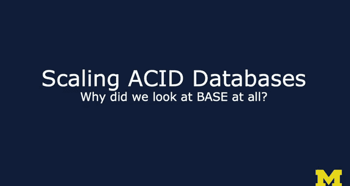
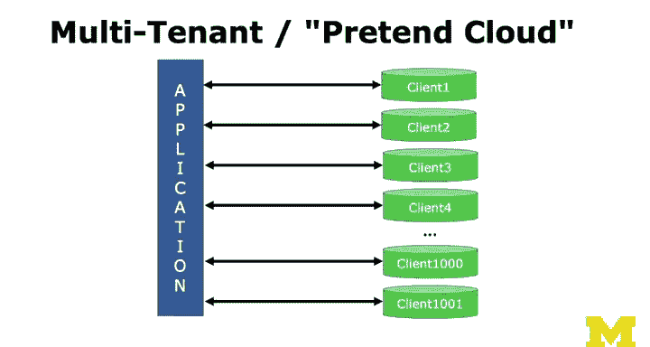

# 密歇根大学《给所有人的PostgreSQL课（数据库设计、SQL、JSON和NLP、ES）｜PostgreSQL for Everybody》中英字幕 - P103：2_关系型数据库扩展.zh_en - GPT中英字幕课程资源 - BV1tj421U7GK

So now I want to answer the question like why not use acid for everything。

 I mean it's so perfect it's so consistent and it's so amazing as I've told you in so many previous lectures。

 why did we even look at acid I mean look at base and the key is is that it was difficult to scale databases and so there's a couple of different ways to scale databases and we'll go through them one is what we call vertical scaling and that's just throwing more hardware at the problem。

More drives， more spinning disks， more channels， know more external ports。

 if you have one port and 50 disks， it doesn't do you any good but if you have 50 ports and 50 disks。

 things like rate to arrays like rate zero and Ra one。

 the idea was to just find ways to increase the simultaneous bandwidth that we could get from disk drives and mostly because what databases are doing is scanning and discarding data to produce a small data set to give you back small result set to give you back。

More CPUs and more memory， so the more you can keep of your database in cash and acid style databases are great at using memory very well so you start with you know8 gig then 16 gig then 32 gig and 64 gig and everything's better until you then hit that new limit so you just like that was great and we're super fast08 a sec it's a year later or six months later and now。

You need 128， so you can't just throw more disk drives， more processors， and more memory。

And especially in 2010， 2011， as we were moving from buying our own expensive hardware to virtualization。

 it was really difficult to virtualize like large memory and many processors and so we tended to virtualize small boxes。

 so if you wanted a big box with eight CPUs and 32 gig Ram because you needed it。

 you tended to have to do something like either buy it and put it somewhere lease space or you had to lease it and you had to make like a three yearear commitment because that was a pretty expensive you 40。

000 piece of hardware and you needed that hardware because your database。

Another thing for vertical scaling that you know there was a couple of years where how do you do your database tuning while I switched to solid state disk drives and like I'm a genius and the answer is yeah。

 that was a genius move for a while and actually SSDs when they first came out were great because their random access from place to place is fixed because they don't have to have rotational delay like disk drives do。

But then it got even better because now if you're actually reading a bunch of tiny little blocks。

 you can actually send a thing to an SSD that says since its like a scatter gather he's like this here's 32 blocks I want you to read。

 read them all and then just tell me when you got them and then they just start coming back at you and vertical scaling has been great。

But vertical scaling is never enough， right， we never have enough。

 and so we've got to find ways to tune。And so one of the classic ways of tuning a relational database is to add what are called read only replicas。

And you basically have some kind of software， maybe even the database itself。

 that looks at each of the SQL statements。Some of them are not making any changes to data and some of them are so an insert or an update or a begin transaction or something like that。

 and you look at that and you go， ohooooh， we're going to have one master database and that's a traditional vertically scale database。

 we make it as fast as we can and we're going to take transactions that either are going to require statements that require transaction or are going to change the database。

And we wrote that to the master database server and then as changes are made。

 it spews out of transaction log， transaction logs are how databases are ensure that changes are made。

 they write it to the transaction log and they write it to the actual database and if something blows up in the middle they go back and look at the transaction log and they reapply that's what transaction logs are for。

You can have a number of other servers that are watching those transaction logs and then having a replica of the database and every time they see a transaction。

 then they add it to the replica and so this actually is。

Kind of baselike eventual consistency Now you know these are delayed by maybe a quarter of a second or even less。

 depending on how awesome they are and how fast the network is and how fast the servers are so you could think of this as adding sort of baselike read stuff to an otherwise acid database and then you know things like basic counts in selects and joins and transactions that you know have no chance of modifying the database you send those to the replicas and so you can have as many replicas as you want。

 you got to be careful because at some point you can't have 1 thousand replicas hitting some poor transaction log because there's still only one transaction lot but the idea of read only replicas release the need to completely scale the master database for the reads and there could be brief moments of inconsistency but way you go now in a way this shows we'll see how this becomes kind of the modern hybrid architecture because this is already a blend of acid and base。

These replicas are ever so slightly， potentially inconsistent。

Multimaster is another kind of thing where you have two master databases。

 but because the master databases has the responsibility of sort of putting this block on all transactions on the way until the transaction in flight really completes。

 there's a lot of coordination between the masters and so people have this and but it's really a compromise because the need to send every lock and every row and everything that might modify。

However to all of them to say， here comes X， I just got a thing to x and you got to stop all x's and。

That combination of two master databases has got to be able to coordinate well enough to make it from the outside world you can't ever have consistency now of course you can you can have this multimaster now each master has a new has transaction log they got to talk to each other's transaction logs and they got to read replicas so multimaster is something that people have used at times but usually it's not a really good solution because there's so much coordination between the masters at some point it's better just have a。

Bigger master。The other。Commons thing is multiple store types so things like profile pictures in a blogging system or an uploaded picture。

 you know you don't really want to put that in database databases are fine at' storing pictures they're sign at storing blobs you can put PDFs or Quick time movies in a database。

 but it turns out that it just kind of for the database backups and so you tend to say you know what for the blobs for their large files that I'm going to deal with。

I'm gonna to have them on some kind of a shared file system because that's mostly that's such a read mostly kind of a thing And so you just kind of have a hybrid where you just say。

 you know I'm gonna to have a database table called the where are the files and then I'm going to have a file system that has files and in the example I'm using you're seeing sort of hashed names it's common to come up with what's called a single instance data store where you actually read the entire file and come up with a Sha1 or some other hash of the file and use that as the index and then you can actually have multiple virtual files in your relational database that point to the same physical file but then when you're actually going to serve the physical file like a quick time move or a PDF or a JpeEG you just use the standard open you open it you read it and you send the bytes out to the browser or whatever it is now you're deciding how to store all this stuff inside your application there's no SQL that kind of figures this out that automatically says oh it' it's a big blob so I'm going to do it completely differently。

Aid databases do often store it differently， the problem is as things like backup can be problematic。

 and so it's nice to have with this kind of a multiple store type it's nice to have an independent backup between your relational system。

And your file system， just because the， especially if you're storing your files based on some kind of a hash。

 the backup is really beautifully simple for a file system and the backup is a little harder for an acid style relational database。

 so multiple star types。There's also what I'll call a multitenant pretend cloud， I'm a cloud vendor。

 but I really don't have a cloud application and so what they have is one bunch of application code and then they have little tiny single instance relational databases。

 one for each client and then they say overall we got like 1 thousand0 clients but you also have like 1 thousand databases and it's not a bad architecture。

 it's actually it's a beautiful architecture in that it lets you have a single application for lots of clients but then it's not a reals not the fact that it might have scaled to 10 million well no it just scaled a bunch of different 80。

000 you know how many0000 it just。There's 100，100，000 person things and now it's 10 million。

 but it's not really 10 million so I'll call this pretendend cloud。

 it's not a cloud scale application， it is just a multi tenantant application that is conveniently architected to look like a cloud application。

And so if we look at this and you look at sort of how applications， let's just imagine email。

 this is a map of higher education institutions。And so you could think of email。

 relational databases were really good at handling things between 1000 and a quarter of a million and so you could imagine an email system with all the students and the alumni。

 quarter of a million， half a million maybe， and so you got a good relational database you'd buy some hardware and you size the hardware for that database and the database grows slowly because you're only going to pull in you know。

15，000 new students a year so life was good right because these are all separate databases and in that kind of fake cloud where they're all separate databases。

 they're all the same these might all be customers of one company and you know one cloud vendor of email but really there's just one database for each of these and there's still got a quarter of a million or less folks and this is。

This is the world in which acid based relational databases evolved is handling。

 let's just say a quarter of a million or less a quarter of a million was a big instance right and but if you could handle a quarter of a million like Oracle and Postgres and MySQL。

 then we can use you for the kind of thing because we had all these separate。Little databases。

 and so that's the state of databases in 2002。And up next we're going to talk about like what disrupted this and that is the first generation real cloud applications。

🎼The。