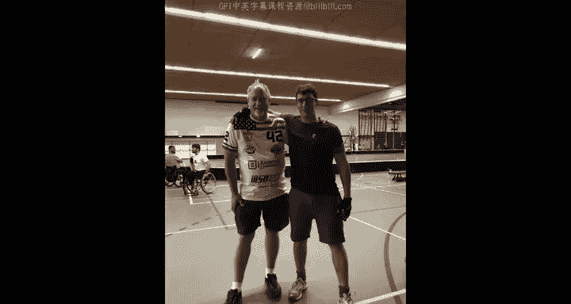

# 密歇根大学《给所有人的PostgreSQL课（数据库设计、SQL、JSON和NLP、ES）｜PostgreSQL for Everybody》中英字幕 - P104：3_荷兰布雷达办公时间.zh_en - GPT中英字幕课程资源 - BV1tj421U7GK

Hello everybody Chuck here， just finished another wonderful couple hours of office hours here in Redta Netherlands where my son is playing at a floorball international floorball tournament and we had a bunch of students show up and I want to let them introduce themselves and say a little bit about the class so hello what's your name and tell me a little bit about the class I Carol and enjoyed following your courses Okay thank you。

Hey， I'm Jerry， I'm from Belgium and I just love Python。

 So you love Python perhaps a little too much。t you just show me you're bringing tattoo up so I can see your tell us the story。

 Jerry of the tattoo。 I had it done in Kentucky。 you had it done in Kentucky That's right so So what prompted you to get a Python tattoo because I really love Python and I really enjoy the classes with you well you nows are now not you're not a bad person if you have a tattoo the way you used to be my name is Roger my story is not that spectacular。

 I don't have any tattoos of Python is true we're in the Netherlands well I just want to thank you for helping me with Kstaring with Python because your course is really like kickstaring with Python that was what it was supposed to do。

Thank you hi I'm Becky and I just really appreciate that I got to take the course several years ago and got started with computer science and you're a recovering law student that's moved from law to technology that's cool。

Hi my name is Alex， I really enjoyed your courses， your classes really helped to get started of the Python and I really liked it。

 thank you for everything。Hi I'm Rawickka I really enjoyed your class along with my boss and another colleague Bobby and Benid so if you guys are listening so it's like I'm covering for you guys it's great your class is really great Thank you Thank you。

😊，Hello， my name is Daniela。And I'm very grateful to Chuck for his inspiration and I started learning Django two years ago Co I'm going to start teaching Dngo as soon as I can。

Hi I'm Janna， I started the fighting course together with Becky and now I moved on to PhP and actually graduated earlier this week You also have an awesome tattoo。

そうです。It's peCman Yeah， it's old school， it's old school packCman tattoo wa wa wa wa。

 wa wa oh and you're chasing you're chasing the ghost tattoos are so awesome。So thanks for watching。

 I don't actually know or I will show up next， I got a whole bunch of travel in July so you'll see me somewhere in the United States in July。

 cheers。🎼So hello here we are its a very strange thing we are at the Para Games in Breedon Netherlands and I'm here with Team USA where my son is playing on Team USA in the USA wheelchair floorball League and we're playing in international games here in Netherlands and not surprisingly one of my course air students is on Team Belgium so I'd like to have you meet Thomas and have you introduced the rest of the members of Team Belgium wheelchair floorball League so hello Thomas I how are you guys my name is Thomas 34 years old I'm here with my team Belgian floorball hockey players so here they are here they are and we have to play against you guys in five minutes or something that's going to be great Python Yes Python I have been following your course of Python was great I liked it was very clearly explained good exercises。

So I learned a lot from it。 So thank you very much for that。 Well thank you for that。

 let's meet some of your fellow players Yes tell us your name I'm Michael from Belgium I live in Greece and I'm 36 years of English。

😊，So are you guys leaving？HHi， I'm Di3 and I might actually take your python course next。

 so looking forward to that hellello， I'm ons 27 years old。😊。

And I'm I'm one of the goalies of a Belgium National team。Okay， well。

 they're all really in a hurry because they have to do a team meeting because we're about to play Belgium versus USA I'll put a little footage of Belgium versus USA in the video。

Cheers。