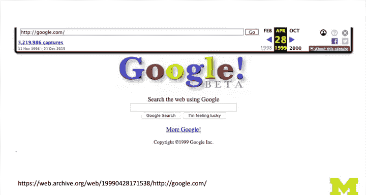
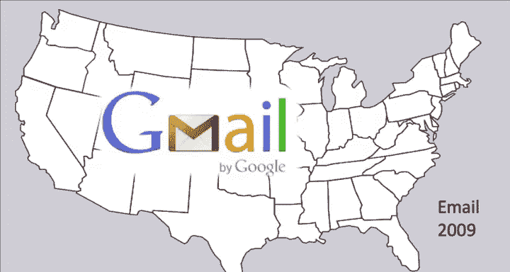
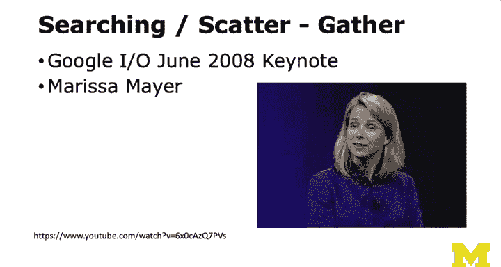
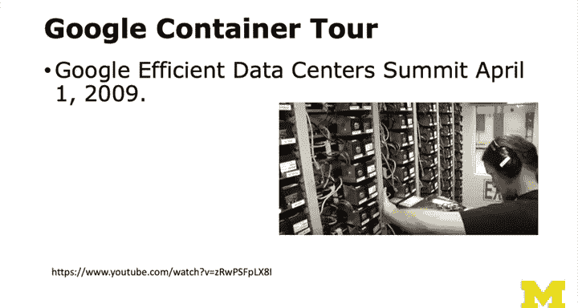
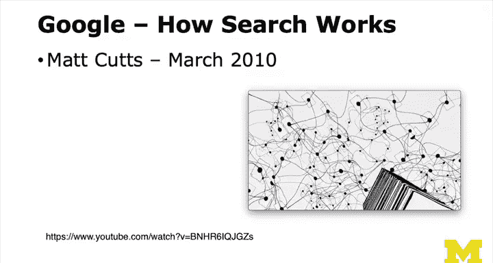

# PostgreSQL for Everybody：5：第一代云计算应用（第一部分）🚀

在本节课中，我们将探讨一场重大的技术变革，这场变革在某种意义上催生了NoSQL运动，并永久性地改变了数据库架构的设计思路。

## 从集中式到分布式的转变

上一节我们回顾了传统的数据库部署方式。本节中我们来看看是什么力量推动了变革。



在2002年之前，典型的做法是购买昂贵的大型服务器（例如一台4万美元的计算机），并在其上运行单一的关系型数据库，以支撑整个应用（如人力资源或邮件系统）。这种垂直扩展的方式行之有效，因为当时的软硬件环境都支持它。许多所谓的“伪云”供应商也采用这种技术：他们只是在亚马逊等数据中心内放置大量独立的数据库实例，并在前面加上应用层进行切换，然后声称自己提供了云服务。本质上，这只是将许多独立的数据库集中放置在一栋或几栋建筑里。

## 谷歌带来的挑战

接下来，情况发生了变化。谷歌需要构建搜索引擎。这涉及到编写一个网络爬虫来抓取整个互联网，制作一份完整的副本并建立索引，同时分析网页之间的连接关系。




这听起来像是数据库的完美应用场景，因为它关乎“关系”，就像关系型数据库一样。紧接着在2009年，Gmail出现了。Gmail不是一个只读应用，它需要处理大量的读写操作：用户登录、查看邮件、发送消息、删除邮件等。这非常像2002年大学里使用关系型数据库的典型应用。


但谷歌无法为每个用户分配一个独立的数据库实例。当时，所有人都使用 `gmail.com` 这个统一的域名。

## 最终一致性的适用场景

谷歌的一个明智之处在于，他们选择的应用程序并不严格需要事务支持，最终一致性就足够了。以Gmail为例，它有上亿用户，但每个用户基本上只在自己的数据“孤岛”内操作。用户只能删除自己的邮件，发送和接收邮件也只是在不同用户的“小世界”之间传递消息。这个过程是客户端-服务器模式的，我的操作稍后才会在你的界面中体现出来，反之亦然。

谷歌在这些云规模的应用中取得了成功。这有点像“先有鸡还是先有蛋”的问题：他们想构建这些酷炫的可扩展云应用，因此不得不放弃某些传统特性。你会注意到，在谷歌早期，他们没有计费系统。因为你会愿意在一个最终一致性的系统上处理账务吗？恐怕不会。你希望账单是准确无误的。

## 数据分片与迁移

即使在Gmail中，写操作也是广泛分布的。在Gmail早期，你的数据可能会被迁移到离你更近的服务器上。例如，如果你圣诞节回欧洲，你的数据会慢慢转移到欧洲的服务器上。你的数据“孤岛”会随着你在世界各地的旅行而移动，从而保证访问速度。

早期的谷歌应用（如搜索、Gmail）不像Facebook或Twitter那样是强连接导向的。它们更像是“为你个人准备的东西”。这些系统使用巧妙命名的文件，通过哈希（例如对电子邮件地址进行哈希）来确定数据存储位置。一个哈希值可能对应一个包含许多文件的文件夹。他们甚至可以在每个用户单独使用的情况下，采用像SQLite这样的小型关系型数据库。

以下是核心概念：

**分片** 是将一个问题拆分到多台服务器上的思想。你的数据只存在于其中一台服务器上，那就是你的分片。这与之前提到的读副本不同，在分片架构中，你的数据并非存在于所有服务器上。

```python
# 一个简化的分片键哈希示例
shard_key = hash(user_email) % total_number_of_shards
```

## 谷歌的技术揭秘

接下来，我想请你观看几个视频（可在YouTube找到）。第一个是玛丽莎·梅耶尔在2008年Google I/O大会上的主题演讲（我提供了一个较短的版本）。我当时就在现场听这场演讲。当她讲到某个部分时，我震惊了。作为一个高性能计算领域的人，我曾认为百万美元的计算机是解决大规模问题的唯一途径。但她展示了这种“聚集-分散”的技术：使用大量廉价的千元级计算机，其速度远超百万美元的单一机器，并且可以随意增加。这非常革命性。



在1997-98年，AltaVista使用非常昂贵的硬件构建了搜索引擎，而谷歌没有。

一年后，谷歌开始展示他们如何构建可虚拟化硬件的实际技术。这同样令人惊叹。在此之前，谷歌的做法是个大秘密。到了2009年，由于能源危机和对这些系统能耗成本的关注，以及硬件一两年后就被淘汰的事实，谷歌、Facebook、Twitter、亚马逊等公司意识到，为了更大的利益，他们应该分享一些高效运作的最佳实践。于是他们开始举办峰会并公开技术。

当我第一次看到这些时，我的反应是：下巴惊掉了。这就是他们的秘密？太不可思议了，我从未想过可以这样构建系统。这完全不是我（一个习惯于ACID事务世界的人）会采用的方式。




但当你观看后，你会觉得：这当然是个好主意！这里体现了 **ACID** 与 **BASE** 的本质区别。我曾是ACID阵营的人，而看到这个BASE的世界时，我觉得：哇，这真的很酷。😊

## 分布式搜索的奥秘


我还想请你看2010年马特·卡茨的一个视频。它制作精良，配有动画。请从ACID与BASE对比的视角来思考，他们是如何利用一组分布式计算机来抓取网页、建立索引并执行搜索的。



我强烈建议你观看这三个视频（玛丽莎·梅耶尔、马特·卡茨的演讲以及谷歌容器之旅），你可以看我提供的简短版本，也可以看完整版。看完之后，我们再继续讨论。


---

本节课中我们一起学习了第一代云计算应用兴起的背景。我们看到了传统垂直扩展数据库的局限，以及谷歌面对海量数据挑战时，如何通过采用最终一致性、数据分片和基于廉价硬件的分布式架构，开创了一条新的道路。这为后来的NoSQL运动和大规模分布式系统设计奠定了重要的思想基础。