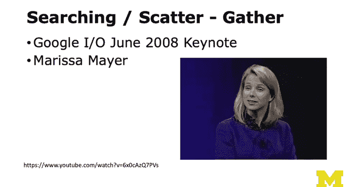
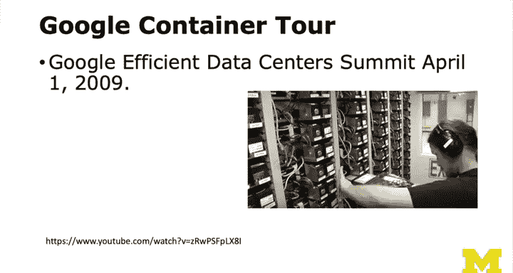
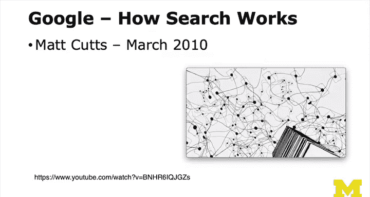
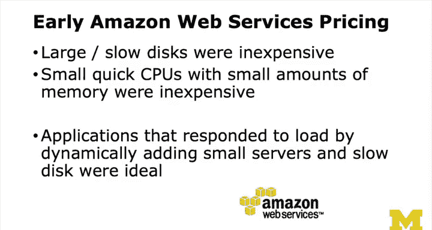

# 密歇根大学《给所有人的PostgreSQL课（数据库设计、SQL、JSON和NLP、ES）｜PostgreSQL for Everybody》中英字幕 - P107：6_第一代云计算应用（第二部分）.zh_en - GPT中英字幕课程资源 - BV1tj421U7GK

So welcome back from watching my three Google videos。

 I hope that you found them interesting and that didn't take too much time。

 So let's talk a little bit about the conclusions that I took away from each of these videos。

 so if we look at the Marissa Meyer video， the conclusion that I took away was。First off。

Google search， we kind of ascribe Google search to being an intelligent life form as it were。

 and if Google search takes a tenth0 of a second，Versus a thousandth of a second。

 we have no difference in our perception。 And so the fact that in early 2000s it probably took a quarter of a second or a half a second。

 it's faster now， but if it took a half a second to bring back what seemingly were intelligent results。

 that was good enough。 And so this is another sort of that's not so much eventual consistency but more just distributed computing。

 and the idea of the scatter and then the gather， that is a costly way of solving a problem。

 but if it's the only way to solve a problem， and the problem is tolerant of a quarter of a second latency。

We're great。So that was the first thing and that is that it's not always about how fast the second thing is is even though that's a quarter of a second。

 it's not like those resources were all busy for that quarter of a second。

 so it might take a quarter of second to go through that network of systems and then come back to you。

At the same time， it's only a thousandth or 10 thousandth of resources。

 and there could be several thousand transactions that are in flight being scattered and gathered at the same time。

 And so it wasn't like it takes a quarter of a second and this computer is busy the whole quarter of a second。

 It was just kind of stuff is just going like a giant hurricane flowing through there's controller things。

 they send them out。 they bring them all back。 And so it's not like the quarter of a second is a slow problem。

 it's the gathering in the scattering， but each operation was really， really， really tiny。

 And it wouldn't surprise me if there was relational databases。

 like sitting often on all those servers for some of the aspects。

 whether it's the crawling or the indexing or the searching。

 there could be places for little tiny isolated relational databases in that entire architecture and。

Of course， as the web got bigger or as Google's copy the web got bigger。

 you instead of sending it to 200 servers， you send it to 300 servers and whatever you just shard the entire web over 300 servers and if your search volume got too high。

 you make more sets of 300 servers or you just make it 600 servers and so what was really cool was the scalability of this that it could stay consistently a quarter of a second。

 no matter how much we started using it， right？And then the container tour again just I just figured there would be racks and there would be fancy equipment but there's not and part of this is a sense of waste why package all that you know here's a thing or it's just kind of on a piece of stuff you plug some things in because it's really just a computer and a couple of disk drives and a power supply and they even have onboard onboard really tiny batteries so that if there was some kind of a power glitch these things keep on going they don't even have a big they might have a big power glitch thing for like cooling and stuff if they got to run their cooling on diesel or whatever it is but in general each one of these little boxes they can probably tolerate it two minute outage right in then routers have their own batteries and so they're like it's these little tough little independent things there's nothing fancy about them there's no wasted packaging there's no beautiful colored plastic or like lights if there's lights there's just lights there's not like lights with a cool。

And so there was an eye to not wasting energy， and if you watch the whole thing there's a lot more about energy management in this。

There's an eye to you know these computers are just like disposable I mean some of them get old although know they use them。

 they think a lot if you read other things about this。

 they think about the life cycles of how how you can take older computers and use them for different tasks。

 etctera， et cetera， et cea and so I found this really exciting and the other thing is as you look at this。

 not start thinking about the Gmail application， not just if you look at this guy's shirt。

 I think he was part of the Google the Gmail rollout and Maria Meyer by the way was like the UI expert on Gmail so I think that's her biggest claim to fame inside of Google is her work on Gmail。

And so in Gmail you got these little boxes right and you could imagine I mean when's the last time you lost data on Gmail。

 they have somewhere between seven and 10 copies of your mail distributed within Iraq。

 distributed within a container different across containers and that's one data center distributed across data centers and distributed geographically around the world and so part of the way Google backs up your data is they don't have a data backup。

 they just replicate it right， they replicate your Gmail。

seven to1 places and eventually that's enough and so you can lose a whole data center and you shouldn't lose Gmail right you can lose a whole container and you should not use Gmail lose your Gmail right and so that's the other thing is the replication and if you look at the architecture of these data centers disk drives were cheap。

They tended to do the high performance things on only one part of the disk drive to keep the heads from moving back and forth。

 but then like the backup copies of your email could be on the rest of the disk drive so they and you can read up on this as well。

 they would only use the first 10% for critical stuff that needed to be performant and then they would use the rest of the disk to back up other disks and。

It's just like a beautiful thing and eventual consistency is the essence of it all。

 so you update your data in your email and there's like nine other copies of it and you delete a message and then those eight copies are out of date。

 but you know four or five seconds later all eight copies have the exact thing or in comess a message。

And it's the one you're talking to you see the message immediately in a couple seconds later。

 then all the copies have it So if that copy went down。

 you might like lose one email mail message right and so that it's just amazing the simplicity of the unit of computation that Google did and now we have MA cuts and what I liked about mat cuts is how something that if you didn't know how it was done like how to compute page rank across billions of web pages you're like oh wait a second you just distributed it and and at night when all the people in America are maybe asleep and not doing searches。

 you got all those CPUs and you just run through and recompute the page rank。

 the page rank algorithm is designed to be a distributed algorithm is designed to converge new pages show up and they kind of disturb the force for a while and then they recompute it how that page ranking is done。

After a while， you realize， well， if you're smart enough。

 something as complex as Google search is somewhat simple and beautiful and elegant。

This is sort of the transition from a company that bases its whole。

Lifebloo on not relational databases， or if it's using relational databases。

 it's using a lot of little ones rather than a one large relational database。Now。

 the other factor in sort of this move to NoSQL and move to distributed it and move to eventual consistency was Amazon。

And at the same time， as Google was sort of being formed， Amazon was a book company， but of course。

 what they figured out was is they had to build server farms so that they could support their books and they built things like DynamoDB so that their ordering system would be fast and run at scale so they distributed build a really cool distributed database so that their ordering system would scale。

 but then they realized， oh， wow， that's a pretty cool distributed database。

But the thing that Amazon did that probably has changed the world the most is。Amazon Web Services。

 so you think about the state of technology when everybody wanted to use cheap。Hardware。

And Amazon wanted to add virtualization on top of that hardware and so you didn't want to buy a bunch of $40。

000 computers and do virtualization there， which is what we were doing kind of in the private sector。

 what they wanted to do is do virtualization on commodity hardware which is dirt cheap right but the problem then is how can Amazon give you a 10 CPU box because if they bought that 10 CPU box because people could lease it let it go。

 lease it， let it go， lease it， let it go and they're stuck with a $40。

000 capital cost right and so it turned out in the early days disks were much larger than their performance。

 meaning they stored a lot of data but you couldn't get at it very fast？

And in terms of virtualization， you had CPUs that were very quick。

 but the thing that was expensive was the memory and so if you had like an eight gig computer back then and you're gonna break it into a couple of two gig computers and virtualization that that was really quite costly and so what they really wanted the thing that was cheap was the smaller computers。

 small small fast the CPUs were cheap， the volume of disk cheap。

 speed of disk was expensive and the memory was expensive so your move toward you get lots of slow disk not very much memory and CPU is basically free。

 volume of disk is free。CPU speed is free， memory is expensive， distransfer is expensive。

 and that's what you could buy。And so you think， well that's what I can buy and if I ask for anything else from Amazon。

 they're going to charge me hardcore， they're going to be to supercharge me， right？

So we started thinking as application developers， we either are going to buy these $40。

000 boxes that go obsolete every two years and another 40 or 10000 or 250。

000 these could be very expensive boxes could we just rent for。10 bucks a month。

 10 of those for 100 bucks a month， and it's way less expensive but we got to completely rearchitect our application because we can't use large amounts of memory and we can't expect that our discs are fast。

 but we can have a lot of disks Now if we can figure out a way to build our application to fit in that particular mold。

 then it's awesome。

So these are what we call carpet clusters right and so this is sort of what I you know a visual metaphor for what Google looked like。

 what Amazon looked like， and the key is it's buying commodity hardware that is written that scale for all of us to have a desktop computer and then that desktop computer drive the price of that hardware and is driven way down so you just buy a bunch of these things and so the extent to which that you could use a network plus a bunch of commodity computers to make what we call a carpet cluster if you could build an application that could work in that environment it was golden。

And so how do you use carpet clusters， right？ Well， you spread your data out， replicate it。

 send queries broadly， bring it back across the network， like map reduces another word for this。

 And it might take a little while， but you can have a whole bunch of them simultaneously in flight because it's the it's not the CPU while you're in a system。

 It's the moving the data into the system and getting the data back out。

 And that can be done many ways in parallel。 So you could create sort of like these。

Database creatures with 128 computers and 128 disk driveries and you could send them queries and there was like databases like Terraadata。

 for example， that created that architecture and then put it all behind a black box and let you just send queries to it and they go Richard。

 send them out and in。Yeah and you could just make it be a sharded database。

 I don't even know what Terraadata was， but I wouldn't be surprised if it was just a bunch of little clusters with a bunch of just little tiny SQL lights inside of them because SQL light is super scorchingly fast and reads to disk really fast。

 makes good use of memory but it's not good at multireader and multiwriterer so you want most of those layer outside of it that makes it look like it's multi-reader multiwriterer but really it's sharding you're sharding the queries across all these systems I never built one of these things I was more into a compute at that point then I was' in a database but just imagine how much fun it would be to build a carpet cluster database system today。

So now we'll talk about second generation cloud applications and the key to the first generation was data was in silos。

 you could have lots of silos which meant just plain。

 sharding and sending your data back and not having your data talk to other people's data was good enough and so in the second generation of cloud systems。

 we can't depend on that simplicity， we can't simplify that much and so that's what we'll talk about next。

🎼The。