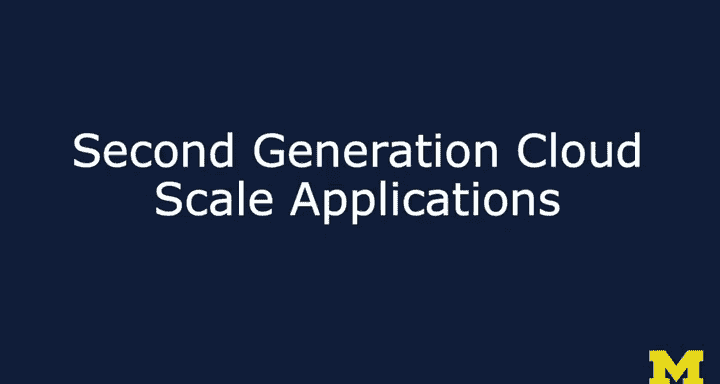

# PostgreSQL for Everybody：7：第二代云计算应用

## 概述

在本节课中，我们将探讨第二代云计算应用（如Facebook和Twitter）所面临的独特挑战。这些应用的核心问题在于如何高效地管理复杂的社交图谱和隐私规则，这催生了新的数据库设计理念——最终一致性数据库。

---

上一节我们讨论了第一代云应用（如Gmail和Google搜索）的架构。本节中我们来看看第二代云应用，它们面临更复杂的数据交互挑战。

第二代应用以Facebook和Twitter为代表。它们面临的核心挑战是：用户不再仅仅与自己的数据交互。在Gmail中，用户主要处理自己的邮件，操作相对独立。但在Facebook中，用户需要管理好友关系、复杂的隐私规则，并且每个人的信息流视图都是独一无二的。

因此，无法像Google那样使用一个统一的全局搜索索引。相反，需要为每个用户创建其专属的视图索引。这导致传统的单一关系型数据库实例（RDMS）无法满足需求。

解决方案是采用分片（Sharding）和复制（Replication）技术。数据被分散到多个服务器上，但目标是将用户所需的数据高效地“推送”到其所在的分片，以减少查询时的跨服务器通信。

---

以下是第二代应用数据分片的一个简化示例：

假设我们构建一个类似Facebook的应用，使用四个服务器，按用户姓氏首字母范围进行分片：
*   A-F 用户 -> 服务器 1
*   G-M 用户 -> 服务器 2
*   N-R 用户 -> 服务器 3
*   S-Z 用户 -> 服务器 4

这些服务器上的数据库彼此不直接通信，数据迁移的责任由应用程序逻辑承担。

现在有四个用户：Amy、Greg、Sarah和Ron。他们互为好友，但数据存储在不同的服务器上。当Amy登录时，她看到好友Greg发布了一条关于披萨的状态。

---

一个简单的互动（例如Amy给Greg的披萨状态点赞）会引发复杂的数据同步问题。

这个“点赞”信息必须被发送到Greg所在的服务器进行记录。但问题在于：Sarah也是Amy的好友，她是否应该看到这个点赞？Ron是Greg的好友（但不是Amy的好友），他是否应该看到这个点赞？这还涉及到隐私规则（例如，Ron是否屏蔽了Greg？）。

目标是：当这四人中的任何一人登录时，他们无需查询其他服务器就能看到Amy对Greg帖子的点赞。这要求“点赞”这个事实必须被提前推送到所有相关用户所在的分片服务器上。

这个过程的复杂性取决于许多因素，例如好友关系、隐私设置等。即使是这个最简单的例子，也立刻变得非常复杂。这解释了为什么Facebook的隐私选项如此精细。

---

这个例子的核心并非Facebook本身，而是**最终一致性数据库**的概念。Facebook是最终一致性数据库的一个典型用例。

工程师们致力于实现“数据推送到边缘”的架构。数据被分片，但会被复制和迁移，使得为用户生成信息流（或时间线）更新的成本尽可能低。预先将数据推送到10个不同服务器（对应你的10个好友）的成本，远低于每次你登录时再去查询这10个服务器来获取更新。

因此，这是一个典型的**最终一致性**场景。你执行一个操作（如点赞），可能需要5到10分钟，所有相关用户才能看到这个更新。Facebook努力降低这个延迟，但其本质仍是最终一致性的。你会注意到，像“添加好友”这类操作通常是分两步完成的（发送请求 -> 对方接受），这种设计本身就适应了最终一致性数据库的工作方式。

---

工程师们在解决这类复杂问题时，有时会过度泛化他们的解决方案。

这幅来自XKCD的漫画形象地描绘了这种现象：左边的人说“能把盐递给我吗？”，右边的人却回答“我知道，我正在开发一个传递任意调味料的系统”，并认为“从长远来看这会节省时间”。

许多工程师在成功解决像Facebook好友列表这样的复杂问题后，可能会想：“我构建的这个东西很酷，在Facebook上运行得又快又好，其他应用是否也能使用完全相同的解决方案呢？” 这种想法催生了新型数据库的诞生。

---

## 总结

本节课我们一起学习了第二代云计算应用（如社交网络）带来的数据管理挑战。核心在于处理复杂的社交关系和隐私规则，这无法通过单一的关系型数据库解决。我们介绍了通过**分片**和**数据预推送**来构建**最终一致性**系统的理念。这种架构牺牲了强一致性，换取了可扩展性和性能，并最终催生了新一代的NoSQL数据库。