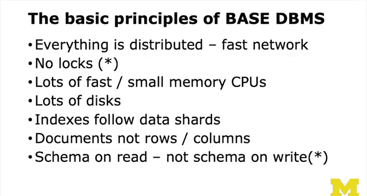
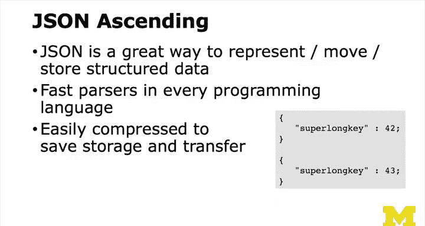
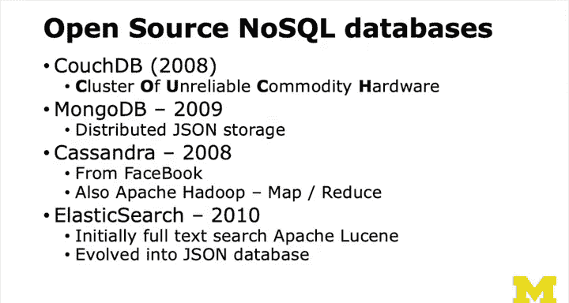
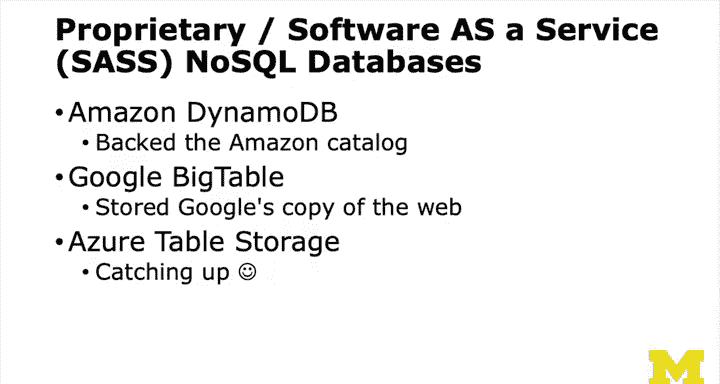
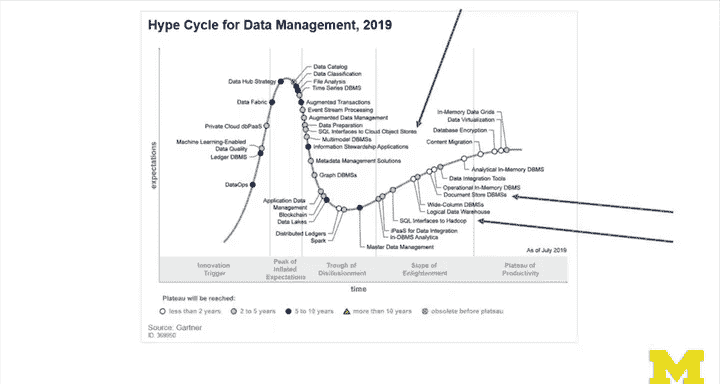

# PostgreSQL for Everybody：8：BASE解决方案的兴起（即NoSQL）🚀

在本节课中，我们将探讨早期的云实验如何演变为NoSQL运动，并了解BASE风格数据库的核心思想、关键技术以及它们在实际应用中的兴衰历程。

---

## 概述

我们将从早期云实验的背景出发，介绍BASE风格数据库的设计理念，包括其分布式、无中心锁、文档存储等核心特征。接着，我们会探讨JSON格式的兴起如何推动了NoSQL的发展，并列举几个重要的开源NoSQL数据库。最后，通过一个真实案例，分析NoSQL技术的优势与挑战，以及行业对其认知的演变。

---

## 从云实验到NoSQL运动

上一节我们讨论了数据库的基本概念，本节中我们来看看一些早期的云实验如何逐渐形成了NoSQL运动。

BASE风格的数据库建立在快速网络之上，其设计目标是将数据尽可能广泛地分布。这类数据库没有中心锁，依赖大量快速、低内存的CPU和多个磁盘驱动器。数据通过分片技术进行管理，索引的作用更多地是定位数据的位置，而非传统的关系型查询。

最终，数据以文档形式存储，而非传统的行和列。例如，好友列表本身就是一个文档。另一个特点是，开发者无需预先定义严格的应用模式（即包含行和列的数据库结构），数据更像是包含键值对的文档。如果需要，可以随时添加新的键值对，这提供了一种灵活的“迁移”方式——本质上是一种“读时模式”。你只需写入文档，然后在读取时寻找你期望存在的键值对。

---

## JSON格式的推动作用

与此同时，JSON格式开始流行，它极大地促进了NoSQL的发展。

JSON是一种优秀的键值对表示格式，每种语言都有其快速解析器。虽然我从未构建过解析器，但可以想象，如果需要对JSON进行压缩以节省内存和缓存空间，将键名转换为数字会是一种非常高效的压缩策略。这能节省存储空间和数据传输量。JSON是一个非常酷的格式。

起初它看似简单，但后来人们发现JSON已经渗透到各个领域，这确实是一件美妙的事情。

---

## 开源NoSQL数据库的涌现

在这个时期，一系列开源NoSQL数据库开始出现。

以下是几个重要的代表：
*   **CouchDB**：其设计基于“不可靠商用硬件集群”的理念，这正是我们之前讨论的。
*   **MongoDB**：常与Node.js生态系统一同出现，提供JSON存储。随着应用更多地向JavaScript迁移，以及AJAX、JSON乃至微服务的兴起，MongoDB成为了这场运动的重要组成部分。
*   **Cassandra**：由Facebook工程师开发，旨在提供类似Facebook能力的开源解决方案。
*   **Apache Hadoop**：是NoSQL领域的另一个开源解决方案。
*   **Elasticsearch**：其初衷是复制谷歌的搜索能力，专注于索引技术。虽然后期有人将其用作NoSQL数据库，但其核心优势在于强大的搜索和倒排索引能力。许多NoSQL数据库可以看作是在相对简单的文档存储之上，叠加了强大的搜索能力。

谷歌搜索本质上就是一个极其强大的倒排索引系统，其工程重点不在于存储文档，而在于如何以可扩展的方式构建、维护和理解倒排索引并加以有效利用。

---

## 软件即服务（SaaS）的兴起

软件即服务（SaaS）也是一个有趣的趋势。

例如，亚马逊的DynamoDB，用户甚至无需了解其内部工作原理。它是亚马逊自身使用的技术。其优势在于，用户无需安装MongoDB并雇佣高薪专家来维护集群，只需根据进出DynamoDB的流量付费即可。虽然每月一万美元的数据库费用看似昂贵，但相比雇佣多名资深开发人员的成本，亚马逊的服务显得非常划算。

谷歌有Bigtable，微软Azure也在持续追赶。晚入场的优势在于可以借鉴他人的经验，节省大量开发时间。

---

## 初创公司的技术选择与挑战

当时，许多初创公司都梦想构建像Facebook、YouTube或谷歌那样的“第二代”云规模应用。

这个时期出现了几个趋势：
1.  客户端应用（如Backbone、Angular、React、Vue等JavaScript框架）的兴起。
2.  Node.js使得JavaScript可以同时用于客户端和服务器端。
3.  JSON数据交换和AJAX技术的普及。

于是，初创公司常选择如MongoDB加Node.js这样的技术栈。他们起步时没有客户，代码写得快，初期运行良好。但当用户量增长到十万级别时，系统往往崩溃。这就是问题所在。

回顾2012年的技术成熟度曲线，NoSQL数据库正处于“技术萌芽期”，备受讨论，随后爬上“过高期望的峰值”。人们从觉得它很酷，到相信它能解决所有问题，再到发现它并非万能。大约到2016年，行业不再单独强调“NoSQL”这个词，因为它本身含义已过于宽泛。“BASE风格数据库”或“最终一致性数据库”是更有意义的表述。

---

## 一个真实案例：优势与陷阱

我有一个朋友创办了一家公司，后来出售了。这家公司叫Verite，他们面临一个问题：需要处理约100TB的数据（这是一个检查论文是否抄袭维基百科等的系统）。他们计划构建一个多租户、单实例的第二代云应用。

和许多人一样，他们最初用MySQL做概念验证。但由于不想投入大量精力学习分片技术，他们选择了一个开源的NoSQL数据库——Cassandra，并租赁了一批硬件。

起初运行良好，直到出现问题。他们不得不聘请昂贵的Cassandra专家，但问题并未根本解决。所有声称“无限扩展”的NoSQL技术都有其极限，问题在于你无法预知它何时会失效。相比之下，像PostgreSQL这样有数十年历史的技术更为稳定。

最终，咨询失败了。他们不得不丢弃所有Cassandra代码和硬件，将整个系统迁移到亚马逊云，并改用Amazon DynamoDB。之后，系统开始正常运行。他们从向顾问开支票（却得到糟糕结果）转变为向亚马逊开支票（并获得可用的服务）。关键在于，DynamoDB并非魔法，你需要学习其工作原理。但学会后，升级、调优等工作都可以交给亚马逊。

使用NoSQL数据库使得这家初创公司能够与一家规模更大、使用自建数据中心和自行分片技术的公司竞争。那家大公司因其技术选择而缺乏敏捷性。尽管这家初创公司的亚马逊账单很昂贵，但相比竞争对手的成本仍然低得多。这是一个关于NoSQL既成功又警示的故事：要谨慎对待网站上宣传的技术，不要盲目采纳。

---

## 总结

本节课我们一起学习了NoSQL运动的兴起。我们了解了BASE解决方案的核心设计，见证了JSON格式如何成为关键推动力，并认识了几种主流的开源NoSQL数据库。通过案例分析，我们看到了NoSQL技术在提供敏捷性和可扩展性方面的优势，也意识到了过早采用不成熟技术可能带来的风险和成本。现代对NoSQL的理解更倾向于将其视为适用于特定场景的、很酷的文档型数据库。然而，传统的ACID数据库厂商并未停滞不前，我们将在下一节讨论他们对NoSQL兴起的反应。