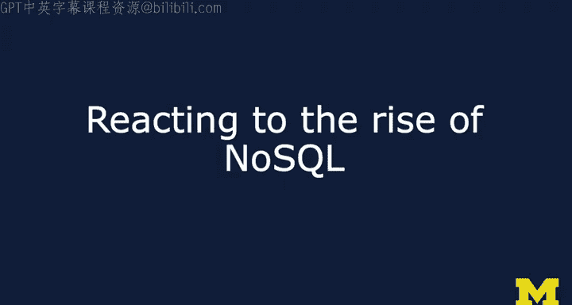
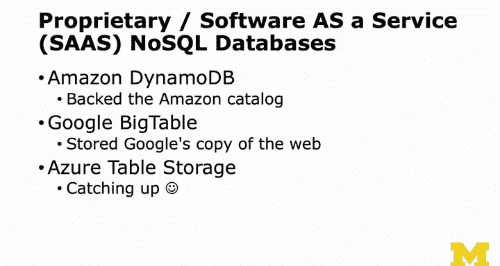

# 密歇根大学《给所有人的PostgreSQL课（数据库设计、SQL、JSON和NLP、ES）｜PostgreSQL for Everybody》中英字幕 - P110：9_应对NoSQL的崛起.zh_en - GPT中英字幕课程资源 - BV1tj421U7GK

So the NoSQL movement comes out of these second generation highly complex。

 pure cloud systems like Facebook， and then a whole bunch of startups that wanted to capitalize on this notion to operate at cloud scale。

 everyone wanted to have a single application， which is not a bad thing， but。The。

The asset vendors who had been doing this for 1520 years， some some from the 60s and on。

 they were like， wait a second。 you know you upstart to think you know something about database。

 We actually did learn something in 20 years of database systems And so they saw in 2013。

2014 that if they SAT down and just said were better that they would lose market share and there's no question about it。

 I mean， everybody thought no SQl was the answer to everything in 2013，2014。

 But the problem is also in 2013，2014 those who were using base style databases started to complain because every once in a while they wanted to do a join。

 And every once in a while， they would want to lose something like a transaction to do a new account or some billing or whatever。

 And so what happened was is the no SQL vendors were hearing complaints and。

And a lot of vendors tried no SQL and then ended up with sort of a negative results or costly results。

And so what happened was is you saw like a rush to acid plus base。

And if we go back to the database scaling， asset vendors have had kind of a baseline like variation with Master and Reed replica。

And the technology didn't stand still either in that decade between 2009 and 2019。Amazon now can。

 I don't know how they do it， but they can sell you a 32 CPU system with a whole bunch of Ram and talk to slow disks really。

 really， really fast and you can't own it。 So if you want to vertically scale an application。

 you can you can it's not just a carpet cluster anymore Amazon。

Has done amazing things to give you a wide range of buffet of wonderful hardware that you can buy。

And the change from spinning disk driveries to solid state dis driveries is changing everything。

 I've already mentioned the scatter gather as a notion， right？Like the Google Sctter gatherer。

D drives can now do scatter gather。 And so you can。

 who knows by the time you're watching it maybe more than 32， But some disk drives。

 you can say I want this block and this block and this block and this block and this block。

 bundle that up into effectively in one message fired at the disk drive。

 and then disk drive is like it fast as it can give you those things back。

 you get all those things back。 Now think about a database that has blocks and all the stuff we've talked about of how databases work。

 You can ask for 32 blocks。 If you have a little bit of inmemory information。

 And you say give me these 32 blocks。 It's as if you asked for one block。

 It's just like wholly mackerel。 So the ability to scale relational acidbased databases has greatly improved in that decade。

 And so it seemed like every time like a cassanda or mango would like be better。 you just like， well。

 I just bought new hardware and my old fashioned Postgre is pretty fast。

And so they also had these acid style database vendors reacted。

 they're like like this is kind of easy， we could add this to our stuff pretty easily and so Oracle adds JSON columns。

 MySQL add JSON columns， Oracle adds some kind of a no SQL database I don't know as much about Oracle that I don't want to know。

 but mySQL 8 really is the addition of really cool and flexible JSON columns。

I told you why I'm not using my SQL because I fear that Oracle wills bend away from open source。

 Postgress is pure open source。Posgress has slowly over the years。

 2008 through 2014 have been adding and now we're lucky here that their JSON B。

 which is by far their most sophisticated sort of aggregate column came out in 2014。

 so it's at least five years old。If we were teaching this course in 2014， you might like say， well。

 you might not want to use JSON B， but I mean today let's use JSON B。🤧う。And just as an example。

Of this is Amazon has built a data backhand that just a data lake basically called RedSshiftft。

And it's like based on Postgress， it's not based on Cassandra， Cassandra member came from Facebook。

 but Amazon's like I'm going to build a data like， oh， and I'm going to grab Postgress。

 another thing that's a little less well known is that a little while back。

 Amazon got rid of all of its oracle presumably replacing it with Postgres which means that Amazon's own infrastructure。

 its own billing and its own tracking uses in effect 100% open source technology and I think that greatly benefits we in Postgress now Amazon Redshift is based on AO which is before HSt JSON and JSON B。

 but I'm going to guess that what they really did was they advanced some of those features。

And and separately from the open source community， which more slowly put them in in a way that we can use to some degree that。

 you know， and theyre they I'm sure Amazon Redshift is a very efficient master slave replica kind of a thing because it's really the redshift is aimed bit kind of a。

Pulling in lots of data simultaneously and a lot of simultaneous readers。

 and so they probably just tweaked everything， but you still kind of pretend it's SQL。

So it turns out that it has been easier for the oldline acid vendors to add base features than it was for the new base vendor base folks that started distributed to come up with kind of this non-distributed way and part of it had to do with the master slave replica model So the other thing that's happening is it used to be the reason no SQl doesn't have so much meaning anymore is SQl does not imply acid。

 the concept of begin transaction， select for update， etc ceter。 Yes。

 that is acid to implement that correctly you have to have acid but just the select and the insert and update that's neither acid nor base that's just a syntax and so。

Folks got there was a feeling like SQL was going to die and that's why they called it no SQL。

 and then after they realized SQL was not going to die and that SQL is probably better for 90 to 95% of the applications。

They kind of realized， well， let's just kind of join the SQL movement and have a different set of semantics that underlie it in the base so you can either have SQL with acid semantics or SQL with base semantics。

And so the runtime is what changes right and so you're seeing a trend towards yeah here's this completely distributed database but we got SQL but don't do a begin transaction because that'll blow thing and that won't work very well because it's it's really distributed underneath right it's yarded and distributed underneath but it makes it so developers can move back and forth and so I think most applications really these days should start out as acid- based applications using something like Postgres and then they could move to something but why not so everyone's going to learn SQL which was not。

A foregone conclusion in 2012 that we might SQL might become like a dinosaur and go away but it isn't going to be a dinosaur。

 so now you might as well take the base style database vendors and for them to support basic SQL。

 not all that hard right， they're supporting the subset and they're clear on what that subset is。

 but it makes it easier for developers to go back and forth between these things。

And so you can kind of imagine that， you know， you've got some hypothetical thing that might be like Amazon Redshift。

 I literally don't know anything about this， but you have some really big vertically scaled acid master with a transaction log and you route the SQL transactions that are going to make SQL statements that are going to make changes to that master and you just use old school techniques。

If you want to do a multimaster， you want to hide that。

And they have a bunch of read replicas and then you could even have a base database living right next door that if you're doing just if you're saying this is a table that doesn't need any acidness and we'll talk about how you might indicate that a table doesn't need acid capabilities you might have a completely separate implementation under the covers for inserts and updates into certain tables where you're saying I'm willing to tolerate eventual consistency right and so you can do this all at the SQLL where you really have in effect three databases in the back and they're talking to one another and you just create a table and sometimes it's stored in an acid database and the other acid semantics and sometimes tables are in a store that has base semantics So here's some examples from really cool blog posts that I recommend that you take a look about at。

And that's how to think in a base like way when using a NASA database。

 and this is where I'm going to tell you all the rules that I told you before are like not true anymore。

 so don't normalize。Replate， right？Don't use serial Oh it breaks my heart to even tell you these things don't use serial。

 don't use auto increment key right because' that's a place of commonality that across 10。

000 systems， there's no way you can do that， but that's okay use GoUIids you randomly pick them in each server and they're guaranteed to be different right because they include timestamp and a bunch of other random things so it's like the likelihood of GuOI collision is so low that you just basically create the primary key for your new documents that you're putting in。

Fewer columns， not more columns， you have one column called JSsonN B。

 which is you know a bunch of key value pairs， which is great The only you just like have like a key。

 an ID which is a GoI and then a you know body which is JSsonN and you see some of the stuff I have you do are just like ID JSson two things Now that doesn't mean you can't have more columns right some columns that are extracts of the JSsonN the only time you make column is for indexing。

And so now it's okay to go into Postgres and have exactly two columns。

 the GOI and the document or the JONB document， right？Don't use foreign keys， or if you do。

 don't mark them as such， right？And so you can say this is an integer or this is a GuOI that points to so I'm in like a post and I want to point to its owner。

 I could have a column called owner， which is a GuOI。

 not an ID but don't mark as a foreign key in the create table。

 which means then it doesn't feel it has any need to kind of synchronize across that It's just a string within the context of this table so you have to make sure there's no undelete cascade and there's not un update cascade。

 none of that， you don't do that that's beautifully magic but it requires acid for it to work and so you just don't tell it to do that。

 you just have some other like process that once you've deleted this thing over here that like at midnight it goes in checks to see it points to a thing that doesn't exist。

 so can we can we delete that and then you delete it right so you have maintenance tasks rather than acid semantics right。

And design your indexes andqueries so that you're getting one and exactly one row right so it's like a document store。

 there's a lot of in that row， you get it all and then you work with it and you might say you might get the row and then if there's kind of this kind of a pseudofo key。

 you might have to go get that too and you might do two transactions。

 but you don't necessarily use a join to do that you just do two select statements and that starts to be kind of the semantics of base at that point。

And you're relaxing what you're demanding of the database。 So when you make a serial column。

 you're demanding something， the database， you're making a contract with a database that the database has got to comply with。

 but if you say no it's just a goodI and I'll tell you what it is in my application I'll make it up in my application tell you you take that responsibility away so the database doesn't have to sort of put that lockup to put that like barrier that says oh sorry I got to wait for everybody else hang on everybody you gotta wait until this one gets through right it's kind of like a going down from many lanes to one lane。

 well the serial is going from many lanes to one lane but the GuOI is just many lanes going straight through and so you just don't have to。

So you see。😊，And so the the blog post that's so cool is we use no SQL and then we stopped we use no SQL and then we use base style thinking inside a Postgres and it turned out to be faster and better and the fact that Postgres handles really large data sets and has for so long is way better than some of these upstart things that just haven't seen scale and the problem is now more and more folks are just using something like Postgres as they're no SQL database。

 they're careful as they design things but then they release the constraints and now what's happening is。

Fewer and fewer folks， and like Amazon Redshift goes to is Postgres， which is just。

Blows my mind in a really good way。So things like software migration don't use Al table because Al table is itself trying to be transactional。

 so it's like lock lock lock lock， lock lock lock， no no no。

 just write a thing that loops through and reads all these things and checks to see if the other thing is there。

 it might take way longer and it might be loops instead of SQL statements。

 but then you're not triggering kind of the acid nature when you don't need it。

Quer for record by primary key or index column。Don't don't read the whole thing because it's a document store it's gigantic don't use and again。

 because you're using the index and the indexes are small like goo it or something you're going and like three discits or something and you've got it don't use don't use joins even if you have to manually retrieve the other documents and this is what no SQL does right I mean you're matching the good in the bad of no SQL you got parallel updates parallel reads a got to read more stuff sometimes you can't just send a beautiful SQL query and don't use aggregations although I。

I'm not sure that I think I would say this， but I don't have any experience to back me up。

 I would say don't use aggregations other than count。Because don't use aggregations that。

Count can be done if I was building it， I could build count using an index only scan versus like an average which actually has to retrieve the data。

 so somehow my instinct。With no backing， my instinct says count aggregations are different than a max min or average aggregation。

 but someone smarter than me will have to tell you that。So no SQL is fine， right。

 no SQL is doing great， they're realizing that they're more specialized and there are times when that fire hose of updates is essential。

There' is less conversation about the end of the SQL language and more conversation about base style databases adopting it there is far less I was almost say no breathless like oh。

 no SQL is great， great， great， at least。People over 30 don't care about it。

 There is a learning curve。 Anytime you pick a nosQL technology。

 understand that you're going to have to learn。 And if you don't know what you're doing and you're starting a company。

 you're so much better off starting out with the relational database and then adding nosQL bits to it rather than just saying I'm no Sql because I don't feel like learning how to model data that's the thing that ticks me off the most is like if you don't know how to model data and you're going to choose nosql because you don't want to learn how to model data what I want you to do is I want you to learn how to model data and then say this is great。

 except and then know that not modeling data when it's the right thing to do not just because it's lazy and you don't want to learn it because modeling data is so beautiful。

 elegant and simple sorry。SaS vendors like Amazon and Google and Azure are really changing the game because these are multi tenantant natural。

 the cost can be really much lower than doing your own stuff。

 and so the idea of hosting your own NoSQL database，Is。Hosting your own database， I'm sorry。

 your own asset database is a normal thing， you know how to manage it。

 we've done that for decades now， but like figuring out how to make it work。

 heck just let Amazon or Google or Microsoft figure that out。

Go ahead and Google like move from Mongo to Postgress or move from Mongo to My SQL and you will find that lots of midter pure cloud applications are leaving。

 are leaving， they tried it， they built it， they scaled it， and they said。

 I'm sorry this just doesn't scale as well as something like Postgress。

When you don't demand acid semantics， when you create tables and you use those tables in a base style way。

 and then you do things like read replicas。So I call your attention。

Why it is that I picked Postgres for this class and that is Postgres is one of the better。

No SQL databases right and so I couldn't have said that in 2012。

 but now in 2020 and beyond Postgres is a good choice for no SQL applications that doesn't mean it's the choice for all No SQL applications。

or document or key value store so Postgres is great。

 you've learned a lot already about JON and Postgres and I hope that helps as you go forward making good choices。

 cheers。