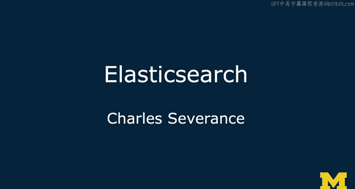
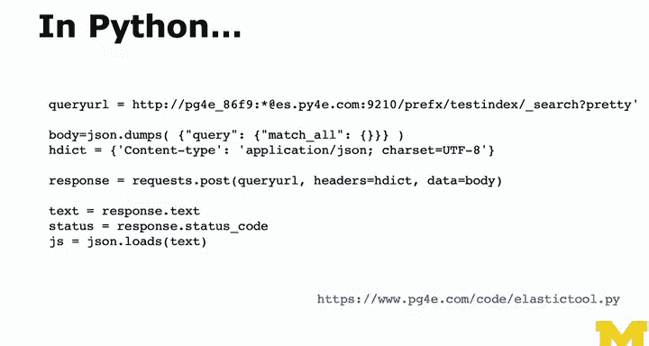

# PostgreSQL for Everybody：12：Elasticsearch概览 🚀

在本节课中，我们将要学习Elasticsearch的基本概念、其历史背景、核心架构以及它在现代应用中的典型用途。Elasticsearch是一个强大的分布式搜索和分析引擎，常被用作增强传统ACID数据库系统的补充工具。

## 历史与背景

上一节我们介绍了PostgreSQL等关系型数据库。本节中我们来看看Elasticsearch的起源。Elasticsearch源于一个名为Lucene的开源项目。其设计目标是复制谷歌搜索引擎的功能。它旨在实现高度分布式架构，能够处理高速输入的数据流。它需要能够存储海量数据（TB级别）。它需要实现快速的大规模并行搜索。通过使用廉价的商用硬件来提升性能。其核心是一个带有增值功能的倒排索引，支持词干提取、排名、相关性计算等语言处理功能。Elasticsearch的排名和相关性算法可能比PostgreSQL的更复杂、更高级。PostgreSQL的相关性功能不差，但并非顶尖。Elasticsearch可用于构建推荐引擎等应用功能。这些功能都是希望具备谷歌式特性的应用程序所需要的。有一种说法是，每个应用程序都应该有一个搜索框，只要它包含用户可能想要查找的信息。更早的项目叫做Apache Lucene。Lucene实际上是该技术的索引部分。Elasticsearch是在许多复杂底层功能之上的一层平滑封装。这有点像将功能外包给亚马逊的DynamoDB。其内部非常复杂，Elasticsearch也是如此。内部有非常复杂的机制，但用户无需过多担心，Elasticsearch会自行组织管理。最初作为应用程序的搜索框功能，Elasticsearch已经演变成一个独立的NoSQL数据库。主要是因为其倒排索引必须具有极高的性能、可更新性和分布式特性。它有许多优秀特性，使其几乎开箱即用，成为一个非常出色的NoSQL风格数据库。

在向您介绍技术时，我非常关注其许可证类型。PostgreSQL是一个开源社区项目，是我最喜欢的开源社区之一，其长期的高水平运作令我印象深刻。Elasticsearch并非完全开源，它使用一种名为Open Core的许可证。其核心部分是Apache许可证，然后由一家名为Elastic的公司（我认为叫Elastic NV）提供支持。这是一家规模很大、非常成功的公司。关于Open Core模式，存在各种不同的看法。有些Open Core供应商的做法我认为很糟糕，存在“诱饵调包”的情况。Elastic公司规模相对合理，对开源有较好的承诺，以至于很多人使用Elasticsearch时甚至没有意识到它不是一个纯粹的开源项目，而是一个Open Core项目。当然，我使用Elasticsearch所做的一切都是基于其开源版本。大多数Open Core公司的问题是，其开源版本功能薄弱，然后他们就会说“你应该付费”，这很不好。我认为Elastic收取托管和咨询费用是可以的，只要我们能使用纯粹的开源版本完成我们想做的事情，并且他们没有表现出要废弃开源版本或进行“诱饵调包”的意图，我就可以接受。但您需要自己留意这一点，自己进行评估。希望围绕Elasticsearch开源部分（即核心部分）有足够强大的开源社区，这样他们就没有动机对我们“变坏”。就像我谈到MySQL时感到不安一样，MySQL并非典型的Open Core项目，仅仅是因为它被Oracle拥有。

## 典型应用场景：混合架构

上一节我们了解了Elasticsearch的起源。本节中我们来看看它的一个实际应用案例。我在一个名为Sakai的项目中使用过Elasticsearch。Sakai是一个开源学习管理系统，是真正的开源，不是Open Core。我们在一种混合架构中使用它。我们有一个数据库系统（MySQL或Oracle，首选MySQL）来处理所有事务性数据，如成绩、会员、班级等。我们将学生和教师可能上传的PDF等文件的存储外包出去。然后我们有一个Elasticsearch实例。我们将博客帖子、讨论帖、页面等内容，通过提取文本并将其作为JSON文档发送，全部输入到Elasticsearch中。我们还有提取器，可以读取PDF、Excel电子表格和Microsoft Word文档。这些提取器从这些文件中提取特征，然后也将它们输入到Elasticsearch索引中。然后我们有一个搜索用户界面。当用户在搜索框中输入类似“关系型”这样的词时，用户界面会与Elasticsearch通信。我们会找到提到“关系型”的帖子、提到“关系型”的Excel表格等等。所以这是一个非常混合的系统，我们并没有真正将其用作NoSQL数据库。这很大程度上反映了Elasticsearch历史上的典型用法。

## ELK技术栈

Elasticsearch最流行的应用之一叫做ELK技术栈。ELK代表Elasticsearch、Logstash和Kibana。它们大部分是开源的。这非常棒。在这种用例中，Elasticsearch更多地被用作一个NoSQL分布式数据库，或者说最终一致性数据库，而不是搜索引擎。Logstash负责处理日志，这些是生产服务器快速生成的数据。很多数据分析是基于日志进行的，因此Logstash接收这些日志并将其快速输入Elasticsearch。我经常谈到大多数数据库活动以读为主，但这个ELK栈通常以写为主。平均而言，它可能进行更多的写入操作，对快速写入性能的要求高于读取性能。这真的很棒，因为它以我们可能不会用到的方式对底层的Elasticsearch数据库施加压力。在Sakai中我们没有这样使用它，因为每小时只上传几个PDF，这与每秒产生100条记录的日志流不同。Elasticsearch可以吸收高速数据流。许多早期的NoSQL工作以读为主，因此只能以一定速率吸收数据。它们有很好的读性能，但吸收写入的能力往往是个问题。很多神奇的系统在处理写入时都有困难。但这个ELK应用或工具包意味着Elasticsearch的写入性能确实很好。然后是Kibana，这是一个可视化系统，您可能会遇到。一旦您的数据进入Elasticsearch，您就可以创建仪表板，快速发出查询。在这里，您可以看到多读取器、超大规模的性能，以及漂亮的并行分布式分散-聚集操作。当您想问“过去24小时发生了什么”时，所有这些功能都会发挥作用，然后您就得到了一个仪表板。因此，ELK是Elasticsearch作为NoSQL数据库的一个非常出色的应用，它极大地推动了写入和读取性能的边界。这在关系型数据库系统中根本无法实现。您只需根据投入的资源来扩大或缩小Elasticsearch集群，它会自动重新组织自己。其内部有Lucene和许多其他组件，但Elasticsearch就像一个好用的包装层。我还没有用Kibana做过什么，但我真的很想尝试。我喜欢Elasticsearch的写入性能和读取性能，Kibana看起来像是一个无需动脑的选择，非常酷。

## 内部架构与API

上一节我们看到了Elasticsearch在ELK栈中的应用。本节中我们来深入了解其内部架构。其内部架构完全基于RESTful Web服务。这就是为什么我说Elasticsearch就像是一堆复杂功能的包装层，这些功能本身可能很难使用。从某种意义上说，Elasticsearch就像是您的DynamoDB，只不过您可以自己安装和运行它。您可以高速地向它输入数据，也可以取出数据和执行查询。其内部完全是分布式的。它具有最终一致性，所有通信、索引重新计算等都像魔法一样自动完成。我们有一个漂亮的RESTful Web服务API，这使得用几乎任何语言与它通信都非常容易，因为您使用的是JSON和RESTful服务。无论您使用Python、PHP、Java还是其他语言，这都非常简单明了。Elastic公司已经构建了非常酷的客户端，使得从各种编程语言与Elasticsearch对话变得相当容易。当然，鉴于数据可以进入任何服务器，这就是它拥有超快写入性能的原因。

它是一个最终一致性系统，因为索引是在事后完成的。任何服务器都可以接收新文档。任何服务器都可以开始对该文档建立索引。然后将索引添加到倒排索引中，而倒排索引本身是广泛分布的。新索引的文档被发送出去并交换，在几秒到一分钟左右的时间内，它们最终会达到一致。但索引是最终一致的。我认为这可能是因为它真正基于搜索引擎范式。在分布式索引方面，它可能是最先进的NoSQL数据库之一。因为它始于一个分布式索引问题，然后围绕一个超快的分布式索引包装了一个NoSQL数据库。

这让您了解了URL的结构。我们在本课程中使用的URL结构如下：您不使用HTTPS（但可以，您可以在HTTP命令中直接发送凭证）。关键点在于URL的末尾。URL有两部分，一部分是索引。您可以将索引想象成类似表的东西。

以下是您开始编写代码时会看到的URL结构示例。再次强调，它是一个REST Web服务，所以我向您展示一个捕获此结构的URL。

## 编程模式与后续

接下来，我们将简要讨论一下Elasticsearch的编程模式。但最有趣的部分将在实际的代码演练中。

---

**本节课总结**

在本节课中，我们一起学习了Elasticsearch的概览。我们了解了它的历史源于Lucene项目，旨在提供谷歌式的搜索能力。我们探讨了它在混合系统中的应用，例如在Sakai学习管理系统中，它被用于增强搜索功能。我们重点介绍了强大的ELK技术栈，它将Elasticsearch用作一个高性能、最终一致性的NoSQL数据库，专门处理以写为主的日志数据流。我们还简要了解了其基于RESTful API的分布式架构，这使得它易于集成和使用。最后，我们预告了接下来的课程将深入编程实践。