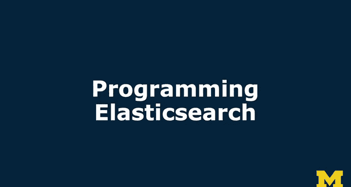
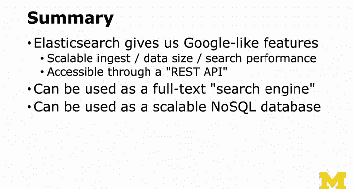

# 密歇根大学《给所有人的PostgreSQL课（数据库设计、SQL、JSON和NLP、ES）｜PostgreSQL for Everybody》中英字幕 - P114：13_Elasticsearch编程实践.zh_en - GPT中英字幕课程资源 - BV1tj421U7GK

So now I want to give you a short overview of the techniques used to programming Elasticse。

 but the best way will be when I start showing you actual code and walk you through some of the different things that we use to program Elasticsearch。

 one of the harder things that you're going to see when you're using the Elasticse documentation。

 especially from the Elastic company， is they do everything in the form of RE APIs and they are telling you basically a URL to hit。

You're supposed to like hit a URL with a get request send a get request to this URL and then send a JSON document that expresses what you want to do if you're a real rest person you might argue that this is not RE。

 it's more of an RPC pattern， RPC pattern， but we don't need to argue about that right now。

 a lot of philosophy and computer science。And so you just send sort of your queryries。

 this is a particular query that says matchch everything。

 this is a way to iterate through all of the documents。In Python。

 the simplest way to talk to any RE API is to use the requests。Library。

And so you have aqueer URL and that query URL is constructed based on the documentation。

 in this case， myqueer URL is going to talk to the table name Test index and I append to underscore search。

This question mark pretty makes it so that the stuff returns with a nice curly brace。

 and then I'm going to convert this into convert this little bit of a dictionary into a string。

 so I'm going to use JSON Library Dump S， which converts a dictionary to a string version of it。

And we're going to send some headers that says this is the kind of content I want back。

 I'd like some JSON and then I send a post request request post to a query URL with these headers and with this JSON body and then I get back some text like the actual purely brace JSON stuff in a status which might be a 200 if it's good a 404 if it's not found or a 500 if things blew up inside so that's the HttP status code and then I might parse that from JSON string into an actual dictionary object so that I can walk through it and so that's just a simple way of talking to any RE web service。

 it's very low level。But a lot of systems build a library to do that。

 and so there is an Elastic search library in Python so I'll just Pip install it。

And then I import the thing and then I you know from Elasticsearch and port Elasticsearch and then I sort of tell it all the stuff to make the actual connection and then I can it knows the patterns for the bin index and then they send the body in as a dictionary and so this makes it a lot simpler so I will show you sample code of both sort of the rest way of doing it and the Elastic searcharch library way of doing it as well。

And so we'll cover those in some sample code So you know Elasticsearch is awesome whenever I'm like confused about how Elastic search works。

 I kind of fall back to this notion that it's like Google but for me right I mean I can feed it a bunch of things I can hit it with queries how would Google handle this and so that's kind of the easy thing it's super scalable both the data in jest the size of the data and search performance at really high scales of data size and it is nicely accessible through a rest API which hides all of the complex detail of the pieces and parts that actually make up elasticastic search。

You can add it as a full text search engine that's better and higher scale than something like the Postgress fulltext search engine and a lot of applications that's their first encounter with ElasticSearch。

 but because itss inverse indexexes so clever if you set your mappings up the right way you can make it quite a formidable simple documents store base style No SQL database and so Elasticsearch is just one of many that I've chosen to show you。

