# PostgreSQL for Everybody：15：演示：将邮件数据导入Elasticsearch 📧

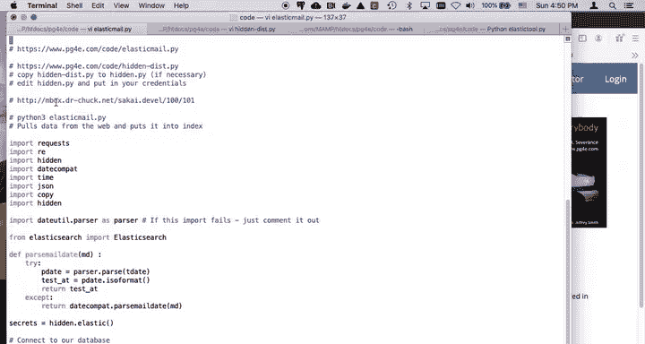

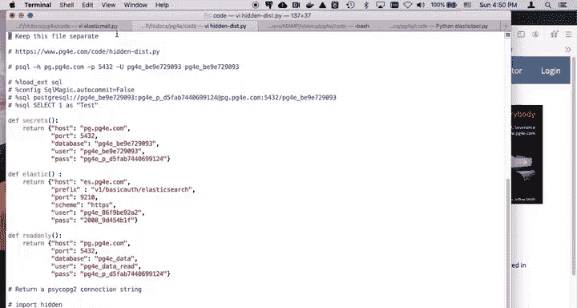

在本节课中，我们将学习如何从远程API获取邮件数据，解析其格式，并将其批量导入到Elasticsearch索引中。这是一个处理非结构化数据并将其转换为可搜索文档的典型示例。

上一节我们介绍了Elasticsearch的基本操作，本节中我们来看看如何将实际的邮件数据导入其中。

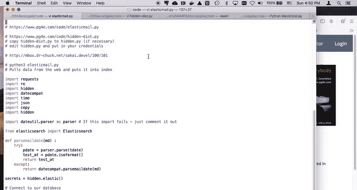

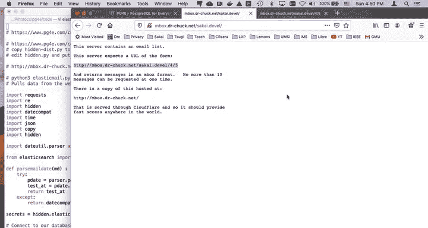

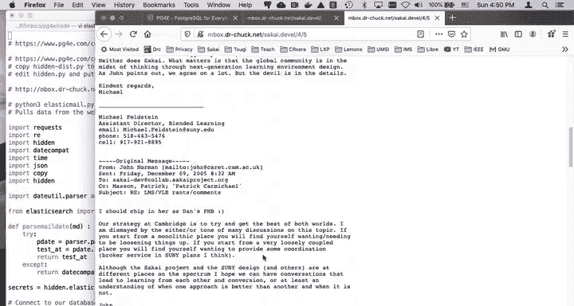

## 概述与准备工作

首先，你需要完成环境配置。这包括设置必要的密钥、密码、前缀、端口等隐藏值。这些配置通常存储在类似`.env`的文件中，并通过`python-dotenv`等库加载。

核心的Python库依赖如下：
```python
import os
from dotenv import load_dotenv
import elasticsearch
import requests
```

我们将使用一个包含Sakai开源项目2005年邮件列表的存档数据源。该数据托管在一个高性能服务器上，确保了快速的访问速度。

## 理解邮件数据格式

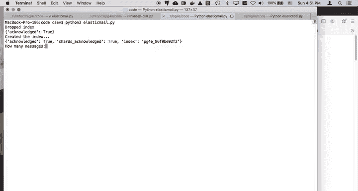

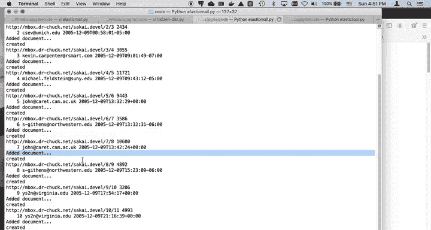

邮件数据通常采用“邮箱格式”。理解这种格式是解析数据的关键。

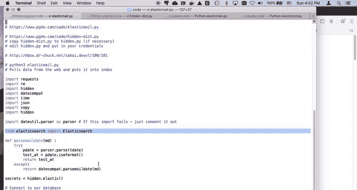

邮箱格式的核心结构是：
1.  以 `From `（From后跟一个空格）开头的一行。
2.  随后是一系列邮件头，每个头都是 `键: 值` 的格式。
3.  邮件头结束后，是一个空行。
4.  空行之后是邮件的正文。

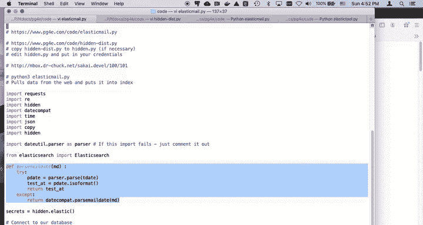

因此，一个邮件消息的基本模式可以概括为：
```
From sender@example.com
Key1: Value1
Key2: Value2

This is the email body.
```
解析代码需要准确地识别这些部分。

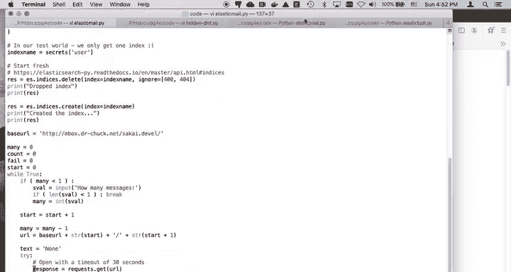

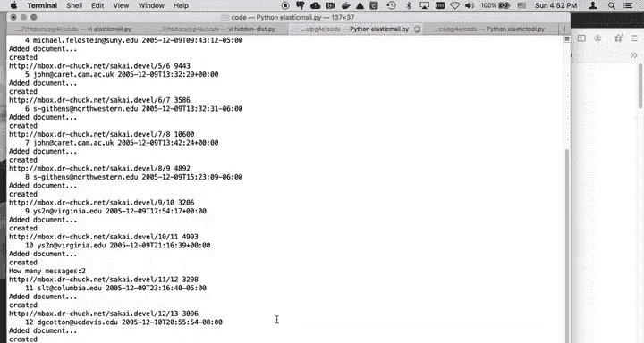

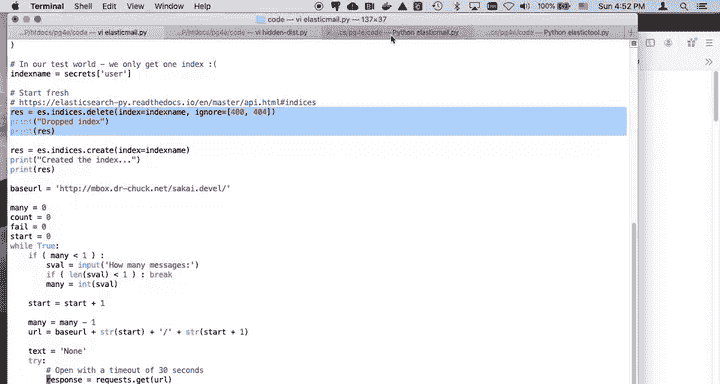

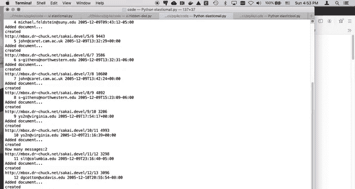

## 代码流程详解

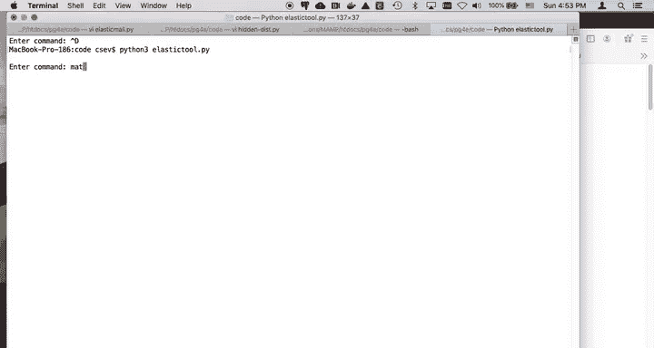

以下是导入程序的主要步骤。我们将使用Python的Elasticsearch客户端和Requests库来实现。

### 1. 连接与索引初始化

程序首先连接到Elasticsearch服务，并准备一个用于存储邮件的索引。为了演示方便，代码会先删除已存在的同名索引，然后重新创建它。在实际长期运行的任务中，你可能会注释掉删除步骤，并通过其他方式管理数据。

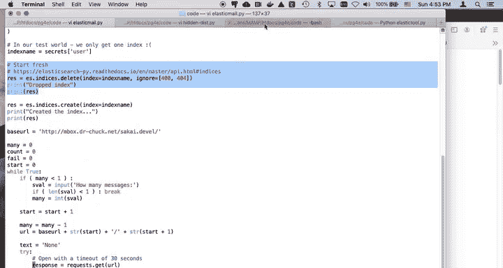

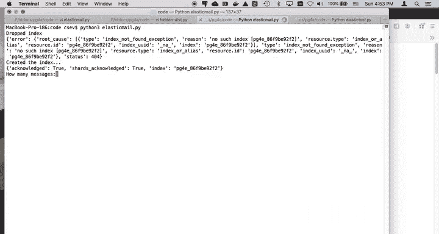

连接和初始化索引的代码如下：
```python
es = elasticsearch.Elasticsearch([{'host': host, 'port': port, 'scheme': scheme}], basic_auth=(key, secret))
index_name = “mail_index”

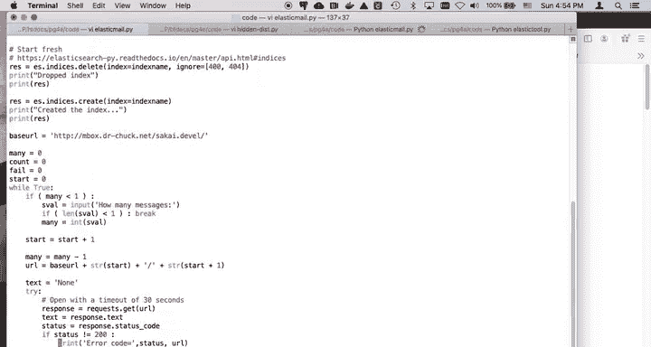

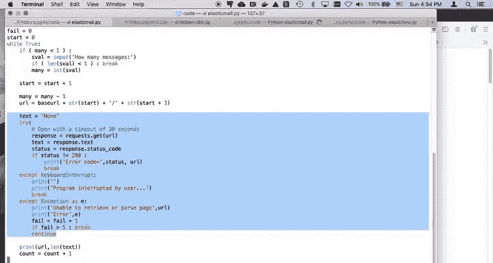

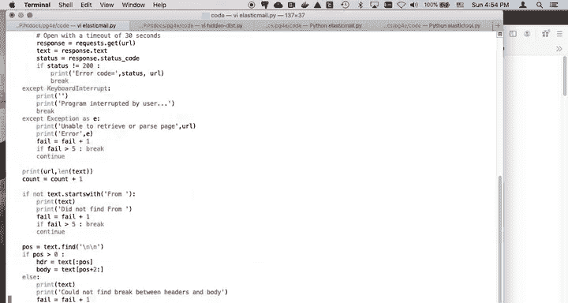

# 删除旧索引（演示用）
if es.indices.exists(index=index_name):
    es.indices.delete(index=index_name)

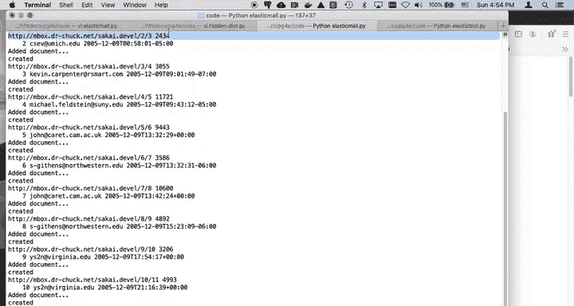

# 创建新索引
es.indices.create(index=index_name)
```

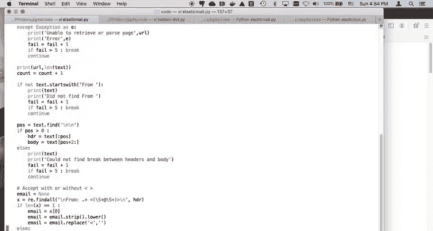

### 2. 获取与解析邮件数据

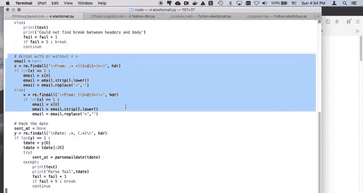

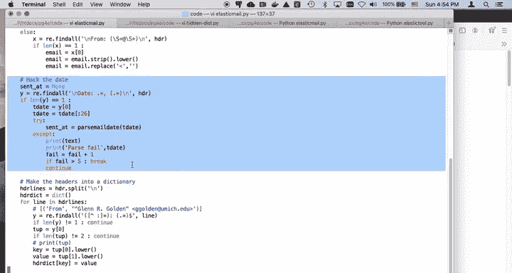

接下来，程序从一个预设的API端点分页获取原始的邮件数据。我们使用一个循环和`start`参数来控制获取的位置，以便能够中断后继续运行。

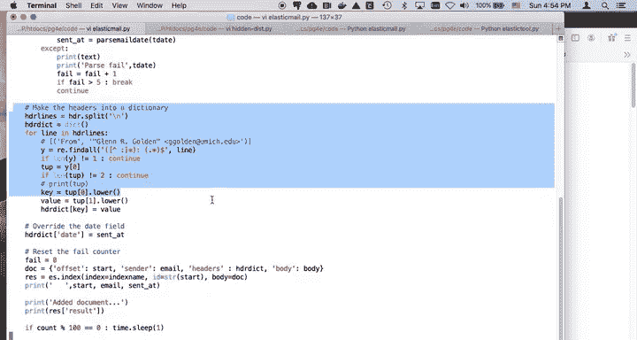

获取到数据块后，需要根据`From `来分割出单个的邮件消息。然后对每个消息进行深度解析：
*   **提取发件人**：从`From `行中解析出邮件地址。
*   **解析日期**：处理各种不同格式的邮件日期，这通常需要复杂的日期解析逻辑来保证兼容性。
*   **解析邮件头**：使用正则表达式将`键: 值`格式的每一行分割开，并清洗数据（例如转为小写），最终构建成一个Python字典对象。
*   **分离正文**：邮件头之后的所有内容即为邮件正文。

解析邮件头的关键正则表达式逻辑如下：
```python
import re
# 匹配“键: 值”的模式
header_pattern = re.compile(r‘^([^:]+):\s*(.*)$‘)
```

### 3. 构建并导入文档

解析完成后，我们将数据组装成一个符合Elasticsearch格式的文档。这个文档主要包含三个部分：
*   `email`：发件人地址。
*   `headers`：解析后的邮件头字典。
*   `body`：邮件正文文本。

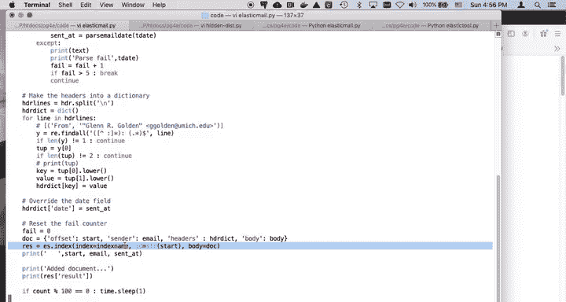

然后，使用Elasticsearch客户端的`index`方法将这个文档插入到指定的索引中。文档的ID我们使用一个自增的整数（`start`变量），这样可以方便地追踪进度和实现断点续传。

插入文档的代码如下：
```python
doc = {
    “email”: sender_address,
    “headers”: headers_dict,
    “body”: message_body
}
response = es.index(index=index_name, id=start, document=doc)
```

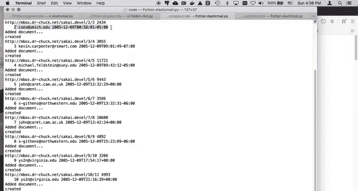

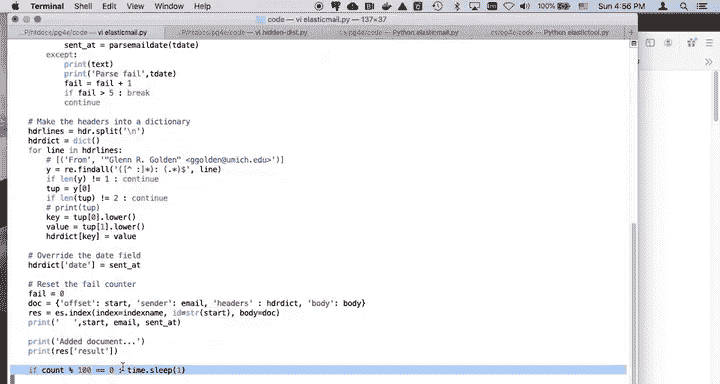

### 4. 进度反馈与循环控制

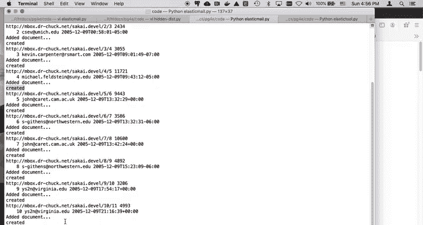

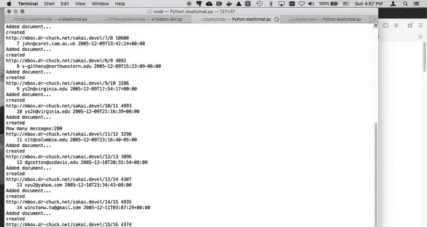

为了监控导入过程，程序会提供反馈：
*   每成功导入一封邮件，会打印一条日志（例如“已添加文档 X”）。
*   每导入100封邮件，会打印一条进度信息并短暂暂停，避免请求过快。

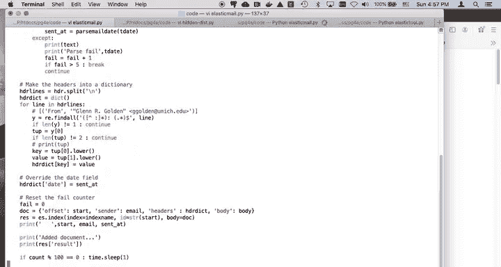

循环会持续执行，直到处理完所有可用的邮件数据。

## 运行与验证

运行主程序后，你可以使用一个简单的工具脚本（如`elastic_tool.py`）来验证数据是否已成功导入。

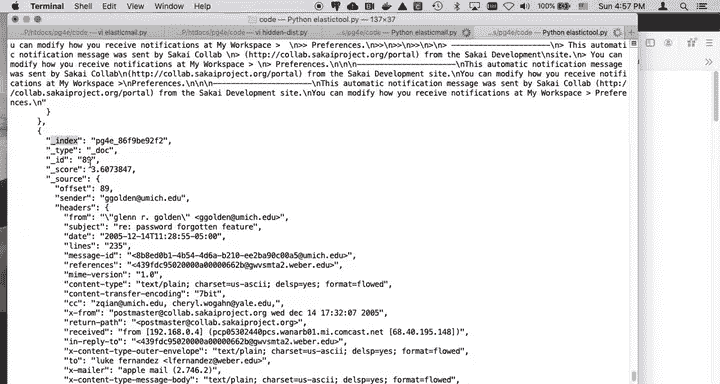

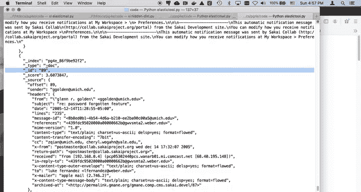

例如，查询所有文档：
```bash
python elastic_tool.py match_all
```
或者，搜索特定发件人的邮件：
```bash
python elastic_tool.py search “Gen”
```
如果返回了包含邮件头、正文等结构化信息的搜索结果，则表明导入成功。

## 总结

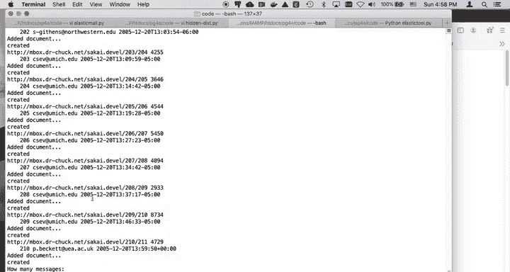

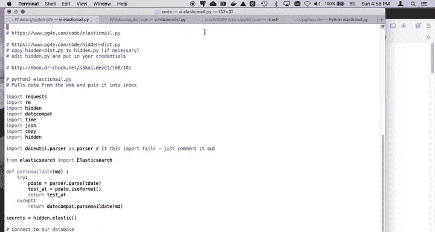

本节课中我们一起学习了如何将非结构化的原始邮件数据导入Elasticsearch。整个过程涵盖了从远程API获取数据、解析复杂的邮箱格式、清洗和转换数据，到最后批量创建可搜索文档的完整流程。处理真实世界的数据往往伴随着各种格式不一致的挑战，本例中日期和邮件头的解析代码就体现了这一点。掌握这个流程，你就能将多种类型的文本数据有效地纳入Elasticsearch的搜索和分析体系之中。