# 密歇根大学《给所有人的PostgreSQL课（数据库设计、SQL、JSON和NLP、ES）｜PostgreSQL for Everybody》中英字幕 - P117：16_演示：Elasticsearch推文处理.zh_en - GPT中英字幕课程资源 - BV1tj421U7GK

Hello and welcome to another walkthrough for Postgres for everybody and this one we're going to walk through a really simple example sort of from the Elasticsearch client documentation and so this is in some ways it's simple but it's also very complete and so again you've got to get your hidden values set up the right way so that your import hidden。

 you've got to use PIP3 to install Elastic search if you haven't already done that and a away we go。

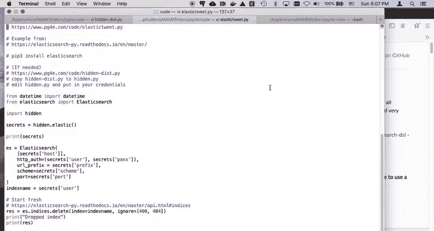

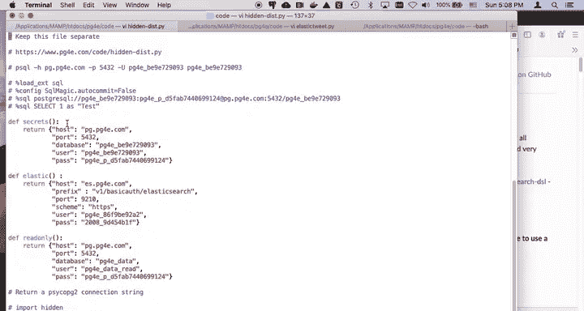

So。Print secrets。 Why do we want to print secrets。Do do， do do do， us's not print secrets。

You don't want to show that in here， then you would see all my secrets so we won't print secrets Ses is just key value pairs that come in in a dictionary where we go。

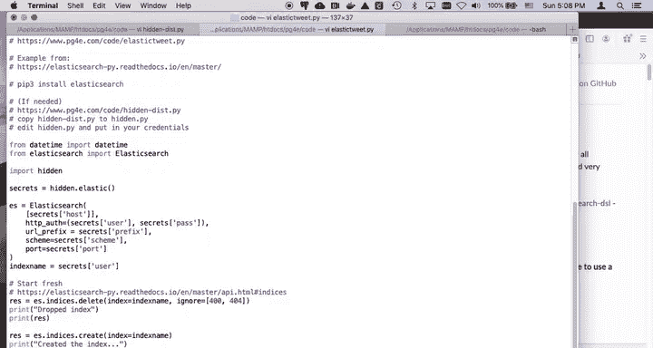

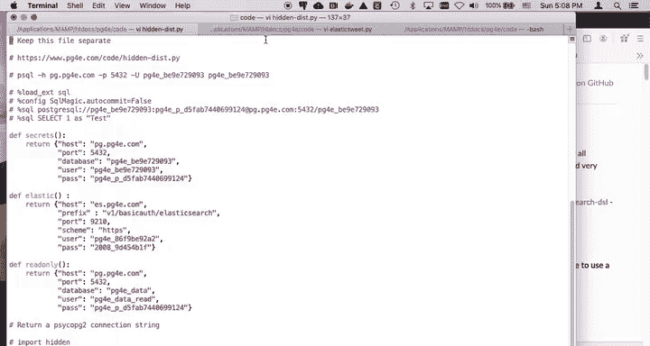

嗯。And so we set the Elastic search client up with the host， the user， the password， prefix。

 and so it takes care of all that as we've seen in other examples。

 it's not really that hard to talk directly to it using requests， just hitting it。

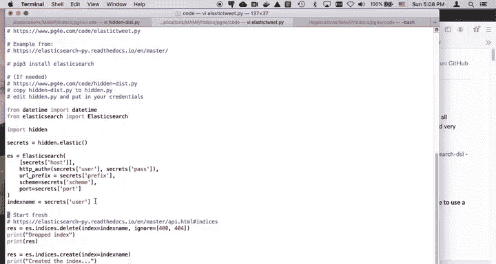

But the way we go。 So， so we're going to basically start just always by wiping out the index so that when we filled up。

 we know what we're doing and then create the index。 and then basically。

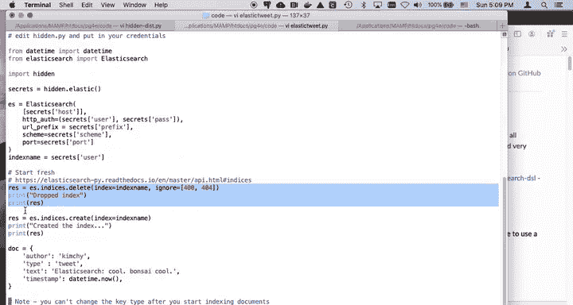

Elasticse thinks of the world in the term of documents， right， and so it's just being。

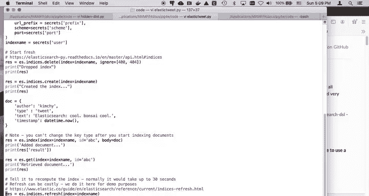

We start with and you can put arrays in here and listen here and other dictionaries in here， et ce。

 an outer thing is always a dictionary if you're doing it right。

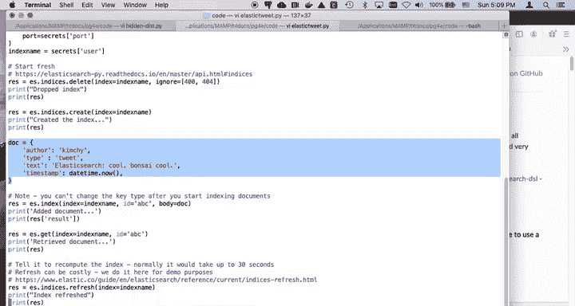

And then the insert， you have to have a key primary key in this case。

 I'm just calling to call that primary key ABC and ES index is I think of it as the insert。

 this thinks so much about the fact that is it's the world's awesomesestt inverted index that it doesn't even think of inserting the documents。

 it thinks of indexing the documents but。There you go， we find out if it's a success or not。

We can retrieve the document if we want。

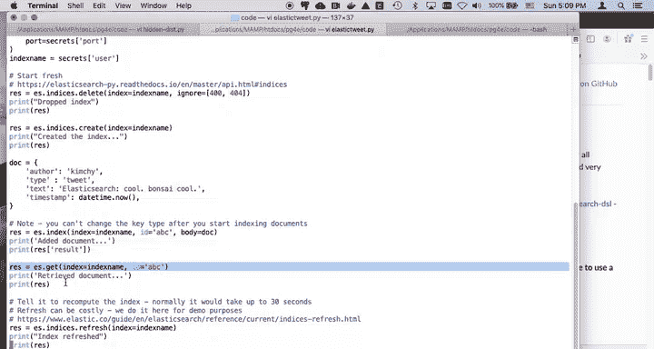

This refresh is in effect。Delay until all of the indexes are finished。

 this is a lookup by primary key， so it's not that big of a deal。

This says I'm going to actually use the inverted index so finish this can be costly。

 so I'm only doing it for demo purposes， tell it to recompute the index。

 normally take up to 30 seconds and so would you like pause。

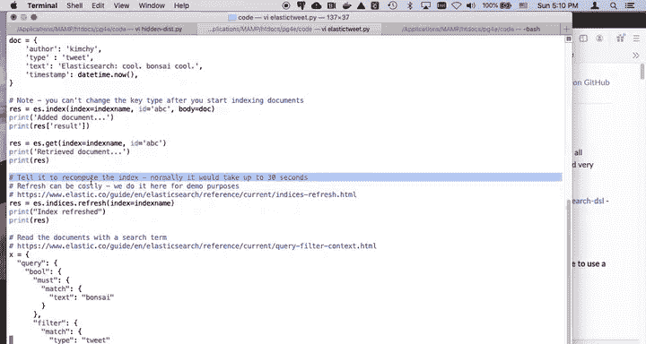

Now this is a more sophisticated query and you can take a look at this documentation we're kind of following this particular documentation so this is a query。

 Gouloleian is a combination it just is a way to combine multiple in effect like and right and so this is like a where clause and this must match。

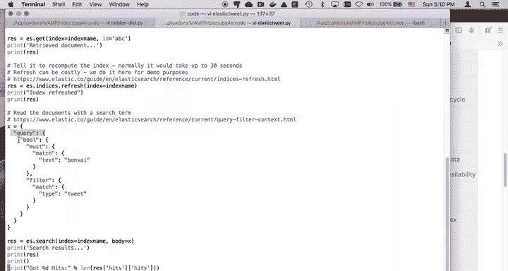

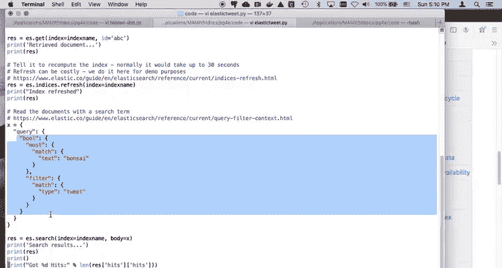

That is。The must match is looking for some text and that's actually not just that's a somewhat soft match whereas this filter is like a hard match。

 This is like a wear clause And so this I'm looking up in this particular case this is like applying a where clause a filter is like really and truly reducing the number of documents that are being searched This Bs eye is more of an approximation。

 something that looks like your sounds like Bons eye， maybe with stemming etca， etc ce。

 And so if you look at the document I'm putting a type in here that it's a type tweet Now I'm only putting one document。

 so it doesn't matter。 I'm just this is kind of your where clause and this is like your soft text look up and the bo basically says both these things have to be true。

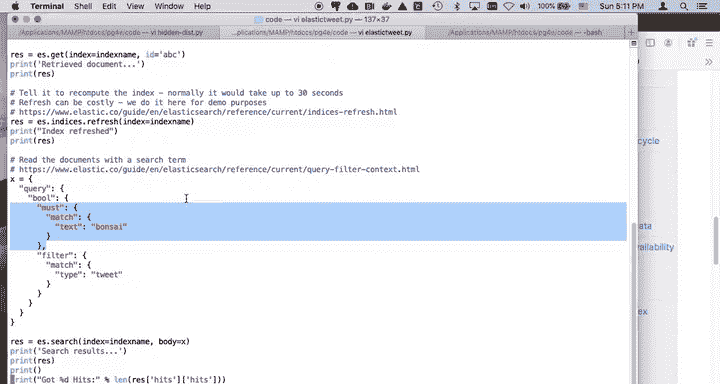

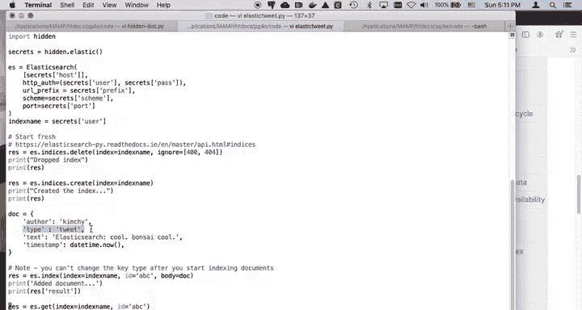

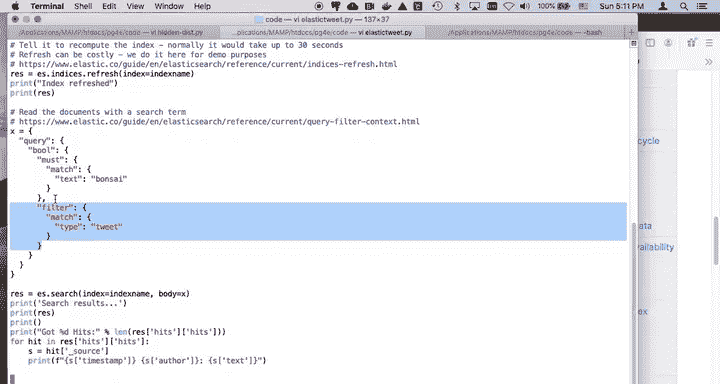

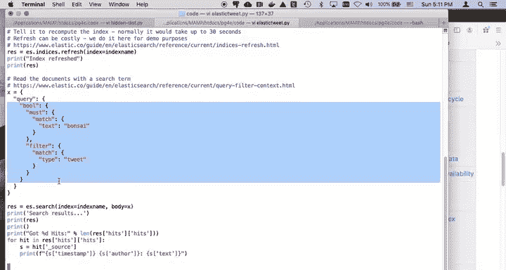

So the w wraps both the match and the filter， well， the must and the filter。Okay。

 and so then what do we do is we basically call the S search with this as the body in this case。

 the Elastic search library is conveniently convinced turning this from a dictionary into a string and then we get our results and we can parse through those results and pull various pieces of the results out so this is going to just there's no interactivity to it。

 it just runs if you elastic tweet。

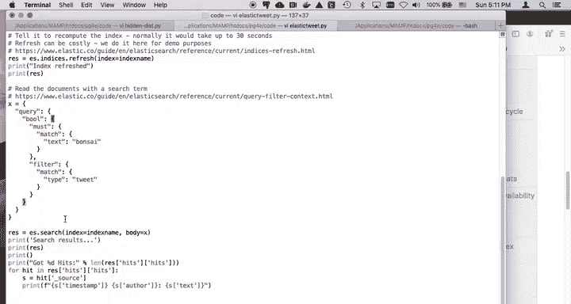

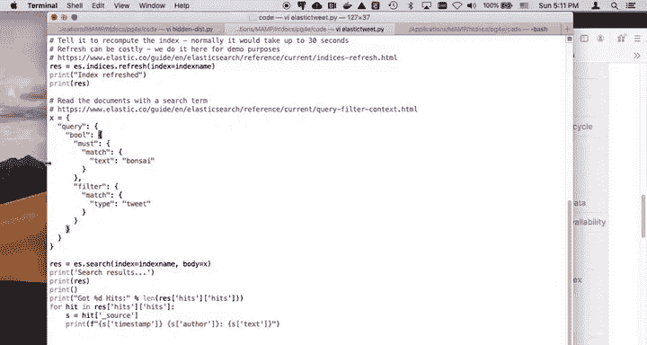

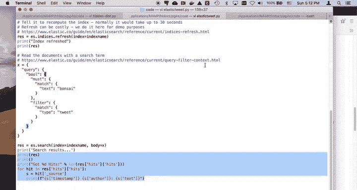

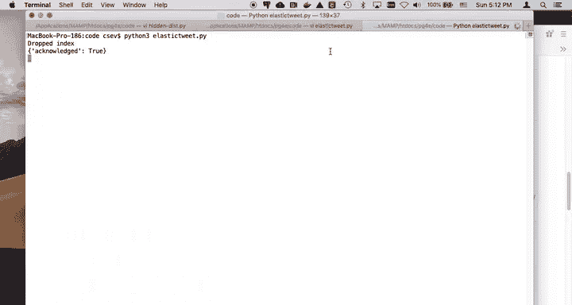

we drop the index， we create the index， we add a document， thats success add document。

 we retrieve the document based on the primary key that we just did and so some here somewhere is the there's the text。

It's of tight tweet， right， it's just a JSson。And then we do the index refresh。

 which again is pause and wait until the indexing catches up so that we can do other searches and then we do the search that basically says let's hit this and we have a where clause。

 the where clause is going to match the type equals tweet and then we got one hit and then I go through and I parse this and I read that stuff out。

 And so that's just a simple walkthrough of a completely self-contained with no external data to put a document in。

Wait for the index to finish and then retrieve the document back out and so this is just a good starting point because you know it completely works。

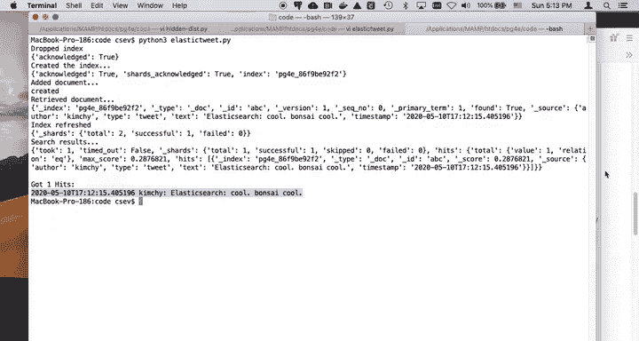

Okay， so I hope that this little quick walkthrough allows you to work with and change that code and build inserts of various kinds that you like。

Cheers。