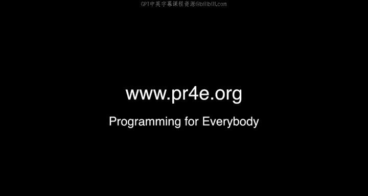

# PostgreSQL for Everybody：P118：17_美国华盛顿州西雅图办公时间

## 概述
在本节课中，我们将回顾一次线上办公时间的交流内容。本次办公时间在西雅图举行，参与者们进行了自我介绍，并分享了各自的学习背景与目标。

---

## 参与者自我介绍
上一节我们概述了本次办公时间的主题，本节中我们来看看参与本次活动的各位同学。以下是他们的自我介绍：

*   An：感谢邀请，学习“Python for Everybody”专项课程很有趣，希望大家享受课程。
*   Lee：西雅图很棒，你所在的地方也很棒。我还没见过扔鱼（指派克市场扔鱼表演）。
*   Steph：编程非常有趣。编织也是一种编程。我是一名生态学家和教师，正尝试转向数据分析和报告工作，以便同时运用我的统计学和教学技能。
*   Teling：我喜欢Python课程和Chuck教授，希望大家享受课程。
*   Nicole：继续学习Python，和我一起成为数据分析师吧。我分析IP协议数据，即网络数据。
*   Joanna：永远不要放弃，独自钻研15分钟后，一定要寻求帮助。
*   Shang：我是Expedia的数据分析师，喜欢分析旅游数据。我爱Python课程，因为它帮助我的女朋友学习编程。
*   William：我正在学习“Python for Everyone”课程，直到上了这门课，我才意识到自己之前字典操作搞得有多糟糕。

---

## 后续活动预告
在大家自我介绍之后，我们来了解一下未来的活动安排。以下是关于下次办公时间的通知：

下次办公时间将在英格兰的布莱切利公园举行。我会提前几周发布详细通知，以便大家安排行程。

---

## 总结
本节课中我们一起学习了西雅图办公时间的交流内容。我们认识了多位来自不同背景、怀着共同学习目标参与课程的同学，并获悉了下次线上办公时间的举办地点。