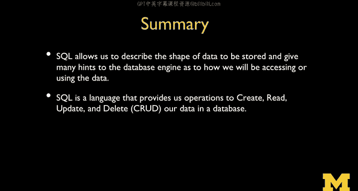

# 密歇根大学《给所有人的PostgreSQL课（数据库设计、SQL、JSON和NLP、ES）｜PostgreSQL for Everybody》中英字幕 - P11：10_PostgreSQL数据库键与索引.zh_en - GPT中英字幕课程资源 - BV1tj421U7GK

So I've been talking all along about how we're doing all this work to be super fast and super efficient。

 and I've been drawing pictures of indexes and stuff like that。 So finally。

 it's time to talk about them so we're going to talk about indexes now。So the。

First thing that we're going to do is we're going to talk about keys。

 Keys are when we're making connections between tables。

 right we connect one table to another table and I kept saying that's the relation right。

 It's the relationship between this table and the other table。

And we need to be able to put columns in tables that are kind of like our handles for rows。

 are a way to reference a row super efficiently。Right and later we're going to figure out how to build these tables。

 but we have we're going to start today just talking about how we put a number on every row。

 Now it turns out that we can pretty much say this is row 1，23，45。

 so we kind of build this sequence and it's an auto incrementing sequence and it's automatically So if two data records records are coming in from multiple sources as fast as possible。

 the database kind of takes them as a funnel and then carefully assigns them sequential numbers。

 you never get a duplicate， no matter how fast these records come in。

 and so the database sort of says lock， add1， insert lock， add1， insert， lock， add1 insert。

 And so that's something the database takes care of us regardless of the number and the speed of the records that are coming in。

And in Postgress and if you ever look at other languages like MySQL or SQL light。

 it's harder than this， but Postgress is like， I'll make this easy because it turns out that we do the same thing over and over and in all those other languages。

 all those other databases， I simply copy and paste this long ugly line， but in Postgres。

 we just say serial。So ID is a serially incremented。

 automatic increment thing that just gets every time we insert it Now we don't have to put it on an insert statement because it's automatically generated by the database。

 So you'll still be inserting on name and email。 And then we can say primary key。

 And so what primary key does is it says build on index for this and its it's the index we're going to use the most。

 This is and in fact that it's an integer this is going to be an integer number。

And integer indexes are like scorchingly fast there's been。

Thousands of people who've researched how to make integer indexes super fast。

 and you don't need to know any of that。 So you just need to know that each row。

Has a little handle on it，1，2，3，4。 And then there is an index here。

 that's primary key that we can go and find one of these superfa。

 So that's this index that sits here。 The indexes。 And by saying primary key。

 and and you're not really telling it how to implement a primary key。

 You're just communicating the fact that I'm going to use this particular I field in a very special way and be prepared database。

 be prepared because I'm going to use it that way。 The other thing we can do in this one that' you can see is this unique constraint。

This is what we call a logical key。 And so the uniqueness basically says we are not allowed to insert the same email address twice。

 It's on this column。 that column is unique。And this is what we call a logical key。

 and that means if you try to insert it twice， it's going to blow up。

Now the way it works is there's all these rows with emails in them and then there's another index with just the addresses。

 and then it looks in this index and says， oh， wait a second， you already have one here。No。

 you're not allowed to insert that。 And so the uniqueness is just like the 128 is a constraint in the schema that you are communicating and then the database is going to enforce on you now it turns out that this index that it makes it kind of realize that that index can then be used to speed the speed access to certain certain records and in this particular index it's probably going to make it so that sorting and prefiect searching is going be super fast。

 and like you don't even need to know that。 all you just say is like this is unique So's like oh。

 I know what to do with that。 I will implement something really really nice for you。

 I have a little surprise for you。 the next time you do a select statement on your 1 million records it's going to be 20 times faster just because you told me that。

So there's a whole bunch of functions， I won't go through them all。

 now is the function that we use for dates and now is 98% of my function use。

 sometimes I'll do concatenations or string substrings。

 those are the kind of things that you can do with functions。Now indexes。

 I've been talking about indexes from the beginning and now I kind of talk them so like you know talk about them a little more so when when I log into Twitter。

 they got to go my password find my password among 500 million users and the key thing is to shorten the scan right I keep saying that it's a couple terabytes and if you go through it even on a fast disk drive if you go through it sequentially。

It's minutes， try to back your whole hard drive up sometime。

 and that's how long it takes to read all the data on your hard drive so you're not really scanning the whole data right。

 so the whole idea of indexes is their shortcuts。They are shortcuts so you know exactly where to go。

 so let's take a look at the two most common indexes， trees and hashes are the most common index。

So bee trees。I mean， all this data ends up stored on disk。And an index is more data on disk。

 and so when you add an index like unique or primary key to a column。

 you actually are telling the database store more data。 So you're telling database。

 don't just store the data I gave you， but stored the data about where that data is。

And so the idea of a bee tree and bee kind of stands for balanced or binary is that you go to a place and then it's sorted and you can kind of pick a range and then you pick a range and that tells you perhaps another index block to read and then you pick a range in that index block and then that tells you another index block to read or maybe it tells you to go right to disk And so instead of having a million disk reads。

 you get to do sort of log of a million the log it's the log because and that's why it's balanced And so you might only have to read six to go through a million records you might actually have to hit the disk and six blocks of the disk。

 the first block， the second block， the third block and then the actual data block So that's called a be tree。

 So let me draw a picture of the bee tree sort of in the way that I've been drawing it all along so to connect back to this so。

So remember， I'm talking about some data that's like let's just call it a terabyte of data。

 and if you have to scan a terabyte of data， you're going through it sort of in sequence， right？

And so what you do is if this has some kind of assorted structure。

 kind of going back to that sequential master update。

You can basically have an index that gives you ranges， so you can break this into ranges of data。

Depending on the size of each disc block， and then for each of the ranges。

 you make a little sort of an index that shows you the start and the stop in each of those ranges。

And then you come and you read the index， which itself is a small amount of data。

 and then based on that。You can pick the right range。 Actually， I've got that。 So you， you come in。

 lu read a small amount of data， figure out which of these things by reading here and then go straight to the right range on the disk。

 So I'm just showing you sort of a two level。 There might be more than one level。

 And so that's the basic idea。 But this is sort of sorted。But there's also blocks。

 so there's sorting within blocks。 and the whole thing doesn't have to be sorted。

 And so that's the idea of a tree index。 Now， the cool thing about tree indexes is that they're good for exact match lookup like if you're looking up the email address of someone who just typed it in a login form。

 They're also help for sorting。They also help for range lookups because you can end up knowing that you just have to grab a chunk of the data ultimately for range lookups。

 they're also good for prefix lookups because prefixes are kind of like ranges because youd kind of grab a little bit and that turns into a range and then you scan that range sequentially but it's a lot smaller than scanning the entire thing sequentially so。

Hashhes， so hash is a little different and the hashes are often used。

In things like those integer keys to make them super fast。 So a hash is a a computation。

 You scan the string and you compute a number。 It could be as simple as adding up the letters。

And dividing by a million or adding up adding the letters up in treating every letter like a number like。

 you know， J might be 11 and 0 might be 14， whatever their sequential numbers。

 Add all those numbers up and then divide by a million and then take the remainder of the division by a million and then use it as an offset right And so it it's a calculation that you do。

 Now if you go read about hashing， you'll find that there are people who spend their whole life researching the best hash function。

 and if you if you read， you'll things like M5 Sha1。Shot 256。These are all hashing algorithms。

 actually， they're the N。Organization that help build SQL。

 the N organization that helps build SQL also helps build hashes， hashes are standards。

 and there's actually competitions that people spend years of their life figuring out the best way to take large blobs。

 large and small blobs of text， and have the best possible hash。The cool thing about hashing as a。

As a database technique is。It really reduces the number。

 So if you think about the the number of in a be tree， if you have a large number of records。

 the number of accesses or goes by the log of them， which is log is really a great reduction。

 if you can say the log of a million is like 6。The log of 10 million is like seven。

 so log is really slow growing。But the hashes are even shorter。 Now。

 the problem with hashes and the reason we don't use them for everything is that hashes are only good for exact match。

 you are prefix matching， they're no good。The data gets completely nonsorted。 So that's no good。

 So if you're looking up like a name or you're going to do sorting， then a hash doesn't work。

 turns out that what hashes are really good for is primary keys or or good。

 globally unique identifier kinds of lookups。 And when they do that， they are super scorchingly fast。

 Okay， so hashes are awesome now。😊，I just tell you about these two indexing mechanisms。

 not because I want you to decide between them because often the database will automatically decide for you which kind of index you just kind of say this is a primary key index。

 chances are good that'll be a hash or if you say unique on a string field。

 chances are good that's going to be a Bre because those are how those things work and but in general we even leave some of these decisions to behind the abstraction and just say。

 hey database you're smarter than I am you got a lot of PhDs that work on all this stuff and so you just worry about that I'm not going to worry about it。

So。SQL is my favorite language I'm glad glad to be teaching it to you unfortunately everything in the world can't be written in SQL。

 but we can certainly describe our data with that and the whole idea is we describe the shape。

 the schema of the data to be stored， and then we have a simple set of primitives that allow us to store and retrieve the data that create。

 read， update and delete so。😊。

Thanks for listening and welcome to SQL。

