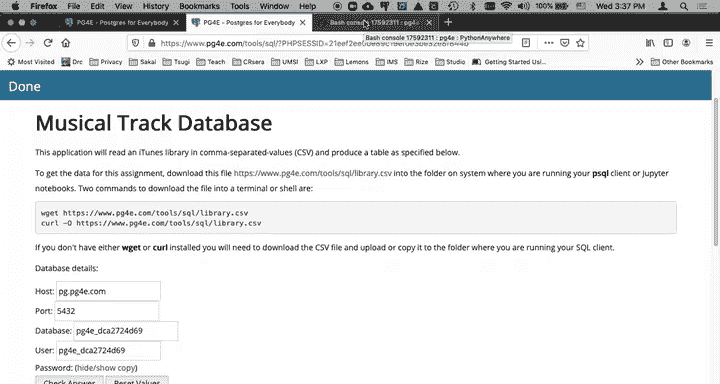
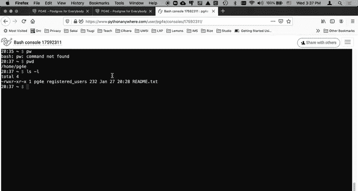
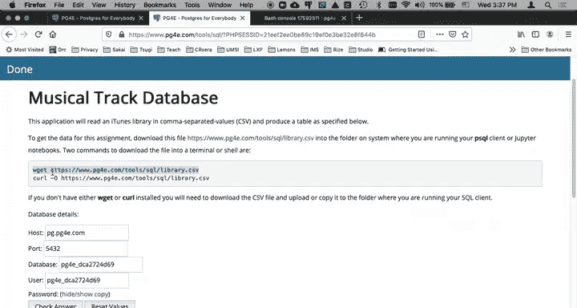
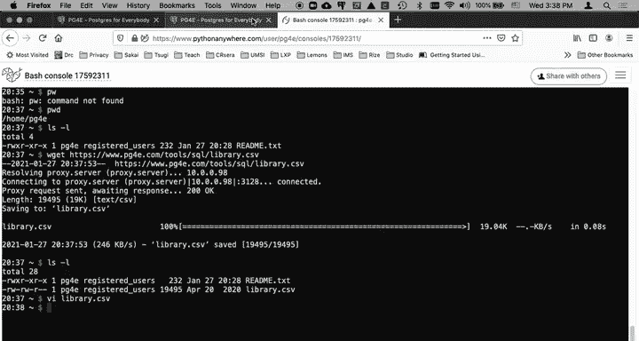
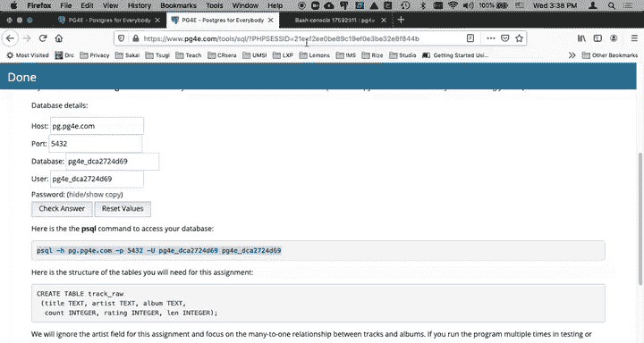
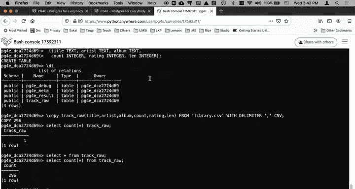
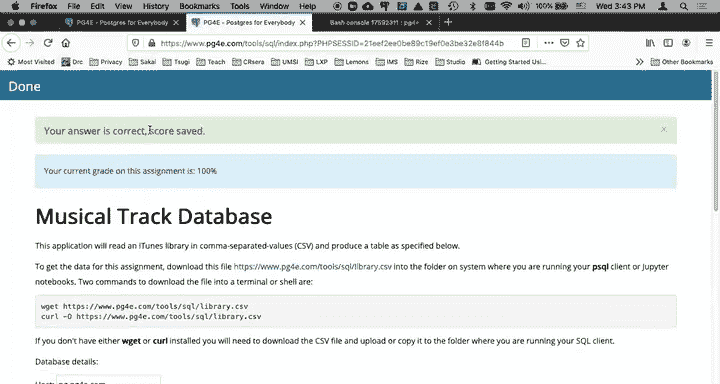
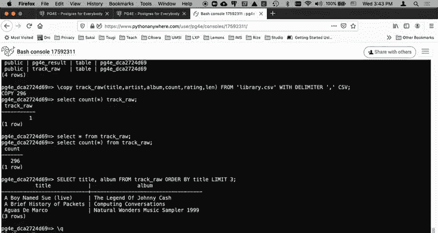

# 密歇根大学《给所有人的PostgreSQL课（数据库设计、SQL、JSON和NLP、ES）｜PostgreSQL for Everybody》中英字幕 - P12：11_音乐曲目数据库CSV应用.zh_en - GPT中英字幕课程资源 - BV1tj421U7GK

Hello and welcome to another walkthrough for Postres for everybody in this walkthrough。

 we're going to do a simple musical track database。 We're going to explore the copy command。

And so the idea is we're going to take a comma separated value and it depends on how you're doing this。

 I'm going to use Python anywhere， given that a lot of what we're doing is on Python anywhere。

 so here I am in Linux I'm in my home directory I got no files other than that readme。 TxT。

And I need to get so I'm going to run the Postgres PgSQL or PqL command here。

 but I have to get this file onto this same computer that's running my client so that it can read it。

 and so there's a command in Linux and sometimes Linux you use Wge or Chro minusso in this case。

 they do the same thing。 They grab data from a URL and they copy it to a file on your hard drive。

 so you'll see that this makes a connection like a browser to a URL and now I've got a file it's got about 20。

000 characters on it。 And if I edit it with my happy little vilib。 csv。

 You see that this is a comma separated value that's got artist in title and album and and my rating in the number of views and the length of this thing。

 And so it's comma separated value， the kind of thing that spreadsheets produce。

 and our goal is to load this。

Into a database， this track raw which's going to have， you know， there's six columns in my CSv file。

 there are six columns in track raw。 and so Ive got to run the Postgs command。

 And so here's all my Postgres details。 but because I do this way too many times I also make it so that you don't have to construct that。

And so that's the PSQL command that I've got to type。

 I'm going to copy my password and paste that over。 And of course， I'm talking to。

 I'm not talking to Linux anymore。 I'm talking to the PS SQL command。 And so I've got this prompt。

Hello， world。What。And so， you know it's expecting me to type something and I'm not typing what it wants and you'll notice that this little arrow is telling me something and it's telling me that I'm in the middle of a communication。

And that's because it expects that semicolon is going to what's going to happen to end a potentially multiline SQL statement so in this case it was expecting me to type SQL and I didn't but it was in a continuation and so that's why it messed up I can take a look at my tables with backslash Dt Now backslash Dt is not structured query language that is part of what it is we do inside PSqL So this is a feature of PSQl and you might use a different database client and you will have a different way to list all of the tables but you can also type SQL as well。

So going back to our assignment， the thing we've got to do is to run a bit of SQL now you'll notice that this is three lines of text ending in a semico so I'm going to copy that。

wantant to paste it。And so you'll see it's it's telling me that it's in a continuation。

 the second continuation says it's not only in a continuation， but it's in a parenthesesis。

 but then if I hit enter， that means that the semicolon is going to cause that statement to execute。

And if I say backslash DT， it's going to show that I've got another table， those other three tables。

 PG free debug， meta and result， there from previous assignments that I was doing。对。

So I now have library CSV on my local hard drive and I've got a table called track RA and the only thing I need to do is to run and copy this all in now later we'll learn all kinds of ways using Python and other things to put data in。

 but I'm going to actually use a feature built into PSQL Now if you're using a different database client。

 this backslash copy is not necessarily going to work。

 you might be using a fullscreen client but this is how we do it in PSQL so for this assignment you might be best off just using PSQL。

So backslash copy is a command， a PSQL command， not an SQL command， PSQL command。

Going into this table with these columns， read this file and split it with commas and do CSsv。

And so that's all built in， we're just going to run it。And。It is going to have selected。I mean。

 it's going to have insert it select count， star， track， underscore RA。type it correct， chuck。嗯。

That's not good。What went wrong？ I only got one。Select star。From oh。

 I think I needed to say from track rock。Yeah， that's going to make a little better。

 Select count stars， what I wanted to say。There's supposed to be more than one track in there。

 and there is， there's 296。So I just select countstar track raw was not a syntax error。

 I don't know quite what it was doing， but it was doing something。

And that's why I was confused and I saw only one， but really there's 296。

 which makes a lot more sense。And doing the assignment， it says， hey。

 run this select statement just to see if you got the right data。

And I will run it and here's the data and let Johnny Cash Comp Con， natural wonders and there we go。

 and at this point I can submit my assignment because my assignment was to get this table created and then the autograder is going to make a database connection to this same database and run a select command。

So let's have it do that and so it got a good answer and away you go。

And so I hope this has been a useful walkthrough of one of these early assignments again。

 this one you might want to use PSQL for because of the use of the copy command there you can out another database clients it might be an import button or something like that。

 but for this one it might just be easier to go ahead and use Python anywhere let me quit on for this to get out backslash queue it might be easier to use Python anywhere for this particular one so hope you found this useful cheers。

