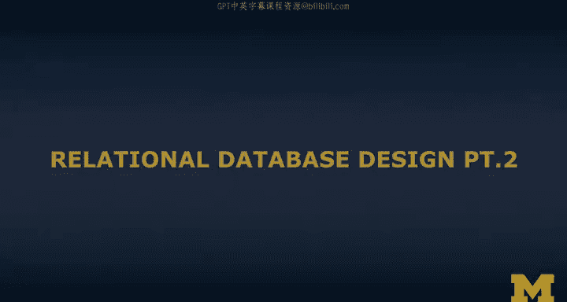
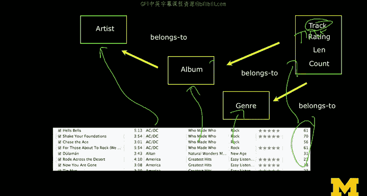

# 密歇根大学《给所有人的PostgreSQL课（数据库设计、SQL、JSON和NLP、ES）｜PostgreSQL for Everybody》中英字幕 - P16：15_关系型数据库设计（第二部分）.zh_en - GPT中英字幕课程资源 - BV1tj421U7GK

So like I said， we're not going to argue with the design of the user interface。

 even as though it has this vertical replication of data。

 what we're going to do is we're going to come up with a way to spread this data across multiple tables so that we end up with no replication of the data and the tables that reproduce。

So what we're going to do is we're going to go through these columns and we are going to basically decide。

 is this is this column part of an existing object or a new object。 And so we're going to。

 once we have an object， we'll add stuff to it。 So it's like what are the things and what are attributes of things。

 And so。This is the set of columns。 Now the interesting thing is the the first thing that you got to do is you got to figure out what your first object is。

And again， I talked about how you're often in a room and there are people who go through this process that have a good instinct about this。

And in a lot of applications， the simple answer is the user。So if you think of multiuser system。

 often the user and you tend to draw that first table or that first object in the middle so that everything else connects to it。

 but in this situation this is a single user application so we can't just say oh the user is the kind of a core thing so you ask yourself what is the single thing that this application is organizing and this is a music system that tracks the tracks we own and plays tracks and keeps track of tracks that are parts of albums and which albums belong to which etc cea。

 et ce how many times we play the track？And after a while， you kind of figured， oh， maybe， maybe。

 just maybe。The track is the first thing that we should work with。

 So let's let's basically make a table that it has tracks。Now this。

 we've kind of got that column figured out now so we got a table of tracks so we can look across and and they're certainly like the title of the track。

 So we'll put the title in here。So we've got the title， so the track has a title。

And then another thing that is is pretty easy is is numbers are no big deal， right。

 We don't worry about vertical replication of numbers。

 The fact that we have things that are both rated for as numbers are cheap。

 So the we'll just right away， stick the length。We're going to stick the genre and we're going to stick the the this I mean。

 the number plays and the length and the genre， and we're just going to put those in the track。

And so we've sort of got this taken care of， we've got this taken care of。

 and we've got this taken care of and that taken care of。

 and they're just all attributes of track like length。Those are just attributes。

 So we've kind of got length。 We got the count。 We got the rating and then we got the track and that's kind of taken care of that track title。

 So we got one table。 Now it's not random that that the columns that have the string vertical replication are like there are the ones that we don't have And so so we'll basically say。

 okay， what other things do we have well， we have an album。And so this is the album。

And all tracks belong to albums。It's a little less of a mess if you're doing this in a whiteboard in an office。

 but you get the idea so tracks belong to albums and albums。Well， albums。

 you can't just put the artist's name in here because there could be many albums to one artist and so you have an artist out here。

And albums belong。To artists。So tracks belong to albums and als belong to artists。

So we've got this done and we've got that done。 and so the only column we have left。

Is the genre Now the genre， let's see if I can get a different color here。Yeah。

 we could actually take the genre。And we could connect it to the artist。

 we could connect it to the album。Or we could connect it to the track。

And this is a situation where actually the decision that we're going to make here is going to change how this will work。

So if we connect it to the track， you change this to a new thing and it won't affect any of the other tracks。

 but if you connect it to the album， use this connection， the connection to the album。

 if you change it in this album of who made who， and you change rock， the genre of who made who。

 then all these are going to change at the exact same moment。And if you connect genre to the artist。

 all the ACDCs have many of them， of course， if you change the genre of ACDC。

 then all the genres of all the ACDC tracks are going to change at the same time。

And so you can sit there and you can argue， is your Ho an attribute of artist。

 is it an attribute of album or is it attribute of track？

And the right answer in this one probably is track。 And so you basically。

 you decide that you're going to connect genre to track and a away you go and。

You end up with a picture。 So that looks like that。

 In't it amazing how much nicer this picture looks than My scribblings， So you have track。

 you have rating， you have length and count that attributes a track。 They're just numbers。

 They're cheap。 There's a title in track。 And that's probably what's missing with this。

 There's a title here。This probably should be the track table with a title in it genre belongs to track theres there is one genre。

 many tracks have one genre， many albums have one that many tracks connect to one album and many albums connect to an artist。

And so this is a way to basically make it so that you'll again also notice that all the vertical representation。

 things that have vertical representation， ended up with their own vertical replication。

 ended up with their own table and things that are just numbers。

And are otherwise not vertically replicated， ended up in his attributes in a table。

 and so that's our data model now。

You probably are thinking to yourself， well， that's not the most perfect data model and the answer is yes。

 we're going to simplify for now some of these things about which artist belongs on which album。

An artist might not always be a group， it might be a set of individuals。

 but let's ignore that for now。But that's the cool part of data models at some point。

 you might want to actually just build a really good music data model that doesn't have so many of these this not quite as simple as this one。

 but for now we're going to work on the mechanics of this and we're going to assume that this is a good data model for which to model music Next。

 we're going to talk about how we build keys and add keys to these tables so that we can make the connections in between tables。

