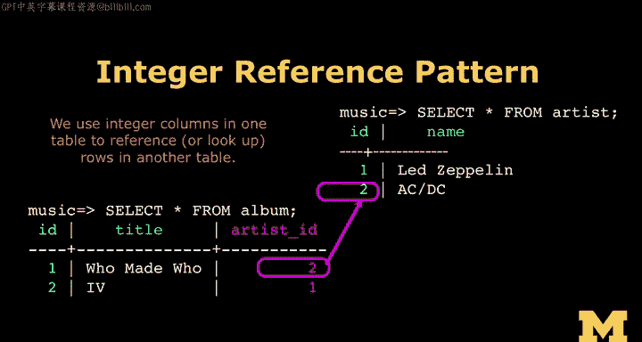
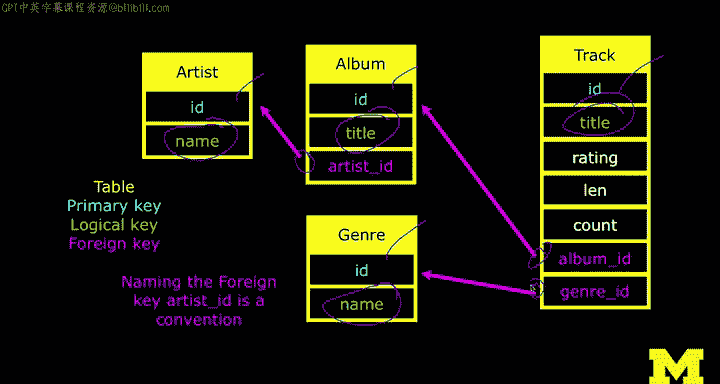

# PostgreSQL for Everybody：P18：17_数据库规范化原理

## 概述

在本节课中，我们将学习数据库规范化的核心原理。我们将了解如何将数据拆分到多个表中，并使用主键、逻辑键和外键来建立表之间的关系，从而避免数据冗余，构建一个高效、可维护的数据库结构。

---

## 从逻辑模型到物理表

上一节我们介绍了主键、逻辑键和外键的概念。本节中，我们来看看如何实际应用它们来构建我们的数据库。

我们的目标是跟踪音乐数据。为此，我们将创建四个表：`track`（曲目）、`artist`（艺术家）、`album`（专辑）和`genre`（流派）。我们将使用数字ID来标识每条记录，并用这些数字来建立表之间的关联。这样，我们就能在用户界面中通过关联这些数字来重建数据，正如设计师所要求的那样。

关于数据库规范化理论，你可以花数月时间深入研究。我在研究生阶段上过数据库课程，当时觉得理论过于复杂，甚至认为数据库是个笨拙的想法。直到后来在公司实际工作中，我才真正理解了它的价值。这并不是说理论不好，理论是数据库如此高效的原因。但从技术实践的角度看，规范化是相当直接的。

以下是规范化的核心步骤：

1.  **避免重复字符串数据**：通过引用（而非复制）数据来存储信息。这是一种数据压缩形式。
2.  **使用整数键**：为主键和引用关系使用整数键。
3.  **建立外键关联**：在需要关联的表中添加外键列。

例如，当我们要存储“AC/DC”或“Led Zeppelin”时，我们只在`artist`表中插入一次。在整个系统的其他地方，我们都使用一个名为`artist_id`的列，并放入对应的数字ID（比如Led Zeppelin是1，AC/DC是2）。从此以后，在这些外键列中，我们就用2来代表AC/DC，用1来代表Led Zeppelin。

一个主键可以被多个外键指向。在我们的数据模型中，关系比较简单。我们之前在白板上画的每个箭头，都代表了一对数字关系：一个源数字和一个目标数字，或者可以理解为父与子的关系。

---

## 建立表间连接

现在，我们将把之前通过头脑风暴建立的逻辑数据模型（将数据拆分到多个表中）重新连接起来。

我们得到了一个包含四个表的模型，现在需要展示建立这些连接的具体机制。

这个过程很简单。每个箭头在数据库中都需要一个具体的列来实现。我们通过添加列来“增强”我们的表。

*   我们为每个表添加一个**主键**字段。
*   我们还有一个**逻辑键**。逻辑键本质上也是一个列，但我们用星号(*)标记它，表示它很特殊。这是我们经常用来查找特定行的列（例如通过曲目标题查找）。数据库会为逻辑键创建**索引**，以加快查找速度。逻辑键通常是我们期望能快速查询的字符串列。
*   为了表示图表中的关系（这被称为**多对一关系**，例如多首曲目属于一张专辑），我们需要建模。在关系的“一”端（如`album`表），我们已经有主键。在关系的“多”端（如`track`表），我们添加一个列，命名为`album_id`。这个命名约定帮助我们记忆：第一部分是目标表名，第二部分`_id`表示这是一个外键，指向`album`表的主键。

所以，这是一个相当机械化的过程：选择逻辑键，添加主键，并根据你绘制的箭头添加必要的外键。

总结一下我们的四表三箭头模型：
*   我们最终得到**4个主键**（每个表一个）。
*   每个表有一个**逻辑键**。
*   我们有**3个箭头**，所以在每个箭头的起点（“多”的一方）放置一个**外键**。

一旦你掌握了这个模式，创建和阅读这些表结构就会变得非常快速和清晰。使用一致的命名约定后，你一眼就能看出哪些是外键。

---

## 总结

本节课中，我们一起学习了数据库规范化的实践方法。我们了解了如何通过避免数据冗余、使用整数主键和外键，将逻辑数据模型转化为具体的、关联的数据库表结构。接下来，我们将开始编写SQL命令来创建这些带有特殊字段的表，并开始插入规范化的数据。