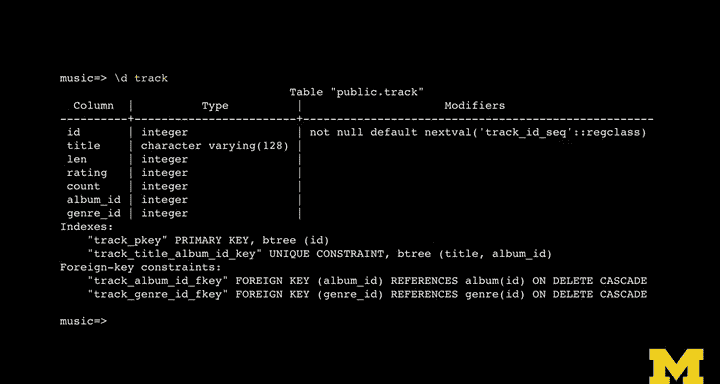

# PostgreSQL for Everybody：P19：数据表构建实践 🛠️


在本节课中，我们将学习如何将逻辑数据模型转化为物理数据模型，并使用SQL语句实际创建数据表。我们将重点介绍如何定义主键、外键、唯一约束，并理解它们之间的关系和作用。

---

## 概述

上一节我们讨论了如何增强逻辑模型以构建物理数据模型。本节中，我们将动手编写SQL，创建这些数据表并将它们关联起来。

首先，你需要创建一个新的数据库。根据你的作业环境，具体操作指令可能略有不同。通常，你需要以超级用户身份创建数据库。例如，我们之前创建的`pg4e`账户有密码，我们将使用它。但请注意，在演示中我以Postgres超级用户身份运行，该用户可以创建数据库，而`pg4e`用户权限则较低。

创建数据库后，连接到该数据库，即可开始输入SQL命令。

---

## 创建数据表的基本模式

你之前已经接触过`CREATE TABLE`语句。创建表时，需要定义一系列列。

PostgreSQL提供了一种简洁的方式来定义作为主键的列，即使用`SERIAL`类型。这不是所有数据库都有的功能。`SERIAL`基本表示：“我想要一个名为`id`的列，作为主键。让它是一个数字，并自动递增。”它是一个从1开始递增的数字（1, 2, 3...）。同时，指定`PRIMARY KEY`会告知数据库为此列创建索引，以实现快速查找。

对于逻辑键，我们使用`UNIQUE`关键字。`UNIQUE`表示该列的值必须是唯一的。例如，“AC/DC”这个乐队名在表中只能出现一次。如果尝试再次插入“AC/DC”，第一次会成功，第二次则会失败。数据库需要为此字段建立索引，以便在插入新记录时快速判断值是否已存在，而这个索引同时也使得按此键值查找记录变得非常快。

以下是我们的基本模式：
*   **主键模式**：使用`SERIAL`和`PRIMARY KEY`。
*   **基于字符串的逻辑键模式**：使用`UNIQUE`。

---

## 创建艺术家（Artist）表

以下是创建`artist`表的SQL语句。它遵循上述基本模式。

```sql
CREATE TABLE artist (
    id SERIAL,
    name VARCHAR(128) UNIQUE,
    PRIMARY KEY(id)
);
```

*   `id SERIAL`： 创建一个自动递增的整数列`id`。
*   `name VARCHAR(128) UNIQUE`： 创建一个最大长度为128的字符串列`name`，并为其添加唯一约束。
*   `PRIMARY KEY(id)`： 指定`id`列为主键。

---

## 创建专辑（Album）表

接下来我们创建`album`表。它引入了第一个外键。

```sql
CREATE TABLE album (
    id SERIAL,
    title VARCHAR(128) UNIQUE,
    artist_id INTEGER REFERENCES artist(id) ON DELETE CASCADE,
    PRIMARY KEY(id)
);
```

*   `title VARCHAR(128) UNIQUE`： 专辑标题是逻辑键，具有唯一约束。
*   `artist_id INTEGER REFERENCES artist(id) ON DELETE CASCADE`： 这是我们的第一个外键。
    *   `REFERENCES artist(id)`： 表示`artist_id`列引用了`artist`表的`id`列。外键位于关系箭头的起始端。
    *   `ON DELETE CASCADE`： 这是一个级联删除规则。它意味着：如果我们有一张`artist`表和一张`album`表，`album`表中的多行记录都指向某一位艺术家。当我们删除这位艺术家时，所有指向他的专辑记录也会被自动删除。删除操作从艺术家表级联到了专辑表。

---

## 创建流派（Genre）表

回顾数据模型图，`genre`表是一个被其他表引用的“一”端。因此它的结构很简单。

```sql
CREATE TABLE genre (
    id SERIAL,
    name VARCHAR(128) UNIQUE,
    PRIMARY KEY(id)
);
```

它仅包含一个主键`id`和一个具有唯一约束的逻辑键`name`（流派名称）。

---

## 创建曲目（Track）表

`track`表看起来复杂，但其实并非如此。

```sql
CREATE TABLE track (
    id SERIAL,
    title VARCHAR(128),
    album_id INTEGER REFERENCES album(id) ON DELETE CASCADE,
    genre_id INTEGER REFERENCES genre(id) ON DELETE CASCADE,
    len INTEGER, rating INTEGER, count INTEGER,
    PRIMARY KEY(id),
    UNIQUE(title, album_id)
);
```

*   `id SERIAL` 和 `PRIMARY KEY(id)`： 创建标准的主键。
*   `title VARCHAR(128)`： 曲目标题本身不是唯一的。
*   两个外键：
    *   `album_id INTEGER REFERENCES album(id) ON DELETE CASCADE`： 指向`album`表。
    *   `genre_id INTEGER REFERENCES genre(id) ON DELETE CASCADE`： 指向`genre`表。
*   `len INTEGER, rating INTEGER, count INTEGER`： 这些是普通的数值列。
*   `UNIQUE(title, album_id)`： 这是本表的独特之处。在其他表中，我们对单个字段使用了`UNIQUE`。但在这里，曲目标题本身不能是唯一的，因为可能有很多首歌都叫“Moonlight”。我们通过`UNIQUE(title, album_id)`定义了一个**组合唯一约束**。这意味着**标题和专辑ID的组合**必须是唯一的。这保证了在同一张专辑内，只能有一首名为“Moonlight”的曲目，但在不同的专辑中可以存在同名的曲目。

---

## 查看表结构

创建所有表之后，你可以使用`\d`命令（在psql中）或查询系统目录来查看表的结构。PostgreSQL会显示表的详细信息，包括：
*   列名、数据类型、是否允许为空。
*   约束类型（主键、外键、唯一约束）。
*   索引信息（例如，唯一约束会使用B-tree索引）。
*   外键的引用关系和`ON DELETE CASCADE`规则。

这让你可以确认刚刚创建的表是否符合预期。

---

## 总结与预告



本节课中，我们一起学习了如何使用SQL将物理数据模型实现为具体的数据库表。我们掌握了定义自动递增主键（`SERIAL PRIMARY KEY`）、基于字符串的唯一逻辑键（`UNIQUE`）、以及连接表关系的外键（`REFERENCES ... ON DELETE CASCADE`）的方法。我们还了解了如何为多个列的组合创建唯一约束，以满足特定的业务规则。


下一节，我们将进行数据插入操作，你将看到这些外键如何协同工作，以及我们如何将这些表的数据彼此关联起来。