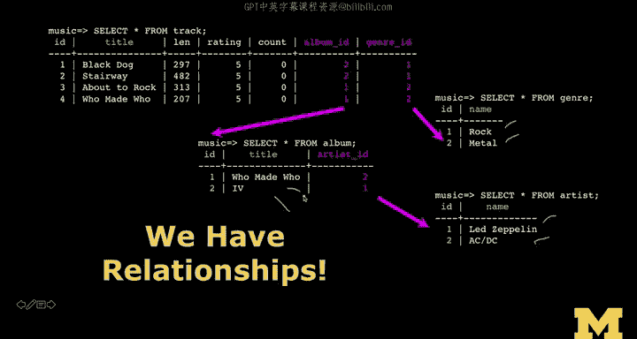

# PostgreSQL for Everybody：P20：数据插入技术


在本节课中，我们将学习如何向已创建的数据库表中插入数据。我们将重点介绍如何为具有自动生成主键（如SERIAL类型）的表插入数据，以及如何通过外键关联不同表中的记录。理解这些插入技术是构建关系型数据库应用的基础。

## 建立基础记录

上一节我们完成了数据库表结构的设计，本节中我们来看看如何向这些表中填充数据。

首先，向`artist`表插入数据时，需要注意`id`字段是`SERIAL`类型。这意味着我们执行`INSERT`语句时，无需指定`id`的值，数据库会自动为我们生成。

以下是向`artist`表插入数据的示例：
```sql
INSERT INTO artist (name) VALUES ('Led Zeppelin');
INSERT INTO artist (name) VALUES ('AC/DC');
```
执行上述插入后，数据库会自动为`Led Zeppelin`分配`id=1`，为`AC/DC`分配`id=2`。这些主键值在数据库内部使用，用于唯一标识记录，不表示任何价值判断。

## 关联表记录

接下来，我们需要将专辑与艺术家关联起来。这需要通过外键`artist_id`来实现。

由于`artist_id`不会像`SERIAL`主键那样自动生成，我们必须手动指定正确的值。例如，在插入专辑时，我们需要知道对应艺术家的`id`。

以下是向`album`表插入数据的示例，注意其中包含了外键`artist_id`：
```sql
INSERT INTO album (title, artist_id) VALUES ('Led Zeppelin IV', 1);
INSERT INTO album (title, artist_id) VALUES ('Back in Black', 2);
```
在这个阶段，我们通常需要手动记录这些`id`对应关系（例如记在纸上），以便在插入关联数据时使用。随着SQL技能的提升，我们将会学习更高效的方法来完成这项工作。

## 处理多对多关系

我们的数据模型从外向内构建，先处理`artist`和`genre`，然后是`album`，最后是`track`。`track`表需要关联到`album`和`genre`。

为`genre`表建立基础记录，可以避免重复输入字符串。我们为“Rock”和“Metal”等流派分配主键，之后在`track`表中引用这些数字即可。

以下是向`track`表插入数据的示例，它引用了`album_id`和`genre_id`两个外键：
```sql
INSERT INTO track (title, length, rating, count, album_id, genre_id)
VALUES ('Black Dog', 297, 5, 0, 1, 1);
```
插入数据时，值的顺序必须与表中列的定义顺序一致。对于`track`表，我们需要知道它所属的专辑ID和流派ID。

## 数据规范化的意义

以上所有操作的核心目的是避免数据冗余。我们为每个字符串值（如艺术家名、流派名）只在数据库中创建一次记录，并获得一个数字主键。然后，我们在其他表中通过外键引用这些数字来建立关联。

这种方法通过数字链接建立了数据间所需的关系。虽然步骤看起来有些繁琐，但本质上只是在使用数字进行关联，并不十分复杂。

## 从存储到展示

将所有数据分散存储到各个关联表中后，我们最终需要为了展示而重新组合它们。



用户界面通常不希望向用户显示内部的数字ID。因此，我们需要高效地将这些压缩的、以数字链接形式存储的数据重新连接起来，生成用户期望看到的输出（如完整的专辑名、艺术家名）。

这些数字ID也是一种数据压缩形式。字符串通常比数字占用更多存储空间。当数据量达到百万级别时，这种存储效率的差异就变得非常重要。


本节课中我们一起学习了在PostgreSQL中插入数据的基本技术，包括处理自增主键、设置外键关联，以及理解数据规范化在避免冗余和提升存储效率方面的重要性。掌握这些技术是进行有效数据库操作的关键。