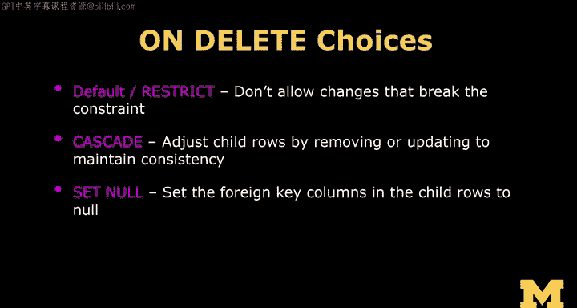

# PostgreSQL for Everybody：P21：跨表连接查询应用


## 概述

在本节课中，我们将学习如何使用SQL的`JOIN`操作来连接多个表，从而从规范化的数据库中重新组合出用户友好的数据视图。我们将探讨`INNER JOIN`和`CROSS JOIN`的区别，并理解`ON DELETE CASCADE`等外键约束的作用。

## 连接操作：从数字到可读信息

上一节我们介绍了如何通过主键和外键将数据分散到多个表中。本节中，我们来看看如何使用`JOIN`操作来遍历这些外键，高效地查询这个信息网络。

`JOIN`操作是`SELECT`语句的一部分，用于在多个表之间建立连接。你必须通过`ON`子句来指定表之间的连接方式。

我们拥有这些数据表，其中包含ID和外键。现在，我们的目标是将它们连接起来，生成一个对用户友好的输出，而不是显示那些用于内部管理的数字ID。

以下是一个基本的连接查询示例：
```sql
SELECT album.title, artist.name
FROM album
JOIN artist ON album.artist_id = artist.id;
```
在这个查询中：
*   `album.title`和`artist.name`是我们希望最终显示给用户的字段。
*   `FROM album JOIN artist`表示我们要水平连接`album`表和`artist`表。
*   `ON album.artist_id = artist.id`是连接条件，它告诉数据库如何匹配行：将`album`表中的`artist_id`（外键）与`artist`表中的`id`（主键）相等的数据行连接起来。

`SELECT`语句的作用是从所有可用的数据列中，挑选出我们想要展示的部分。

## 理解JOIN的机制：INNER JOIN vs. CROSS JOIN

为了深入理解`JOIN`的工作原理，我们需要区分两种连接类型。

`INNER JOIN`（内连接）只返回在两个表中都能找到匹配项的行。它本质上是在所有可能的行组合中进行筛选。

实际上，存在一种更基础的连接叫`CROSS JOIN`（交叉连接）。交叉连接会返回两个表中所有行的组合，而不进行任何筛选。如果第一个表有M行，第二个表有N行，结果将产生M x N行。

以下示例展示了`CROSS JOIN`：
```sql
SELECT track.title, genre.name
FROM track
CROSS JOIN genre;
```
如果`track`表有4行，`genre`表有2行，这个查询将返回8行结果，包含了所有可能的组合，包括匹配和不匹配的。

`INNER JOIN`可以看作是在`CROSS JOIN`的结果上，通过`ON`子句（或`WHERE`子句）过滤掉不匹配的行。在实际应用中，我们几乎总是使用带有`ON`子句的`INNER JOIN`，因为它更高效。明确写出`INNER`关键字是可选的，`JOIN`默认就是内连接。

## 重构数据视图：多表连接

现在，让我们进行一个更实用的多表连接，以重建我们最初的数据视图。

以下查询将连接`track`、`genre`、`album`和`artist`表：
```sql
SELECT track.title, artist.name, album.title, genre.name
FROM track
JOIN genre ON track.genre_id = genre.id
JOIN album ON track.album_id = album.id
JOIN artist ON album.artist_id = artist.id;
```
这个查询的执行过程是：
1.  从`track`表开始。
2.  根据`track.genre_id = genre.id`连接`genre`表，找到对应的流派名称。
3.  根据`track.album_id = album.id`连接`album`表，找到对应的专辑标题。
4.  最后，根据`album.artist_id = artist.id`连接`artist`表，找到对应的艺术家名称。

最终，我们得到了一个包含歌曲标题、艺术家、专辑和流派的完整视图，之前为了规范化而消除的文本重复（如“Rock”出现多次）在此刻被重建出来。可以这样理解：我们用数字压缩存储了数据库，而`JOIN`操作在查询时动态地将这些数字“翻译”回可读的文本呈现给用户，但底层存储依然是高效的。

## 外键约束：ON DELETE CASCADE

在创建表时，我们为外键添加了`ON DELETE CASCADE`约束。现在我们来理解它的作用。

外键建立了表之间的“父子”关系（例如，`genre`是父表，`track`是子表）。`ON DELETE CASCADE`定义了当父表中的一行被删除时，数据库应对其子表中相关联的行采取什么操作。

`ON DELETE CASCADE`意味着“级联删除”。如果删除`genre`表中的某一行（例如“Metal”），那么所有在`track`表中`genre_id`指向该行的记录也会被自动删除。这有助于保持数据的一致性，避免出现指向不存在的父记录的“孤儿”数据。

除了`CASCADE`，还有其他选项：
*   `RESTRICT`：如果存在关联的子记录，则阻止删除父记录。删除操作会失败。
*   `SET NULL`：将子记录中外键字段的值设置为`NULL`。要使用此选项，外键字段必须允许为`NULL`值。



`CASCADE`是一个常用的选择，因为它能自动维护引用完整性。SQL执行出错，往往是因为它正在严格执行我们为它设定的数据规则。

## 总结


本节课中我们一起学习了SQL连接查询的核心应用。我们掌握了如何使用`INNER JOIN`和`ON`子句跨表查询数据，将规范化的数字ID转换回用户友好的文本信息。我们还探讨了`CROSS JOIN`的机制以加深理解，并了解了`ON DELETE CASCADE`等外键约束对于维护数据完整性的重要性。通过多表连接，我们能够从高效的规范化存储中，动态重构出完整的应用程序数据视图。