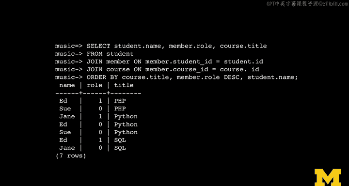

# 密歇根大学《给所有人的PostgreSQL课（数据库设计、SQL、JSON和NLP、ES）｜PostgreSQL for Everybody》中英字幕 - P24：23_多对多关系模型.zh_en - GPT中英字幕课程资源 - BV1tj421U7GK

So many demand many relationships are really important databases and I think they're less intuitive in some ways。

 I find that students find it difficult to say like as soon as I show you the one demand many relationship。

 which is what I just got done telling you about， students are like， I get it， I get it， strings。

It's hard to know when to use them in many relationships。

 so I'll just sort of show you some examples and maybe allude to when to use them。

 It'll come to you when it's time to use them。So here is a one to many relationship that we've been using right。

 and so there are many tracks that point to one album。Now。

 one of the ways that you can kind of realize in the back of your mind？What color。

 let me get a different color。That you should have done a many to many relationship instead of a one to many relationship is if you think to yourself。

 you know， what about。What if there's more than one album for a track。 So here's a track。

 and it's on the original album and then it's on a compilation album。

 and then it ends up on a soundtrack。 You say， well， how about if I call them album I D1。

Album ID D2 and album ID D3， wouldn't that work， so now I can have a track on three albums。

 Wouldn't that be pretty awesome？But the problem is， is that how does that stop。

 When does it stop Becauseuse a track could be on hundreds of albums。

 You don't know if one is the right number，3 is the right number or 100。

 And I can assure you that in your application， if you think 100 is enough， then it won't be enough。

 right， then it'll be like 1001， you'll encounter something where you need 1001，1001。

 no matter what number you pick。 So the idea of sort of making this almost like an array of album Is。

Not going to work。Okay so you think， oh， I'll do that and I know I've built spreadsheets where I'm like。

 oh boy， here's a thing and here's like， you know， X and x2 and x3 and x4 and I'll do that。

 And that's that's the way to do that's not how we do it。 First off。

 it's way expensive because you got all those columns you got on all rows that you may have zero albums or you may have 100 albums and if you have 100 columns in off chance that you need it。

Okay， I think I think you get it。 But the moment you think I need to add another one that's probably And that's what's been going off in your head all along is' like tracks could belong to more than one album。

 and an album could have like 20 artists。 So， you know， if you go back to the artist I in album。

 artist ID1 artist I2。 Oh， there's like five people in most bands。 No， there's not。

And then there's the writerer and there's like， okay。So you get。

Many to many turns out to be the right way to do all the data models。Except genre。

 I think genre is fine， but album and artist， those relationships should aprive in many to many。

And so this is just sort of how it looks in the one to many。 we end up with two tables。

 one is kind of like the from table and the two table or you could think of this one。

 I sort of think of the this is the main table and the sort the track is the main table and the genre is a lookup table you could say genres the parent table and this is the child table there's lots of way to describe it。

 you could call this the many the many to one， the arrows go in different directions， but whatever。

So this is what they look like， right？ You got two tables。 You're reducing the vertical。

 you're going to reduce the vertical duplication in this one table by making a little table that has the strings in it and then using numbers to replace that vertical duplication。

 So that's the basic technique that we use for one des。 So many des。We can't do it with one table。

 Now， in a sense， if you draw a logical diagram， you can still say there are many books and many authors and every author has many books and every book could have many authors。

 and so you can't do in either direction of one to one to many。 So in a logical diagram。

And a logical diagram， you just like say this this is a crows feet， many right crows feet。

 many crows feet， many that's a logical diagram， but it's not a physical diagram。

 So what we have to do in all these cases is we can draw the arrows however we want a logical diagram。

 but then we have to turn it into a physical diagram So we do what's called a junction table or a join table or an any table or a through table or whatever And what you basically do is you break this many to many。

Into a series of one to manyies， right， so this this ends up being a one to many。

And then this ends up being a many one to many。 And now we've turned it into two one de manyies。

 It's probably just as easy for me to show it to you in a create statement here。 So this。

 I'm going to solve the problem of。Who is students in courses？So。

 and teachers and courses at the same time。 So students courses and teachers and courses。

 one student can be in many courses。 One course has many students。

 There's no way to say student course， one course2 course 3， you're not going to do that。

 and then course student 1 student 2 student 3。 It would just never work， right？

 So what we do is we make this table that's in the middle we'll call the membership table or the member table。

 and it has two foreign keys。 Now， sometimes you put a primary key in to make it easy。

 sometimes you don't， in effect， you make the student I in course I D combination unique in this。

 although there are times you don't， you don't do this。 But in this case， we would make it unique。

 Now the interesting thing is you can also。Model data at the connection。

 so this connection is distinct for every student course accommodation。

 and so this is the way in learning systems， my account is different than your account and that I am marked as a teacher and you're marked as a student and that goes into。

This middle table， so you are not a teacher or a student， teacher。

 you are a teacher and a student in a particular course。Okay。

 so the role you are in depends on the student。The user course combination basically right and so we can actually model data at this connection and it's nice because there's a record in the member table that is distinct for each student course combination。

Okay， so foreign keys pointing to primary keys going outwards。

 So it's probably easier just to show this to you in SQL。

 So the first thing that we're going to do here is we're going like we always do when we're making tables is we're going to start from the edges and move in。

 we in a sense， have to create the primary keys before we create the foreign keys because then the create statements that include foreign keys will blow up So they need the table。

 So we have to create the student table in the course table and at this point， I hope it's。

Pretty normal to say ID serial， which is our primary key name Varar 128， which is just an attribute。

 email Varar 128 unique， that means it's kind of our way of saying it's our logical key and the primary key for this is ID。

That's no different than anything else we've done before， right， the same is true。 Of course， Id。

 this is kind of like genre。 almost Id and title， which is var cha is unique。

 and then primary key Id。 So we made two little leaf tables basically on our little tree。

 So the interesting thing happens when we start creating this middle table right。

 And it's pretty straightforward。 It's just two foreign keys pointing outward to two tables with primary keys。

 and then there's the data that's modeled at the middle， right。

 So we have student Id which references student， the Id field in the student table。

 on deletete cascade。 Remember about on deletete cascade， that means that if we delete a student。

 the membership record is going to also be deleted。

 this is pretty obvious that delete cascades great。

 Sometimes you might have other other uses of ondelete。And then the same happens。

 we point outward to course through course ID references course ID on deletete cascade， beautiful。

 beautiful， beautiful。Roole integer。 Now， role is the data that's modeled at the point of connection。

 right， One student connects to one class， and you're a teacher。

 One student points connects to one class， and you're a student。 That's data。

 And there might be more than one field there， right， So you might， you might on one side。

 have like a。A discussion thread on the other side might be a comment that says this user made this comment。

 and this might be the text of the comment， right， And so that that there are other ways to do it。

 Now， the other thing that's cool and interesting about this is the primary key statement。

The primary key for this table is not a single column。

The primary key for this table is a combination of columns and that basically says that you can only have one combination of a student ID and a course ID you can' have and that's important Now some of these you don't want that to be so strict but the primary key is a student ID in course ID and that's why we don't need our own ID serial if we were doing something like forums and comments we might have an ID and then even like a date and time so you could order them so you could make sort as many comments on a form as you wanted to make but in this case we're going to make the primary we're not going to have an ID serial and we're going to make the primary key be the combination of student ID and course ID。

It's， it's beautiful。 I mean， honestly， I just think the prettiest thing is to not listen to my lecture at all and just gaze at the absolute beauty。

Of S Q L， because it is beautiful。 It is so beautiful。So。Let's put some data in， not too surprising。

Again， we're going to start from the leaves just like we did before， insert some students。

 insert some courses。Then we're going figure out what their keys are again。

 there's vertical replication that we don't want to see happen right we don't want the student name or email to be replicated vertically anywhere or the course name or the vertically replicated so we need to make primary keys so we got James1 adds two and z is three and Python is one SQL and PhHP and now we just make the connections and so these are even more abstract Now we're just going to use one as the role So if you look at the role here the role is this the third parameter yeah the role is the third parameter here so we're just going to use one for teacher in zero for student。

And so we're going to insert Jane into Python as the teacher。

 we're going to insert Ed into Python as a student。

 we're going to insert Sue into Python as a student， right？

And then we're going to insert Jane into SQL as a student and。

Ed as into SQL as a teacher and on and on。 So these just become numbers。 And again。

 we're using these numbers as like links， right now。And so a away we go， right。

 And so then that plugs all these things together。And。

That's the data that we end up with and in the join table or the middle table or the through table。

 the member table in this case is really just a bunch of numbers， although if this were。

Comments and forums there might be the comment text might also be modeled in this middle table right in the middle table here。

 the comments in the text might be modeled and you might have a date and time and other stuff right in this case。

 it's super simple we're unique on the student ID course ID combination and we're modeling just a number which is the role。

 which is kind of how you do it with students。And then we have to reconstruct all this stuff。

 and so this this is a join to reconstruct it all。And again。

 we're going to go across a couple of tables， select the student name。

 the role from the membership table in the course title from the student table joined to the member table。

 according to the rules of。Member。tudentid equals student。id again， pattern pattern pattern。

 join course on member。t course ID， so the member of the join is going outward here equals course ID。

And order by course title， member role， descending， and then the student name so we're。

So then we just see and that remember all descending。

 the reason I did that is so that the teacher shows up first。 and so now we see。

Ed and Sue and PhHP and the teacher student， and then we see Jane， Ed and Sue in Python。

 and we see Jane's the teacher in that case， and then we see Ed。

 Jane or in SQL and we see that as the teacher in that case so away we go。

 we get all of our data back we can use joins to connect all these things。

 we can use wear clauses to figure out if somebody is even in a course。

way you go and so this is sort of like if you take a look at this in a data model workbench。

 you can see these two things kind of pointing out from the middle table。And again。

 this was an example from a MySQL database that I've got in a project called SuUi that is the thing that I use for auto graders。

So this has been quite a week。You certainly have used integer numbers for lots of things。

 we've used integer numbers to compress data。To reduce the size of the overall size of data and database。

 and then we use them for linking and we use them for primary keys and so numbers turn out to be important normalizing data is turning them into inger keys and。

Why did we do all this， Why didn't we just make a spreadsheet with all these things in there。

 And the answer is it might seem like a trade off that we had to do all this stuff。

 We had to make up these numbers。 But if you're going to build something that's important that's worth storing in a database。

 it's likely going to get big。Right， if it's small。

 you could just write a little Python program and do something。

 read the file completely every time and make a dictionary in memory。

 but if you can't fit a dictionary in memory， you got to use a database。

 It just there's no way you can say， well， I just bought a fast bigger computer。

 And the answer is if your data is getting big like that。

 buying a 16 gig computer does not solve your problem so。It might seem like a trade off。

 but you need to spend this time designing the database so when your application gets large。

 exceeds the size of the memory so you can't just do a Python program。It continues to be fast。

This is an exciting thing and we got so much more to talk about in SQL， this is just table stakeakes。

 it just kind of gets us into the game so that I can talk about all these things， primary keys。

 foreign keys， logical keys， joins， so that you will understand that and we're going get into a lot more complex。

 intricate ways to use SQL， but this covers all the basics that we need to get started。

