# 密歇根大学《给所有人的PostgreSQL课（数据库设计、SQL、JSON和NLP、ES）｜PostgreSQL for Everybody》中英字幕 - P25：24_数据库设计与多对多关系演示.zh_en - GPT中英字幕课程资源 - BV1tj421U7GK

Hello and welcome to another Postgres walkthrough。 This walkthrough。

 we're going to walk through the stuff we're doing in the second lecture。

 This is lecture about database design and foreign keys and and。Various relations。

 So the one thing we're doing in this lecture is something we're going to automate much later。

 And but that is building。Building database tables that are linked together and database rows that are linked to other rows by hand just so you can see them just once we automate them。

 I don't want you to forget how they work So we're going to have a bunch of tables in the data model here is there's a track table that has a foreign key to an album table the album table has a foreign key to the artist table and then the track also has a link to the genre table and these lookup I call these lookup tables they have a ID which is you know automatically assigned we put a name in we call it unique just because if we're going call a lead Zeppellin we only want one lead Zeppellin row because ultimately we're going to make lead Zeepellin be a number So you see these this one here also has this table has album table has a foreign key。

And so the thing the thing is is these these foreign key columns are just integer numbers。

 The ID serial is a little specialist， but it's just an integer number that's automatically generated。

 And so after weve come up with a data model， design the picture。

 then we can create all these tables now。This is all set up so that you can mostly just cut and paste things really fast into。

 you， I've got a， I've logged into my。

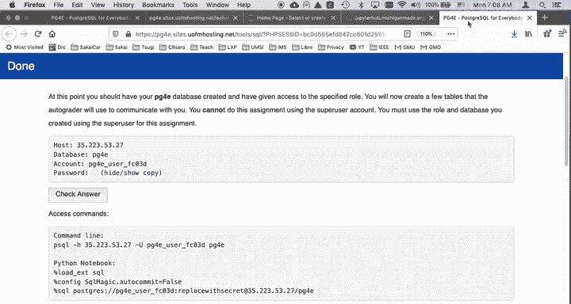

Postgres and off I go。

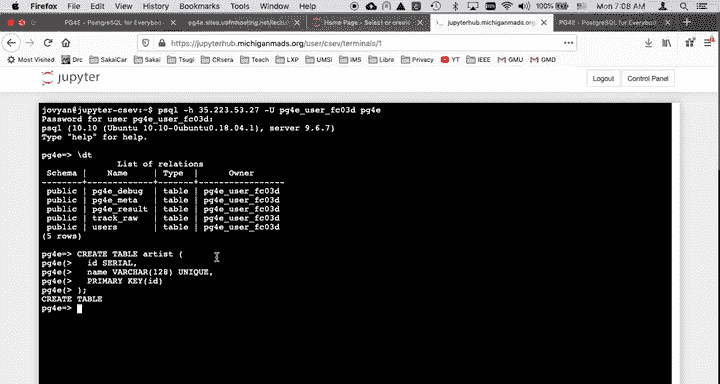

You can go as fast as I want with these things， I can just grab a whole bunch and because they end in semicolons and it somehow the Postgress client keeps up with the pasting and it all works pretty well。

 And so there you go， I've created an artist， album， genre and track table。

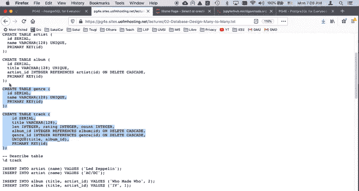

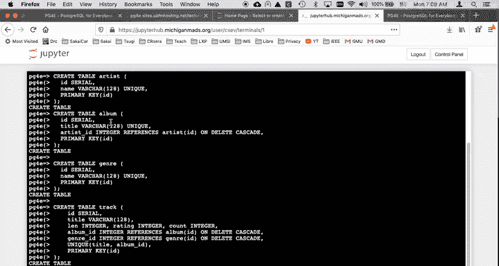

And so now I'm going to do some inserting。

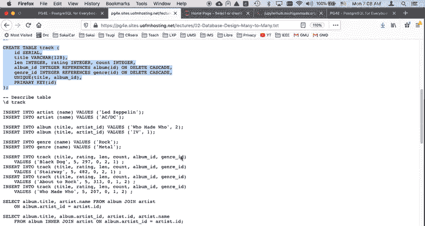

So the key thing is if I look like insert into artist led zpppelin here。

And then I select star from artist。Yes。T I hit the tab button there。 So I start from artist。

 then you see， and the ID is the key thing。

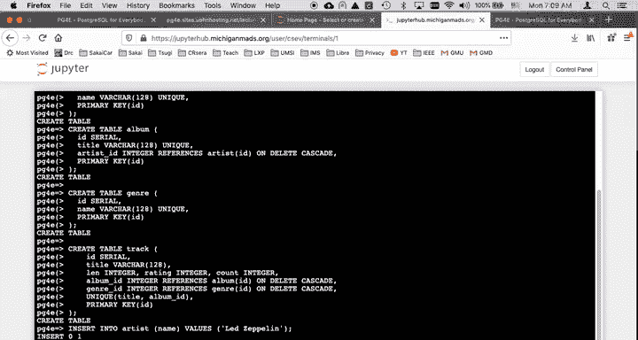

And。And I'll put in another artist， A DC。 So these are the lookup tables。

 These are the tables that we are。

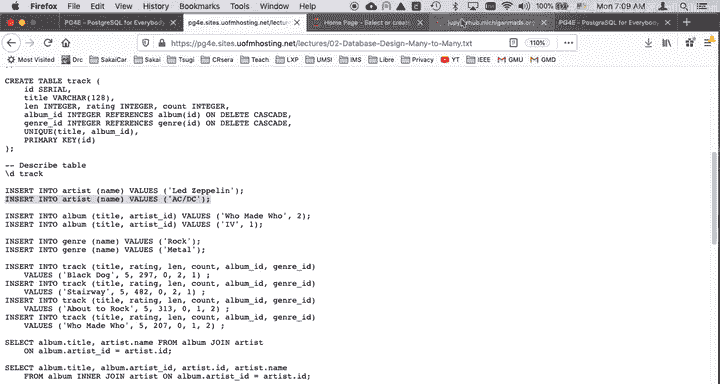

Fillling in with the string values so that we can create numbers that we can use everywhere else in the system。

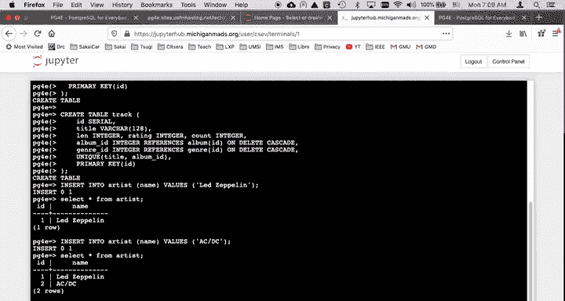

没有。The foreign keys， like artist I D， you have to explicitly will come up with other ways later where with sub selects。

 et cetera。 that they can look these up。 But in the short term， we're just going to do this manually。

 And so that means that we need to remember that who made who， which is A D C。

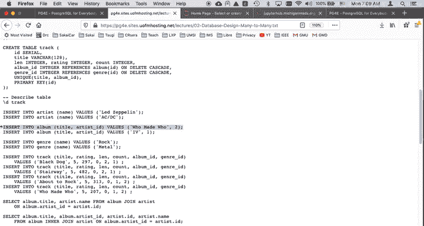

Is number 2。 So forever in this system now， AcDC is going to be the number  two。

 So now we can make an album and indicate that it's artist number two with this insert statement。

 Who may who and number 2。

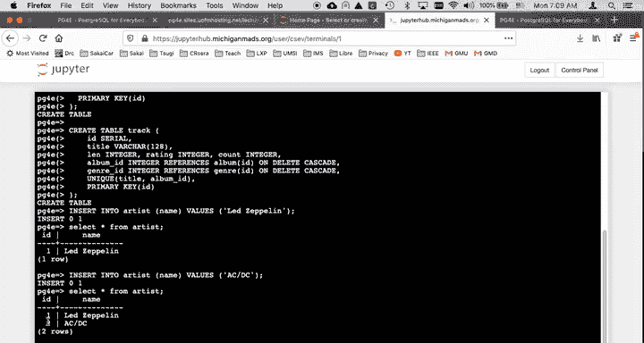

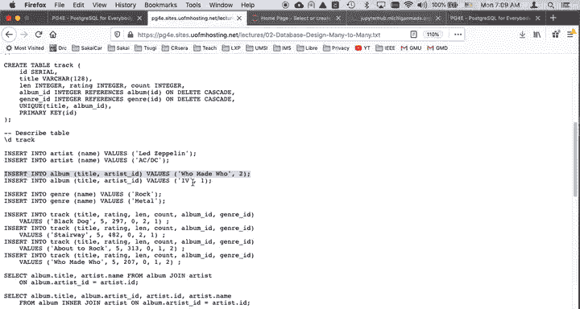

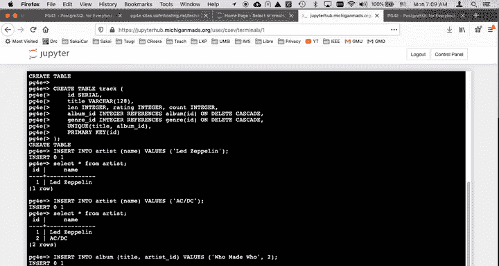

， and so we can do the same thing with LED Zepplin's album4。There you go。And we'll do the same thing。

 genre is another lookup table， so we'll just insert these two things。

 make sure you do these things in order。 Otherwise my numbers don't work anymore。

 select star from genre。

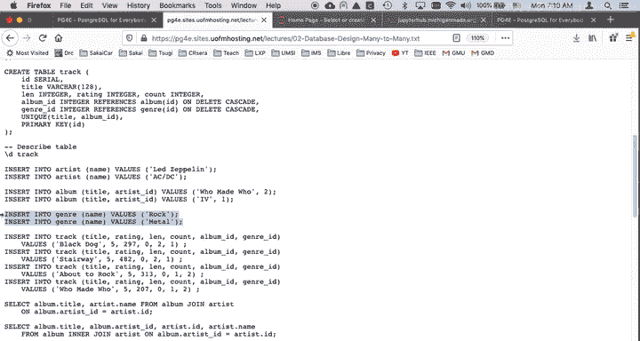

So we can see what the genre numbers are Now if I was doing this。

 I might have to write this down on a piece of paper， but I already did it。

 so I've got these numbers just right so this looks this next insert into track。

 This looks very complex but it's just got title length rating count Al mighty genre ID and this two in this one at the very backend here。

 Those are the numbers that are the foreign keys。 So you can't really sort of tell the difference between count。

 which is just an integer and Al mighty and genre ID。

 They're just integers in this particular insert statement and so the database knows because of the fact that we use this it's a reference and it's a foreign key and we've communicated on the create statement what these really mean and so mysQl can optimize them but in the insert statement they're just numbers and so we can put all those things in。

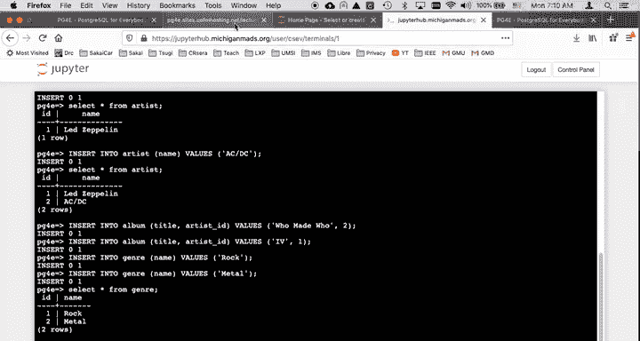

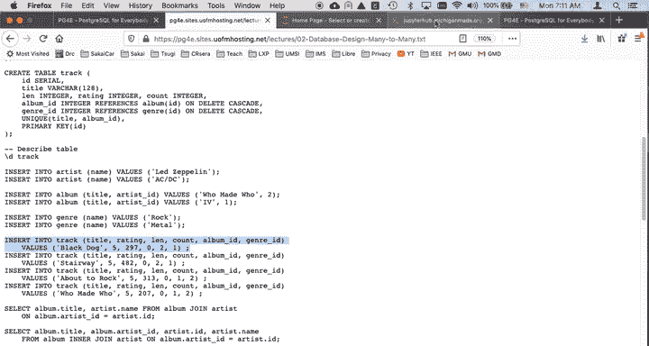

And we now。Oh， I forgot to copy and paste see， oh， this is really cool insert into genre name values rock duplicate key violates unique constraint。

 This keeps you from inserting it I didn't cut and paste quite right and so I'd already I'd tried to do that twice。

 but if you look。

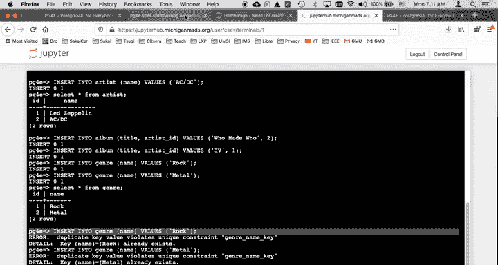

In track， I try to reinsert the genre， because I have this varchar 128 unique。

 the fact that I already had rock in there。

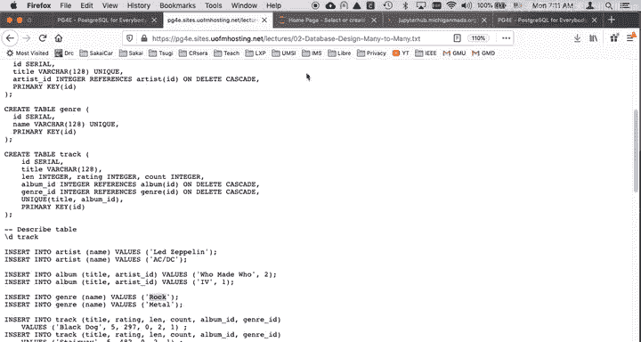

My database complained Now this is not a bug this is me in my database create statement。

 protecting me as typing an SQL commands from doing something stupid and making a mistake right and so it saved me from myself。

 So let me copy and paste this correctly and get that record inserted into track。

 insert into track and we got and we do a select star from track。

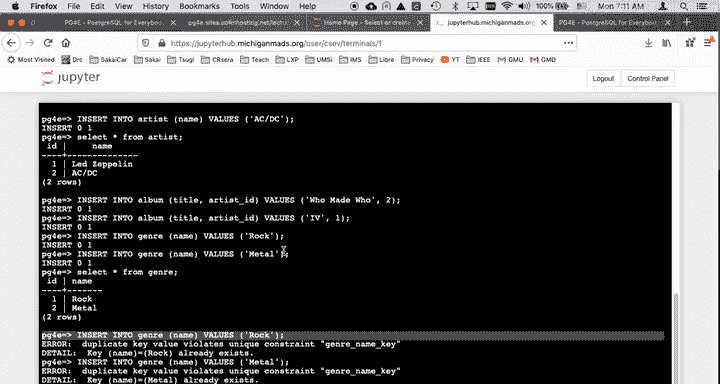

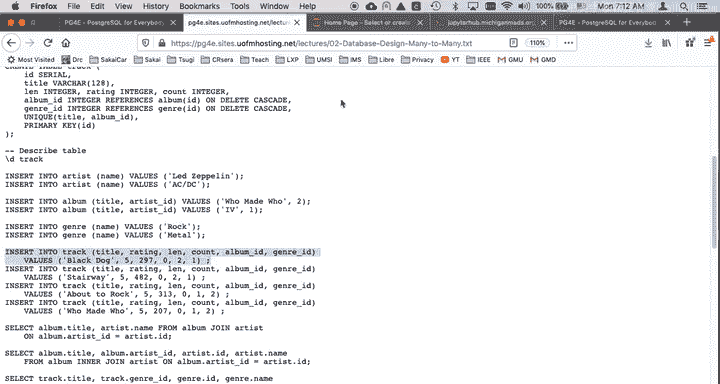

And see those numbers and even in this select the album ID and the genre ID just look like normal integers。

 but inside the database， trust me， my Postgress is thinking this through very carefully。

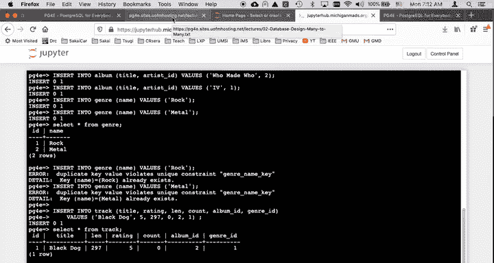

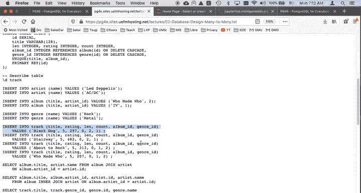

So let's insert the rest of these things。And get them all in。So now we have four records， select。

Count star。From track semicolon。

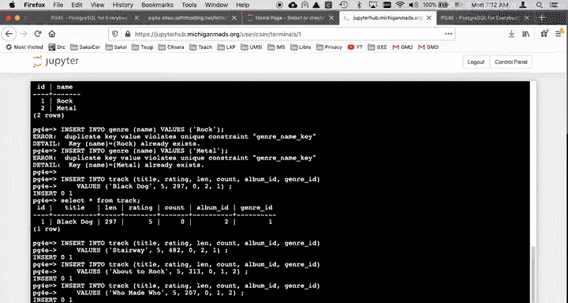

So we got four rows in there， four rows。So this is our first join。

 we're going to read the album title and the artist' name from the album。

 joined with the artist on the condition that the album's artist ID is equal to the artist ID。

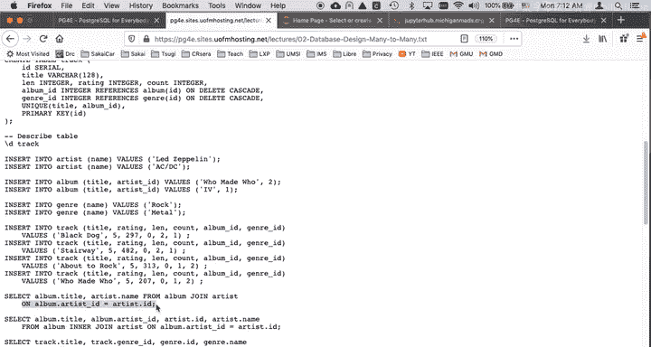

AndSo let's take a look at that。There we go。Who made who so that's going across two tables。

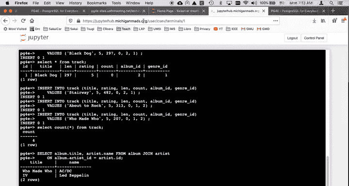

It might be easier to see this if we show album ID， artist ID and Al ID in the query。

 so this next query does that。

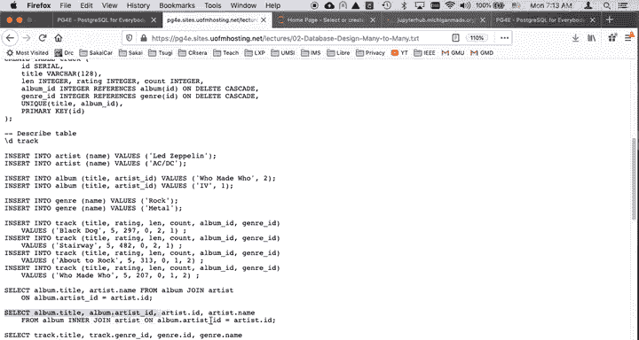

So now we can see how the artist ID， the rows are the rows that match between artist ID and album I D。

 and those are the rows we're seeing。 But what the select does， these this album。Album。

aristid and artist。id don't really need to be shown for us as the developer。

 I'm just showing it so we can kind of understand the database mechanisms that are going on。

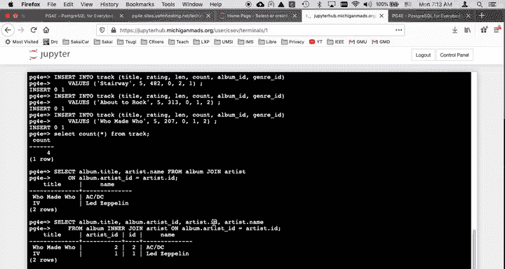

Now you can kind of see something about how joins work if we run a cross join between those。

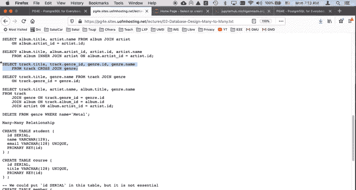

Between two things， a cross join doesn't filter out the things that don't match。

 so the cross join shows all the combinations of all the tracks with all the combinations of all the genres。

 and then you'll notice that sometimes these numbers match between genre I and the genre dot ID。

Sometimes they don't match。 And so really a regular join is a cross join with a filter that requires the match。

 And so that's where the on clauseuse comes in。 the on clause says， do a cross join， but。

Throw away the things that don't match the on claws。

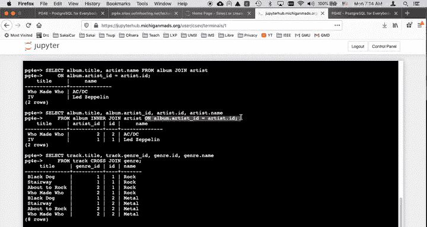

So we can see that， so let'll turn this into a normal old inner join or。

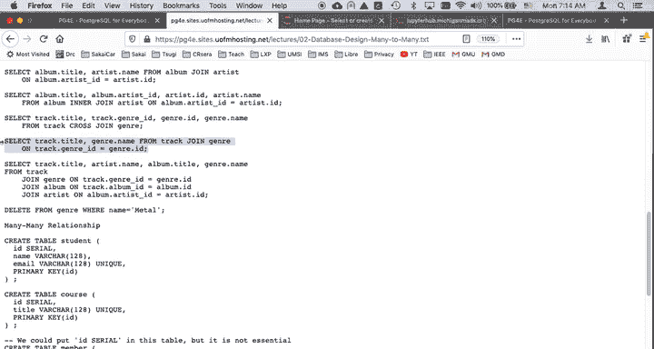

Non cross join with an encluse， and we see that it filters out only the things that we want where the rows really match。

 there is one there。There's one there。About to rock matches who made who matches。

 and then stairway is not metal and black dog is not metal。

 The cross join shows all those combinations， but the enclawuse of the regular join filters out so that we only see the matches。

 And after a while， we just stop thinking about this to realize that this is a cross join with a filter。

 a regular old join is a cross join without a filter。

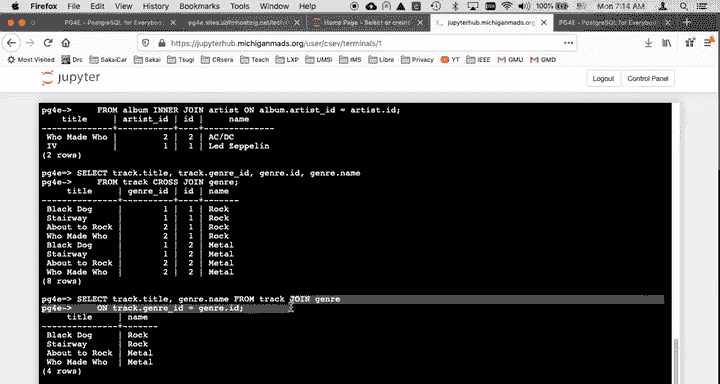

And if you want to do the whole big select where we join across all four tables。

 it's not all that hard， you got a join and you got an onlause。

 you' got another join you got an on clauseuse and the oncluse looks the same。

 I mean we name these artist underscore ID and the primary keys or ID and the foreign keys have the name of the table。

 this greatly helps this convention greatly helps when you're typing join command。

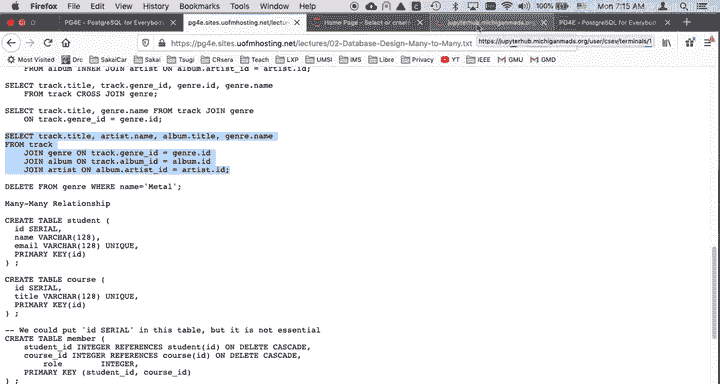

And so that's the many to one relationship， that's three tables and four tables and three many to one relationships。

Just to show you how the on deletete cascade works。

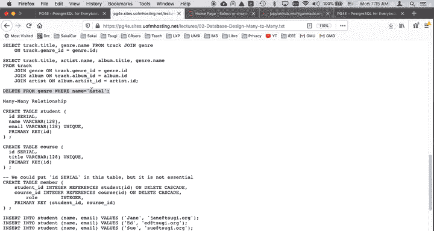

Let me do a select star from tracks。And you see that I have four records there。And then if I oops。

It's not what I want it to do。Select star from track。

 and then if I delete genre and what we're demonstrating here is the fact that that we。

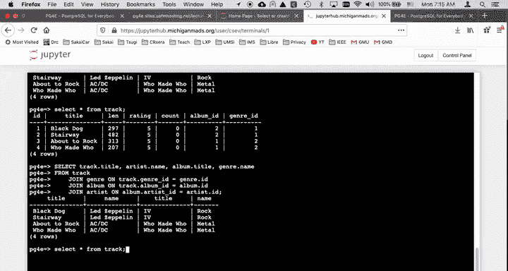

The track table says on delete of a genre row， delete the corresponding track。

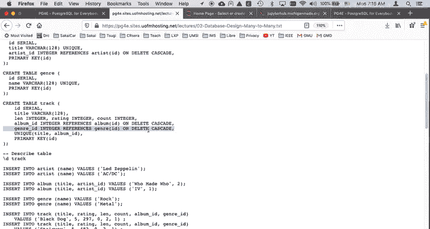

And so you'll see that even though I'm just deleting something from genre， so'll select star。

From genre。You see there's only one left， but the real effect is that we can do a select star from track。

And those two went away。 So the genre idea that had twos are gone now。

 And so that's because the delete from the genre table cascaded into the track table。

 So that's pretty cool。

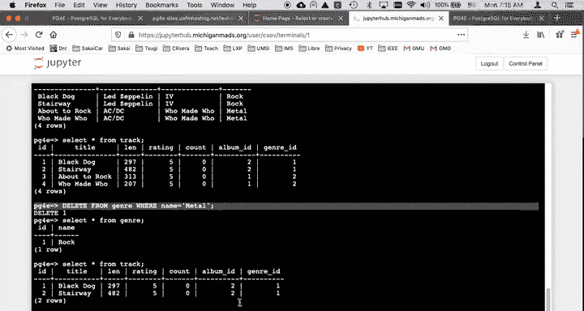

Okay。So now let's switch to many to many， but the key to many to many is is not that all that crazy。

 The many to many is a。Two one to many relationships。

 and so if we take a look at this many mini relationship between students， courses and members。

The student is just a lookup table right， you see that it've got an ID。

 a name and an email that's bar cha unique。Course table that's got a title that's varchar unique。

 Again， that varchar unique keeps us from making mistakes and。

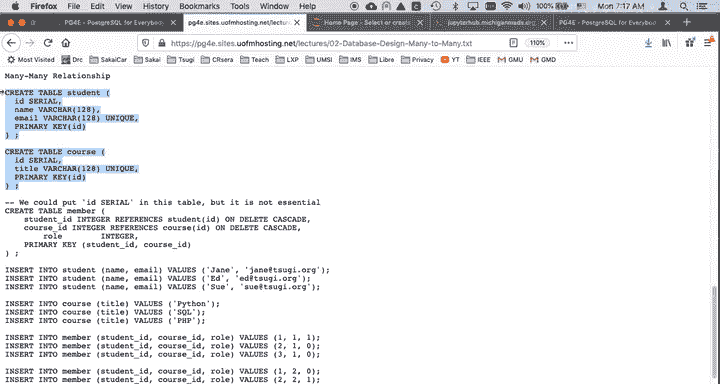

Putting duplicate things in。 so let's create those two tables。 Those two tables are the basic tables。

 but then we have。

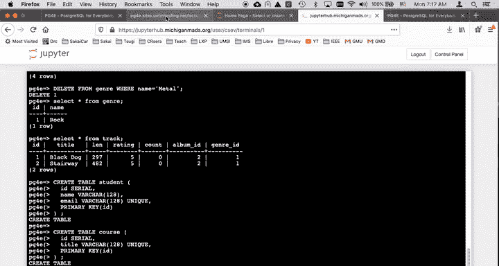

Here。Some people want to put an ID serial in the table。

 but I'm going to make it so that the primary key in this table is a combination of the student ID and the course ID。

 so this is the join table or the junction table or whatever Student ID is a foreign key and a student course ID is a foreign key。

In course， and these look exactly like foreign keys because literally many to many is this middle table with two left and right outbound。

Forign keys。 and then primary key， you can actually put a combination。 so it's the combination。

 So one comma 2 is okay。 Student ID of1 course I of2 is okay。 Student ID of2，2，2 is okay。

 but you can't have two rows that have identical combination of student ID and course ID So that's the primary key。

 and you want that because you really just want to say， well。

 this student is only allowed to be in this course at one time。 we don't need extra rows。

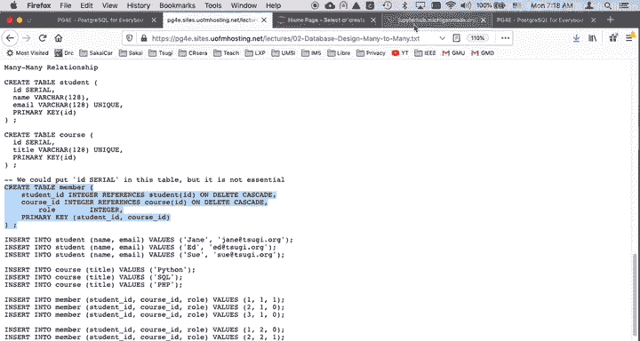

There might be times that when you don't care about that when you can have more than one。

 perhaps in particular because we're modeling this role value at the connection between student a student and a course。

 maybe we've decided that we can have a student in course with a different role and then I would make my primary keyV student ID course ID comm role and then there are those three things that have to be unique so you could be in as a student and an instructor so that。

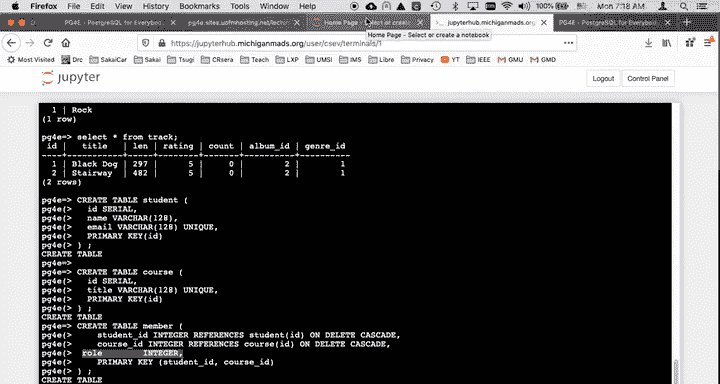

That's just a data model。We have lookup tables， the student and the course lookup tables。

 and I'll just grab those insert statements and send them in。

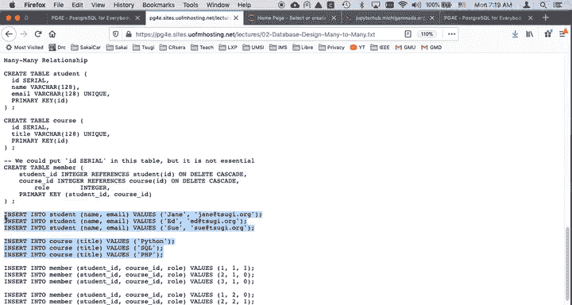

And so it's fun about this。 So now I've just got select I've got three records in each of the student and course tables。

 select star from student。Select our from Co。You see three records。

 but really what we've also done is created the ID fields for these things。

And now we're going to start adding the connections between them。

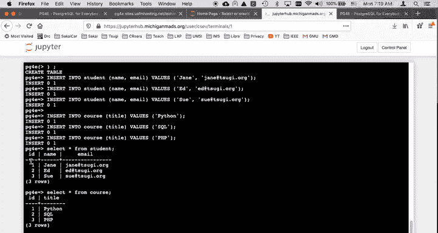

And so we have to know these numbers。 And again now here I've got to insert into member。

 a whole series of insert into members。 Now this was hard and I had to like go back and get all the numbers right。

 which again， you see student ID course I are just integers like the first one is 11。

 That means Jane is going into the Python course and she is going in as the instructor。2。

1 means thated is going into the Python course anded is going in with a zero as the student。

And so I'm just going to blast all these things in there。 I'm going to send these looks like5，7。

7 insert statements with all the foreign keys。

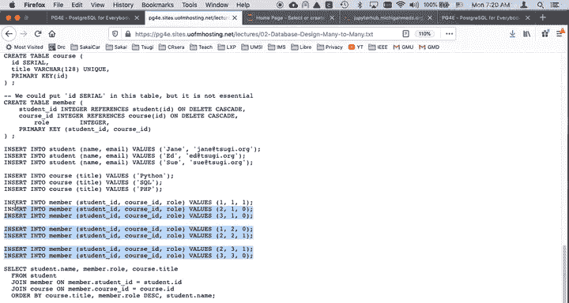

And they go， and now I can say select。Star from member。Oh， I do that， I make that typo all the time。

Rum， not form。RightAnd they're just numbers right but these are links Now the role is not a foreign key。

 but course ID and student night air foreign key， and when you construct a join， you sort of join。

 I think of it is joining through the member table。

 Now it turns out you can write this select statement here with student name member role course title。

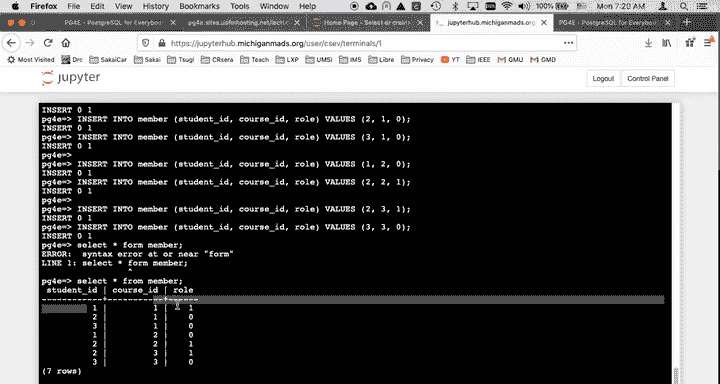

The from and the member you can put them in different orders。

 but I like to draw them in a particular order and particularly I like the join table in the middle right so I'm going from the student table joining through the member table into the course table。

 but they really just joined up and Postgres figures out all that stuff and of course I got to order by and I've got the course title member role descending and the student name just because I want it to look pretty。

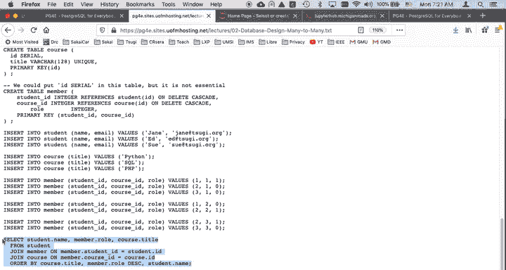

Because I want to see everybody next to each other in the course so we can see。

We can see all these folks， we can see Ed is the teacher of PhP and Sue is a student。

 Jane is the teacher of Python and Ed and Suer students et cetera， et cetera。

 etc cea and so that gets you through some many to many stuff now this is the manual way of inserting with these foreign keys with these hardcoded numbers you need to write these numbers down a little piece of paper and I'm not going to make you do too much of this by hand because the next thing we're going to teach you is how to automate all this stuff。

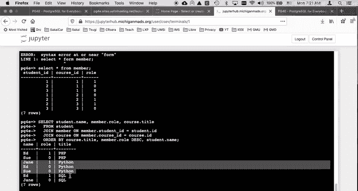

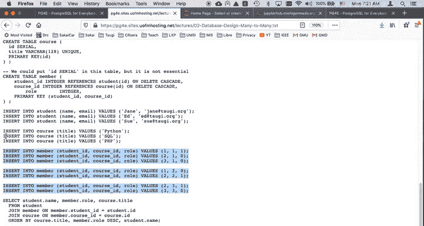

Cheers。