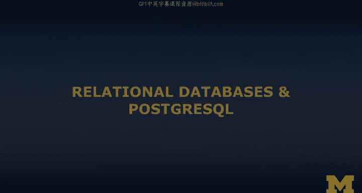
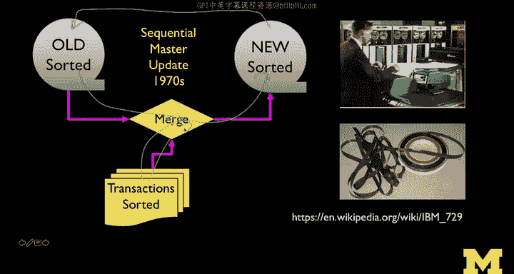
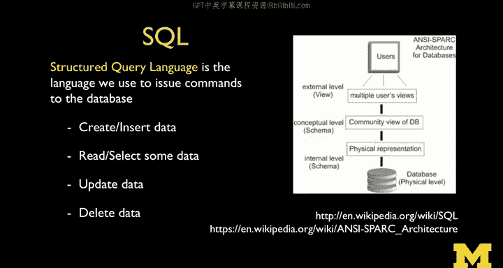
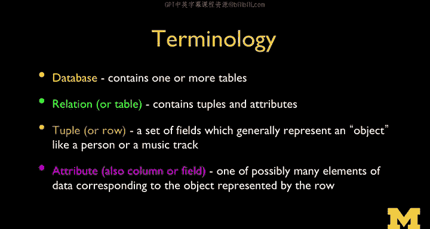
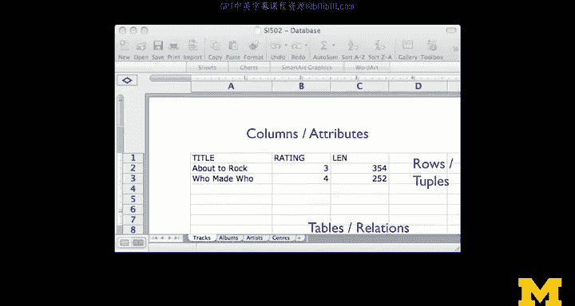
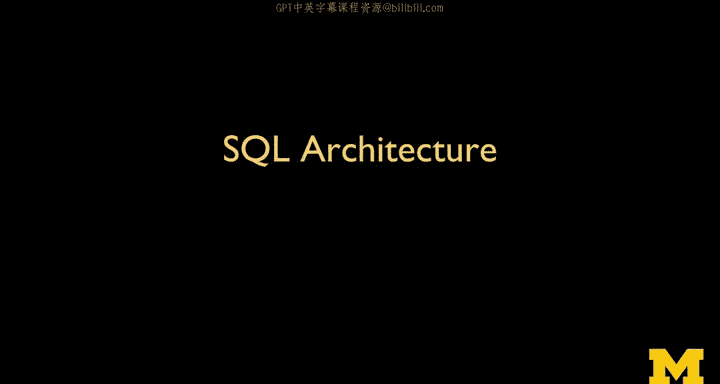

# PostgreSQL for Everybody：P2：关系型数据库发展史 📜

在本节课中，我们将学习关系型数据库的发展历史，了解从磁带存储到现代数据库的演变过程，并认识SQL语言的重要性。

## 从磁带存储到磁盘存储 💾

上一节我们介绍了课程概述，本节中我们来看看数据库技术是如何从磁带存储发展起来的。

在早期，计算机的内存和磁盘容量都很小，数据主要存储在磁带上。磁带是一种线性存储介质，访问不同位置的数据需要花费数秒甚至数分钟的时间。为了解决这个问题，人们发明了“顺序主文件更新”的方法。

以下是其工作原理：
*   银行将客户的所有历史数据按账号排序后存储在磁带上。
*   每个银行网点会有一份打印的余额清单，记录截至前一天午夜的数据。
*   白天发生的所有交易（如存款、取款）会被记录在穿孔卡片上。
*   晚上银行关门后，工作人员会将这些交易卡片按账号排序。
*   程序会同时读取磁带上的一个记录和卡片上的一个交易记录。
*   程序会比较两者的账号，如果交易记录的账号更大，就简单地将磁带记录复制到新磁带上。
*   当两者账号匹配时，程序会更新余额，生成新记录并写入新磁带。
*   这个过程只需要在计算机内存中保存一个磁带记录和一个交易记录，就能处理海量数据。

## 磁盘驱动器的革命与数据库的诞生 🚀

上一节我们了解了磁带时代的局限性，本节中我们来看看磁盘驱动器如何改变了游戏规则。

随着磁盘驱动器（以及后来的固态硬盘SSD）的出现，数据访问方式发生了根本变化。磁盘的读写头可以快速移动到任何位置，访问任意数据块的时间成本几乎相同，不再受数据物理位置远近的显著影响。

这带来了一个关键问题：如何构建软件，使得账户余额能在你存钱或取钱的瞬间得到更新？显然，“顺序主文件更新”方法不再是最佳选择。

在20世纪60年代和70年代，随着这些技术变得普及，许多公司开始构建“数据库”的概念。经过数十年的研究，我们得到了被称为“关系型数据库”的杰出软件。与顺序读取数据不同，关系型数据库知道如何在数据网络中高效地“跳跃”访问。它的背后有坚实的数学理论基础，这也是其高效运行的原因。

## SQL：数据库的通用语言 🗣️

上一节我们看到了专用数据库的兴起，本节中我们来看看如何通过标准化语言来统一它们。

随着数据库在60、70年代的发展，出现了IBM、Burroughs等供应商。每家公司的数据库都采用不同的策略和模型，并且通常绑定在自家的硬件上。这导致了互操作性问题。

美国国家标准与技术研究院（NIST）推动了数据库的标准化。他们与各供应商合作，最终制定出了**SQL（结构化查询语言）**标准。SQL的关键在于，它不规定数据库如何构建，而是规定了我们如何与数据库对话。

SQL是一种声明式（非过程式）语言。在过程式语言中，你需要精确指定每一步操作（如“先做这个，再做那个”）。而SQL允许你声明“我想要这样的结果”，数据库系统会自行优化并决定最佳的执行步骤。这种抽象使得不同的数据库供应商可以在底层实现上竞争和创新，同时用户可以使用统一的SQL语言进行操作。

## 核心概念：CRUD与数据模型 📊

上一节我们认识了SQL，本节中我们来看看使用数据库最核心的四个操作和数据的基本模型。

所有存储数据的系统都离不开四个基本操作，在数据库领域这被称为 **CRUD**：
*   **C**reate：创建数据
*   **R**ead：读取数据
*   **U**pdate：更新数据
*   **D**elete：删除数据

SQL语言的核心就是让这些操作变得快速且易于表达。

关系型数据库有深厚的数学基础，因此你会看到两组术语描述同一事物：
*   **理论术语**：关系（Relation）、元组（Tuple）、属性（Attribute）
*   **编程术语**：表（Table）、行（Row）、列（Column）

对于开发者而言，可以简单地将数据库想象成一个强大、快速的电子表格。表就像工作表标签，列是属性，行是记录。这种抽象使得我们可以专注于业务逻辑，而无需深究底层复杂的实现机制。

## 主流数据库系统简介 🏢

上一节我们了解了数据库的抽象模型，本节中我们快速浏览几种主流的数据库系统。

SQL的通用性使得学习一种数据库后，可以很容易地迁移到其他系统。以下是几种常见的数据库：
*   **SQL Server**：微软公司的强大产品，是一款坚实的商业数据库软件。
*   **MySQL**：曾经非常流行的开源数据库，后被Oracle公司收购。市场对其未来的开源性存在一些担忧。
*   **Oracle**：商业数据库的黄金标准，功能强大，适用于大型企业级应用，但通常被认为在安装和维护上更为复杂。
*   **PostgreSQL**：本课程将重点教学的开源数据库。它功能丰富（许多特性与Oracle类似），完全开源且社区活跃。鉴于MySQL可能存在的商业风险，越来越多的公司和项目正在转向使用PostgreSQL。

选择PostgreSQL进行教学，是因为它既拥有高级功能，又能保证开源自由的未来，是学习现代数据库技术的优秀平台。

## 总结 📝

本节课中我们一起学习了关系型数据库的发展历程。我们从磁带存储的“顺序主文件更新”讲起，看到了磁盘驱动器如何催生了能够随机访问的现代数据库。我们了解了SQL作为标准化查询语言的出现，它用声明式的方式让我们与各种数据库交互。我们还认识了CRUD核心操作，以及如何将数据库直观地理解为“强大的电子表格”。最后，我们简介了几种主流数据库系统，并说明了选择PostgreSQL作为本课程教学工具的原因。接下来，我们将开始学习SQL的架构并编写我们的第一条SQL语句。