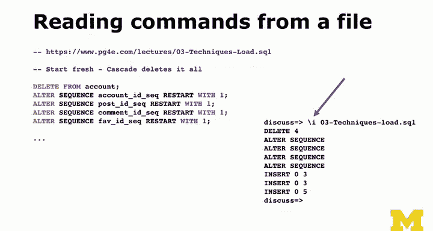

# PostgreSQL for Everybody：P30：表结构修改技术


在本节课中，我们将要学习如何在创建表之后修改其结构。你将了解到，即使初始设计有误或需求发生变化，也能通过SQL命令轻松调整数据库表，而无需停止应用程序或丢失数据。

## 概述

上一节我们讨论了创建表的基础知识。本节中我们来看看，当表结构需要调整时，例如列的数据类型不合适、需要添加或删除列，我们应该如何操作。PostgreSQL 提供了强大的 `ALTER TABLE` 命令来处理这些情况。

## 修改表结构

在数据库设计初期，我们可能无法预见所有需求。例如，你可能创建了一个用于存储博客文章的表，并将内容字段 `content` 设置为 `VARCHAR(1000)`，认为1000个字符足够。但后来发现有些文章更长，这个限制就不够了。

好消息是，在大多数成熟的数据库系统中，包括 PostgreSQL，你都可以使用 `ALTER TABLE` 功能来修改表结构。你可以在应用程序运行时修改表，数据库会自动将现有数据转换到新的模式。

以下是一些常见的表结构修改操作：

### 1. 修改列的数据类型

假设 `content` 列最初是 `VARCHAR(1024)`，但你需要它能存储无限长度的文本。你可以使用以下命令将其改为 `TEXT` 类型：

```sql
ALTER TABLE 表名 ALTER COLUMN content TYPE TEXT;
```

### 2. 添加新列

如果你忘记为“喜欢数”添加一个整数列 `fav`，可以事后添加：

```sql
ALTER TABLE 表名 ADD COLUMN fav INTEGER;
```

### 3. 删除列

如果你错误地添加了一个名为 `oops` 的列，可以将其删除：

```sql
ALTER TABLE 表名 DROP COLUMN oops;
```

### 4. 修改约束

表结构的修改不限于列。如果你定义了错误的外键关系或唯一性约束，也可以修改。例如，你可能需要将单列的唯一约束改为多列组合的唯一约束。这通常涉及先删除旧约束，再添加新约束。

```sql
-- 删除旧约束
ALTER TABLE 表名 DROP CONSTRAINT 约束名;
-- 添加新约束
ALTER TABLE 表名 ADD CONSTRAINT 新约束名 UNIQUE (列1, 列2);
```

**注意**：在对运行中的数据库进行结构修改时需谨慎。例如，如果应用程序正在向一个你刚刚删除的列写入数据，操作就会失败。因此，最好在应用程序低峰期或维护窗口进行此类操作。

## 从文件执行SQL脚本

除了交互式地执行命令，另一种高效的技术是从文件读取并执行SQL语句。这在需要批量插入数据或运行复杂脚本时非常有用。

例如，讲师可能会提供一个包含上千条 `INSERT` 语句的文本文件。你不需要手动复制粘贴每一条，只需在 `psql` 命令行工具中使用 `\i` 命令。

假设你已将SQL脚本文件 `load_data.sql` 下载到当前工作目录，可以这样执行：

```
\i load_data.sql
```

这会让 PostgreSQL 读取并执行文件中的所有 SQL 语句。

## 总结



本节课中我们一起学习了 PostgreSQL 中修改表结构的关键技术。我们了解到，使用 `ALTER TABLE` 命令可以灵活地更改列的数据类型、添加或删除列，以及调整约束，并且这些操作通常可以在数据库运行时进行。此外，我们还学习了如何使用 `\i` 命令从文件执行SQL脚本，这对于批量操作非常高效。


下一节，我们将探讨数据库中如何处理日期和时间，这是数据管理中的一个重要部分。