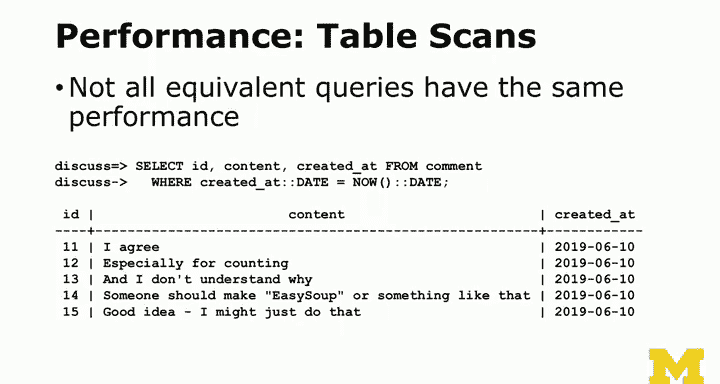

# PostgreSQL 数据库课程：P31：日期数据类型处理 📅

## 概述

在本节课中，我们将要学习 PostgreSQL 中日期和时间数据类型的处理方式。我们将探讨日期、时间和时间戳的区别，学习如何存储和转换时区信息，并了解如何执行日期运算和查询优化。理解这些概念对于构建健壮的、全球化的应用程序至关重要。

## 日期与时间：两种思维方式

日期是数据库的重要组成部分。理解日期有两种方式。

第一种方式是将日期和时间视为类似字符串的字段。例如，当你输入历史数据时，比如美国内战的重要事件发生在1862、1863和1864年，这些是历史日期。此时，时区或具体时间点通常不是争论的焦点。日期和时间只是你读取和输入的信息，它们记录的是事件发生时被写下的内容，与时区无关。

而在计算机领域，当我们处理诸如博客发布时间这类信息时，情况则不同。例如，系统显示“2小时前发布”。这涉及到“何时发生”的概念，我称之为“时间点”。日期、时间与时间戳（更偏向于“何时发生”的概念）之间的关键区别在于：时间戳记录的是一个绝对的、全球统一的时刻。

## 时间戳与时区 🌍

当我按下这个键的瞬间，就是一个时间点。这个时刻在全球所有时区都是同时发生的。例如，你发起一个会议说“大家好”，这在美国东海岸可能是下午5点，在西海岸是下午2点，在某个内陆地区可能是晚上11点。但这仍然是同一个“时刻”。

因此，我们使用时间戳。PostgreSQL 中有两种时间戳，一种几乎没用，另一种是带时区的时间戳（`timestamp with time zone`）。它们都是8字节字段。我个人总是使用 `timestamp with time zone`。

`timestamp with time zone` 的有趣之处在于，你可以存储一个特定时区的时间，例如美国东部时间下午1点。当你查询它时，可以将其转换为美国特定时间、英国标准时间或其他任何时区。

PostgreSQL（以及大多数数据库）有一个 SQL 函数叫 `now()`。它返回当前时刻，通常关联着一个时区（可能是配置的通用时区，即格林威治标准时间）。这个“现在”就是当前这一分钟。

## 自动生成时间戳

我们倾向于在数据库中大量使用 `timestamp with time zone`。其他数据库可能没有这种类型，但在 PostgreSQL 中是必要的。

你还会注意到我们使用了 `DEFAULT now()` 这样的文本。这类似于约束或唯一键。在模式定义（`CREATE` 语句）中，我们告诉数据库我们希望它自动为我们做什么。

如果你看我过去10年创建的任何数据库，我总是有一个 `created_at` 字段。在某些数据库中是 `timestamp`，在 PostgreSQL 中是 `timestamp with time zone`。它的作用是：在插入行时，自动填入当前时间，而无需我在每个 `INSERT` 语句中都手动指定。

我以特定的方式命名它，并给数据库一个指令来预填充它。

有些数据库支持 `updated_at` 字段的自动更新，意味着当你执行更新操作时，可以标记一个字段自动更改为更新时刻的“现在”。但在 PostgreSQL 中，你不能在 `CREATE` 语句中直接实现这一点，需要通过存储过程来实现，我们稍后会讨论。因此，在这个例子中，`created_at` 和 `updated_at` 在插入时都被设置为当前时刻，但更新操作不会改变 `updated_at`。这有点反直觉，其他数据库有更简单的方法来实现。

## 最佳实践：UTC 时间

使用带时区的时间戳是最佳实践。这并不意味着所有时间戳都必须存储在某个特定时区，尽管我喜欢选择 UTC（协调世界时）时区。

UTC 基本上就是格林威治标准时间，独立于夏令时。它是英国的时间，但英国也有夏令时和标准时间之分。而 UTC 始终相同，没有夏令时。这就是格林威治标准时间、英国时间与 UTC 之间的区别，尽管它们大致属于相同时区。

因此，无论我们在世界何处，都倾向于使用没有夏令时的英国时区（即 UTC）来存储时间戳。

这样做的理念是，你可以随后告诉 PostgreSQL 将其转换为你想要的任何时区。这就是为什么当你乘坐飞机进入不同时区，打开谷歌日历时，它会问你是想以太平洋时间查看这些事件，还是继续以东部时间查看。最糟糕的情况是，当你在太平洋时区时，有人发邮件说“我们下午3点见面”。你在太平洋时区输入下午3点，然后飞回家后发现，等等，怎么是中午？出什么问题了？

## 时区转换与复杂性

最终，在数据库中，由于在线应用程序经常在全球范围内同时运行，我们会使用 UTC 存储时间。但随后我们可以说：我想知道这在本地时区是什么时间。因此，你可以为每个用户提供不同的视图。这就是 `AT TIME ZONE` 子句的用途，例如 `AT TIME ZONE 'UTC'`、`AT TIME ZONE 'ET'` 或 `AT TIME ZONE 'HST'`。

时区非常复杂。如果你查看早期版本的 PostgreSQL，它们可能只支持大约14个时区，但后来意识到这并不准确。看看时区列表，你会惊讶于时区的复杂性。并非所有时区都是整小时偏移，有些是6小时30分钟（如印度/科科斯群岛），有些是15或45分钟。可以想象，生活在那些地区，要设置多人实时会议并确保时间正确该有多难，因为你的日历可能会偏差30分钟。

我们稍后会实际操作这些数据，因为它能提供一些有趣的数据点。

## 探索时区信息

`pg_timezone_names` 是一个系统视图，它列出了可用的时区信息。`abbrev` 是常用缩写，如 `EST` 代表东部标准时间，`BST` 代表英国标准时间。`is_dst` 表示该时区当前是否处于夏令时。

数据库常做的一件事就是创建这类“伪表”。它们意识到可以创建一个名为“可用时区”的东西，或者只是创建一个你可以用 SQL 语句查询的虚拟表。这很酷，因为现在你可以在其中使用 `WHERE` 子句进行查询。

`SELECT` 是查看数据的好方法。我们只需用这些信息创建一个虚拟表。安装 PostgreSQL 时，你可能需要选择时区，或者可以添加新的时区。查看 `pg_timezone_names` 可以告诉你正在使用的特定数据库中有什么。

## 类型转换（Casting）

现在是讨论类型转换的好时机。我不知道“casting”这个词从何而来。

在编程中，类型转换是指将一种类型的变量或常量转换为另一种类型。例如，将整数转换为字符串等。

PostgreSQL 有几种语法来实现类型转换。一种是双冒号 `::`，我认为这是一种非常优雅的语法。例如，`now()` 返回一个带时区的时间戳，但 `now()::date` 会将其转换为日期，有效地截掉时间部分。

另一种是 `CAST` 函数，例如 `CAST(now() AS date)`。`AS` 是一个关键字，`date` 是预定义的类型之一。这是一种更标准的方式。双冒号语法是它的简写形式。

同样，`now()::time` 只截取时间部分。可以将其视为通过日期视角或时间视角来审视数据。

## 日期区间运算

我们还可以进行日期区间运算。`INTERVAL` 本身是一个关键字，它接受一个参数，是一种小型语言，例如 `‘2 days’`、`‘5 hours’`。你可以查阅这种区间语言的详细说明。

我们常做的一件事是查询“两天前是什么时候”。所以，`now() - INTERVAL ‘2 days’` 表示现在减去两天。你还可以将其转换为日期：`(now() - INTERVAL ‘2 days’)::date`，这意味着将两天前的时间戳转换为日期，即丢弃时间部分。这样我们就可以进行非常精确的日期区间运算。

## 截断函数

还有一个内置函数叫 `date_trunc`，它允许我们丢弃时间戳中的某些精度，例如截断到天、小时、分钟等。

这是一个简单的概念，但代码可能有点复杂。例如，我们想查找今天发布的评论。

我们说的是 `created_at >= date_trunc(‘day’， now())`。如果你取当前时刻并将其截断到只保留天，那就是一个日期，比如6月10日。如果今天大于或等于6月10日，并且 `created_at` 小于 `date_trunc(‘day’， now()) + INTERVAL ‘1 day’`（这将是6月11日），那么就在这个范围内。

我是怎么找到这个方法的？我想我是去了 Stack Overflow，搜索了“如何使用 created_at 查找今天发生的事情”之类的问题。所以，不要觉得去 Stack Overflow 查这些东西有什么不好。我主要是为你提供进入 Stack Overflow 的入口点。

## 查询性能考量 ⚡

这个话题在本课程和下一课程中会经常出现，那就是：并非所有返回相同结果的查询都具有相同的性能。

这与一个事实有关：有时，你表达查询的方式会导致数据库必须检索大量行，然后逐行检查。这是最慢的方式，我们称之为“全表扫描”。

当我们开始关注性能时，我们会说：看看这个查询，它的性能会如何？然后他们可能会说，你刚才做的那个操作会导致全表扫描。这意味着，糟糕，我们必须读取所有数据，并使用像循环中的 `if` 语句那样的逻辑来读取所有记录。这是最慢的方法。数据库的问题在于它们很大，数据分布各处。因此，读取所有记录通常会对性能产生影响。

问题是，有没有一种方法可以让我通过 `WHERE` 子句来避免读取所有记录？一个不读取所有记录的 `WHERE` 子句，通常是在字符串字段上有唯一索引，并且你查询 `WHERE email = ‘csev@umich.edu’`。即使有数百万条记录，索引也能让它直接定位到 `csev@umich.edu`。这就是我说的“非全表扫描”。即使对于数百万条记录，这也可能只需要一两次 I/O 操作。

我现在提出这一点，是因为这种特定的业务方式，或者说这种选择今天评论的方式，你可以说：让我们取今天并将其截断为日期，即转换为日期。然后判断创建日期是否等于今天的日期。

目前我无法向你详细解释，但你可以去 Stack Overflow 上查找为什么这个查询慢，而另一个查询快。这可能会是一个有趣的探索。

我只想说，在某些情况下，数据库内部可以利用 `date_trunc` 的某些特性，而在进行类型转换时则无法利用。但这并不意味着 PostgreSQL 14 不能学会让后者变快。这就是问题所在。没有绝对的规则，只是事实表明这个版本的查询比那个版本的查询慢。我们以后会更多地讨论这个问题。

对于这个特定的例子，你无法控制太多，你只会看到，如果你对这个查询执行 `EXPLAIN`，会发现它导致了全表扫描，而另一个则没有。我提出这一点，是因为这将是我们讨论一些查询时的常见主题：是的，这种技术比那种技术好，因为一种技术会导致全表扫描，而另一种不会。

## 总结

本节课中，我们一起学习了 PostgreSQL 中日期和时间数据类型的核心概念。我们区分了单纯的日期/时间记录与表示绝对时刻的时间戳，并深入探讨了带时区的时间戳（`timestamp with time zone`）的重要性及其在全球化应用中的最佳实践——使用 UTC 进行存储。我们学习了如何使用 `DEFAULT` 约束自动生成 `created_at` 等时间戳，以及如何进行类型转换（`::` 和 `CAST`）和日期区间运算（`INTERVAL`）。此外，我们还介绍了 `date_trunc` 函数用于截断时间精度，并初步接触了查询性能优化的概念，了解到不同的查询写法（如使用 `date_trunc` 与直接类型转换）可能对是否引发全表扫描产生关键影响，这是数据库性能调优的重要基础。下一节，我们将探讨如何使用 `DISTINCT` 和 `GROUP BY` 来处理列中的重复值。