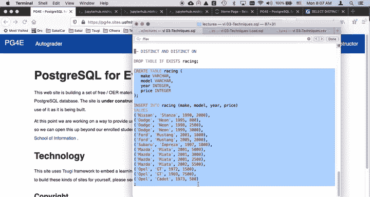
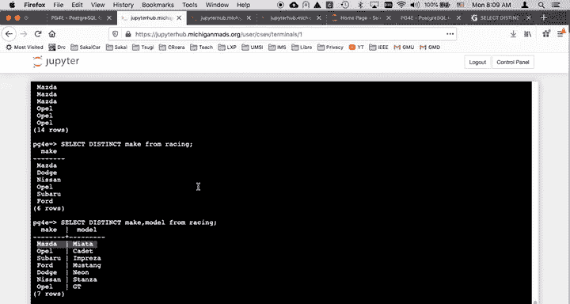
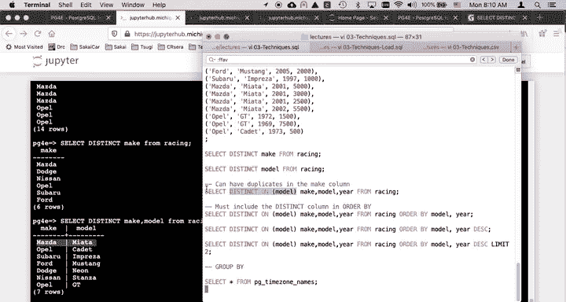
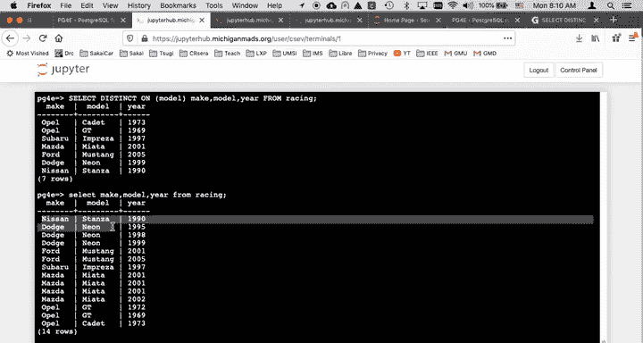
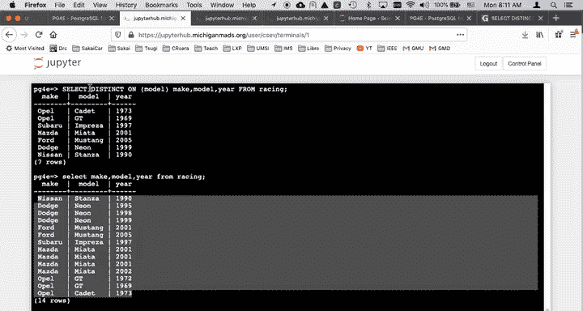
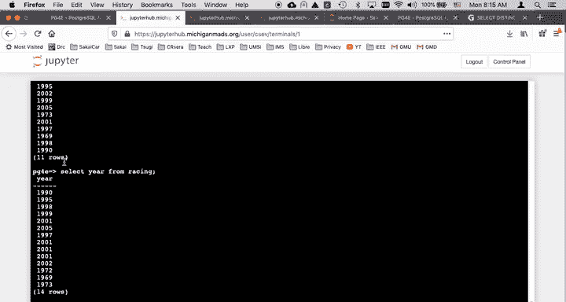
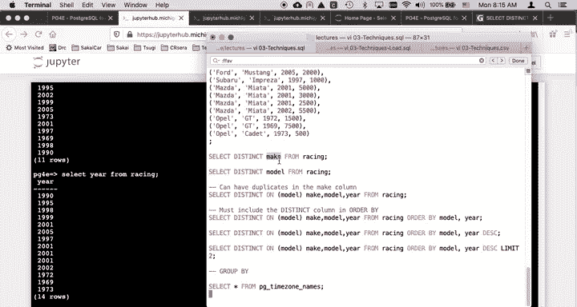

# 密歇根大学《给所有人的PostgreSQL课（数据库设计、SQL、JSON和NLP、ES）｜PostgreSQL for Everybody》中英字幕 - P33：4_SELECT DISTINCT语句演示.zh_en - GPT中英字幕课程资源 - BV1tj421U7GK

Hello and welcome to another Postgres SQL walkthrough in this particular walkthrough。

 we are going to work on distinct and distinct on。So I'm going to create a table。

And I'm going to put some vertical replication in it because distinct is a way of eliminating vertical replication。

 And so I'll just go ahead and fill this in。

Create the table and put that data in with lots of vertical replication for these makes and the models。

 Nissan Dogenon， dodgeon Dogenon。 So we even have sort of some。

With nothing but the price in the year changing the three dodges， et cetera， et cea。

So that the key idea is is select distinct。 So me let me first say， just select。Make。From racing。

And you see that there's a bunch of vertical replication， right， Dodge， Dodge， Dodge， Ford Ford。

 Suuru， Mozda， Mozda。So all you have to do is say， you know what， I don't want any duplicate row。

 so the simplest form of distinct is the most powerful， select distinct。Make from racing。

 all that says is don't show me the same row twice。RightAnd so that sort of just gives you the rows。

 but only the ones that。Only once and you can think of it as it's going through the select and it says。

 oh here's going this is going to produce a row， is it already there， if it is don't put it in again。

 it's as simple as that because it's going through the database finding all the rows that match whatever where claws。

 etc。And you can say I'd like to select Dis make comma model。

And then that basically does the combination of make and model， the combination of make and model。

 select distinct make model from racing。 and that's the so that again， it follows this rule of。

The row， which is the combination of all those fields， don't give me more than one identical one。

 so that's basically doing this distinct processing。

Now you can control distinct a little bit more with this distinct on and so what the distinct on does is it basically says。

 you know， give me these rows and what I really want is I'm really most interested in duplicate removal in one of the columns。

So I can say select distinct on make model year from Ra。

And so that says I really don't want any vertical replication in the model column right。

 So there's no vertical replication in the model column。 Now。

 this is a little different than just doing a select。Of make。马low。Y。From racing。

rightYou're from racing。So there's a lot of vertical replication and it eliminated this。 but the pro。

 though interesting question is like in these dodge neonons that have three numbers。

 which of those three numbers made it in？So we're doing the distinct reduction here on the model thats we want to but it really is discarding。

 so it's creating all these rows，'re creating all of the make model year row combinations。

 and then it's discarding them because we've asked for a distinct processing on the model field。

But we， do we know which one of them makes it got， Well。

 there's there's actually no duplication it makes。 But let's look at years for the moment。

 Which year is it going to pick。 Well， you can do that by specifying an order by at the end。

 And then it will kind of pick the first row that it encountered。

 So if I say select make model year from racing order by year desk that says。

Do that descending by year。 So now we're going to see。Yeah。

 thats that's so there we got the year descending， and so the Dodge neos， where's my Dodge neon 95。

 99， 98， right？If I really want to， probably what I wanted to see there was I wanted to see by the。

Model commonly。DL。The model and then the ear descending。 and so not makes a little more sense。

 So I see the model's been sorted， but then within the duplicate， it it sorts them。

 And then what I can say is I can say， I can add to this， I can say distinct on。

 And then I'm going to basically as it's going through model。 it'll find the first one。

 So you'll see that it finds the first one and discards any duplicates in the model column。

 But it's because I've ordered by or ordered by it。 right。

I've done an order by I'm going to get the first one， so if I add to this。And say select。Distinct。On。

王海龙。It's going to go through oops。This。It's going to go through these rows。

 they're going to be ordered by model。Model in year in descending。

 And then it's basically going to be doing the discarding by looking at this and say。

 do I already have one of these models If I do in this G T case。

 I'm going to throw this second one away so you'll see that it throws everything。

 It only pulls in effect within any group of models because it you'll notice that I ordered it by model first and then you' descending second。

It's going to only pick the first one。 So let's see what we get。 So we get Masmita 2002， and indeed。

 Masimta 2002 is the first of that set of rows。 And so I could， I can just not do descending。

 And you will see that it's going to give us the earliest model of say my dodge neoon 1995。

 And if I look at my Dodge neoons， I have a 95，98 and a 99 dodge neoon。 now。Select， make model。y。AR。

We cannot type， I type you fast。Select make model in here from racing。

 So with all that select distinct on， I would just point out that。

90% or more of the select distincts I don't use distinct on。 I just say something like select。

Distinct。Model from race。So it's usually like one column or sometimes I'm doing it with a bunch of rows where there might be duplicate rows after the because the one thing that select does is it reduces the rows。

Distinct。马龙。From racing。There we go。Or you could even look at this what are all the years。

 I could say， to select distinct year from racing。Those are the distinct ears。

 if I don't put distinct in。Should have some duplicates。

Yeah so the throughway some things so the whole idea that about distinct is that select distinct just basically says and you can have more than one field in here right it just says don't show me the same row twice and because the select is reducing the data that it's getting right it actually is the post reduction row that is the distinct processing as handled by。

