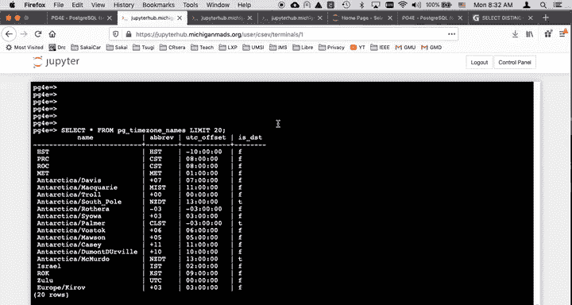
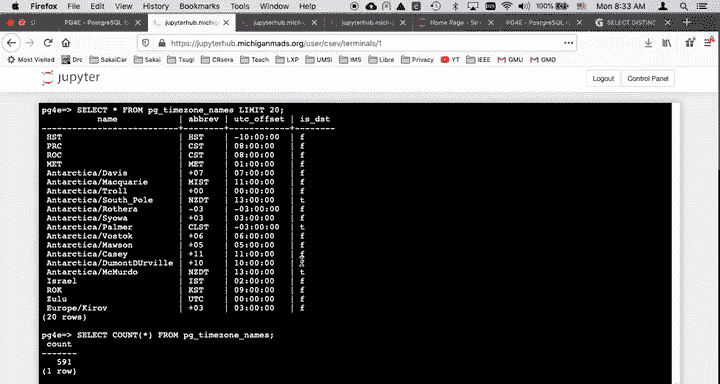
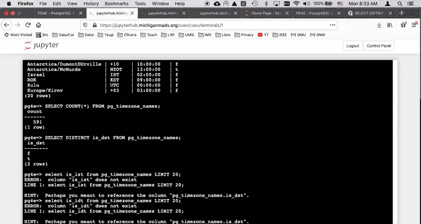
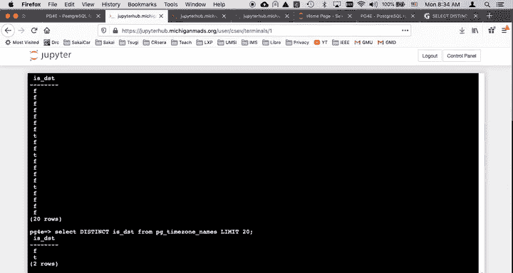
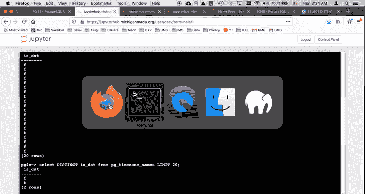
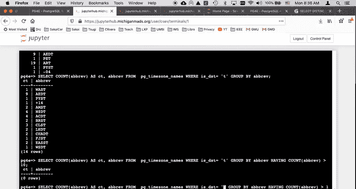
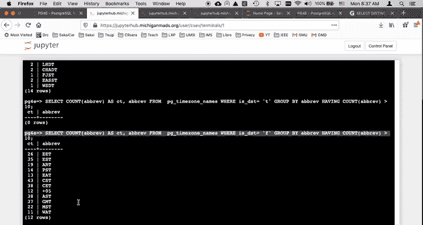
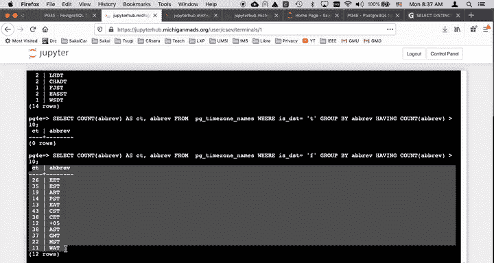
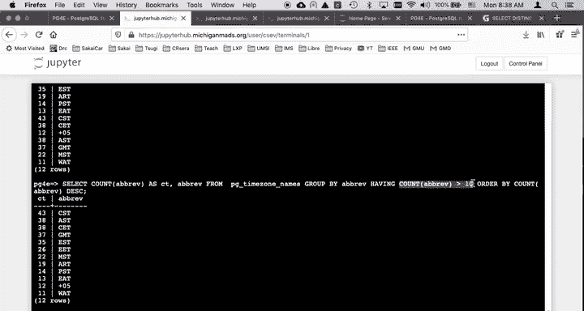

# 密歇根大学《给所有人的PostgreSQL课（数据库设计、SQL、JSON和NLP、ES）｜PostgreSQL for Everybody》中英字幕 - P34：5_GROUP BY分组查询演示.zh_en - GPT中英字幕课程资源 - BV1tj421U7GK

Welcome to another walkthrough for Postgress On this one。

 we are going to talk about group by and how group by works and group by is related to distinct in that。

Both group by in distinct in effect， create a record set and then post process。

 that record set distinct is really simple。 It throws things away。 and for this one。

 instead of making yet another little data set that's hard to keep track of I'm just going to play with the built in time zone。

 So there are a whole bunch of time zones。 this PG time zone names is a table that's sort of a virtual table that all the different time zones that you can do。

 so it's got a name abbreviation offset from UTC and whether or not it's daylight savings time or not。

 So I can do like we've already talked about select countstar。

 there's 591 rows in the PG time zone underscore names。

ButAnd we can also use a select distinct， which is something we just cut on talking about。

 which basically is reducing the vertical replication in the I is DSST。

 So you see there's just either true or false and so if we just do a select distinct。

 you see that you know there's two rows that are distinct， there's only a false row and a true row。

 so the select distinct you know showed me that now probably I should just say select is IST。

From。PG time zone names。Limit。20 just for yucks。 you know， you'll see that if you don't say distinct。

 oh， what did I do。Oh， is DST， not is IST？Select I is DSST from PG time zoneone Nas limitit 20。

Can't even type it right。

DSD， there we go， So you see all this vertical replication right。

 you see all this vertical replication and this stk just sort of squeezes out that vertical replication。

And again， it's looking at the rows if I added something to that。If I added something to it。

 the distinct would not just be is DSST。

This is not exactly the we just talked about distinct， so I'm not going to talk about distinct again。

Now， so here this select count is DST， let's take a look at this particular one。

So the idea here is this is doing it's pretty much like a distinct on is DST。But in a sense。

 as the duplicate rows are being thrown away， they're being counted。

 So select count is DSST and is DSsT from PG time zone group by is DSST。

 So that basically says this is kind of like a distinct。But it's a grouping。

 So it groups all of the F rows together， and then all the T rows together and then counts them and gives them back to us。

 Okay， so that's the essence of group by。 Now I'll have some more complex examples。

 but it's really important that you have this basic example understood， right？ Take a bunch of rows。

Group them together by the distinct values of IST， and then count them。

And that's what this this is showing us， but we can do some more things， right。

 we can do things like we can do the same thing for the abbreviation。

There's all the abbreviations and the count of the different abbreviations that are being used like EST for Eastern Standard Time。

 there's a whole bunch of those， so that's another one。Now you can have a wear clause。

And so here' let's look at this one， make this one really wide。 there we go。

 You can have a wear clause。Right， group by a breeze right here。So I can say this。

But so let me just run that one。So we have a where clause and this where clause affects the things that participate in the count。

 so it's going to calculate this count， but it's going to do this is DST equals true， right？

And so that where clause sort of。Filtered the records。Before it did the group by。Okay。

 now the the problem is is we might want to filter based on this count。

 And so that's what the having clause is。 So the having clause that the where clause is。

Filter the records， pass them into the group right process。

 and then the having clause makes it so that we can do it afterwards。

 So now we can say where con are Now， the key is as you got to be pretty careful。

 you can't just put any old thing in having here。 It's got to be one of the things in the in the selected rows。

So， now。So there was no that where DSTST group by a Bre having count more than 10。

 I think that if I made that false， it might get more。

Yeah， I got more。So there's there's not a lot of daylight savings times in there。

 a lot of false daylight savings times so you see that but the where again。

 the where happens before the groupry， and that's why it's you see the order here is that it happens with a where clause then there's a group by clause and then there's a having clause and just having allows you to sort of post process the results of the group by right that's I think it's really quite awesome I mean it may seem like a silly thing。

 but the leave me。

We didn't。It would be difficult without it， so here we're just going to count the abbreviations。

And look for the ones that are more than 10。And so that shows you could also then sort of， you know。

 I would like to order this by the count of the abbreviations descending， so we'll do that。

So these are the most common abbreviations now， 43， 38， right on down， and that's quite nice。

 there's only 12 of them that have more than 1 that abbreviations that are used more than 10 times。

And so this is。This is a subquery and we'll talk about subqueries coming up next。

 So I hope this whole select distinct was useful to you。 I mean。

 this the group buy is useful to you and then coming up。

 we're going to talk a little bit about subqueries。

