# 密歇根大学《给所有人的PostgreSQL课（数据库设计、SQL、JSON和NLP、ES）｜PostgreSQL for Everybody》中英字幕 - P36：7_子查询应用演示.zh_en - GPT中英字幕课程资源 - BV1tj421U7GK

Hello and welcome to another SQL walkthrough and this walkthrough。

 we are going to talk about subqueries。And so subqueries are a powerful and useful technique。

 people don't like using them in high performance situations like for online systems。

 but we're going to use them a lot for data manipulation。

 especially the kinds of things that we're just going to do once or it's a way to manipulate data that we're not going to do a thousand times a second。

So let's take a quick look at some data。嗯。

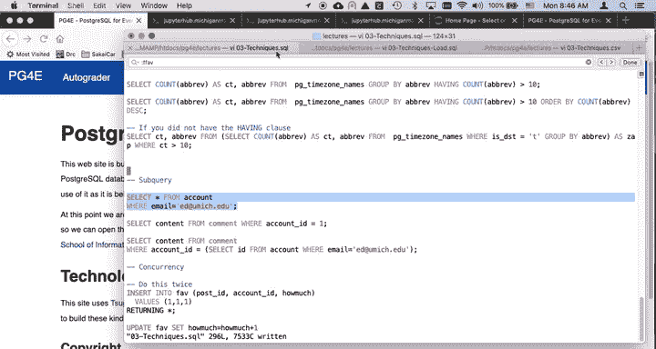

The idea of a sub query is it takes the results of one query and feeds it into another query。

 So if we just take a look here。 So we get select star。 this。

 this is pulling out a one row of of a record。 But if I， if I switch this to be。

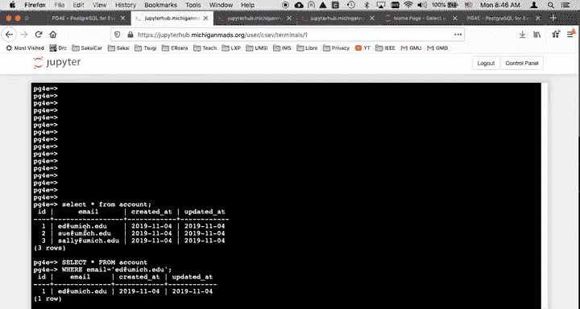

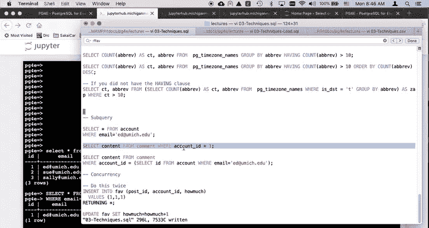

You know， select content。From comment where account ID equals one。

 well that is going to find one of the comments fored right。

 So if you recall earlier when we were hand constructing some of some of our many to many relationships。

 we were we were remembering so let's let's actually。Make this be a select star。

 Select star from comment where account IDd equals 1。And so account ID。

 we are knowing what these things were， what these post IDs were。

We're figuring all these things out and by hand， but we can actually look at this so we can say。

 wait a sec， we actually know we have a way of looking up this number one and we can look it up with a where clause here。

And so what we're going to say is I'm going to say select。I D from。Select ID from。Account。

Where email equals edit you may study to you。

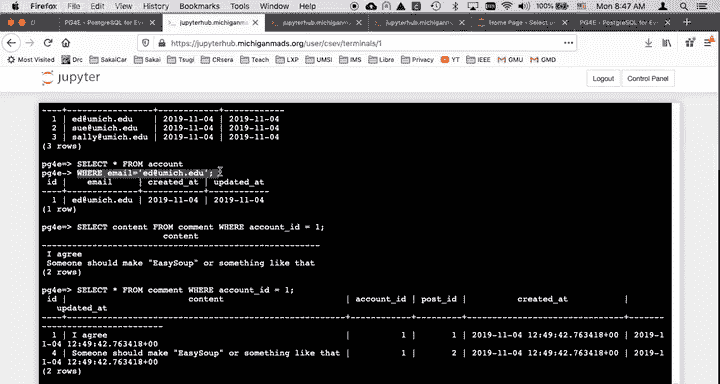

So here we go， this is a way to get at that number。

 wouldn't it be nice if we could say we could run this one here？And get this number。Here instead。

 and then we could actually look up content from comment where account where email equals edit image study to you and that's kind of what the simplest of subses are。

 So what I'm going to do is I'm going to go right here and I'm put in some parentheses and I'm going to take this select statement。

And put it in there。So now we only to have select content from comment where account ID equals and then this select statement。

This is why they call them subqueries or subses because what it does is Postgres runs this select。

 gets this number and then runs the outer select。 This is both the reason that people love them and the reason that people hate them。

 I that it requires， in effect， two separate operations， which the outer operation is， in a sense。

 pause until the inner operation finishes， what we're doing here is almost instantaneous for both of them。

 But if you're doing this for a long time on things that run over and over and over again。

 it can be inefficient。But basically it works exactly as you would expect now and so the way you work is you work until you get like your query。

 the way you want it， it gives you this number and then you have a query that uses a number like this select content query and then you say。

 oh， I can combine those two things and so a way that I go right so that's what the simplest of subqueries is。

And so that's a very， very simple subquery and it's very counterintuitive now。

There's another version of the sub queryry。 And let's go back to a previous example where we are using the having clause。

 Remember， the having clause happens after the after the group by process。 So we have this group by。

 and then we have an effect the results that come from that。

So we get that group by to finish and then we have this having clause and then we're going to have an order by well what if you didn't have a having clause you could use an outer and an innerware clause so you take so what we do is this。

 right？Select。So let me do this a little differently， let me change where this line breaks。

When you put this parenthees。Here make this more than one line。😔，So we can see it a little better。

Okay。So this is a subquery right here， and this is a query that you can run。

 you can actually run this query and you can see what's going to happen。

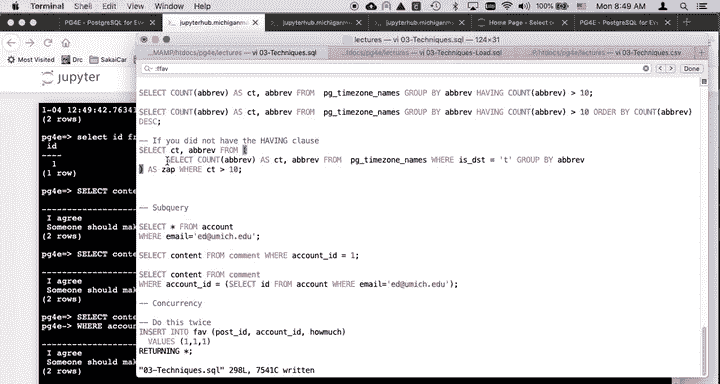

So I forgot to semicoant and you see that it's a series of rows。

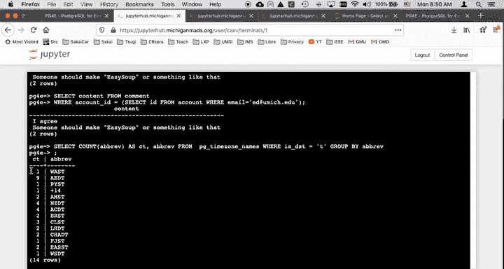

So this is a query that doesn't like the previous one。 just made a single number。

 This one creates a previous set of rows。 So what I can do this is now I can put this in the from clause。

 So this the from clause to this outer query， C T Ari and then。

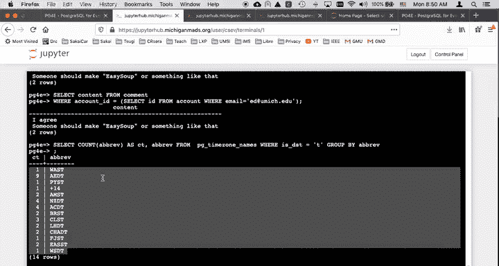

A way I go， right。 And so I give this as Zap。 This as Zap is a way to give。

This inner temporary table， in a sense， this is like if' going to make a table。

 because this the whole parenthesesis right here is that's like a table that I just am making temporarily。

 I'm running this query。 I'm running this query right here。

And then I am creating a table that will temporarily name Zap。

 and then I'm going to select from that and I'm going to apply a where clause to it。Right。Actually。

 this one would be better done if I made that be a false。

So this shows you a technique that I use a lot and that is I use a text editor to build up my use a text editor to build up my queries and then I pop them over and then I copy them and I paste them in so if I don't like it。

 I could change it。

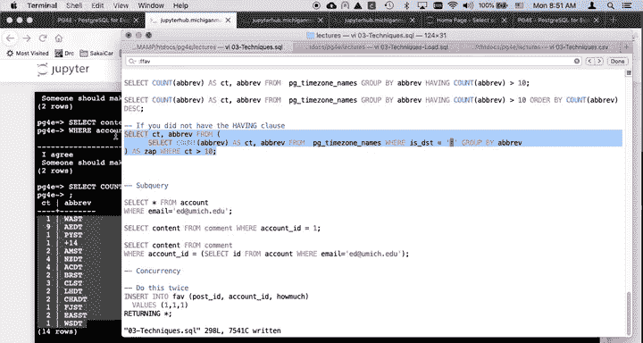

So there we go， we get a little better count there right， so there's 26， 35。

 We're going to try to make a wear clause， but this outer bit。

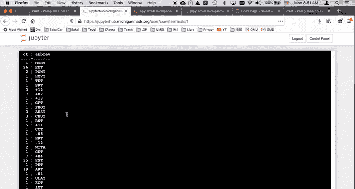

That is going to be the table quote unquote from which this outer clause is going to run。

 So without further ado， let's do that。 So we're going this seat， and you all have you build these。

 you'll notice that the output of this query is。Two columns， and I am treating those。

 and I can give these things different names because this Ct is just the first column of the inner query and a Bv is just the second column of the inner query。

 And so， but there has to be the same number。 if I don't put the same number here， it'll be unhappy。

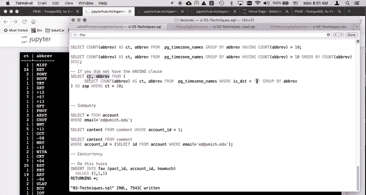

But then what I can do is I can treat this output as a table itself。

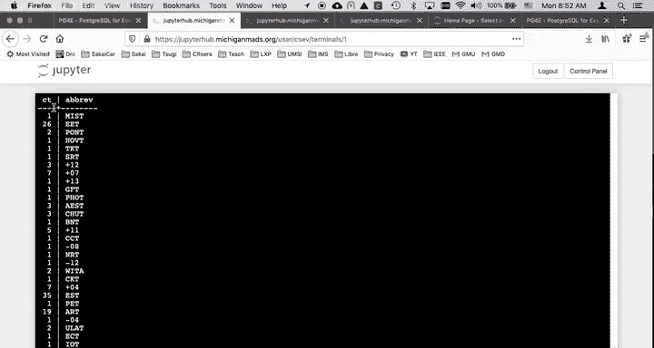

And so that's what's going on， so if I run this whole thing。

 you're going to see this with a where clause。

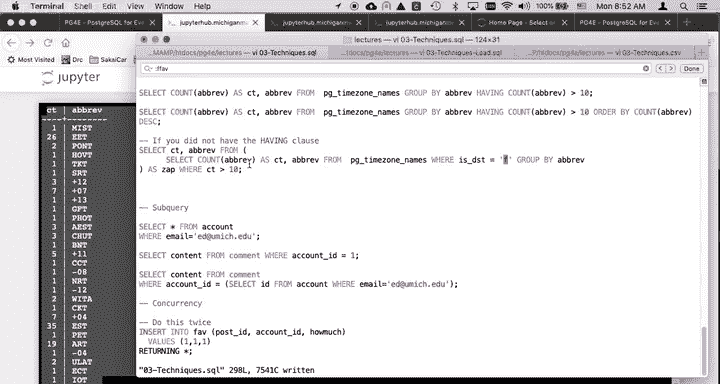

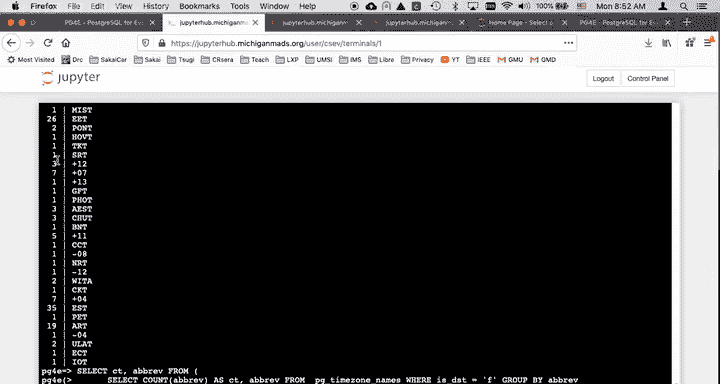

喂。And the where clause is this outer number， this C。

 So that this became a table that became a where clause。 I could even add to this on order by。

But then， that order by。Ct desk。So that's going to order by this CT。

 which is this virtual column here。

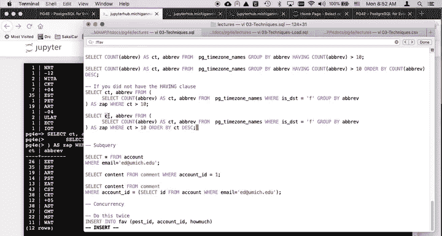

So that's going to order by them in descending so the largest one is going to be first and so the subquery is one of those things that it's really essential。

 but and again it's an optimization boundary where we can't make this query go faster this outer query must completely wait until the innerquery is completely finished and then it' sort of if this query is big enough it kind of has to write it all out to disk and then it has to read that query back in not nothing here is large enough that it matters and it's all instantaneous but this is why database tuners especially for online systems do not like subqueries。

 but for us in a more of a data mining context， sometimes subqueries are essential and we are typing commands that might run for half a second。

 but we're only going to  typeping once and so we're not running an online system and so subqueries are super powerful and super a lot of potential but we avoid them quite a bit。

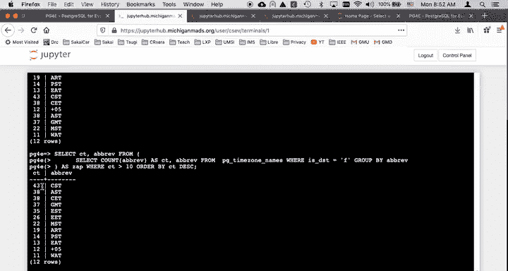

And online systems， cheers。