# PostgreSQL for Everybody： P38： 并发与事务操作演示 🧑‍💻

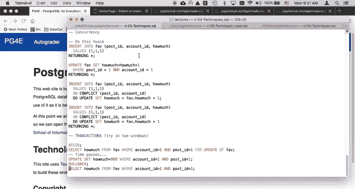

在本节课中，我们将学习数据库中的并发操作与事务管理。我们将了解当多个客户端同时访问和修改数据库时，PostgreSQL 如何确保数据的一致性和完整性。课程将通过一个“点赞”功能的例子，演示如何使用 `INSERT ... ON CONFLICT` 语句以及显式事务（`BEGIN`、`COMMIT`、`ROLLBACK`）来处理并发场景。

## 并发操作概述

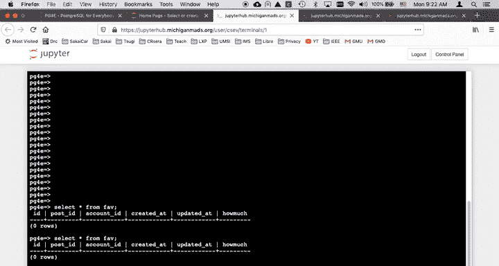

在在线应用中，并发是一个关键概念。它指的是多个客户端（例如两个独立的终端）同时连接到同一个数据库服务器并执行操作。


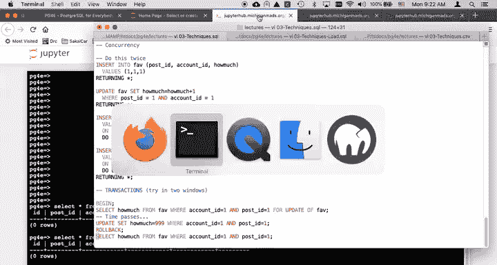

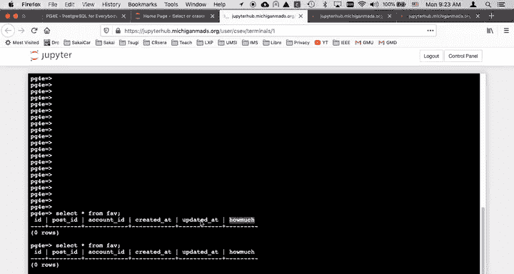

从并发角度看，读取操作通常不是问题。数据库可以高效地处理多个客户端同时读取相同数据。然而，当多个客户端同时尝试添加、删除或更新数据时，就可能产生冲突。

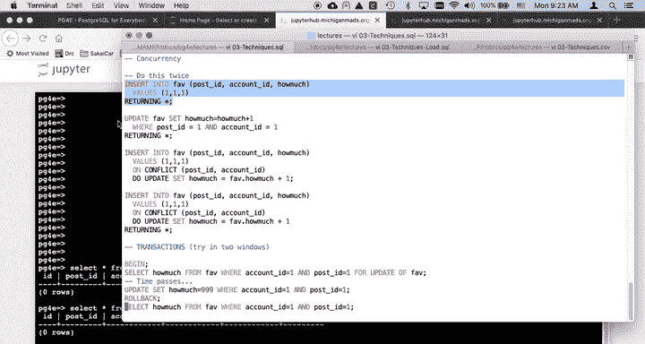


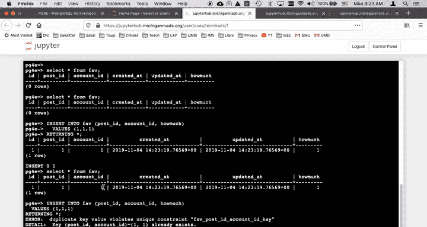

## 示例：点赞功能

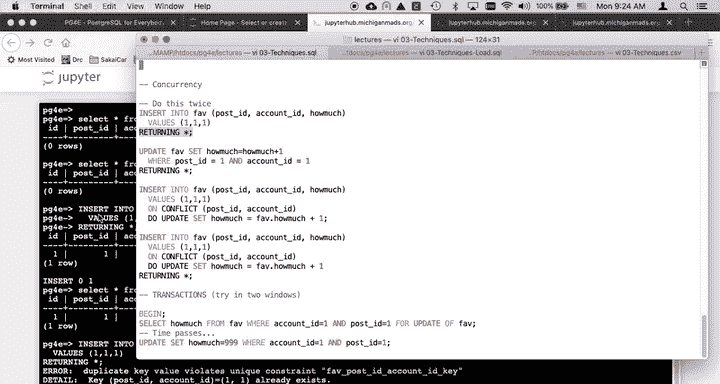

我们以一个“点赞”功能为例。数据库中存在一个名为 `fav` 的表，它是一个多对多关系表，记录了用户（`account_id`）对帖子（`post_id`）的点赞次数（`howmuch`）。

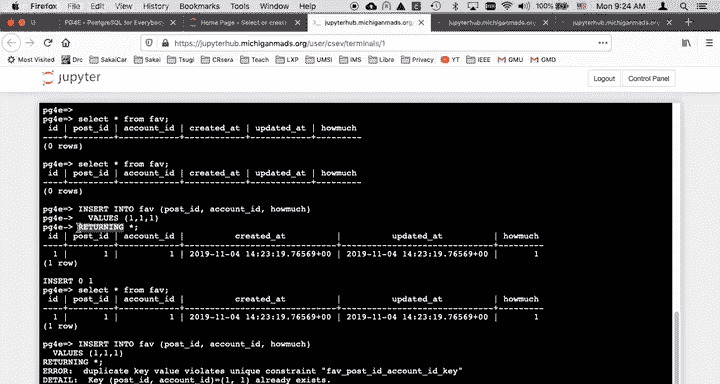

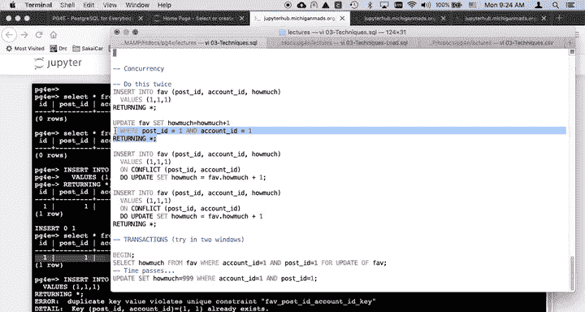


用户点击“+1”按钮，表示对某个帖子更加喜爱。对应的操作是增加 `fav` 表中对应记录的 `howmuch` 值。

### 初始插入与更新

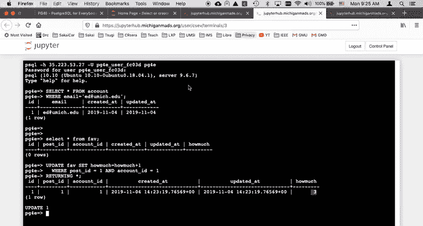

首次为用户1点赞帖子1时，我们执行插入操作，将 `howmuch` 设置为1。

```sql
INSERT INTO fav (post_id, account_id, howmuch) VALUES (1, 1, 1);
```

执行 `SELECT * FROM fav;` 可以看到结果。

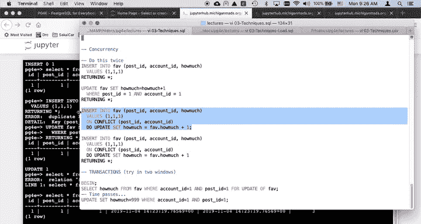


如果再次执行相同的 `INSERT` 语句，会因为违反唯一约束而报错。我们在创建 `fav` 表时，在 `(post_id, account_id)` 上设置了唯一约束。


因此，当记录已存在时，我们需要执行更新操作。

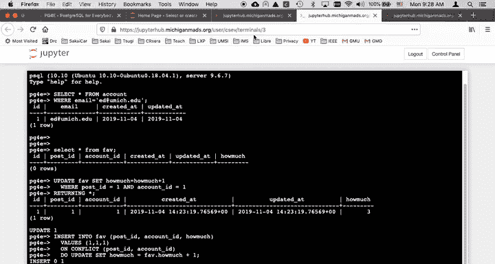

```sql
UPDATE fav SET howmuch = howmuch + 1 WHERE post_id = 1 AND account_id = 1 RETURNING *;
```

`RETURNING *` 子句会在更新后立即返回被更新的行，让我们看到 `howmuch` 变成了2。

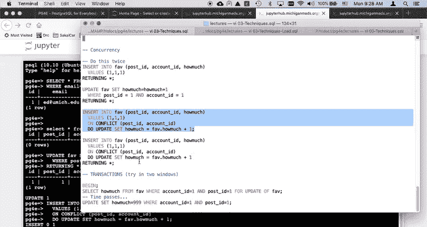

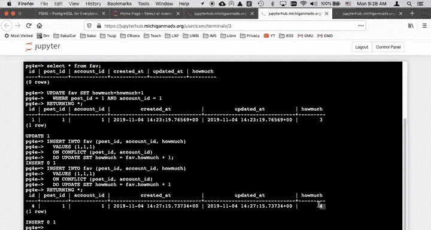


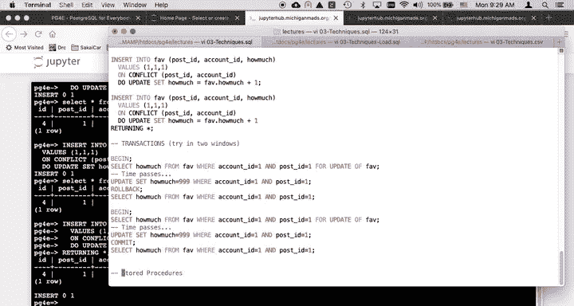

这个更新操作本身是一个独立的事务。如果两个客户端同时执行此更新，数据库会顺序处理它们。例如，先后执行两次后，`howmuch` 会变成3。


## 使用 INSERT ... ON CONFLICT

在实际场景中，我们无法预知记录是否存在。PostgreSQL 提供了 `INSERT ... ON CONFLICT` 语句，将插入和更新合并为一个原子操作。

以下是该语句的核心结构：

```sql
INSERT INTO fav (post_id, account_id, howmuch)
VALUES (1, 1, 1)
ON CONFLICT (post_id, account_id) -- 指定冲突的列
DO UPDATE SET howmuch = fav.howmuch + 1; -- 冲突时执行更新
```

这个语句实现了“有则更新，无则插入”的逻辑。它被包装在单个事务中，因此即使多个客户端同时发送此语句，数据库也会顺序解析执行。

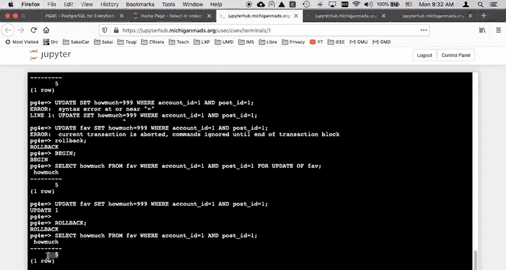

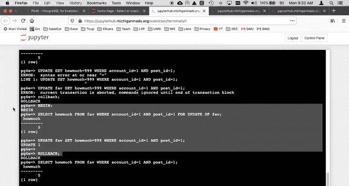

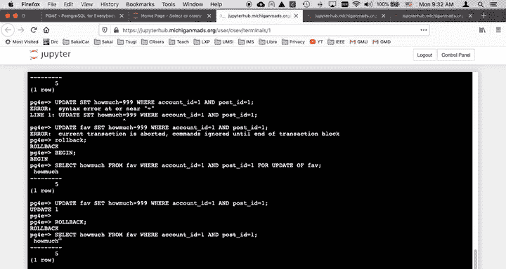

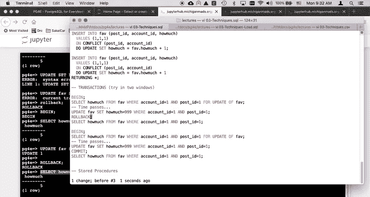


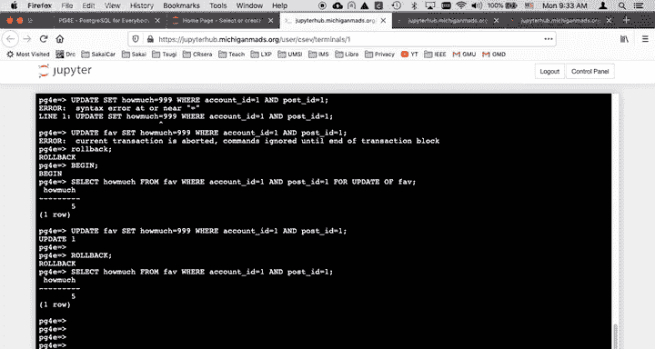

我们可以通过实验验证：
1.  清空表：`DELETE FROM fav;`
2.  首次执行上述 `INSERT ... ON CONFLICT` 语句，由于没有冲突，会执行插入。
3.  再次执行相同的语句，由于唯一约束冲突，会执行更新，`howmuch` 变为2。

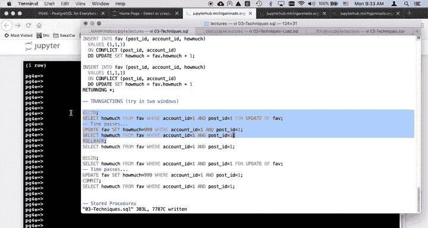

这种方法利用了唯一约束，并将整个逻辑封装在一条 SQL 语句中，只需一次客户端与服务器的通信，非常高效。

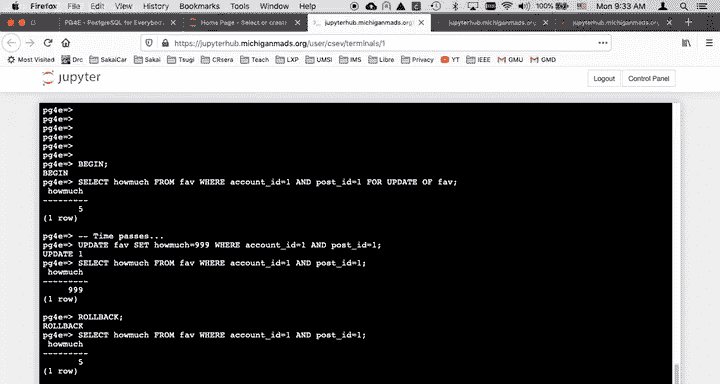


## 显式事务控制

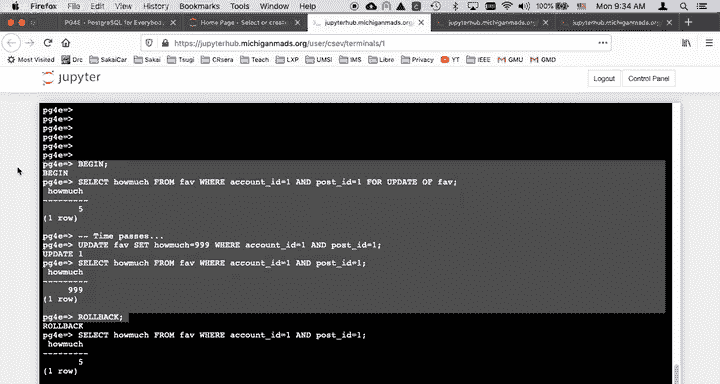

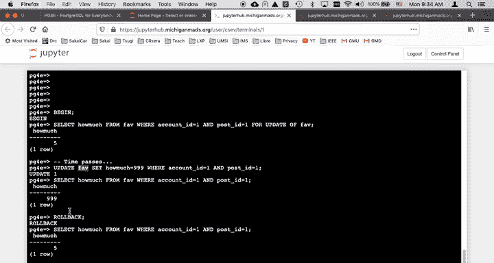

有时，业务逻辑需要将多个 SQL 语句组合成一个原子操作。这时就需要使用显式事务。PostgreSQL 使用 `BEGIN`、`COMMIT` 和 `ROLLBACK` 语句来控制事务。

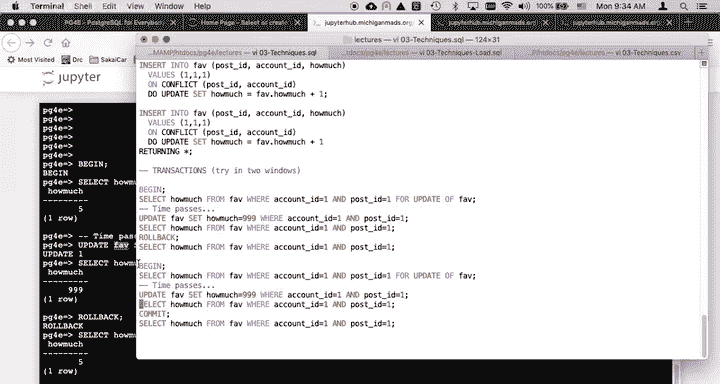

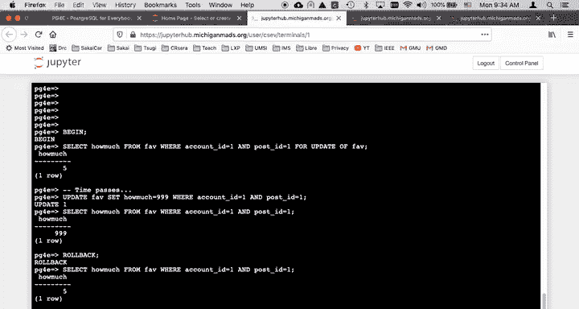

*   `BEGIN`： 开始一个事务。
*   `COMMIT`： 提交事务，使所有修改永久生效。
*   `ROLLBACK`： 回滚事务，放弃所有未提交的修改。

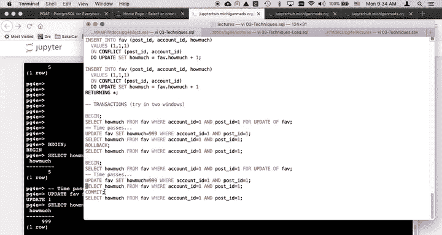

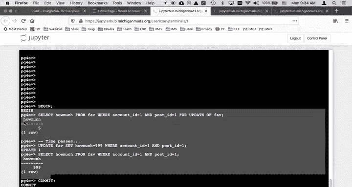

事务的核心思想是“要么全部执行，要么全部不执行”。在 `BEGIN` 和 `COMMIT`/`ROLLBACK` 之间的所有操作，在提交前对其他事务是不可见的。


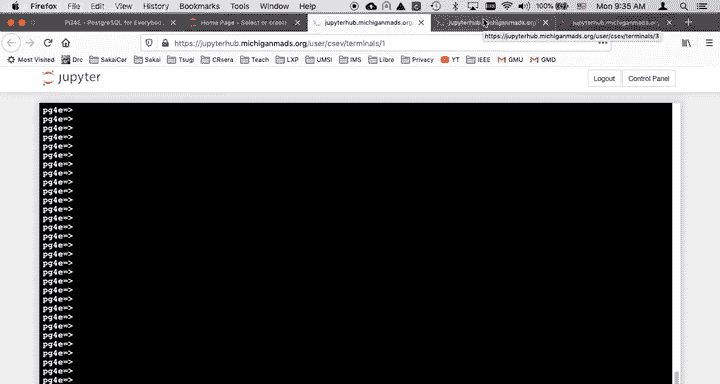

### 事务与行锁

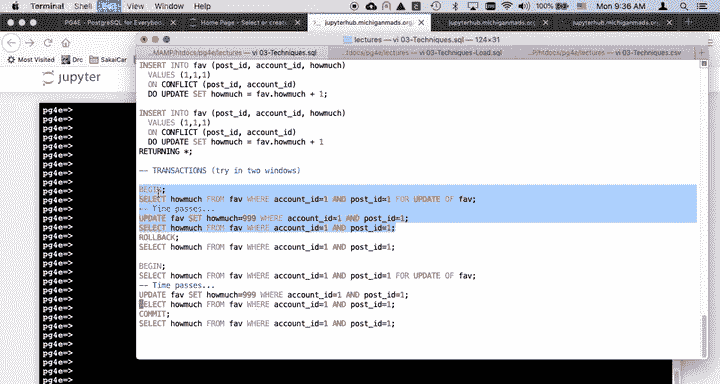

在事务中，可以使用 `SELECT ... FOR UPDATE` 语句锁定行，防止其他事务修改，直到当前事务结束。

```sql
BEGIN;
SELECT howmuch FROM fav WHERE post_id = 1 AND account_id = 1 FOR UPDATE;
-- 此时该行已被锁定
UPDATE fav SET howmuch = 99 WHERE post_id = 1 AND account_id = 1;
-- 执行其他操作...
COMMIT; -- 或 ROLLBACK;
```

如果在一个事务中执行了 `SELECT ... FOR UPDATE` 并锁定了某行，另一个事务尝试执行同样锁定该行的操作时，会被阻塞，直到第一个事务释放锁（通过 `COMMIT` 或 `ROLLBACK`）。

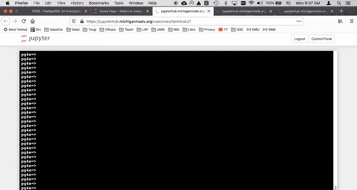

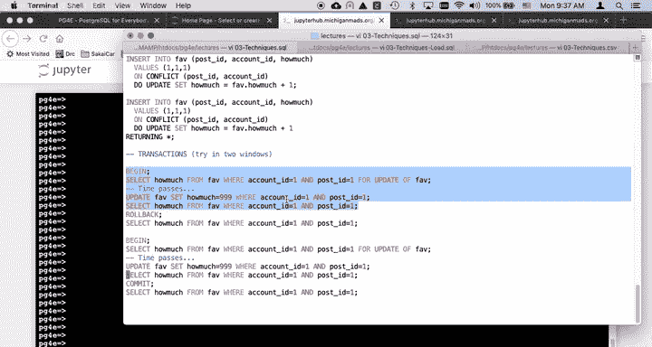


### 死锁与超时

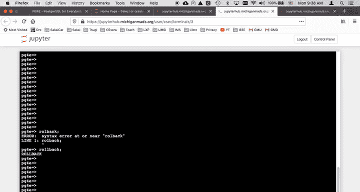

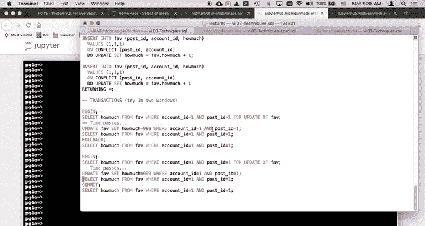

如果多个事务互相等待对方释放锁，就可能发生死锁。数据库通常会检测死锁并强制中止其中一个事务。被阻塞的操作也可能在等待一段时间后超时。

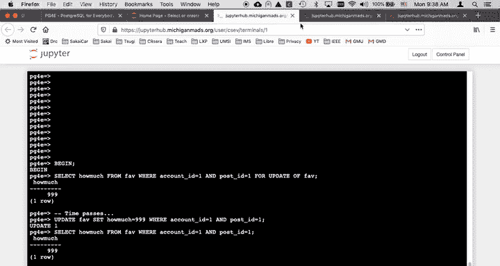


## 总结

本节课中我们一起学习了 PostgreSQL 的并发控制与事务管理。

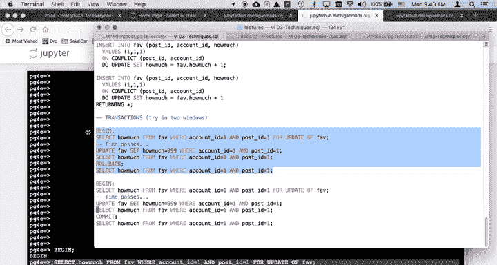

我们首先了解了并发操作在在线应用中的重要性。然后，通过一个点赞功能的实例，学习了：
1.  如何使用 `INSERT ... ON CONFLICT` 语句高效地实现“插入或更新”逻辑。这种方法将多个操作合并为一次数据库交互，并自动处理并发冲突。
2.  如何通过 `BEGIN`、`COMMIT`、`ROLLBACK` 语句来管理显式事务，确保一系列操作的原子性。
3.  如何使用 `SELECT ... FOR UPDATE` 在事务中锁定行，以及理解由此可能引发的阻塞和死锁现象。

核心要点是，`INSERT ... ON CONFLICT` 是处理简单并发更新的首选高效方式，而显式事务用于更复杂的、需要多步操作的业务场景。理解这些机制对于构建健壮的、支持高并发的应用程序至关重要。

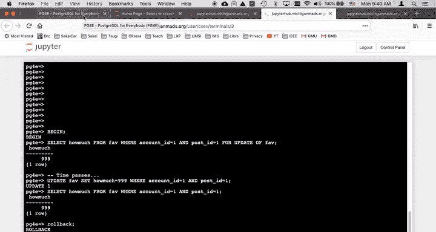


