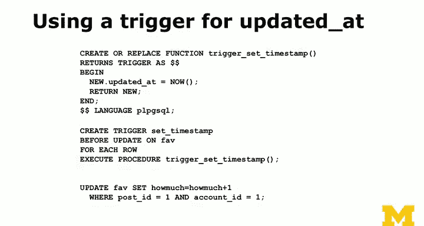
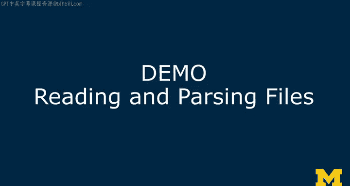

# PostgreSQL for Everybody：P39：存储过程开发实践


## 概述

在本节课中，我们将要学习PostgreSQL中的存储过程。我们将探讨存储过程的概念、优缺点，并通过一个具体的实例——自动更新记录的“更新时间”字段——来演示如何创建和使用存储过程。

## 存储过程简介

存储过程是数据库中的一个重要主题，关于它的讨论常常能引发强烈的观点。我将分享我的个人观点，并理解这仅仅是一种看法。

我倾向于尽可能避免使用存储过程。我不喜欢存储过程的主要原因是我经常需要在不同的数据库系统之间迁移。如果你在一家使用PostgreSQL的公司工作，那么对存储过程的抵触情绪可能不会那么强烈。但是，如果你需要从Oracle迁移到PostgreSQL，或者从MySQL迁移到SQLite，并且过度使用了存储过程，你会发现它们通常完全不具备可移植性。即使在不同的数据库中可以实现存储过程，其语法和功能也存在细微的差异。

## 存储过程的优缺点

以下是存储过程的一些关键考量点：

**优点：**
*   **性能卓越**：存储过程可以将多个步骤的查询（例如，运行一个查询，读取结果，再运行七个查询，然后执行其他操作）合并为一个数据库事务。这减少了应用程序（如使用psql）与数据库之间的往返次数和SQL语句数量，从而显著提升性能。

**缺点：**
*   **可移植性差**：它们很难在不同的数据库系统间迁移。
*   **测试困难**：相较于应用层代码，存储过程的测试可能更复杂。

因此，我并非完全不用存储过程，而是倾向于将它们隔离使用，并且必须有非常充分的理由才会使用。

## 使用存储过程的充分理由

一个使用存储过程的充分理由是解决重大的性能问题。例如，如果你的应用主屏幕需要执行一系列复杂的查询，导致速度极慢，那么将其封装成一个存储过程可能是必要的商业决策。

另一个理由是实现某些无法通过`CREATE TABLE`语句表达的复杂业务规则约束。例如，我曾希望实现一个规则：两个字段中必须有一个不为空（即不允许两个字段同时为空）。标准的`NOT NULL`约束无法表达这种“两者择一”的逻辑。虽然可以通过应用层代码确保不插入违反此规则的记录，但作为软件开发者，我更希望数据库能主动强制执行这个规则，以便在我犯错时及时捕获。

这种“防错”机制是编写可靠软件的重要部分。存储过程可以充当这种双重检查的角色。

## 实践：自动更新时间戳

现在，让我们回到一个具体的存储过程实例，它涉及我们`favorite`表中的`updated_at`字段。

从语义上讲，`updated_at`字段用于捕获记录最后一次被修改的时刻。`created_at`在插入时由`DEFAULT now()`自动设置。问题是，每次执行`UPDATE`语句时，我们不仅需要更新目标字段，还必须手动设置`updated_at = now()`。

有些数据库可以自动完成这个操作，但在PostgreSQL中，标准做法是使用存储过程（或触发器函数）来实现。这是一个非常简单的存储过程示例，我不期望你编写很多存储过程，但希望你知道它们的样子。

### 创建触发器函数

我们首先创建一个触发器函数。触发器函数定义了“当某事发生时，执行此操作”的逻辑。

```sql
CREATE OR REPLACE FUNCTION trigger_set_timestamp()
RETURNS TRIGGER AS $$
BEGIN
  NEW.updated_at = NOW();
  RETURN NEW;
END;
$$ LANGUAGE plpgsql;
```

*   `CREATE OR REPLACE FUNCTION trigger_set_timestamp()`：创建或替换一个名为`trigger_set_timestamp`的函数。
*   `RETURNS TRIGGER`：声明此函数将作为触发器使用。
*   `BEGIN ... END;`：这是存储过程的主体代码。它所做的就是：对于即将被修改的记录（用`NEW`表示），将其`updated_at`字段设置为当前时间(`NOW()`)。
*   `$$ LANGUAGE plpgsql;`：定义函数使用的语言为PL/pgSQL。PostgreSQL支持多种存储过程语言，虽然我个人不喜欢存储过程，但如果必须使用，我倾向于使用内置的PL/pgSQL，因为它功能最强大。

这个函数的作用是：在一条记录即将存入数据库之前，“拦截”它，悄悄地将当前时间戳赋给它的`updated_at`字段，然后再让它继续进入数据库。

### 创建触发器

接下来，我们需要创建一个触发器，将上述函数与具体的表操作关联起来。

```sql
CREATE TRIGGER set_timestamp
BEFORE UPDATE ON favorite
FOR EACH ROW
EXECUTE FUNCTION trigger_set_timestamp();
```

*   `CREATE TRIGGER set_timestamp`：创建一个名为`set_timestamp`的触发器。
*   `BEFORE UPDATE ON favorite`：指定在`favorite`表发生`UPDATE`操作**之前**触发。
*   `FOR EACH ROW`：表示对于`UPDATE`语句影响的每一行记录都执行一次触发器函数。这是因为带`WHERE`子句的`UPDATE`可能会修改多行数据。
*   `EXECUTE FUNCTION trigger_set_timestamp();`：指定要执行的函数是我们刚刚创建的`trigger_set_timestamp`。



现在，当我们执行类似`UPDATE favorite SET howmuch = howmuch + 1 WHERE ...`的语句时，`updated_at`字段会被自动设置为当前时间，而无需在语句中显式写出。

## 总结




本节课中，我们一起学习了PostgreSQL的存储过程。我们讨论了存储过程的优缺点，认识到它们虽然能带来性能提升和实现复杂约束，但也存在可移植性差和测试困难的问题。我们通过一个自动更新时间戳的具体实例，演示了如何创建触发器函数和触发器来实现存储过程逻辑。存储过程可以非常简单，也可以非常复杂，我倾向于只在有充分理由（如解决特定性能问题或实现关键业务规则）时使用它们。在接下来的课程中，我们将尝试综合运用所学知识，进行读取解析文件、计算主键和使用子查询等演示。