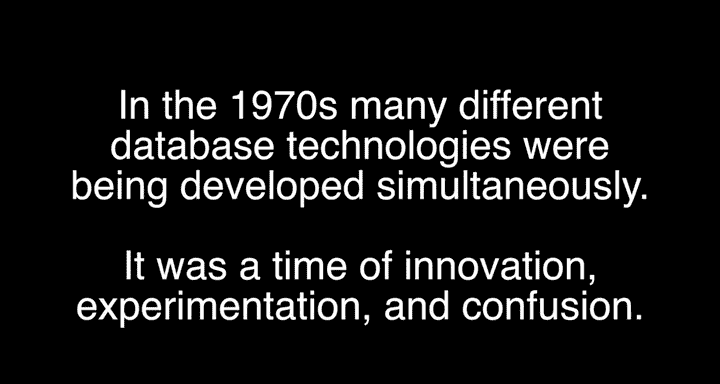
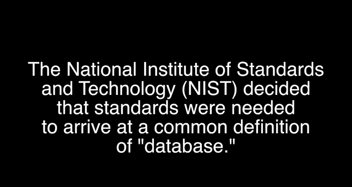
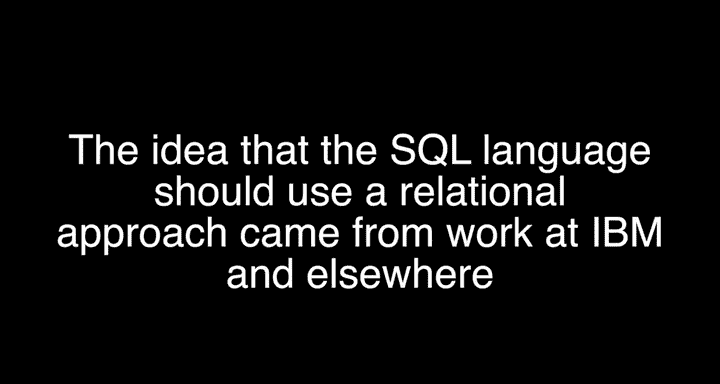
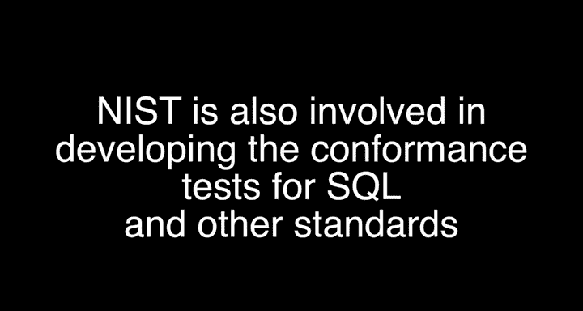

# 数据库标准简史：P3：2_特别视频：Elizabeth Fong与SQL标准

在本节课程中，我们将跟随Elizabeth Fong的讲述，了解SQL标准诞生的背景、原因和过程。我们将探讨数据库技术从多样化走向标准化的关键历程，以及标准如何促进技术普及和应用互操作性。

---

## 技术多样化的早期阶段

在数据库技术发展的早期，市场上存在多种不同的产品和技术路径。这些技术从无到有，逐渐发展壮大。

当时，用户在选择数据库产品时面临困惑，例如需要决定是购买IBM、Oracle的产品，还是选择更便宜的方案。这种决策需求开始显现。

## 标准化需求的产生

数据库管理系统作为软件基础，其上层能够构建的应用种类极其多样。因此，人们希望建立某种标准，使得应用程序能够在不同的平台上运行。

最初，我们使用文件系统，文件是层次结构的。随后出现了IBM信息管理系统，它是一种树状结构。当时业界争论的焦点是数据应该采用树状、网状还是平面文件结构。我们甚至还在争论数据是否应该包含自我描述标签，后来这被称为元数据，现在人们称之为模式。

## 数据库系统研究组与基础规范

为了解决这些问题，数据库系统研究组提出了一个参考模型或规范，定义了数据库管理系统应具备的最小功能集。

为了成为一个合格的数据库管理系统，它必须能够存储数据、检索数据、修改数据、组织数据、删除和操作数据。这些要求最终形成了一套规范。

## 标准组织的成立与关系型数据库的兴起

在那段时间，一个重要的标准组织诞生了。我们发起成立了NC小组，即现在的Insight组织，它是美国国家标准组织的一部分，代号为X3H2。Don Deutsch和Len Gallagher等人都参与其中，这个小组被称为数据管理语言小组，旨在推动标准化工作。

## 标准化的核心：接口与语言

进行任何标准化时，人们会意识到，可以标准化的对象很多。但关键在于，当你需要与他人沟通时，必须有一个双方都能理解的公共接口或词汇表。

因此，对于软件系统而言，标准化的核心并非其全部能力，而在于其**语言**。

## 关系型模型与SQL的诞生

当时，关系型数据库的代表是IBM的Codd。他提出了规范化理论，开始谈论平面文件，并将其称为“表”。这是一个非常易于理解的概念。

为了从表中检索数据，人们使用类似 `SELECT [column] FROM [table]` 的语句，例如 `SELECT name FROM employee`。一种简单的查询语言由此诞生。

## 符合性测试与市场推动

测试环节是采纳标准时一个非常重要的方面。当产品声称符合某个ISO标准时，需要通过认证来证明其合规性。否则，应用程序可能无法在其上正常运行。

假设你开发了一个学生课程记录系统。无论底层是Oracle、Sybase还是Microsoft SQL Server，你都希望你的应用程序能够正常工作。这正是市场用户所期望的。

当然，Oracle和微软都会推销自己的产品。但在采购过程中，用户会要求产品“符合SQL标准”。因此，供应商必须提供符合性测试证书。

我们拥有经过认证的实验室，它们会提供一份经过验证的产品清单。清单上的产品已被确认符合标准，用户可以放心从清单中选购。这是一个严格的市场要求，因为付钱购买的是用户，而不是标准制定者。

## 标准化时机的重要性

时机决定一切。标准化不能太早，否则会扼杀许多创新概念，因为人们会觉得市场已经定型，即使现有方案并不完美，他们也不会再进入这个领域。

反之，如果标准化太晚，就会错失良机。市场上会出现过多不同的方案，选择过于繁杂，反而造成混乱。SQL无疑是把握住时机、取得成功的典范之一。

---

在本节课中，我们一起学习了SQL标准诞生的历史背景。我们了解到，标准化源于市场对互操作性的需求，其核心在于统一交互语言而非限制功能。关系型模型以其简单的“表”概念为SQL语言奠定了基础，而恰当的标准化时机则是技术成功普及和生态繁荣的关键。