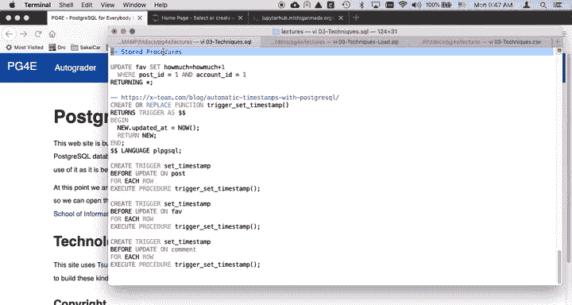
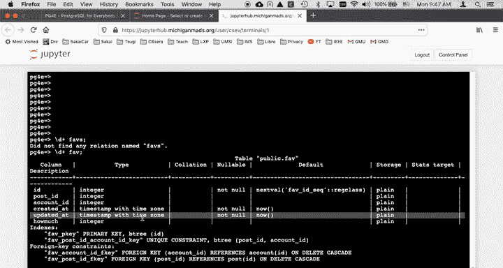
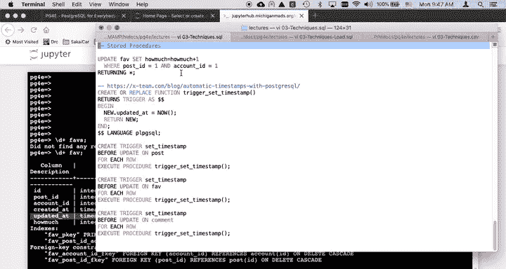
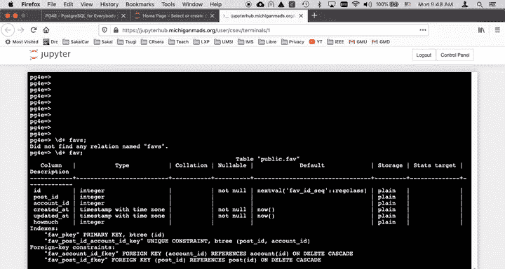
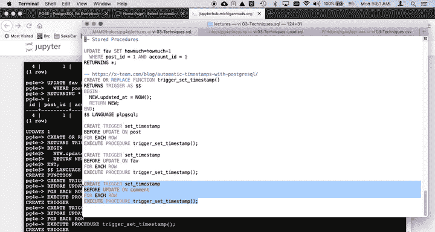
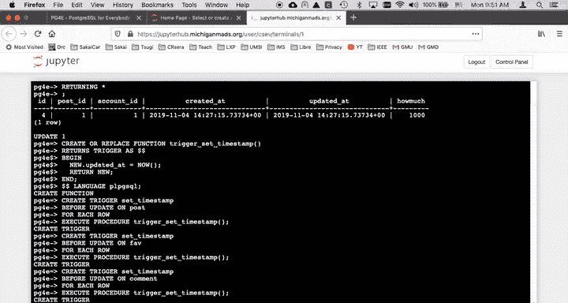
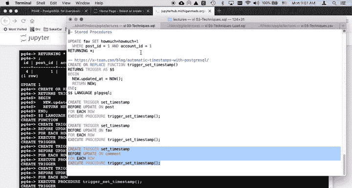
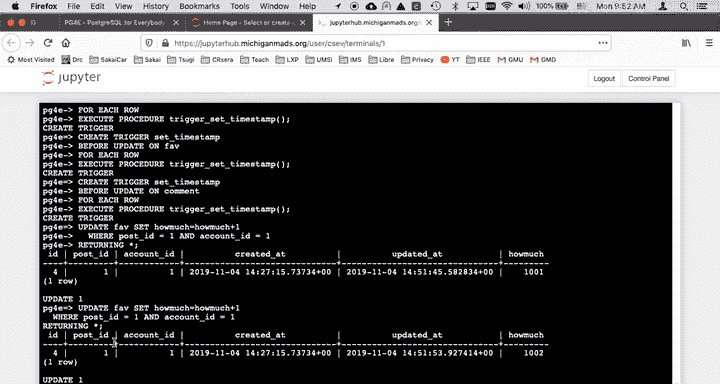
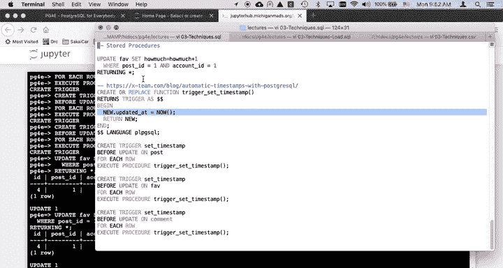

# PostgreSQL for Everybody：P40：存储过程应用演示 🛠️



在本教程中，我们将学习如何使用存储过程（Stored Procedure）和触发器（Trigger）来自动更新数据库表中的“更新时间”字段。我们将通过一个具体的例子来演示其工作原理和实现步骤。

## 概述

在数据库设计中，我们经常需要记录数据行的创建时间和最后更新时间。虽然可以在创建表时设置默认值，但自动更新“更新时间”字段的功能在PostgreSQL中并非内置。本节将介绍如何利用存储过程和触发器来实现这一自动化功能。





## 自动更新“更新时间”的需求



首先，我们来看一个示例表 `fav`。该表通常包含 `created_at` 和 `updated_at` 这样的时间戳字段。`created_at` 可以在插入时通过 `DEFAULT NOW()` 自动设置。然而，当我们更新一行数据时，`updated_at` 字段并不会自动更新。

例如，执行一个更新操作后：
```sql
UPDATE fav SET howmuch = howmuch + 1;
```
`created_at` 保持不变，但 `updated_at` 也没有变化。我们通常希望 `updated_at` 能在每次数据变更时自动更新。

## 什么是存储过程和触发器？

一些数据库系统在 `CREATE TABLE` 语句中提供了自动更新 `updated_at` 的功能，但PostgreSQL没有。因此，我们需要使用存储过程和触发器。

*   **存储过程**：是一段存储在数据库服务器中的代码。它允许你扩展数据库的行为，在服务器执行SQL命令时加入自定义逻辑。
*   **触发器**：是与表关联的规则，当特定事件（如 `UPDATE`）发生时，会自动执行一段代码（通常是存储过程）。

PostgreSQL的存储过程有专用的语言（如PL/pgSQL）。虽然不要求精通编写，但理解其概念很重要。

## 实现步骤

以下是实现自动更新 `updated_at` 字段的具体步骤。

### 第一步：创建存储过程函数

我们需要先创建一个函数，该函数将在更新操作发生前被触发，其职责是修改即将写入数据库的“新”行数据中的 `updated_at` 字段值。

```sql
CREATE OR REPLACE FUNCTION update_updated_at_column()
RETURNS TRIGGER AS $$
BEGIN
    NEW.updated_at = NOW();
    RETURN NEW;
END;
$$ language 'plpgsql';
```
这段代码创建了一个名为 `update_updated_at_column` 的函数。它使用 `NEW` 关键字访问正在被更新的新行数据，并将其 `updated_at` 字段设置为当前时间戳，然后返回修改后的行。

### 第二步：创建触发器

接下来，我们需要将这个函数与目标表关联起来。我们创建一个触发器，指定在每次更新表中的行**之前**（`BEFORE UPDATE`）执行我们刚创建的函数。

```sql
CREATE TRIGGER update_fav_updated_at
    BEFORE UPDATE ON fav
    FOR EACH ROW
    EXECUTE FUNCTION update_updated_at_column();
```
这个触发器被命名为 `update_fav_updated_at`。它作用于 `fav` 表，会在每次更新（`UPDATE`）该表的每一行数据之前，自动调用 `update_updated_at_column()` 函数。

### 第三步：应用到其他表

同样的逻辑可以应用到其他需要此功能的表上，例如 `post` 表和 `comment` 表。你只需要为每个表分别创建触发器。

```sql
-- 为 post 表创建触发器
CREATE TRIGGER update_post_updated_at
    BEFORE UPDATE ON post
    FOR EACH ROW
    EXECUTE FUNCTION update_updated_at_column();



-- 为 comment 表创建触发器
CREATE TRIGGER update_comment_updated_at
    BEFORE UPDATE ON comment
    FOR EACH ROW
    EXECUTE FUNCTION update_updated_at_column();
```
在实际项目中，这些创建触发器的语句通常会包含在数据库的初始化或迁移脚本中。





## 效果验证

完成上述步骤后，当我们再次对 `fav` 表执行更新操作时：

```sql
UPDATE fav SET howmuch = howmuch + 1;
```
此时，`updated_at` 字段会自动更新为当前时间，而 `created_at` 字段则保持不变。每次更新都会触发这个机制。

## 总结与建议

本节课我们一起学习了如何在PostgreSQL中使用存储过程和触发器来实现 `updated_at` 字段的自动更新。



*   **核心机制**：通过创建一个修改 `NEW.updated_at` 的存储过程函数，并将其通过 `BEFORE UPDATE` 触发器绑定到目标表上。
*   **使用场景**：这是解决PostgreSQL中自动更新时间戳的一个典型且合理的方法。
*   **学习建议**：对于初学者，不一定要掌握编写复杂存储过程的技能，但理解其概念并能查找、使用和适配常见的存储过程（如本例）是非常有价值的。在大多数应用开发中，复杂的业务逻辑通常放在应用层处理，而非数据库存储过程中。



通过本教程，你掌握了利用数据库内置功能自动化维护数据元信息的一种实用技巧。