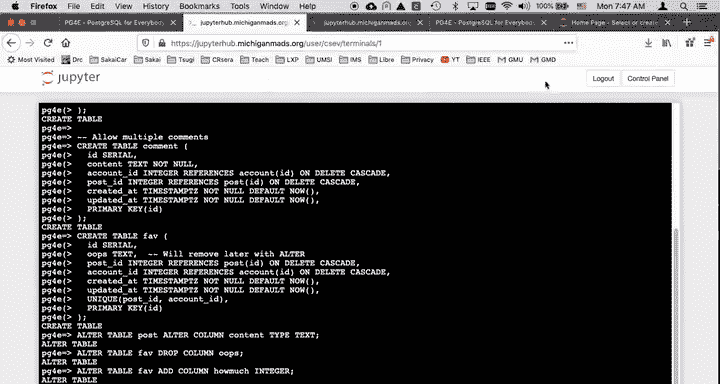
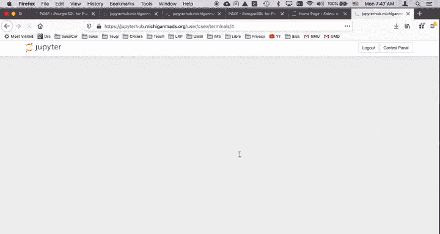
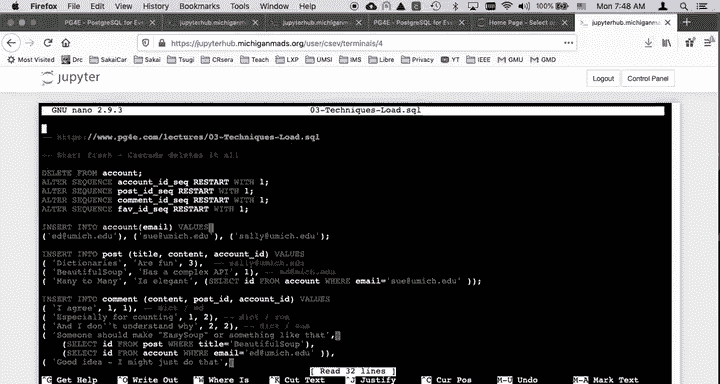
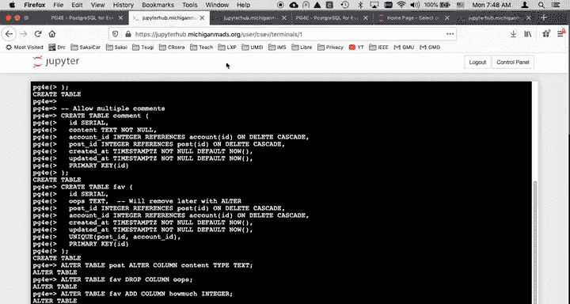

# 密歇根大学《给所有人的PostgreSQL课（数据库设计、SQL、JSON和NLP、ES）｜PostgreSQL for Everybody》中英字幕 - P44：15_数据库创建与数据加载演示.zh_en - GPT中英字幕课程资源 - BV1tj421U7GK

Hello and welcome to another walkthrough of our Postgres。Is。A simple three table。

 many to many situation we're going to have users and posts and comments。

And the comment is effectively many to many join table。

 except it has very important information that's stored at that connection in the content right。

 so created in at the content， there's whole there's all kinds of stuff here。

A post belongs to a user， so we have a foreign key account ID。And so away we go。

 So let's go ahead and build these tables， just copy them all。Comments and all。 And post them into。

There we go， Good thing。 I've got no typgraph layers if you see some of my slides it say times timestamp Z。

 that was a common typo that I made so you might want to anytime you see timesstamp Z turn it into timestamp TsZ。

 sorry about that mistake。And so now we have this all set up now。Let's make this favorites also。Now。

 I want to talk a little bit about。The al table。 So one of the cool things about database。

 and usually it's not right after you create it where you notice you've made a mistake。

 but we're going to fix a couple of mistakes。 So if you look at the post table。

You see that I made content of our chart 1024， I'm in a meeting and someone says， whoa。

 we're going to have to have posts that are more than 1 thousand0 characters so I'm like oh。

 I better fix that。Alter table。Post alter column content type text。

 So what we're doing is we're changing a table。Table post for altering a column， alter column。

 The name of the column is content， and the new type is text now。

The key is is this is also going to convert live during the database if there is already data。

 and so Al table is a very powerful thing。We can get rid of a column， Al table5 drop column oops。And。

So that gets rid of a column。And we can add another column， add a column， alter table5。

 add column how much integer。And so that adds a column。

 so we're able to play with the schema of these tables。

 The schema is very constraining on purpose that's just how databases work。

 but we get to change the schema and automatic conversion。

 you can convert something from a integer to a string or a string to an integer if you do an al table that converts from a string to an inger。

 it's going to try to convert it and it will have trouble if there's strings in there that aren't legitimate integers but you'd be surprised at how much you can do and you can do it while the database is running and while actually transactions are happening as long as you don't break the software。

 So if you drop a column the software is looking for。

 then all the select statements will just like blow up in the next moment。

 but you can alter these tables So that's pretty cool。So。

So next thing I want to do is I want to load a bit of data and so you can put。

 you can make SQL commands living in you see me just copying and pasting this stuff。

 but you can also do this by copying by putting it all on a file and then running the file So if I look at this file03 techniques load SQL。

The one thing I'm doing is I'm delete from account that's members how a delete statement works is delete all records and this al sequence。

 this basically restarts this serial numbers so I clear them all out this you wouldn't do in a live running database I'm just doing this so I can do it over and over and over again。

And then I'm going to do some insert statements， Fi some stuff up just sort of to save it。 Now。

 you need to figure out how to get this in here。 And so what I'm going to do is I'm going to make myself a terminal。

And I am in that same same directory， I could download that file and I could upload that file。

 but the easiest thing to do is do what's called a W get。

So W get actually retrieves a file using HtP and then stores it in the local directory。

 and I am going to grab this actually that's not quite going to work because I don't have the。嗯。

I don't have it up on its ultimate final。It domain name。His domainoma name is not final yet。

 so it's going to have to come from here。Okay， so if I do an LS minus L。

 you see that I have this file here and if I do a nano of 03 techniques。Three techniques， load SQL。

 there we go and control x。

Gets me out of that。 So I've got that file loaded。 So that means that I can go back here in the same place。

 and I can simply say。

Read this file。 So anything that says backslash。Backslash I， and we'll have other things like。

 you know， backslash D plus。 those are commands to。The Postgress client。

 the PSQL client that youre using， they're not actual SQL。

 and so if you're using minusQL or Oracle it like D plus Fab。

 there's a whole different name for that and so those are non standard across databases。

 Al table is pretty standard across databases， but certainly create tables pretty standard with a few select is pretty standard。

But I'm going to use this back slash eye， and that is going to load a file on from this shell that I'm working at inside of my Jupiter notebook。

 and I copy that file there， and it's going to load it and it ran all of those commands。

 See how cool that is。 So now I can say select。Star from post。And there they are。

 so all those things were loaded up quite nicely， and that just saves me some time。Okay。

 so I'm going to stop now and I'll pick this up a bit later in with this same database。

