# PostgreSQL for Everybody：P45：CSV数据加载与规范化演示 📊

在本节课中，我们将学习如何将CSV文件中的数据加载到PostgreSQL数据库，并自动进行规范化处理。规范化是数据库设计的关键步骤，它能减少数据冗余，提高数据一致性。我们将通过一系列SQL操作，将包含重复数据的CSV文件转换为一个规范化的、具有外键关系的数据库结构。

---

## 下载与准备数据

首先，我们需要获取数据文件。我们将使用 `wget` 命令下载一个示例CSV文件。

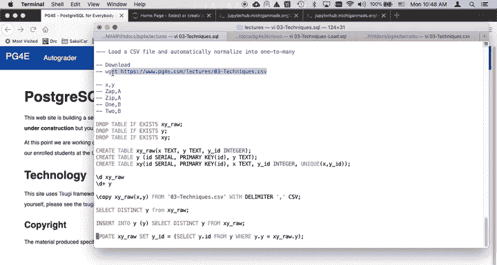

```bash
wget https://example.com/technique.csv
```

下载完成后，可以查看文件内容以确认数据格式。这是一个简单的示例数据，包含两列，其中第二列存在重复值（垂直重复）。

---

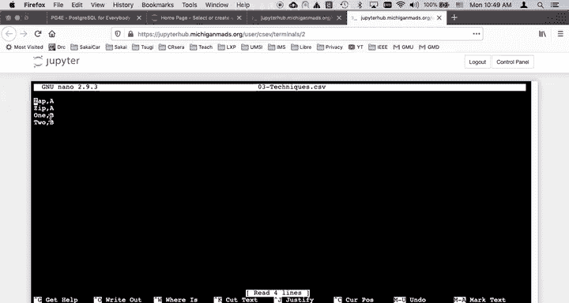

## 创建临时表并加载数据

为了加载CSV数据，我们首先需要创建一个临时表，其结构与CSV文件匹配。这个表将暂时存储原始数据。

```sql
CREATE TABLE xy_raw (
    x TEXT,
    y TEXT,
    y_id INTEGER
);
```

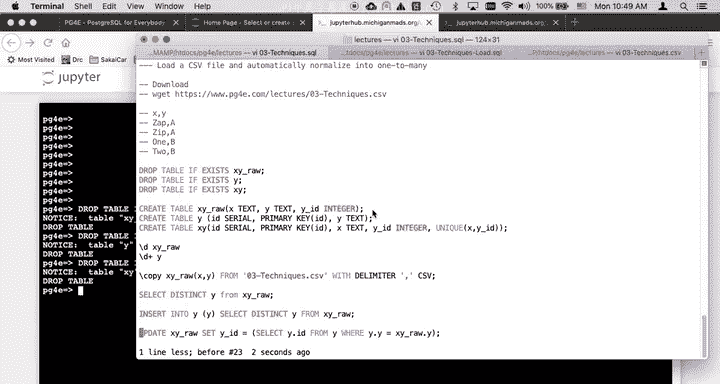

创建表后，我们使用 `COPY` 命令将CSV文件中的数据加载到这个临时表中。

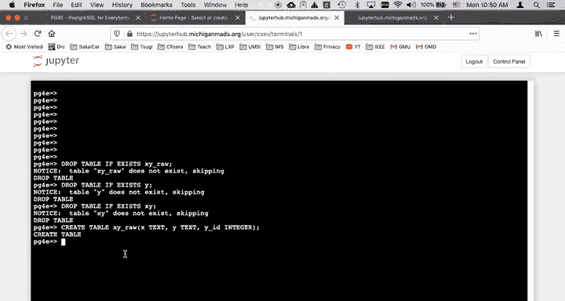

```sql
COPY xy_raw (x, y) FROM '/path/to/technique.csv' WITH (FORMAT CSV, DELIMITER ',');
```

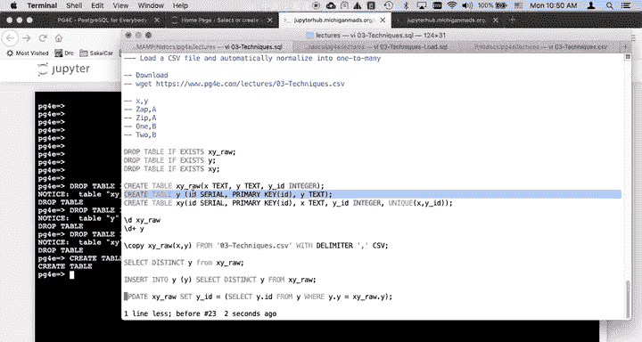

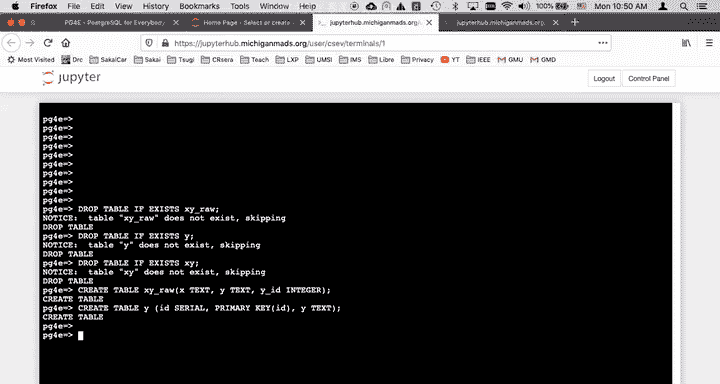

加载完成后，可以查询 `xy_raw` 表来确认数据已正确导入。此时，`y_id` 列是空的，因为我们还没有填充它。

---

## 创建规范化表结构

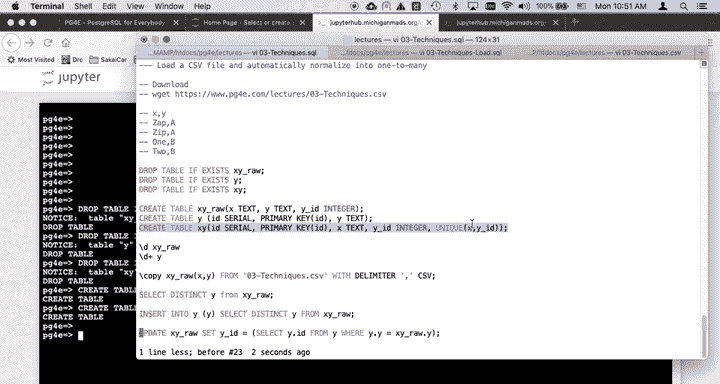

接下来，我们创建两个最终的目标表，用于存储规范化后的数据。

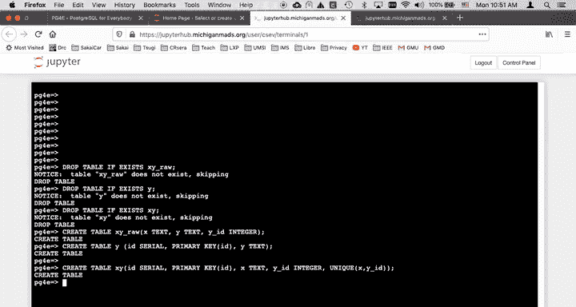

1.  **`y` 表**：用于存储 `y` 列的唯一值，并为每个值分配一个唯一的ID（主键）。
    ```sql
    CREATE TABLE y (
        id SERIAL PRIMARY KEY,
        y TEXT
    );
    ```

2.  **`xy` 表**：这是我们的主表，它将存储 `x` 值和指向 `y` 表的外键。我们还会设置一个唯一性约束，确保 `(x, y_id)` 组合的唯一性。
    ```sql
    CREATE TABLE xy (
        id SERIAL PRIMARY KEY,
        x TEXT,
        y_id INTEGER REFERENCES y(id),
        UNIQUE (x, y_id)
    );
    ```

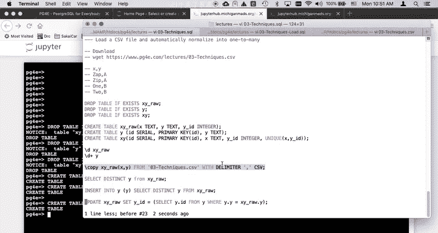

---

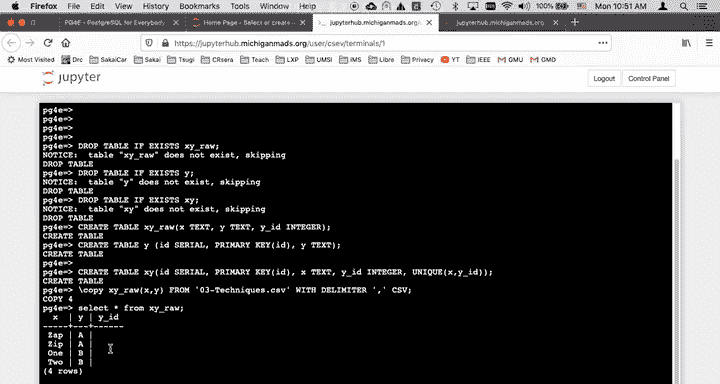

## 填充规范化表

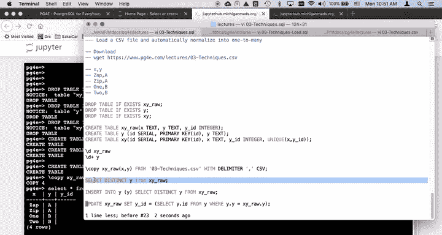

现在，我们开始将临时表中的数据转移到规范化表中。这个过程分为几个步骤。

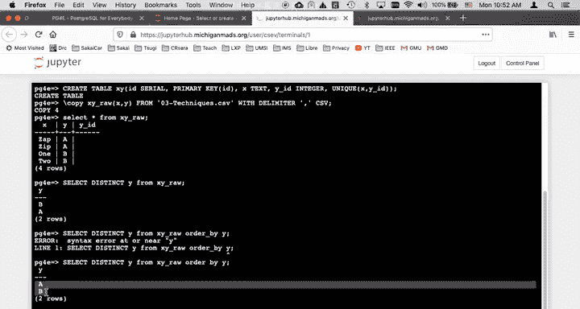

### 步骤一：填充 `y` 表

我们需要从 `xy_raw` 表中提取 `y` 列的所有**不重复**值，并插入到 `y` 表中。这里的关键是使用 `SELECT DISTINCT`。

```sql
INSERT INTO y (y)
SELECT DISTINCT y FROM xy_raw ORDER BY y;
```

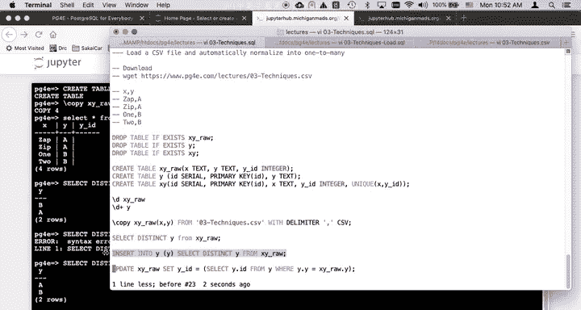

执行后，查询 `y` 表，可以看到每个唯一的 `y` 值（如 ‘A’， ‘B’）都获得了一个自增的ID（1， 2）。

### 步骤二：更新临时表的外键

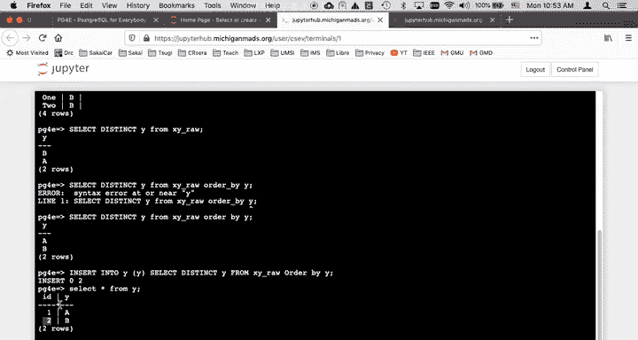

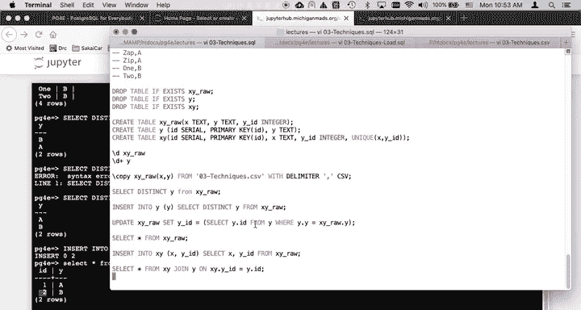

接下来，我们需要更新 `xy_raw` 表中的 `y_id` 列，使其指向 `y` 表中对应的ID。这通过一个 `UPDATE` 语句配合子查询完成。

```sql
UPDATE xy_raw
SET y_id = (
    SELECT id FROM y WHERE y.y = xy_raw.y
);
```

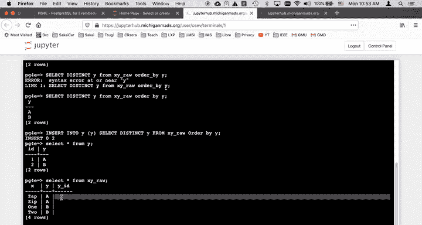

这个语句为 `xy_raw` 表中的每一行，根据其 `y` 值在 `y` 表中查找对应的 `id`，并填充到 `y_id` 列。

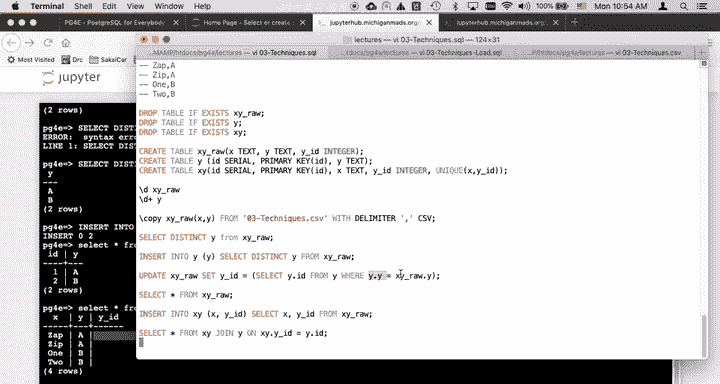

### 步骤三：将数据插入最终表

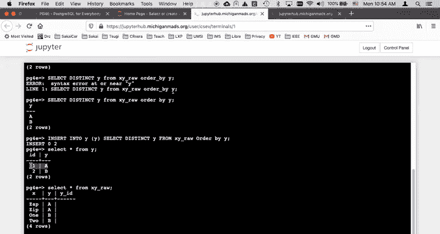

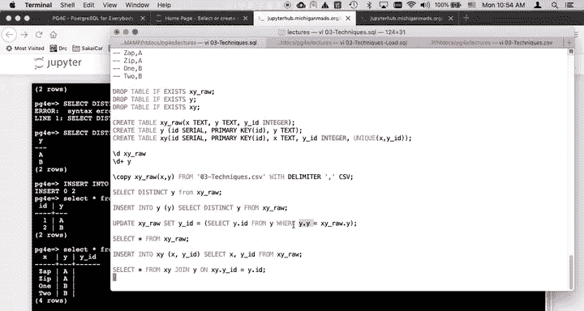

现在，`xy_raw` 表已经包含了正确的外键ID。我们可以将其中的 `x` 和 `y_id` 数据插入到最终的 `xy` 表中。

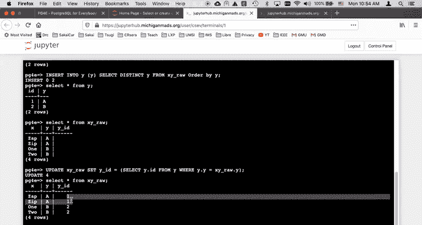

```sql
INSERT INTO xy (x, y_id)
SELECT x, y_id FROM xy_raw;
```

此时，`xy_raw` 表中的 `y` 列数据已经冗余，可以删除该列或直接删除整个临时表。

---

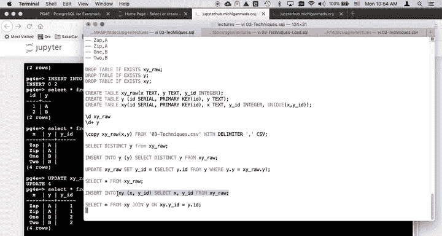

## 验证与查询

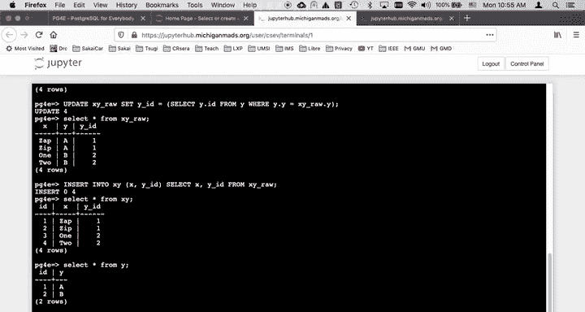

让我们通过一个连接查询来验证规范化是否成功，并重建原始的数据视图。

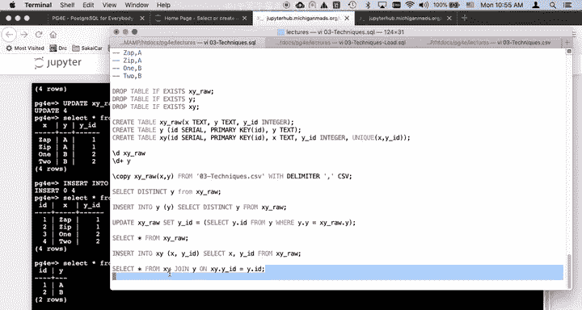

```sql
SELECT xy.*, y.y
FROM xy
JOIN y ON xy.y_id = y.id
ORDER BY xy.id;
```

这个查询将 `xy` 表和 `y` 表连接起来，输出结果应该与我们最初加载的CSV数据在逻辑上完全一致，但数据结构已经得到了优化。

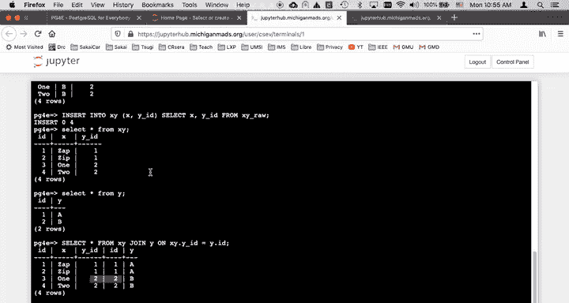

---

## 核心技术总结

本节课我们一起学习了从CSV文件到规范化数据库的完整流程。核心技巧包括：

1.  **使用 `COPY` 命令高效加载CSV数据**。
2.  **利用 `SELECT DISTINCT` 提取唯一值**，以消除垂直重复。
3.  **通过 `INSERT INTO ... SELECT ...` 语句**，将唯一值插入到查找表（如 `y` 表）并自动生成主键。
4.  **使用带子查询的 `UPDATE` 语句**，为原始数据行匹配并填充正确的外键ID。
5.  最后，**将包含外键的数据插入到最终的主表**中，完成规范化。

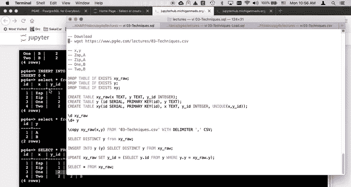

通过这一系列操作，我们成功地将一个扁平、存在冗余的CSV数据集，转换为了一个结构清晰、关系明确、易于维护的规范化数据库。