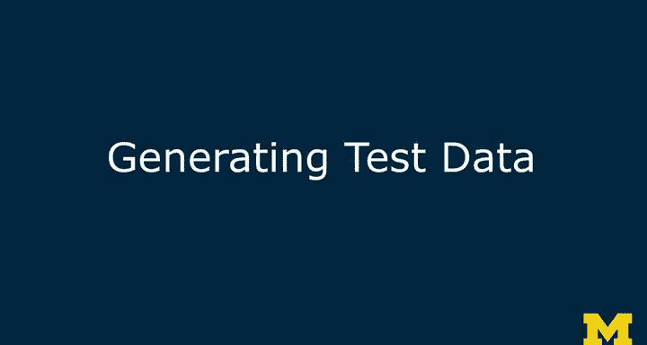
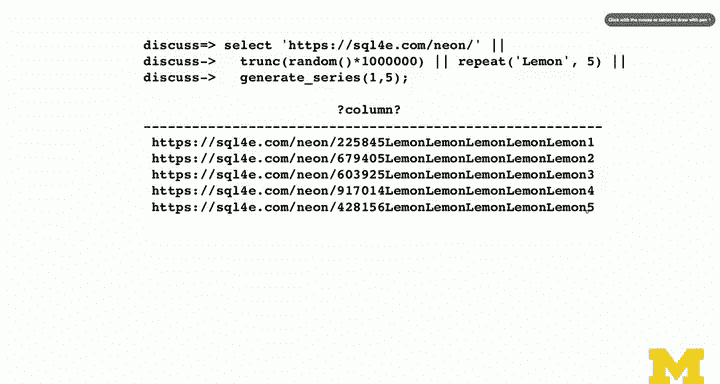

# PostgreSQL 数据库教程：第19章：数据库文本处理技术 📚


在本节课中，我们将学习如何在 PostgreSQL 数据库中生成测试数据，并初步探讨与性能相关的考量。我们将介绍几个核心的 SQL 函数，它们能帮助我们高效地创建大量、多样化的数据行，为后续的查询性能测试和文本处理打下基础。

---



## 生成测试数据 🧪

在前面的课程中，我们主要使用少量数据示例进行演示。然而，要真正测试查询性能（例如，在不同索引策略下的速度）或评估存储空间占用，我们需要在数据库中填充大量数据，比如一万、十万甚至一百万条记录。

你可以通过编写 Python 程序或 Shell 脚本来循环插入数据，但 PostgreSQL 本身提供了一些非常便捷的函数来生成随机数据。我们将通过示例逐一了解这些函数。

以下是生成测试数据时需要用到的几个核心函数：

*   **`random()`**: 生成一个介于 0 和 1 之间的随机浮点数。
*   **`trunc()`**: 将数字截断为整数。
*   **`repeat(string, number)`**: 将指定字符串重复指定次数。
*   **`generate_series(start, end)`**: 生成一个从 `start` 到 `end` 的数值序列，并以此创建多行数据。

---

### 函数详解与示例

上一节我们介绍了生成测试数据的必要性，本节中我们来看看每个函数的具体用法和效果。

**`random()` 与 `trunc()` 函数**
`random()` 函数每次调用都会产生一个 0 到 1 之间的新随机浮点数。为了得到特定范围的整数（例如 0 到 100），我们可以将其乘以范围上限，然后使用 `trunc()` 函数截断小数部分。

```sql
SELECT trunc(random() * 100);
```
这段代码会生成一个 0 到 100 之间的随机整数。

**`repeat()` 函数**
`repeat()` 函数用于水平拼接字符串，生成一个长字符串。这在创建长的测试文本或键值时非常有用。

```sql
SELECT repeat('neon ', 5);
```
这段代码会返回字符串 `'neon neon neon neon neon '`。

**`generate_series()` 函数**
这是最强大的一个函数。你可以把它类比为 Python 中的 `range()` 函数。它本身会生成一个数值序列，当在 `SELECT` 语句中使用时，它会将这个序列“爆炸”成多行数据。

```sql
SELECT generate_series(1, 5);
```
这段代码会生成五行数据，值分别为 1, 2, 3, 4, 5。

---

### 组合使用生成多行数据

理解了每个独立函数后，我们现在将它们组合起来，以创建包含多行、内容各异的数据集。

以下是组合这些技巧的示例：

```sql
SELECT
    'sql4do.co/neon' || trunc(random() * 1000000) || repeat(' lemon', 5) AS data,
    generate_series(1, 5) AS id;
```

在这个语句中：
1.  `||` 是 PostgreSQL 中的字符串连接运算符。
2.  我们构造了一个长字符串，包含固定前缀、一个随机数以及重复的单词。
3.  关键点在于 `generate_series(1, 5)`。它的存在使得整个 `SELECT` 语句会执行五次，从而生成五行数据。
4.  最终，我们得到五条记录，每条记录都有一个较长的 `data` 字段和一个从 1 到 5 顺序递增的 `id` 字段。

通过灵活运用 `random()`, `trunc()`, `repeat()` 和 `generate_series()` 这些函数，你可以构造出任意数量、结构复杂的测试数据，并将其插入到目标表中。

---

## 后续内容预告

接下来，我们将利用生成的测试数据，探讨一旦数据存入数据库后，我们可以用哪些文本函数对其进行处理和分析。



---


本节课中我们一起学习了在 PostgreSQL 中生成测试数据的核心方法。我们掌握了 `random()`, `trunc()`, `repeat()` 和 `generate_series()` 这几个关键函数，并了解了如何将它们组合使用，高效地创建出用于性能测试和功能验证的大规模数据集。这是进行深入数据库性能分析和文本处理的重要第一步。