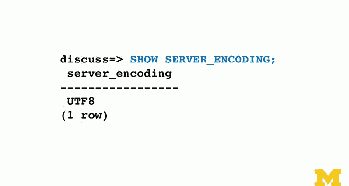

# PostgreSQL for Everybody：P50：字符集编码原理 🧩


在本节课中，我们将要学习字符集编码的基本原理。理解字符集对于处理文本数据至关重要，它解释了计算机如何存储和表示我们看到的字母、数字和符号。我们将从早期的简单编码讲起，一直发展到如今广泛使用的Unicode标准。

## 从ASCII到Unicode的演变

上一节我们介绍了文本字符串，本节中我们来看看字符集的具体发展历程。

早期的计算机由于内存昂贵，字符集设计得非常精简。最初的字符集甚至只包含大写字母，以节省存储空间。随着技术进步，我们开始需要表示更多字符，包括小写字母和各种符号。

ASCII（美国信息交换标准代码）成为了一个广泛使用的标准。它将每个字符映射到一个0到127之间的数字，并使用8位（一个字节）来存储。例如，大写字母‘H’对应的ASCII码是72。

**公式：** `字符 ‘H’ 的ASCII码 = 72`

ASCII码的设计使得字符排序和数学运算变得简单，因为字符的数值顺序与其在字母表中的顺序一致。然而，ASCII只能表示128个字符，这对于英语以外的语言是远远不够的。

为了支持更多语言，人们创建了各种扩展字符集（如Latin-1、Windows-1252），它们使用一个字节的后128个码位（128-255）来表示额外的字符。但这导致了“代码页”混乱的问题：同一个数字在不同字符集中代表不同的字符。如果一个文件没有指明其使用的字符集，就很容易出现乱码。

## Unicode：统一的解决方案

为了解决多语言字符集的混乱问题，Unicode应运而生。这是一个非常巧妙的方案。

Unicode的核心思想是创建一个单一的、庞大的字符集，为世界上所有书写系统中的每一个字符分配一个唯一的编号（称为“码点”）。这个编号范围非常广，使用32位（约21亿）的空间，足以容纳所有现代、古代甚至未来的字符。

**概念：** Unicode为每个字符分配一个唯一的**码点**（Code Point），例如字母‘A’的码点是U+0041。

这意味着，无论是英文字母、中文汉字还是数学符号，在Unicode中都有自己专属的位置。它完美地解决了字符集不统一的问题。

## UTF-8：高效的编码方式

然而，如果直接用32位（4个字节）存储每个字符，对于大量文本数据（如网页、数据库）来说，空间浪费是巨大的。因为像ASCII字符这样的常用字符根本不需要那么多空间。

于是，UTF-8编码被发明出来。它是一种针对Unicode的可变长度字符编码。其设计非常精妙：

*   **兼容ASCII：** 对于码点在0-127之间的字符（即ASCII字符），UTF-8使用1个字节存储，且编码与ASCII完全相同。
*   **可变长度：** 对于其他字符，UTF-8使用2到4个字节进行编码。常用字符使用较少的字节，生僻字符使用较多的字节。

**代码示例：** 在UTF-8中：
- `‘A’` (U+0041) 编码为 `0x41` (1字节)
- `‘¢’` (U+00A2) 编码为 `0xC2 0xA2` (2字节)
- `‘中’` (U+4E2D) 编码为 `0xE4 0xB8 0xAD` (3字节)

这种设计使得UTF-8在保持全球通用性的同时，又具有很高的存储和传输效率。到2012年左右，全球超过90%的网页都已使用UTF-8编码，它已成为事实上的互联网字符编码标准。

## 在PostgreSQL中处理字符

在PostgreSQL中，虽然你可以为数据库选择多种遗留的字符集，但对于所有新项目，最佳实践是统一使用UTF-8编码。

以下是关于字符串长度计算的重要概念：

*   **字符长度 (`char_length`)：** 返回字符串中字符的数量。
*   **字节长度 (`octet_length`)：** 返回字符串实际占用的存储字节数。
*   **位长度 (`bit_length`)：** 返回字符串占用的位数，通常是字节数乘以8。

**代码示例：**
```sql
-- 假设一个中文字符串‘学习’
SELECT
    char_length(‘学习‘) AS 字符数, -- 返回 2
    octet_length(‘学习‘) AS 字节数, -- 在UTF-8中可能返回 6（每个中文字符占3字节）
    bit_length(‘学习‘) AS 位数; -- 返回 48 (6字节 * 8)
```

对于遗留数据，你应该制定一个方案，在数据入库时将其转换为UTF-8。确保你的应用程序、数据库和文件传输都使用UTF-8，可以最大程度地避免乱码问题。

## 总结




本节课中我们一起学习了字符集编码的发展历程。我们从只占1个字节、功能有限的ASCII码开始，经历了多种扩展字符集并存带来的混乱，最终迎来了Unicode这一统一的字符集标准。而UTF-8作为Unicode的一种高效编码方式，因其兼容性和空间效率，已成为当今数字世界的通用字符编码方案。理解这些原理，能帮助我们在开发中更好地处理多语言文本数据，避免常见的编码错误。