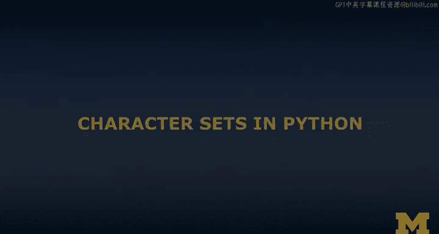
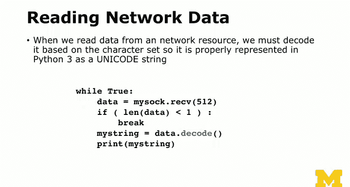
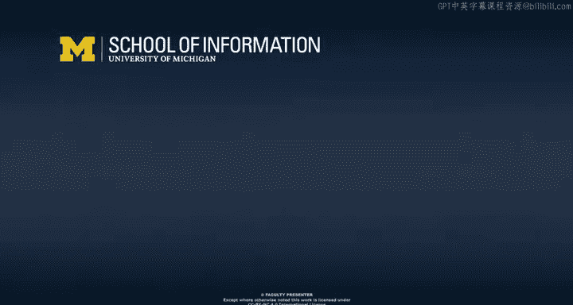

# 密歇根大学《给所有人的PostgreSQL课（数据库设计、SQL、JSON和NLP、ES）｜PostgreSQL for Everybody》中英字幕 - P51：22_Python中的字符集处理.zh_en - GPT中英字幕课程资源 - BV1tj421U7GK

So now continuing talking about character sets， we're just going to do a quick review of how character sets work in Python。

 having to do with sort it's where when data is at rest versus when data is in motion。

So Python 2 to Python 3， a big part of that transition was going to UniIcode as the internal format inside of Python so in Python 2。

 the internal format of strings we're ASII8 bit bytes。

 but again that's because it's 20 some years old and was northern European and so it was the whole ASCI thing was kind of northern Europe and America and honestly you know by now Python 3 is everyone accepts it but there was a lot of debate for well over 10 years as to whether Python 2 was so good in Python 3 was like don't we we don't even need this well the answer is is Python3 had to happen and UniIcode is the right answer。

So。With that as sort of background， Python 3 made the decision。

 and I think it's brilliant that all the strings in memory are simple Uniiccode。

It's not that big of a deal。They have another type called the Bs type。

 which is for eight bit characters and as we'll see a little bit， there is a purpose for bites type。

 especially when you're starting doing compression and hashing and stuff like that。

But Uniode is big because that's 32 bits per character， but it's super fast for like going down。

 looping through characters， like going down1 thousand characters。

 you can bounce really fast because they're four bytes you don't have to look at every character to figure out。

 you can go to the 40th character by going to the 168th100 go to the 40th character by going to the 160th byte。

So Uniode is awesome for in memorymory， but when you're storing it on disk or sending it across a network or storing it a file。

 then you want to convert to UTF8 and so it's both for interoperability because you other languages like PhP or they're going to want to look at UTF8。

 they're not going to want to look at UniIcode so even though Python has a Unicode inside。

 it has to read UTF8 materials， work on it in UniIcode and then write it back out。

And so database tables are UTF8， network connections are UTF8 and files are UTF8。

So because the strings in Python are UniIcode， every time Python is talking to something that it knows to be external。

 it has to go through a decocode process， and that is decode this encoded data。

 you can almost think a UTFA is a compressed format and we're kind of uncompressing it that's what I can think of decoding so from a file or UTF8 network or database。

 you're going to decode it before you work with it inside Python。

 and then if you have it inside Python， then you got to encode it。

 it almost like a compression and decompress， decompression when you read and compression when when you write and I talked about UTFA。

So if you open a file you'll see that there is a parameter called encoding and the default is none。

 but then the default is generally you can ask what the default is and you'll find in most cases 8090% of the case is maybe 100% of the case is that you're just going have the encoding the UTF8 and the reason UTF8 works so well is if it's an old ASI file it just works the only time you'd use this is if it was like a Windows 1252 or Latin 1 or something that had characters above 127 that were not UTF8 and so most of the time the default works。

 so we just soar of kind of pretend because ASI just kind of grandfathered in in the UTF8 so it happens automatically and if you're reading it you can tell it I want to read it binary versus read it text and then it gives you the bytes if you tell it I want this to be binary。

So when you read network data， so the decoding is happening implicitly once you open the file。

 then it'll decode for you when you read the data。But in network data， if you're talking on sockets。

 some of the network like URL Lib does the decoding for you automatically in this case I'm talking to a socket directly and I have to do a decocode and so you know just look for this and if you see a decocode I just want you to understand what that means as it means it's I got some raw bitetes from the outside world and I'm expecting them to be TF8 but the string that I'm going to have inside Python I want to be unIcode。

 so decode， decompress， take that data and get it internally。

Now， it turns out that if you talk to a database in Python。

 you use a thing called a database connector。And the cool thing about the database connector is the database is marked as what the character set is。

 And like I said， you just want it to be UTF 8。 but even if you had like a weird old character set。

 a weird old database that had ASI character set be like oh the connector actually as it's reading and giving you the rows back It's like oh I'm gonna to take this AS convert it to UTF8 or if you even had like one that had a legacy Japanese character set in a database。

 the database connector would convert from the legacy Japanese character set in the database on the way in into UniIcode and it would convert Unicode to the legacy Japanese character set。

 So it turns out in databases it's worked really well for a long time。

 And so kind it worked pretty well because the connector knows the format the database has been created in and so all the database stuff is stored in that format and then it does the conversion automatically So you just say get me that row in Python and then you have you have a nice Python Unicode string and it's done automatically So。

I is prettyt much done automatically， network stuff is done mostly automatically and the database stuff is done on it and I just want you to be aware of the fact that you might have to move this data back and forth and you might have to convert that data so if you're seeing something and it's really weird and certain characters aren't showing up the way you do。

 think look for the encoding and the decoding as potentially the problem that's causing sort of your confusion in terms of character sets。

