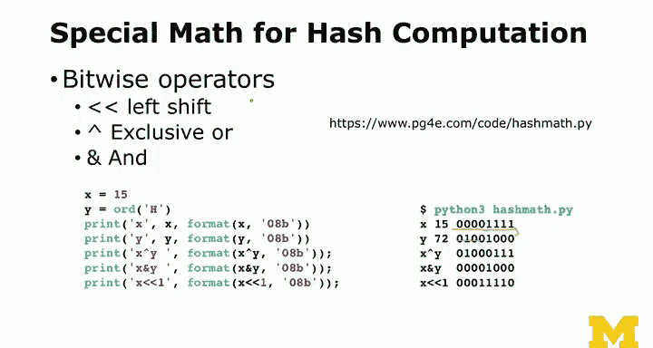

# PostgreSQL for Everybody：23：哈希算法内部机制 🔐


在本节课中，我们将深入探讨哈希算法的核心概念和工作原理。哈希算法是计算机科学中一项基础且强大的技术，广泛应用于数据校验、密码学、数据库索引和字典等关键领域。我们将从基本原理出发，通过简单的Python示例，揭示哈希函数如何将任意长度的数据转换为固定长度的“指纹”，并解释其为何如此重要。

---

## 哈希函数是什么？

哈希函数本质上是一个数学函数，它接收任意长度的输入数据（从一个字符到数百万字符），经过一系列计算，最终输出一个固定长度的值，通常称为哈希值或摘要。

这个过程的**核心公式**可以抽象为：
`hash_value = hash_function(input_data)`

哈希函数的关键特性是**确定性**：相同的输入数据经过相同的哈希函数计算，**总是**会得到完全相同的输出值。然而，输出的长度是固定的，例如64位、128位或256位。

---

## 我们为什么需要哈希？

哈希算法在计算机系统中扮演着多个关键角色。

### 数据校验（校验和）

在网络传输中，数据可能因干扰而出现错误（如比特位翻转）。为了解决这个问题，发送方在发送数据的同时，会计算数据的哈希值（校验和）并一并发送。接收方收到数据后，重新计算哈希值并与接收到的校验和进行比对。如果两者不一致，则说明数据在传输过程中出错，需要丢弃或重传。

虽然你在高级编程（如Python）中可能不直接处理这些底层校验，但以太网、Wi-Fi乃至手机网络等底层通信协议都在广泛使用哈希进行数据完整性检查。

### 密码学哈希

密码学哈希将哈希的应用提升到了安全领域。它用于数字签名、验证消息完整性等场景。密码学哈希函数需要满足更严格的标准，我们稍后会详细讨论。

### 数据结构基础

哈希函数是Python字典、数据库表和数据库索引等高效数据结构的基石。理解哈希有助于你理解这些工具为何能如此快速地存储和检索数据。

---

## 优秀哈希函数的特性

研究人员投入毕生精力设计和分析哈希函数。一个优秀的哈希函数应具备以下特性：



以下是哈希函数需要满足的几个关键特性：

*   **确定性**：相同的输入必然产生相同的输出，而非随机数。
*   **敏感性**：输入数据的任何微小变化（哪怕只改变一个字符）都必须导致输出哈希值的显著不同。
*   **均匀分布**：对于大量不同的随机输入，其产生的哈希值应均匀地分布在整个可能的输出空间（例如，对于一个64位哈希，不应只产生1到10这样的小范围数字）。
*   **单向性**：从输出的哈希值**无法**逆向推导出原始的输入数据。这一点在密码存储中尤为重要。

---

## 深入原理：一个简单的哈希函数示例

上一节我们介绍了哈希函数的理想特性，本节中我们来看看一个非常简单的哈希函数是如何在代码层面运作的。理解这个简单模型，有助于破除哈希的“魔法”感。

我们将通过Python代码演示一个基础的哈希计算过程。这里会用到一些位操作符，你可能平时很少接触，但它们对于理解哈希的核心机制——“移位、合并、掩码”——至关重要。

首先，了解一些基础操作：
*   **左移 (`<<`)**：将所有比特位向左移动，右边补零。例如 `1011 << 1` 变成 `10110`。
*   **按位异或 (`^`)**：比较两个数的每个比特位，如果不同则结果为1，相同则为0。例如 `1010 ^ 0110 = 1100`。这是一种“合并”数字而不使其无限增大的好方法。
*   **按位与 (`&`)**：常用于“掩码”操作，可以保留指定位，清除其他位。

现在，让我们观察一个简化的哈希函数如何工作：

```python
def simple_hash(s):
    hv = 0
    mask = 0xFFFFFF  # 一个24位的掩码，限制哈希值长度
    for ch in s:
        hv = ((hv << 1) ^ ord(ch)) & mask  # 核心操作：移位、异或合并、掩码限制
    return hv

# 测试
print(simple_hash("Hello"))  # 输出一个数字，如 1711
print(simple_hash("hello"))  # 输出另一个数字，如 1199 (大小写敏感)
print(simple_hash("eHllo"))  # 输出又一个不同的数字，如 47 (顺序敏感)
```

**核心流程解析**：
函数遍历输入字符串的每个字符。
1.  **移位**：将当前累积的哈希值左移一位，为新字符腾出空间。
2.  **合并**：将新字符的ASCII码值与移位后的哈希值进行**异或**操作，将其“混合”进去。
3.  **掩码**：使用**按位与**操作和一个固定掩码，确保哈希值不会超过预设的最大长度（本例为24位）。

这个过程就像是在搅拌机中依次加入食材：每次加入新字符（食材）时，先搅拌一下已有的混合物（移位），然后加入新字符并混合（异或），同时确保混合物不会溢出容器（掩码）。

你可以看到，改变一个字符的大小写或顺序，都会导致最终结果截然不同，这体现了哈希的**敏感性**。

---

## 哈希算法的演进与挑战

我们刚刚构建的简单哈希函数非常脆弱，很容易找到两个不同的字符串产生相同的哈希值（即**哈希碰撞**）。设计一个能抵抗碰撞的、强大的哈希函数是严肃的科学研究。

### 算法竞赛与标准化

像美国国家标准与技术研究院这样的机构会组织全球性的竞赛来选拔新的哈希标准（如SHA-256）。各团队提交自己的算法，然后相互攻击，寻找碰撞漏洞。经过多轮淘汰和优化，最终胜出的算法才会被广泛采纳为标准。

### 经典哈希算法：MD5与SHA-256

*   **MD5**：这是一个早期的128位哈希函数，曾广泛应用。其内部结构也是由多轮的移位、异或等操作构成，但比我们的示例复杂得多。然而，MD5在密码学上已被证明是**不安全**的，因为研究人员找到了高效制造碰撞的方法。不过，对于非对抗性场景（如快速去重），它仍有其用处。
*   **SHA-256**：属于SHA-2家族，输出256位哈希值。它是目前广泛推荐使用的密码学安全哈希算法，其结构同样复杂但经过了更严格的安全验证。

在PostgreSQL等系统中，你可以直接使用内置函数计算这些哈希值：
```sql
SELECT md5('some data');
SELECT sha256('some data'::bytea);
```

---

## 哈希的陷阱：以密码存储为例

哈希的**单向性**使其常用于密码存储：系统存储密码的哈希值而非明文。当用户登录时，系统对输入的密码再次哈希，并与存储的值比对。

但这存在一个陷阱：攻击者可以预先计算海量常用密码及其哈希值，形成“彩虹表”。如果用户密码过于简单（如“password123”），其哈希值很可能就在彩虹表中，从而被瞬间破解。

因此，在实际应用中，存储密码不会直接使用MD5或SHA-256，而是会采用加盐（Salt）和慢哈希函数（如bcrypt、PBKDF2）等技术来极大增加破解难度。

---

## 总结

本节课中我们一起学习了哈希算法的内部机制。
1.  我们了解了**哈希函数**是一个将任意数据映射为固定长度“指纹”的确定性过程。
2.  我们探讨了哈希在**数据校验**、**密码学**和**数据结构**中的关键作用。
3.  我们分析了优秀哈希函数所需的特性：**确定性**、**敏感性**、**均匀分布**和**单向性**。
4.  我们通过一个简单的Python示例，拆解了哈希“移位-合并-掩码”的核心计算流程。
5.  我们回顾了哈希算法的演进史，认识了**MD5**和**SHA-256**等经典算法及其安全背景。
6.  最后，我们指出了哈希在密码存储中的潜在风险以及相应的安全实践。


理解哈希并非魔法，而是建立在严谨数学和计算机科学之上的技术，这将帮助你更深入地理解数据库索引、数据完整性验证及网络安全等诸多领域的工作原理。