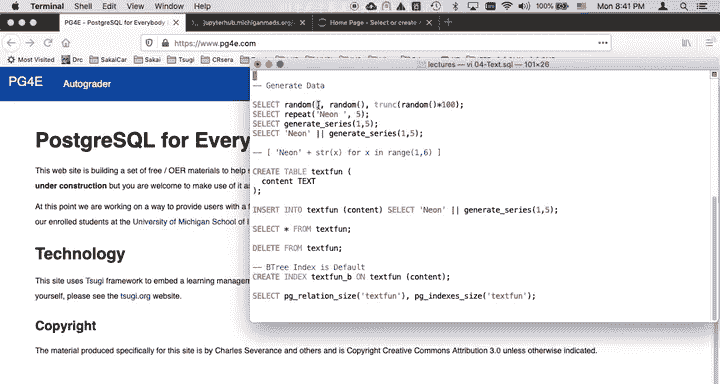
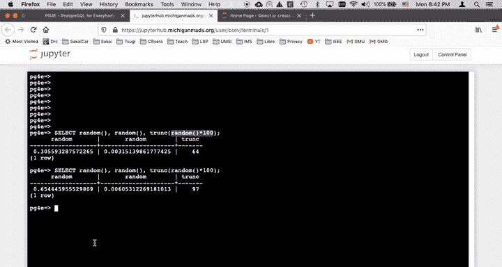
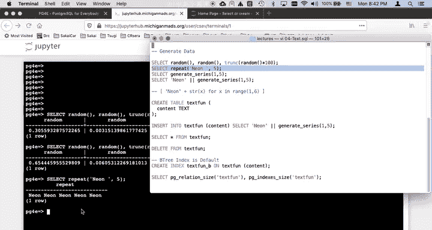
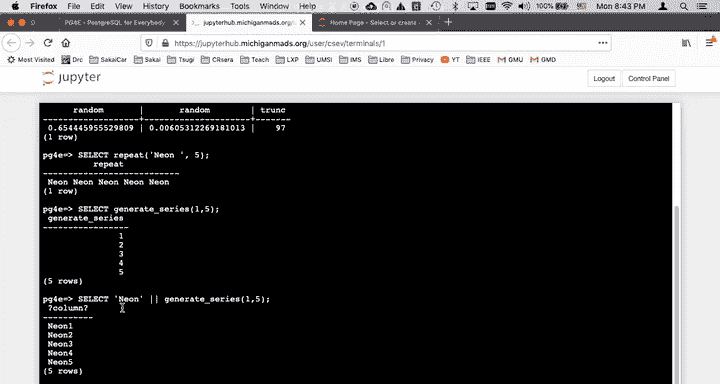
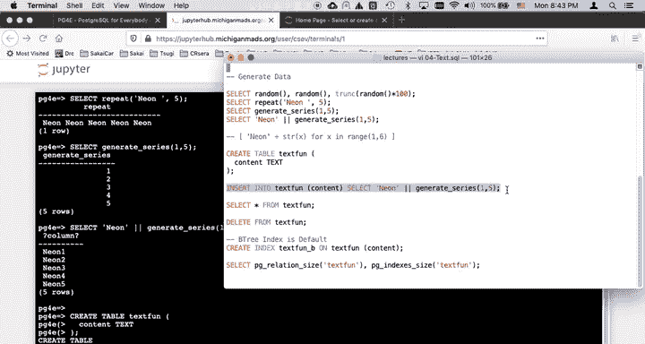
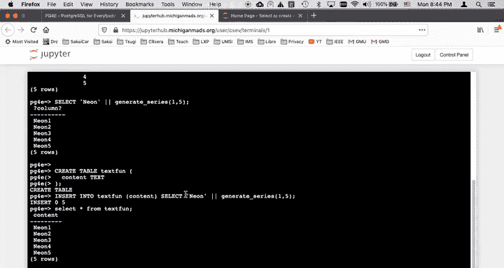
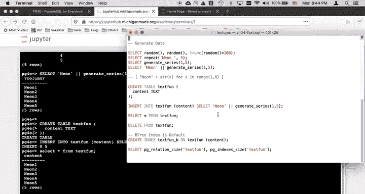
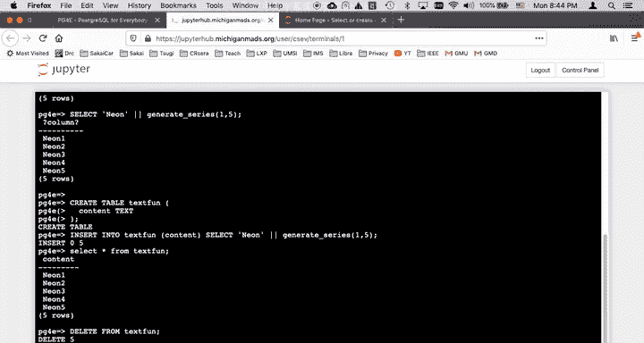
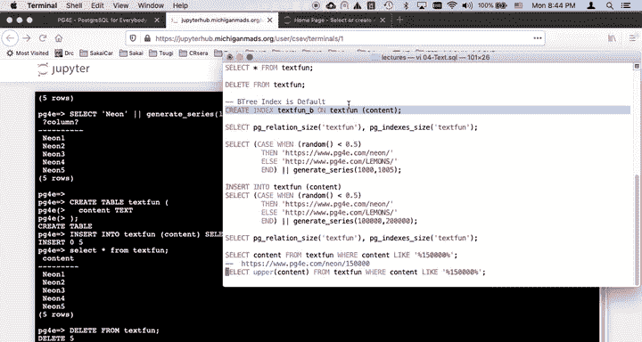
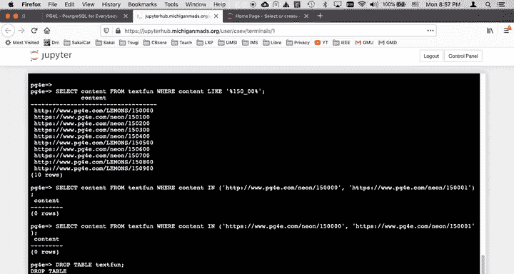

# PostgreSQL for Everybody：P55：文本生成与扫描演示 🧪

在本节课中，我们将学习如何在 PostgreSQL 中生成和操作文本数据。我们将探索生成随机数据、构建长字符串、执行批量插入以及使用各种字符串函数进行查询和扫描的方法。这些技巧对于填充测试数据、性能分析或处理文本信息非常有用。

## 生成随机数与字符串



首先，我们来了解一些生成数据的基础构件。`random()` 函数可以生成一个介于 0 和 1 之间的随机浮点数。每次调用它都会得到不同的值。

```sql
SELECT random();
```

如果你想得到一个 0 到 100 之间的整数，可以使用 `trunc()` 函数对 `random() * 100` 的结果进行截断。



```sql
SELECT trunc(random() * 100);
```



## 使用 `generate_series` 生成多行数据

`generate_series` 函数是生成多行数据的强大工具。它本身看起来像是一个值，但每次被引用时，都会强制生成一个新行。

```sql
SELECT generate_series(1, 5);
```



上面的查询会生成一个包含数字 1 到 5 的五行结果集。

我们可以将它与字符串连接操作符 `||` 结合使用，来生成有意义的文本行。

```sql
SELECT 'neon' || generate_series(1, 5);
```



这类似于 Python 中的列表推导式，会生成一个包含 `neon1`, `neon2` 等元素的列表。

## 批量插入数据到表中







了解了如何生成数据后，我们可以利用它来填充数据库表。首先，创建一个简单的表。

```sql
CREATE TABLE text_fun (content TEXT);
```



我们可以使用 `INSERT INTO ... SELECT` 语句，将 `SELECT` 查询的结果直接插入到表中。关键在于，`SELECT` 语句返回的列数必须与 `INSERT` 语句指定的列数匹配。

```sql
INSERT INTO text_fun (content)
SELECT 'neon' || generate_series(1, 5);
```

插入后，可以查询表的内容进行验证。

```sql
SELECT * FROM text_fun;
```

## 生成更复杂的随机数据

为了进行更实际的测试，我们可能需要生成包含随机内容的更大量数据。我们可以结合 `CASE` 语句和 `random()` 函数来实现。

`CASE` 语句类似于编程语言中的 `if-then-else`，但它是在 SQL 的每一行数据生成时进行条件判断并返回不同的值。

```sql
SELECT CASE
    WHEN random() < 0.5 THEN 'lemons'
    ELSE 'neon'
END;
```

这个查询会随机返回 `'lemons'` 或 `'neon'`，概率各为 50%。

现在，我们将这个随机生成器与 `generate_series` 结合，生成多行数据，并插入到一个新表中。

```sql
CREATE TABLE text_scan (content TEXT);
CREATE INDEX text_scan_content_idx ON text_scan (content);

INSERT INTO text_scan (content)
SELECT CASE
    WHEN random() < 0.5 THEN 'lemons'
    ELSE 'neon'
END || generate_series(100000, 200000);
```

这个操作会生成 100,001 行数据，每行的内容是 `'lemons'` 或 `'neon'` 后接一个序列号。请注意，在大数据量插入时，操作可能需要一些时间。

插入完成后，我们可以查看表和索引占用的磁盘空间。

```sql
SELECT
    pg_size_pretty(pg_relation_size('text_scan')) AS table_size,
    pg_size_pretty(pg_indexes_size('text_scan')) AS index_size;
```

## 字符串操作与扫描

数据准备就绪后，让我们看看如何查询和操作这些文本数据。最标准的字符串匹配操作是 `LIKE`，它使用 `%` 作为通配符，代表任意数量的字符。

```sql
SELECT content FROM text_scan WHERE content LIKE '%15000%';
```

这个查询会查找 `content` 字段中任意位置包含 `'15000'` 字符串的所有行。

以下是其他一些常用的字符串函数：

*   **大小写转换**：使用 `UPPER()` 和 `LOWER()` 函数。
    ```sql
    SELECT UPPER(content), LOWER(content) FROM text_scan LIMIT 5;
    ```

*   **截取子串**：使用 `LEFT()` 和 `RIGHT()` 函数获取字符串开头或结尾的指定数量字符。
    ```sql
    SELECT LEFT(content, 4), RIGHT(content, 4) FROM text_scan LIMIT 5;
    ```

*   **查找子串位置**：使用 `STRPOS()` 函数。
    ```sql
    SELECT STRPOS(content, 'neon15000') FROM text_scan WHERE content LIKE '%neon15000%';
    ```

*   **分割字符串**：使用 `SPLIT_PART()` 函数，它接受三个参数：原始字符串、分隔符和想要获取的部分序号。
    ```sql
    SELECT SPLIT_PART('http://example.com/page', '/', 4);
    ```

*   **字符替换**：使用 `TRANSLATE()` 函数进行一对一的字符映射替换。
    ```sql
    SELECT TRANSLATE(content, 'thp/.', 'THP!_') FROM text_scan LIMIT 5;
    ```

除了 `%`，`LIKE` 操作符还支持 `_` 通配符，它精确匹配**一个**任意字符。

```sql
SELECT content FROM text_scan WHERE content LIKE 'neon150_0';
```

你也可以使用 `IN` 关键字来匹配一个值列表。

```sql
SELECT content FROM text_scan WHERE content IN ('neon15000', 'lemons15001');
```

## 清理工作

学习完成后，记得删除我们创建的测试表，以释放服务器空间。

```sql
DROP TABLE text_scan;
```

---



本节课中，我们一起学习了在 PostgreSQL 中生成、插入和扫描文本数据的多种技术。我们掌握了使用 `random()` 和 `generate_series()` 生成测试数据，使用 `LIKE` 和通配符进行模式匹配，以及运用一系列内置字符串函数（如 `UPPER`、`SPLIT_PART`、`TRANSLATE` 等）来处理文本。这些技能对于数据库测试、数据清洗和日常查询都至关重要。