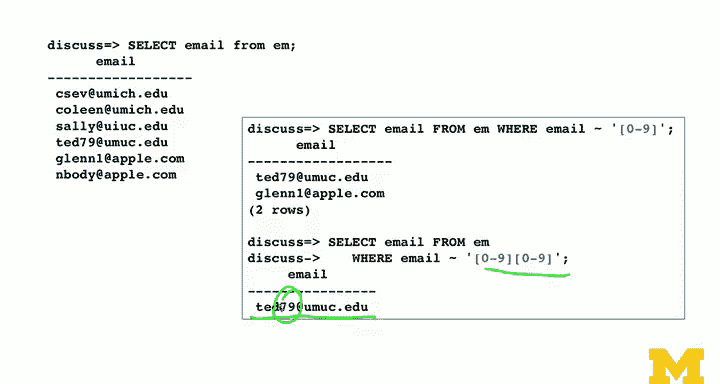

# PostgreSQL for Everybody：P58：正则表达式原理 🧠


在本节课中，我们将学习正则表达式的基本原理。正则表达式是一种强大的文本处理工具，广泛应用于数据分析、字符串搜索和模式匹配。我们将了解其历史背景、核心概念以及在PostgreSQL中的基本应用。

正则表达式起源于20世纪60年代和70年代，与处理字符串的编程语言、形式语言分析等领域相关。它本质上是一种基于文本的编程语言，使用特殊字符而非传统编程关键字（如`if`）来构建模式，用于在字符串中进行搜索、匹配和提取操作。

## 正则表达式核心概念

正则表达式是一种紧凑的语言，用于在字符串中执行循环、条件判断等操作。它类似于通配符，但功能更强大，不仅用于匹配，还可用于解析。正则表达式在Linux命令（如`grep`）、以及Java、PHP、Python等编程语言中均有实现，但不同实现之间存在细微差异。

PostgreSQL采用了一套相对保守的正则表达式实现。对于初学者而言，正则表达式起初可能显得难以理解，这很正常。掌握它就像学习一门新的编程语言，需要时间和练习。

## 基本语法速览

以下是正则表达式的一些关键“关键字”：

*   `^`：匹配行的**开头**。
*   `$`：匹配行的**结尾**。
*   `.`：匹配**任意单个**字符（通配符）。
*   `*`：表示前一个字符可以出现**零次或多次**（贪婪匹配）。
*   `+`：表示前一个字符可以出现**一次或多次**。
*   `[abc]`：匹配括号内的**任意一个**字符（例如，匹配`a`、`b`或`c`）。
*   `[^XYZ]`：匹配**不在**括号内的任意字符（例如，匹配除大写`X`、`Y`、`Z`之外的字符）。
*   `[a-z0-9]`：匹配一个**范围**内的字符（例如，匹配小写字母或数字）。
*   `()`：用于分组和**提取**匹配的子字符串。

## PostgreSQL中的正则表达式运算符

上一节我们介绍了正则表达式的基本语法，本节中我们来看看PostgreSQL中用于匹配的正则表达式运算符。PostgreSQL提供了以下主要运算符：

*   `~`：匹配正则表达式（区分大小写）。
*   `~*`：匹配正则表达式（不区分大小写）。
*   `!~`：不匹配正则表达式（区分大小写）。
*   `!~*`：不匹配正则表达式（不区分大小写）。

这些运算符用于`WHERE`子句中，对文本列进行模式匹配。它们与标准的SQL `LIKE`运算符有所不同。`LIKE`需要显式使用`%`作为通配符，例如 `LIKE '%umsi%'` 表示在字符串任意位置查找“umsi”。而正则表达式 `~ 'umsi'` 则隐式地在整个字符串中滑动匹配，检查是否存在子串“umsi”，其内部相当于一个循环过程。

## 基础匹配示例

为了演示这些概念，我们使用一个包含电子邮件地址的示例数据。首先，我们构建一个最简单的正则表达式，功能类似于`LIKE`。

以下查询查找包含子串“umsi”的电子邮件：
```sql
SELECT email FROM users WHERE email ~ 'umsi';
```

这个表达式会沿着电子邮件字符串滑动“umsi”进行匹配。接下来，我们看看如何匹配特定位置。

使用 `^` 可以匹配字符串的开头。以下查询查找以字母“c”开头的电子邮件：
```sql
SELECT email FROM users WHERE email ~ '^c';
```

使用 `$` 可以匹配字符串的结尾。以下查询查找以“.edu”结尾的电子邮件：
```sql
SELECT email FROM users WHERE email ~ 'edu$';
```

## 使用字符集与范围匹配

以下是使用字符集（`[]`）进行匹配的示例：

查找以字母`g`、`n`或`t`开头的电子邮件地址：
```sql
SELECT email FROM users WHERE email ~ '^[gnt]';
```

这个模式 `^[gnt]` 匹配开头字符是`g`、`n`或`t`的字符串。

我们也可以使用范围进行匹配。以下示例演示如何匹配包含数字的字符串：

查找包含任意单个数字（0-9）的电子邮件：
```sql
SELECT email FROM users WHERE email ~ '[0-9]';
```

查找包含连续两个数字的电子邮件：
```sql
SELECT email FROM users WHERE email ~ '[0-9][0-9]';
```
模式 `[0-9][0-9]` 匹配两个连续的数字。你还可以在其中加入 `.*` 来表示两个数字之间可以有任意数量的其他字符，例如 `[0-9].*[0-9]`。



## 总结


本节课中我们一起学习了正则表达式的基本原理及其在PostgreSQL中的应用。我们了解了它的历史，学习了核心语法元素如 `^`、`$`、`.`、`*`、`+`、`[]` 和 `()`，并掌握了PostgreSQL中 `~`、`~*`、`!~`、`!~*` 这四个基本的正则表达式匹配运算符。通过简单的示例，我们实践了如何进行开头匹配、结尾匹配以及使用字符集和范围进行灵活的文本搜索。正则表达式是一门功能强大且紧凑的语言，多加练习将帮助你更高效地处理文本数据。