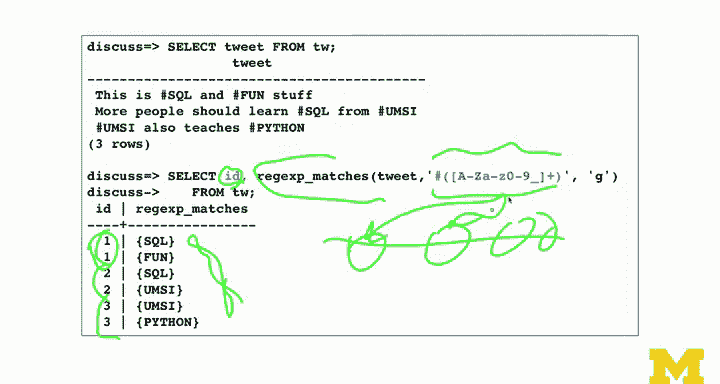

# 密歇根大学《给所有人的PostgreSQL课（数据库设计、SQL、JSON和NLP、ES）｜PostgreSQL for Everybody》中英字幕 - P59：30_正则表达式应用实践.zh_en - GPT中英字幕课程资源 - BV1tj421U7GK

So we just got done using wear clauses and regular expressions to pick which rows to show。

 Now what we're going to do is we're going to actually do stuff with the columns that come back from those rows。

 So we're actually parsing the results。 Now， in general， if you just need the whole column。

 you just select email in the way you go。 But basically we can then also use regular expressions to parse the columns。

 So if we take a look at this first thing。We see， you know， we're going to select substr of email。

 and so this could be select email。 Here's aware clause though just like we did before。

 but basically what we're going to do here is we're going to actually pull out those digits。

 So this is read that email address and find。0 through 9， which is digits。 So the bracket。

0 through 9 is a digit。 And then we have this plus。 Now， this plus is a modifier that modifies that。

 And that's one or more。 So if you put a star there it would be 0 or more。

 which would match everything because 0 or more digits is everywhere。

 So plus means one or more digits。 Okay， but it also is going to be greedy in that it's one or more contiguous digits。

 And if there were like。You know， a string that had like one， two and a string that had three。

 four and a string that had five， six。It would get the first one。

 So we'll talk in a second how you get the second one。 But in this case， it gets the first one。

 So you see that 79 from one of the email addresses in one。 And so this actually。

 you can see this is it kind of is pushing out and expanding。 and it's like。

 find me all the numbers that are contiguous。Okay。Then we can do a much more complex one。

 so this is a way to pull the domain name out of an email address and so this one takes a little bit of explaining。

So dot， if you go back to your cheat sheet， matches any character。

 plus is a modifier that matches that。 So that says dot means any character。

 one or more of those characters。Followed by an att sign。

So what that does is if there is something here and then an at sign。

 it's a way of scanning up till the moment that you find the at sign。

Then what we have is the parentheesis character。The parenthey character says start extraction here。

 Start extraction at the character after the at sign。

 dot star means any character as many times as you want。 So like blah bh blah blah bla， blah blah。

 All and then then chop that out and then dollar is the end of the line。

 So this literally stated basically says， scan the line till you find an at sign and then give me everything from the at sign to the end of the line。

That's what this regular expression says。It's awesome。And again。

 you just got to look at these things。 Remember the plus modifies the one before it。

 and the star modifies the one before it。 Preheses is the start。At sign is just a character。

 dollar sign is the end of the line。 So the only thing that's really just a character that's not programming in this whole thing is the at sign。

that's basically how to pull the domain name off of an email address column。

You can do that in Python and I'm sure you have done that in Python。

 especially if you've taken in one of my classes。But here's how you do it in regular expressions。

 and you can actually use this exact same regular expression in Python。

 and if you took my Python class。Python for everybody， you actually saw this example。

 which I borrowed liberally from Python for everybody。Okay。So this one here is pretty much the same。

 It is just doing a distinct。 It's adding a distinct so that now that basically says all of the domains of all the email addresses from this database。

 That's what that's doing。 I could even say an order by。 we'll do some order buying here。

 So that's that same regular expression that basically says， go up to the asterisk， start extracting。

 extract all the way to the end of end of the line。Now， we can do other things。

 Now that this one here that you'll see is a little kind of ugly。🤢。

They'll just tell you that this part here， email from that， email from that。

 and all the places it says email， those are identical。

I couldn't put that like in a variable or something。 So it's， so just think of that as like。

It gets us this email address from a column of email。

 So what we're going to do is we're going to select pull out the email address。And then。

 we're going to count。Each email address。 And then we're going to do a group by this same thing。

 which is the domain name of the email。 You can almost think of this as。Doomain。Name。

Right so we're going to select it， they're going to count them and then we're going to use a group by of this same thing。

 And so this is a kind of variation on distinct， except that when it's taking theapp。

 co and turns out that there's two of them， it remembers that were two of them Uuc。

 edu it remembers that there are oneumMuc that remembers there one and there were two Umiedduu addresses So you can put these in various parts of the select statement that looks a little cryptic by the time it's all said and done。

 but it runs just fine once once the database engine can take a look at that。Now， that was。

 remember I said that if there is like a。1，2，3，4。 Everything I've shown you so far is going to pull the first one out and ignore all the rest one。

 It could be even 5，6， right， So ignores the rest of them。

 Sometimes you want to get all of the matches。 So the substr call gets the first match in a text column。

 ignoring the other matches， even if the regular expression would match more than one。

 but we can get an array of matches， which is kind of different than a column。

 It's like an array that that you get when you do a select statement。 And we use the function。

Rg X underscore matches， which basically says it looks pretty much the same as substring It's just now I want all the matches instead of whatever and you have to in your code do something a little bit differently when you've received these but and the application that we're going to do is hashtags and so we're just going to be looking so we put some hashtags in like these might be tweets or whatever so we have hashtags and then we're going to take a look at how to pull these hashtags out。

So here's our tweets with lots of hashtag in them。And so we can put this in a where clause。

 but this is exactly what we did before where we' was like， okay。

 find all the tweets that have hashtags in them。 North hashtag SQL。

 so this one goes through and finds SQL finds SQL， could have done that with a light clause if we wanted to。

 and we don't see the one here that says UMSI Python。So that's just a wear clause。

That is something that we did before。Now we're going to use Regg X matches。Okay。

So let's take a look at the code。Pound sign。That's just a character。Prenheses says start extraction。

 Other parentheses says。And extraction。Then we have a set。 This is this equals one character。

And inside it are what the legit characters are， so capital letters。

Lower case letters and numbers and underscores。So we decided that's what our tweets are。

 our hashtags are is a pound sign。Followed by then， at least one。The plus means at least one。Upper。

 lower numbers and underscores。 And so that's what we're matching。

But what we've done is we've said Reggx match。 and that means go across the line and find it。

 And because we didn't put the pound sign in the Priey， I could have put the Pri outside it。

 you'll see in the matches。 we don't get the pound sign。Again， that that was my choice。 I could have。

 I could have done it either way， but I just wanted the tags without the pound signs。

 And so that is the list of the of the tags。 And if we。We can use select distinct。

G means all the way across that's all the way across。 we do a select distinct to remove。

 so all the all of the tags in this database there they are， and we've removed any duplicates。

But then we can also do things like say， okay， I want to select an addition。 This is the same。

 I want， In addition， I want to know which tweets， what the primary key of the tweet is that had that particular thing in it。

 And so， you know， Twe 1 has SQL and fund Tweet 2 has SQL and UMI and tweetweet 3 as UMI in Python。

 And so this would be a thing that you could then， you know do something with。

 But you would basically sort of extract it and expand it and kept track of which tweet you're in。

Who knows what you're doing with this？ But that's the kind of thing that you can do。

 So the main thing we talked about here is this ragx matches， which goes across the whole line。

 grabbing as many times as this pattern can be fit to that line and then giving you an array。

You know， an array of all the things where they matched。

So that kind of sums up this set of string manipulation lectures I'm going to do a sort of code demo where I do one of my favorite examples of reading through email addresses。

 parsing email addresses and calculating counts of things and we're going to do it all in SQL some of you who may have taken my class online or others that use my book。

 see I've done this in Python with dictionaries and lists and tuples and sorting etc。

 and we're going to do it all in one or two statements with SQL in this particular demo so I'll cover that demo。

This is sort of a tantalizing look into it， we're going to actually read a file。

We're going to pull it all in as flat text lines in a database and then we're going to run some regular expressions。

 we're going to use a where clause to pick the right lines and then we're going to do some group buys and order buys and when it's all said and done we're going to end up with a list of email addresses and counts to the times that's those people sent the email and we're going to do it two ways we'll do it with and without a select statement and we'll take a look at some of the performance implications and what it is that you don't want to use a select statement okay。

