# 密歇根大学《给所有人的PostgreSQL课（数据库设计、SQL、JSON和NLP、ES）｜PostgreSQL for Everybody》中英字幕 - P5：4_使用PythonAnywhere运行SQL.zh_en - GPT中英字幕课程资源 - BV1tj421U7GK

Hello and welcome to another recording for Postgres SQL for everyone。

 perhaps the first recording you're watching。 So today I'm going to show you how you can do all of the homework using the PSQL command on a Linux shell that we get free from Python anywhere First I want to introduce you to the Python anywhere crew I have been to London a couple of times and met with and had coffee with the great folks at Python anywhere they are are theyre very good you're going to use a free account and it's going to stay free。

 it expires after three months if you don't use it but if you keep using it it stays free and you can upgrade for a more advanced account but for this class you just need the completely free account and nothing more and they don't spam you and they're not they don't try to get your money they just give it to you for free so I really like working with them。

So once you sign in and you start doing your homework。

 you're going to be seeing things like these assignments。

 initial database set and when you go in there pGfree。

com is going to give you a database and these are the connection the host the port。

 the database in the user and the password are what you need to make a database connection for Postgres from any client and you can use any client you want。

 but I'm going to focus on the command line client and it just also gives you the exact PSQL command to type if you have a command line client。

so there's some documentation on how to do what I'm talking about that's available and it's linked right from the lesson and so you can go through that documentation。

 but my video is going to show you so now I' have got Python anywhere and this is a free account。

 my username is PG free， I got it because I got there first。

And so there's a number of cool things that that you can do here and the thing we're going to do most and I tend to。

I tend to open a lot of things in new tabs， so I'm going to open the Cons screen in a new tab。

 and I'm going to start a F console。

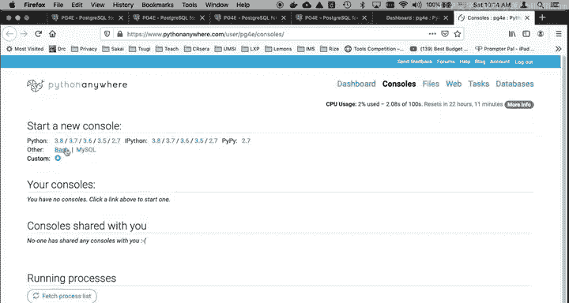

And so here I am， I've got a bash console in its Linux。 there's a number of。PWD。

 I can see my current working directory， I can say LS to see files I already made this file lesson1。

sql cat it cat lesson 1。sqL that shows the contents of a text file cat readme text oh by the way I just said cat R tab you can do tab completion when you're typing a file name on a Linux command which is super cool the other thing you can do is cursor back through your previous commands I'm just pressing the uparrow and so I can do that I can type CDd folder to be in a folder oops CDd folder tab that'll work there's no files in here I can say CDd do do to go up a folder I can go back into my folder CD folder tab then I say CDdtd if I say CD squiggle or till that goes back to your home folder。

No matter where you're at， and so you'll see a lot of my commands tell you to do CD tilted and then CD and it was up folder。

And everyone has a home directory， like in most commands where there's a folder that you can write to and it's based on the name of your account。

And then let's see we can do a clear command。Okay， so let's run Postgres， that's just Linux。

 let's run Postgres， let me show you one more thing before we go running Postgres。嗯。

I'm going to go open another tab of files。 This is super cool。 and so here is the text editor。

 one of the things you might want to do is type some of your SQl into files This is the text editor you see where we're in our home folder you see a lot of files with dots you see the folder that I made you see a lot of files and dots so I go into folder you see that right so you see where I'm in the folder I can go back up to my home folder these dots are like configuration files and folders。

 virtual environments if you're doing Python these are all files generally leave these dot files around and you can see the readB do Txt that was placed there by。

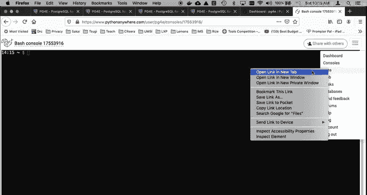

Them by Python anywhere when I got first set up and then lesson1 do SQL， which is a file that。

And I can edit the file and I can save it okay， and so I'm not going to do that。

 I'm just going to cancel it and leave。Yeah， on the page because I don't want to change it so you can edit these files。

 you can also edit the files。

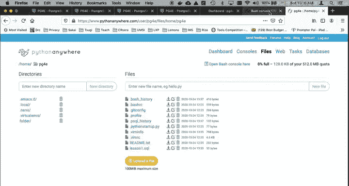

And oops come back， Come back。各位。You can use editors like Nano or VI。I'm a VI person。

AndSo there we go， and so you can edit these files， et cetera， et cetera， et cetera。Let's。

Remember what's inside lesson one SqL because sometimes you might want to do your homework by editing a text file and putting your SQL into it because you got to do it over and over and over again。

 you make a little tiny mistake。 Sometimes I just like cut and paste from my desktop tool into。

The command line， but here we are， we are in Linux and now we are going to connect to Postgres。

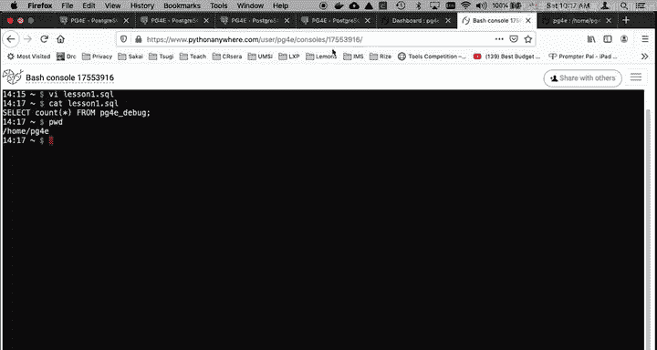

So I give you in pretty much everys。Every young。Assignment， I give you the Postgres command。

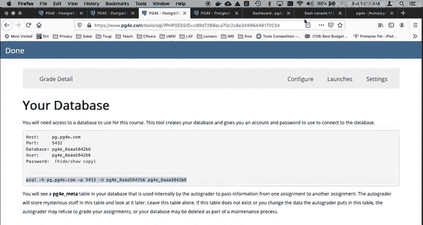

And so we'll just type it。That that's got my account and my database， they're the same thing。

 you get exactly one account and one database and it's very limited。

 and then you got to type the password。

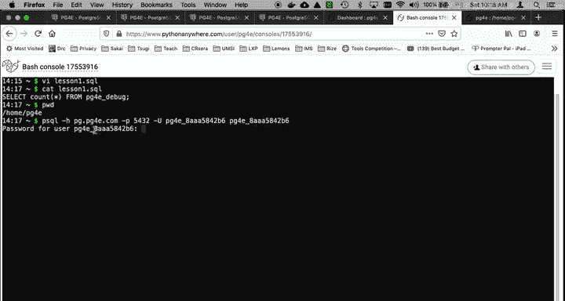

But there is this convenient。Copy button， which puts the password in a paste buffer。

 and I am now logged in。 So there I am。 I'm talking to Postgres。

 I am running on a this Postgres client is running in England and it's talking to a server that is in Amazon somewhere owned by the University of Michigan。

 Okay so the commands you can type here， depend on PSQL that is the Postgress command line client。

 Some of the commands are that start with a slash， for example， like the Dt command。

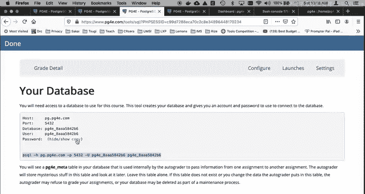

That shows all the tables that you have。That's a PSQL command if you're in a different client。

 you can't always type the DT command。Right， but you can also type。Select。SQL commands， right。

 select star from。I always like to make my。P G4 E underscore debug。

So it's going to give me all the rows from the table now that' this is SQL you end it with a Scolon and it's SQL and you're going to learn a lot SQL in this class because that's what this class is about and there you go and you see that SQL and that you'll see later what the purpose of that is if you want to run from that file you type slash I lesson。

1。 SQL。And you can run that so that says go run that SQL commands， command or commands from Le 1。sqL。

 and you can also press up arrow here as well and rerun the previous command。

And again I'm not going to do the whole class here。

 I just wanted to show you how to get in and now I'm going to show you how to get out。ed backslash Q。

 again， this， this I， backslash I， the things that。start with the backslash Those are PQL commands。

 They are not SQL commands。 this select statement， no matter what client you're using。

 there'll be a way to send SQL， these are talking to the local client， okay。

And if you use a some kind of a command line or a full screen， you will see that。

 So I type back slash cube and then I am out of。I'm out of PSQL and back into Linux。 Now。

 if I go back to consoles， just leave here。 I go back to consoles。

 you'll see that I've got this console。 So's I'm not really logged out。 And in the free account。

 you only get two console。 So you can come back and you will see when I come back to this console。

 I'm back where I started。 If I want to actually exit out of the console。

 You can go back to consoles。

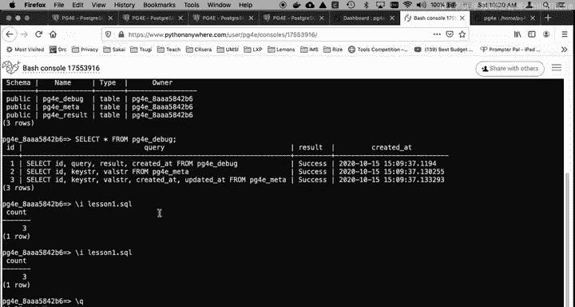

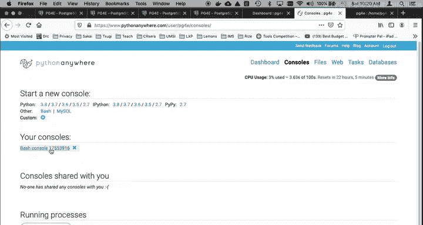

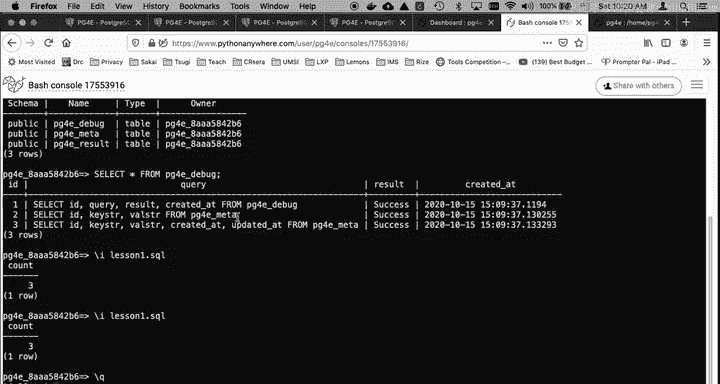

And you can say get rid of it or from within the console。

 you can type control D or you can type exit。

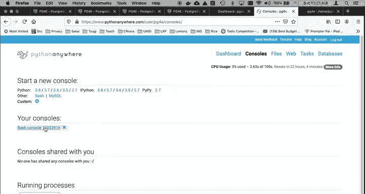

And then it's logged out， so now it's gone and if you come back here to consoles， you will see。

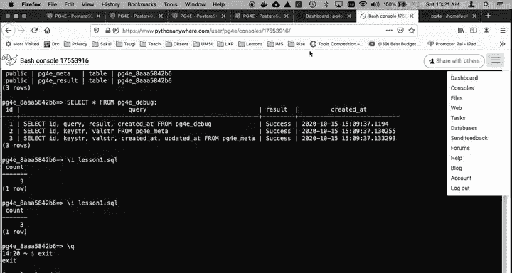

You don't have any consoles so youd start another one with bash and so again。

 thanks to the great folks at Python Any for giving us such a cool way to play with Linux and SQL for this class and I hope you found this video useful cheers。

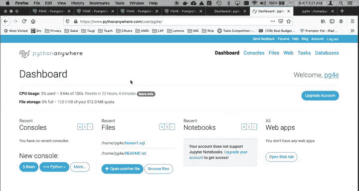