# PostgreSQL for Everybody：P68：SQL倒排索引构建演示 🗂️

在本教程中，我们将学习如何使用SQL构建一个倒排索引。倒排索引是一种数据结构，常用于搜索引擎，它通过关键词来映射到包含该关键词的文档。我们将从基础概念开始，逐步演示如何通过SQL语句创建和使用这种索引。

## 概述

上一节我们介绍了倒排索引的基本概念。本节中，我们将通过具体的SQL命令，一步步演示如何从原始文档数据构建一个倒排索引，并利用它进行高效的查询。

## 核心函数：`string_to_array` 与 `unnest`

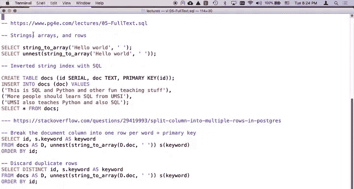

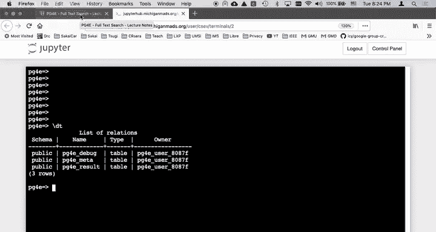

构建倒排索引的关键在于两个SQL函数：`string_to_array` 和 `unnest`。

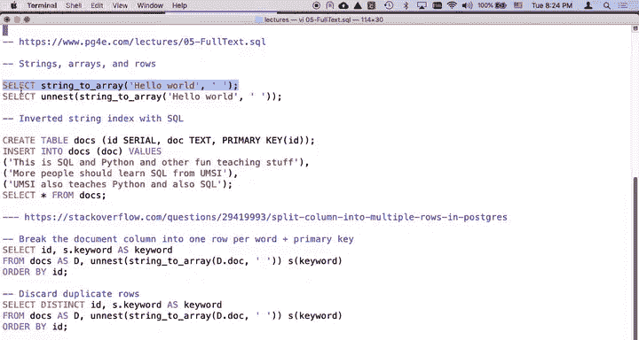

*   `string_to_array` 函数类似于Python中的 `split` 方法。它接收一个字符串和一个分隔符，并将字符串分割成一个数组。
    **公式**：`string_to_array(string, delimiter) -> array`
*   `unnest` 函数则将一个数组“展开”为多行数据。它将水平排列的数组元素转换为垂直排列的多行记录。

以下是一个简单的示例，展示了这两个函数的组合效果：

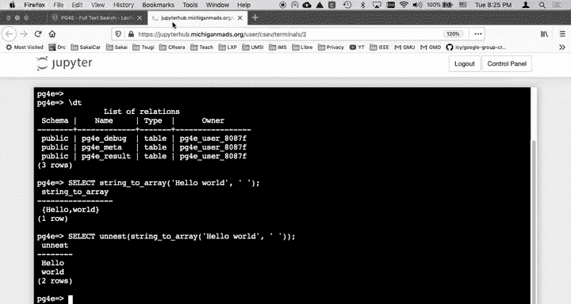

```sql
SELECT unnest(string_to_array('hello world', ' '));
```

执行上述代码会得到两行结果：一行是 `hello`，另一行是 `world`。

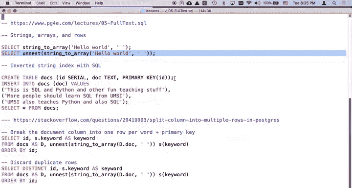

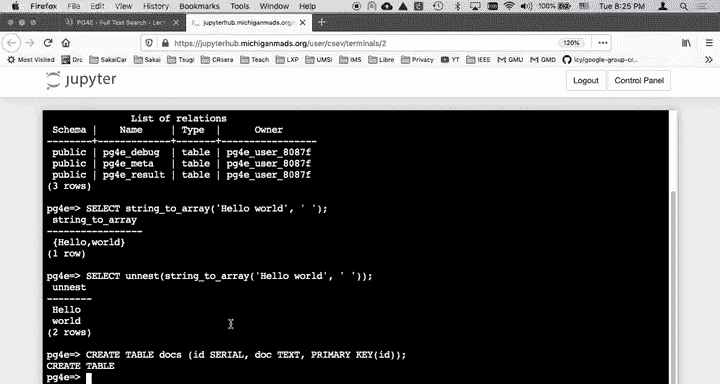

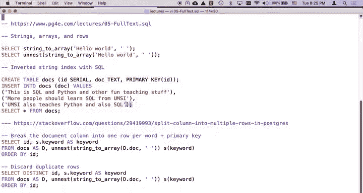

## 创建示例数据表

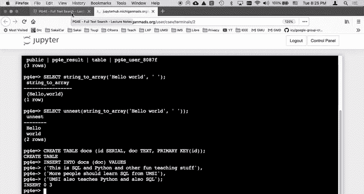

首先，我们需要一个存储文档的表。以下是创建 `docs` 表并插入三条示例文档的SQL命令：

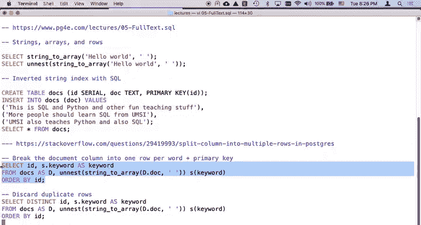

```sql
CREATE TABLE docs (
    id SERIAL PRIMARY KEY,
    doc TEXT
);

INSERT INTO docs (doc) VALUES
('This is SQL and Python and other fun teaching stuff'),
('More people should learn SQL from UMSI'),
('UMSI also teaches Python and also SQL');
```

这样我们就有了一个包含三篇文本文档的表。

## 构建倒排索引

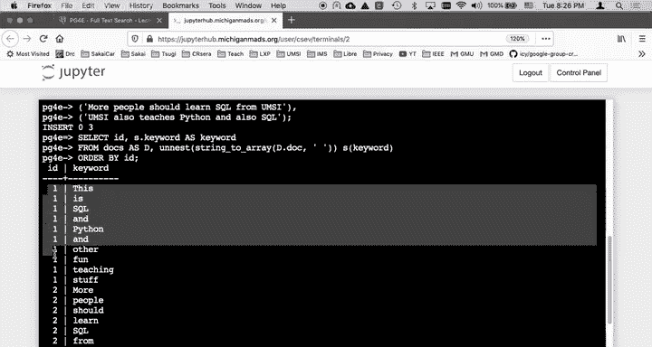

接下来是核心步骤：将文档拆分为单词，并建立单词到文档ID的映射。

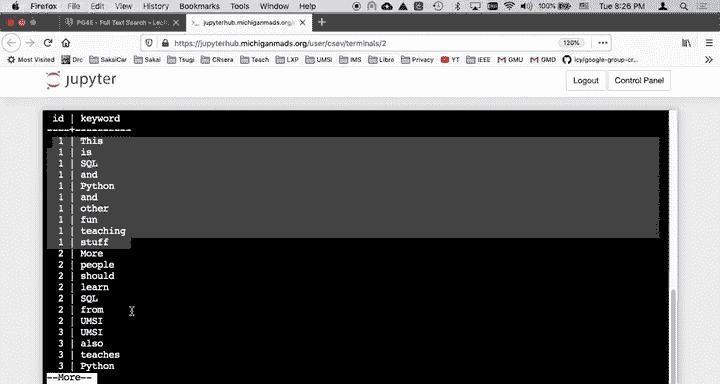

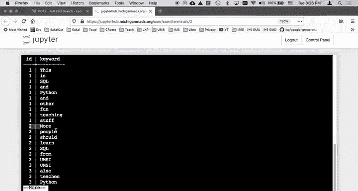

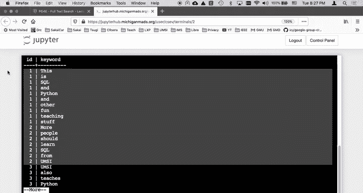

### 第一步：拆分文档并关联ID

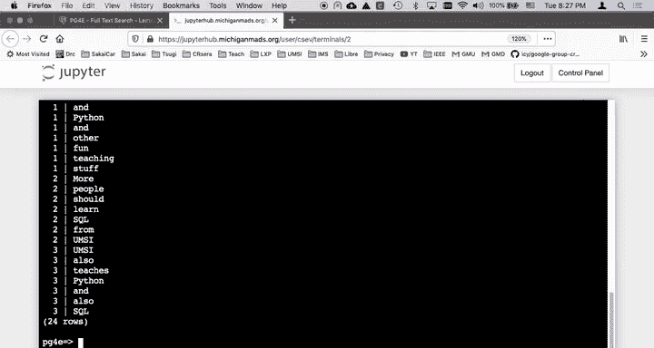

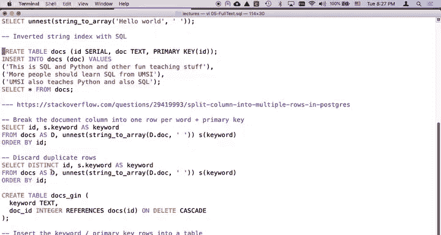

我们可以通过一个 `SELECT` 语句，将每个文档的单词拆分出来，同时保留其原始文档的ID。

```sql
SELECT id, unnest(string_to_array(doc, ' ')) AS keyword
FROM docs
ORDER BY id;
```

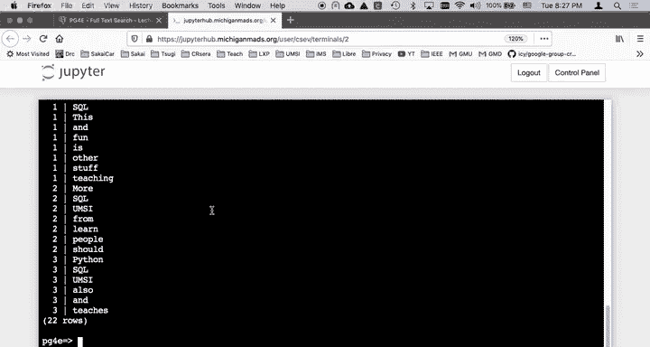

这条语句会为每个单词生成一行记录，包含该单词所属文档的 `id` 和单词本身 `keyword`。原始的三行文档数据被扩展成了多行单词数据。

### 第二步：去除重复并创建索引表

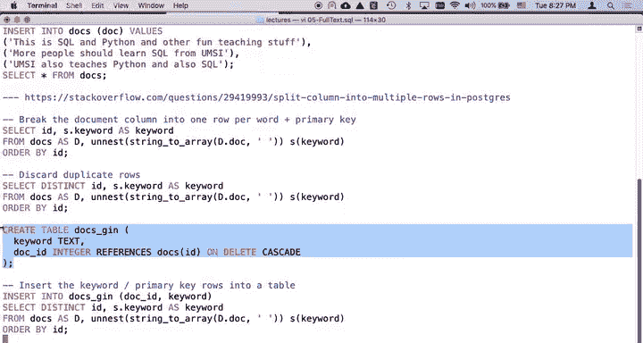

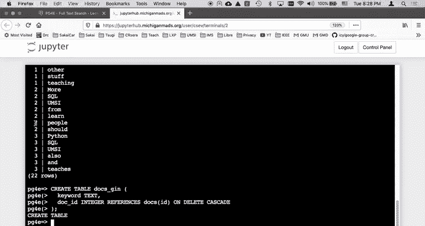

同一个单词可能在同一个文档中出现多次。为了创建高效的索引，我们通常需要去除文档内重复的单词。这时可以使用 `SELECT DISTINCT`。

现在，我们创建一个专门存储倒排索引的表 `docs_gin`，并将去重后的结果插入其中。

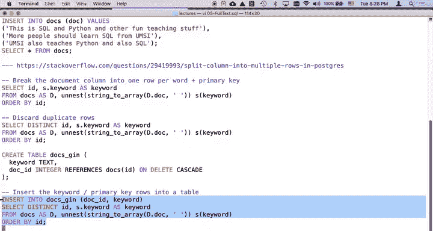

```sql
CREATE TABLE docs_gin (
    keyword TEXT,
    doc_id INTEGER REFERENCES docs(id) ON DELETE CASCADE
);

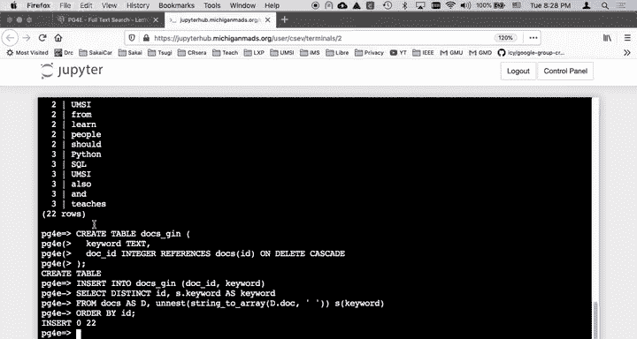

INSERT INTO docs_gin (doc_id, keyword)
SELECT DISTINCT id, unnest(string_to_array(doc, ' ')) AS keyword
FROM docs;
```

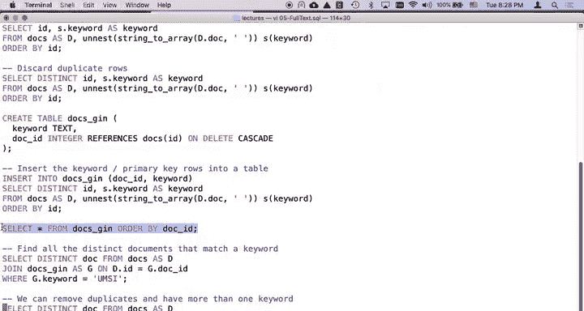

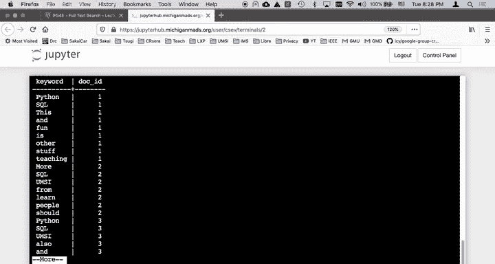

执行后，`docs_gin` 表就成为了我们的倒排索引。它存储了每个关键词以及出现该关键词的文档ID。

## 使用倒排索引进行查询

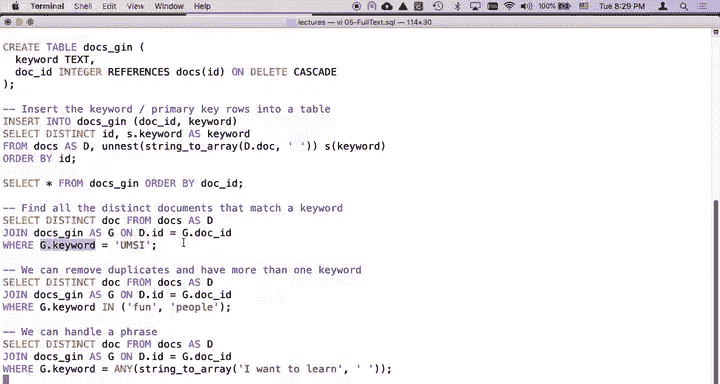

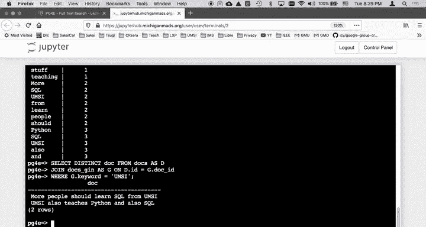

索引构建完成后，我们就可以利用它进行快速查询。

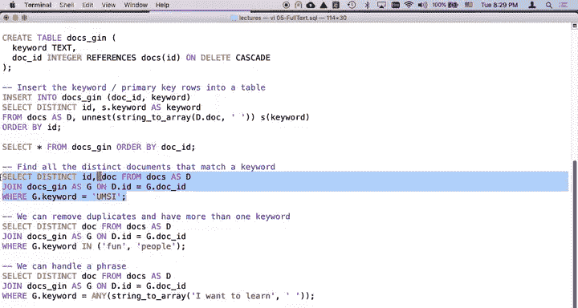

### 基础查询：查找包含特定关键词的文档

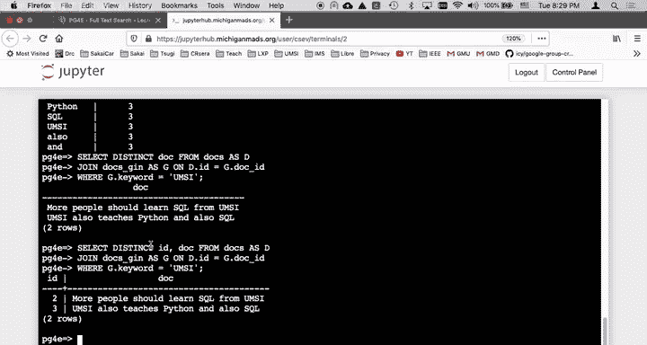

要查找所有包含关键词 “UMSI” 的文档，我们可以通过 `JOIN` 连接 `docs` 表和 `docs_gin` 索引表。

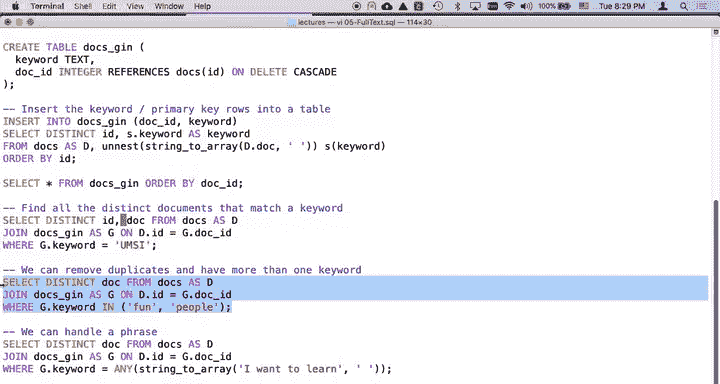

```sql
SELECT DISTINCT d.id, d.doc
FROM docs AS d
JOIN docs_gin AS g ON d.id = g.doc_id
WHERE g.keyword = 'UMSI';
```

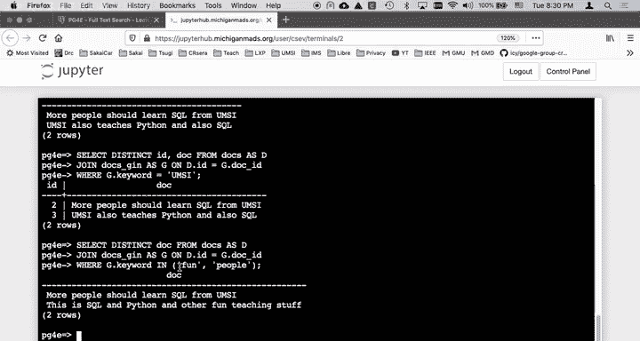

### 使用 `IN` 操作符进行多关键词查询

我们也可以查找包含任意一个给定关键词的文档。以下是使用 `IN` 操作符的示例：

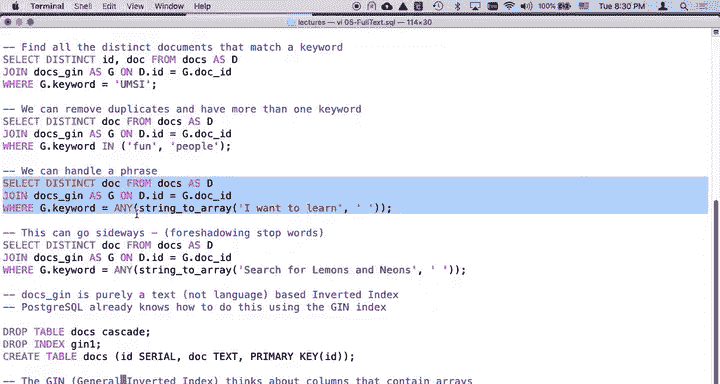

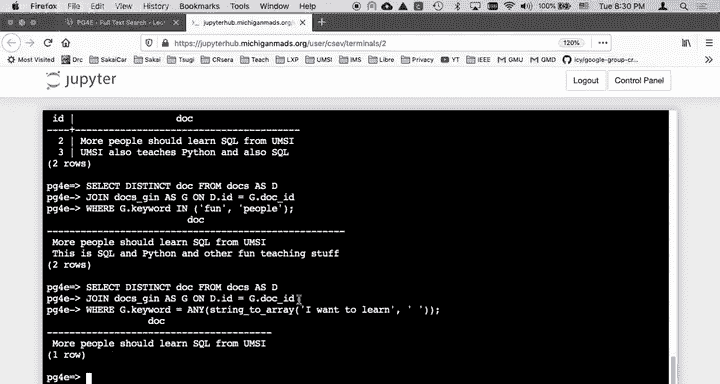

```sql
SELECT DISTINCT d.id, d.doc
FROM docs AS d
JOIN docs_gin AS g ON d.id = g.doc_id
WHERE g.keyword IN ('fun', 'people');
```

### 处理短语查询

有时我们想查询包含一个短语中任意单词的文档。可以结合 `string_to_array` 和 `ANY` 操作符来实现。

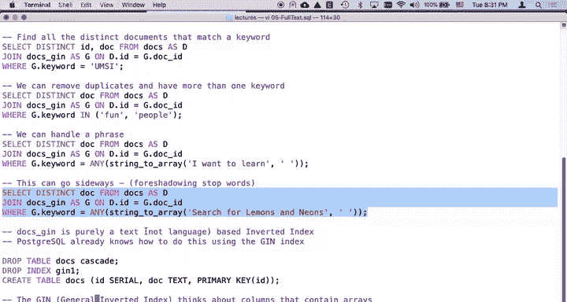

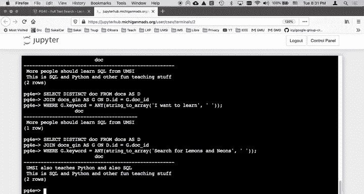

```sql
SELECT DISTINCT d.id, d.doc
FROM docs AS d
JOIN docs_gin AS g ON d.id = g.doc_id
WHERE g.keyword = ANY(string_to_array('I want to learn', ' '));
```

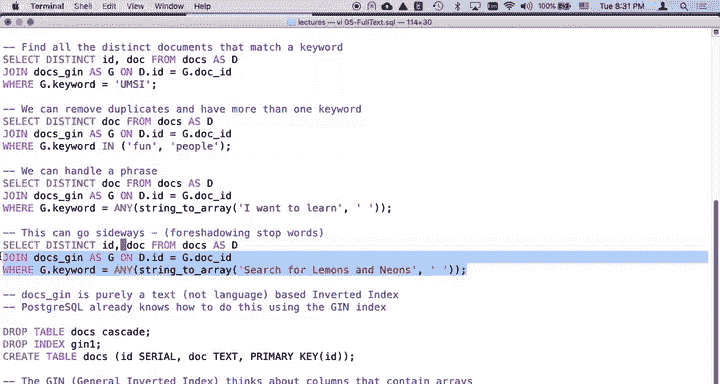

这条查询会找到包含 “I”、“want”、“to” 或 “learn” 中任意一个单词的文档。

### 停用词问题

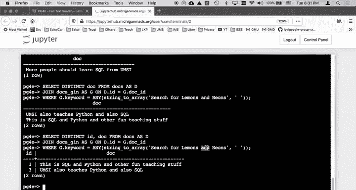

需要注意的是，像 “and”、“the”、“is” 这样的常见词（停用词）可能会在查询中产生大量无关结果。例如，查询 “search for lemons and neon” 时，匹配到的可能仅仅是文档中的 “and” 这个词，而非我们真正感兴趣的 “lemons” 或 “neon”。在实际应用中，通常需要在构建索引时过滤掉这些停用词。

## 理解查询逻辑

为了更清晰地理解倒排索引的工作原理，我们可以单独查看索引表的内容。以下查询直接展示了关键词 “UMSI” 到文档ID的映射：

```sql
SELECT keyword, doc_id
FROM docs_gin AS g
WHERE g.keyword = 'UMSI';
```

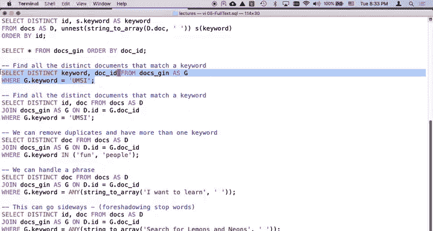

得到文档ID列表后，再通过 `JOIN` 到 `docs` 表获取完整的文档内容。这种先通过索引缩小范围，再获取详细信息的两步过程，正是倒排索引提升查询效率的核心。

## 总结

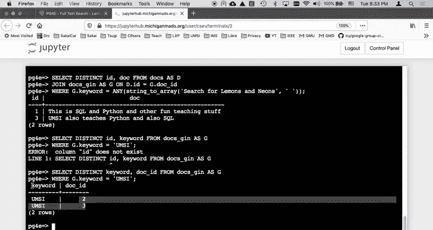

本节课中我们一起学习了如何使用SQL手动构建一个倒排索引。我们掌握了关键步骤：
1.  使用 `string_to_array` 和 `unnest` 函数将文档拆分为单词。
2.  创建索引表并利用 `SELECT DISTINCT ... INSERT INTO ...` 插入去重后的单词-文档ID对。
3.  通过 `JOIN` 索引表和使用 `WHERE`、`IN`、`ANY` 等子句进行高效的全文检索。
这个过程清晰地展示了倒排索引从构建到应用的全貌，是理解数据库全文搜索功能的基础。