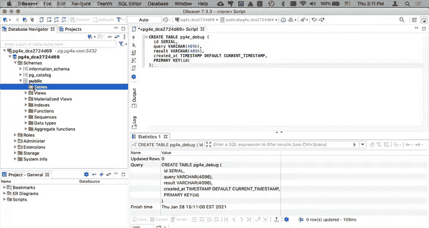
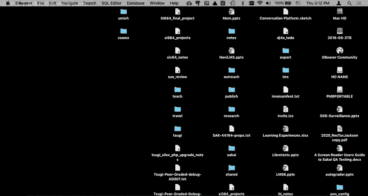
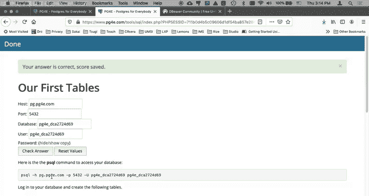

# 密歇根大学《给所有人的PostgreSQL课（数据库设计、SQL、JSON和NLP、ES）｜PostgreSQL for Everybody》中英字幕 - P6：5_使用DBeaver客户端执行SQL命令.zh_en - GPT中英字幕课程资源 - BV1tj421U7GK

Hello and welcome to another Postgre for everybody walk through in this walk through。

 we're going to use instead of。The Python anywhere or a Jupiter notebook or even the terminal on your own computer and using PSQL。

 I'm just going to show you a way to use a sort of high。

A desktop application to work with your SQL database。

 so I've already installed this D Beaaver and it's free， it's open source。

 it's quite amazing and it works pretty well not all of these kinds of desktop applications work well with Postgres databases like there's a PG admin that doesn't work well because your database doesn't have enough power but D Beaaver seems to work out okay。

So the way these navigators work is they have what are called connections and this this can do not just Postgres。

 but as you'll see a whole bunch of things。 so you you'll find your way into your assignment and we're going to do this very first assignment and I can do this use this in the database。

 but this is a PSQL is a client。 We're not going to use that our client is going to be Dbeaver。

 So what we're going to do is we're going to go into D Beaaver and we're going to say add another connection and it already knows about Postgres Now if you first install it it may have to install some drivers。

 don't worry about it。 See like that works just P you fine and the way you go so。

This you're going to go back now to the data that you've got and the data that you've got。

 I'll show that to you in a second is you say Pg。pg4E。com。 That's the name of the host。

 the database name we're going to copy and paste that back and forth。

 The database and the user are the same。So we'll do that and that so that came from your assignment and we can copy our password and come over here and put our password in。

 and that's literally all you need to do and it's again。

 we're creating a client through which we can send SQL commands。Okay， and so here we go。

 we've got this， it says this is a database connection and within that you could have more than one databases。

 but right now we only have one database and if you keep opening this up，You see that the schemas。

These two， the PG catalog。This has got stuff that Postgres needs。

 and sometimes you'll will'll actually select from that， but don't hurt it。

 And the information schema。 That's like its own internal stuff。 Leave that alone。

 The place that you work here is in this public。 and we're going to be making tables。

 which currently we have done， right。And so we want to run some SQL and so we've got if you have a bunch of these over here on the left hand side。

 you want to have this one selected and then you click on this thing that basically says。

Make a new SQL script and so this is a script and a destination of the SQL commands。嗯。

Is that database， and so if we go back to our assignment now。

And we look this create table is the first thing that we're supposed to do。

 so I'll say create table right， and then I am going to hit the go button that's what this little execute SQL statement is and look at that it told us that it worked and now if we pop this open。

There's supposed to be a table here。It should be I need to refresh it or something。

Refresh the connection， we'll refresh the connection。Oh， somehow I lost my connection。

Refresh the connection。

So I refresh the connection and then we see the Pg4 E Dbug。 Okay。

 so now I'm going to go and do another script this script is right here。

That there theres my little public window there。And I'll go to the next thing I'm supposed to do。

 I'm going to run another create T table， Pg4 E result， and I type that in here and then I run it。

And then I come over here， and I。Do a refresh。And I see that one。

It wouldn't hurt if it auto refreshed， but wait we got。

 we're only going to do a few of these and then and you'll also。

 so then what we're going to do is we've created these two tables and we're going to do check answer。

 which is going to check to see if our tables were created because my auto grader is now connecting to that database connection。

And。At this point， if we do another refresh。You see that this meta table showed up just just like it said it was going to do。

 And so you've now created this。And so there's things you can do and can't do an import exporter a little bit different。

 And so most of the assignments you will be able to do in this class using either a D beaver or another client or PSQL I tend to focus on PSQL because sometimes you're working on a server and you're logged into that server and you got to type the commands in command line。

 And so there's nothing wrong with knowing how to use command line。

 but there's also nothing wrong with knowing how to use a more advanced client。

Okay， so that was just a really quick walk through on how you might use the Beaaver as your client sometimes as a substitute for PSQL or complement PSQL cheers。

