# PostgreSQL for Everybody：6：SQL自然语言索引演示 🗂️

在本节课中，我们将学习如何构建更复杂的自然语言倒排索引。我们将通过处理停用词和词干提取，来优化文本搜索，使其更贴近自然语言的处理方式。

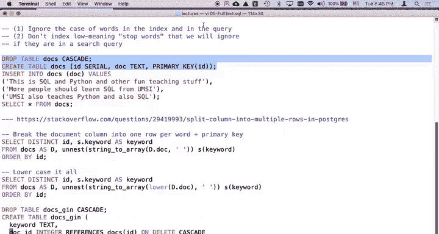

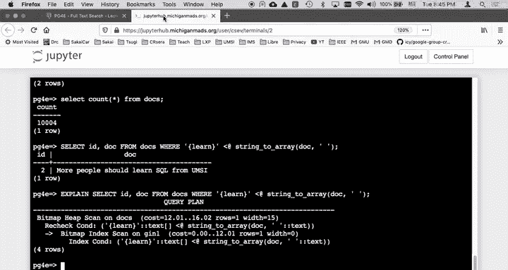

## 概述

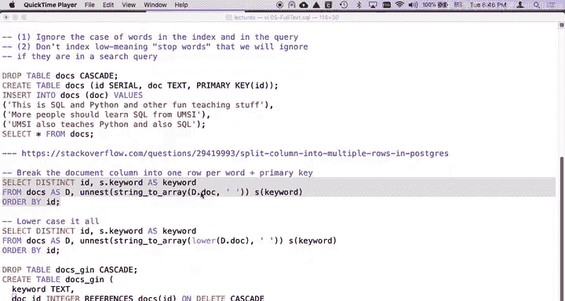

上一节我们介绍了基础的倒排索引。本节中，我们将利用自然语言的特性，通过**转换为小写**、**移除停用词**和**词干提取**来优化索引，从而提升搜索的准确性和效率。

## 准备工作

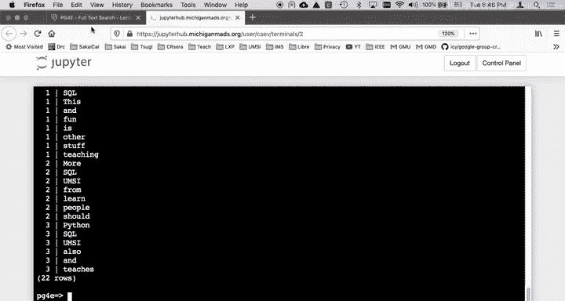

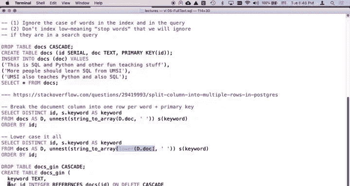


首先，我们需要重新创建示例数据表。虽然可以只删除表中的数据，但为了清晰起见，我们将重建表结构。

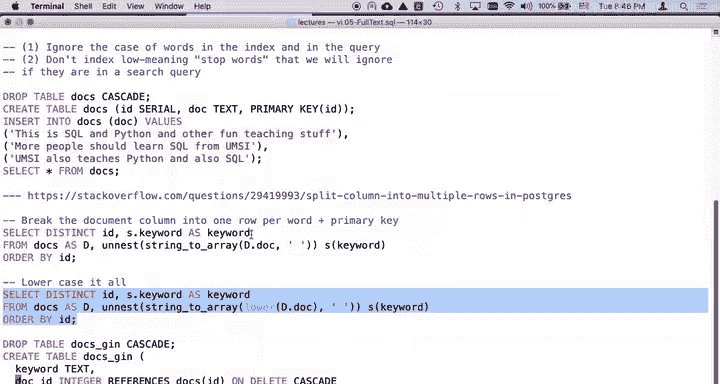

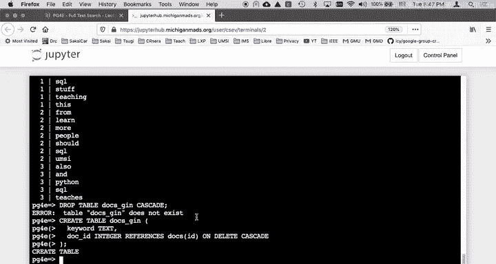

```sql
DROP TABLE IF EXISTS docs CASCADE;
CREATE TABLE docs (
    id SERIAL PRIMARY KEY,
    doc TEXT
);
```

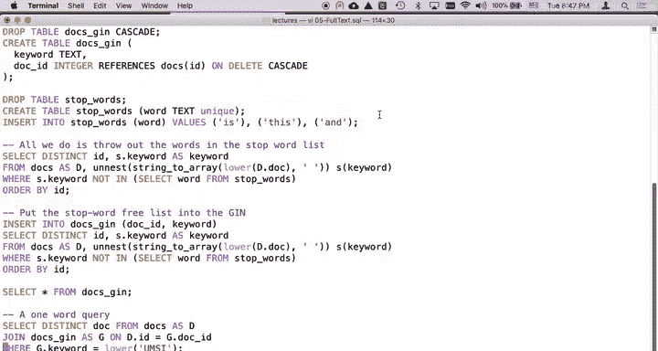

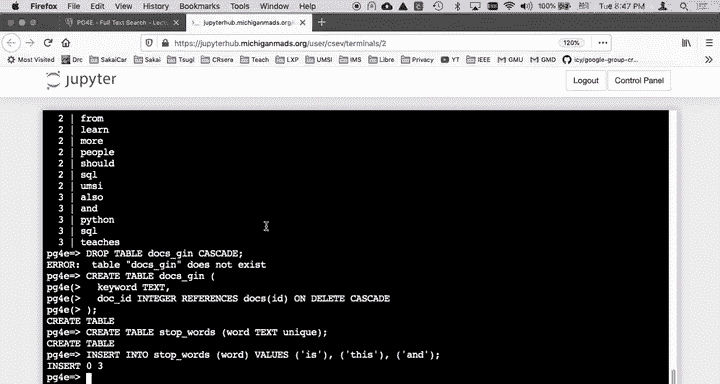

接着，向表中插入三条示例文本记录。

```sql
INSERT INTO docs (doc) VALUES
('This is the first document.'),
('This is the second document.'),
('Learning SQL and Python is fun and teaching is rewarding.');
```

## 转换为小写并分词

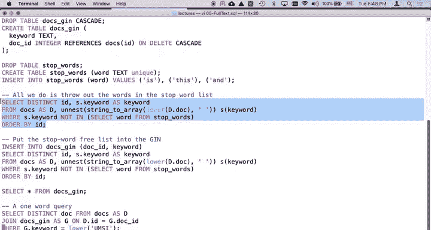

为了消除大小写差异，我们将在分词前将整个文档文本转换为小写。这是构建统一索引的关键第一步。

以下是创建关键词列表的SQL语句，它使用`unnest`和`string_to_array`函数，并在拆分前应用`lower()`函数。

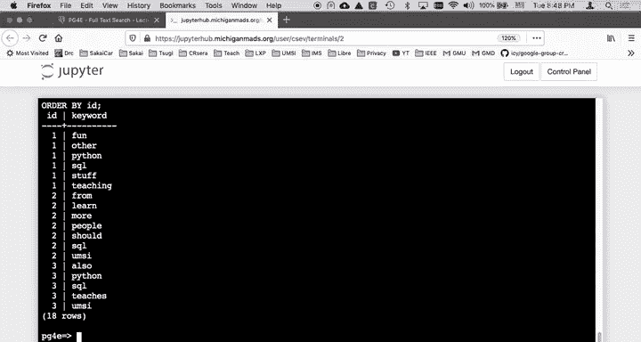

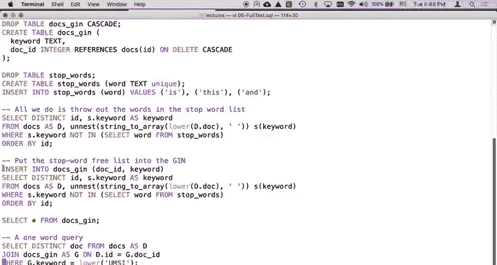

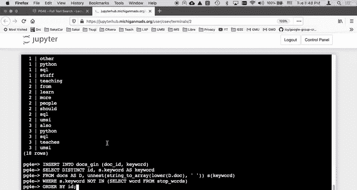

```sql
SELECT DISTINCT id, keyword
FROM docs,
     unnest(string_to_array(lower(doc), ' ')) AS keyword;
```

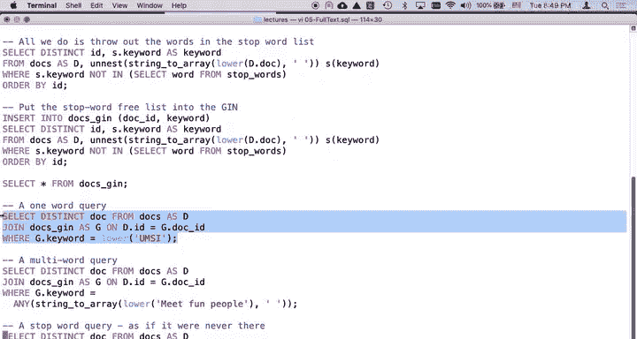

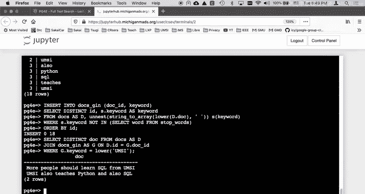

执行后，所有关键词都已转为小写，为后续处理奠定了基础。

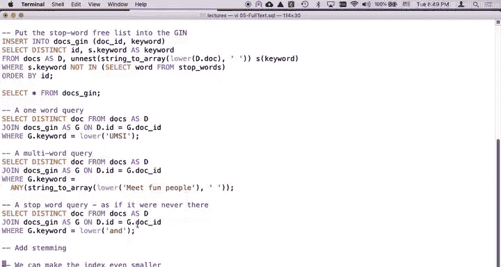

## 创建倒排索引表

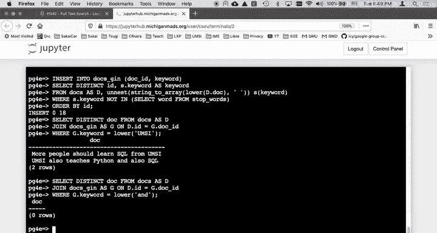

现在，我们创建用于存储倒排索引的表`docs_gin`。

```sql
CREATE TABLE docs_gin (
    keyword TEXT,
    doc_id INTEGER REFERENCES docs(id) ON DELETE CASCADE
);
```

## 处理停用词

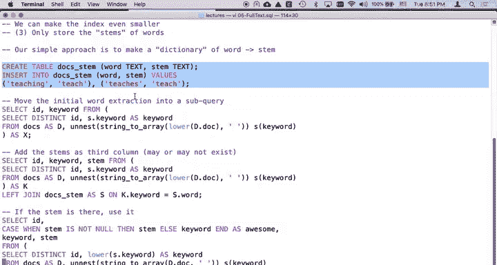

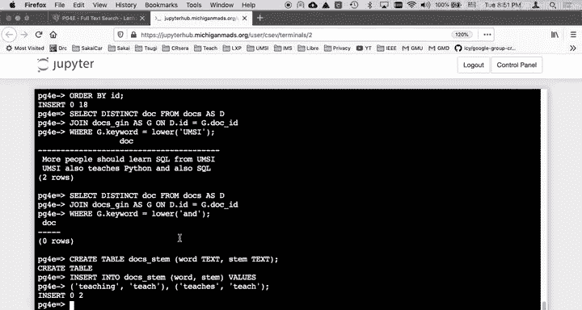

停用词是指在自然语言中频繁出现但本身没有实际搜索意义的词语，例如“and”、“the”、“is”等。移除它们可以精简索引，提高搜索效率。

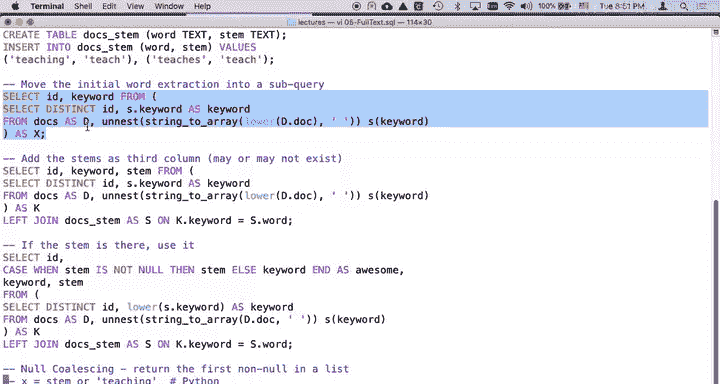

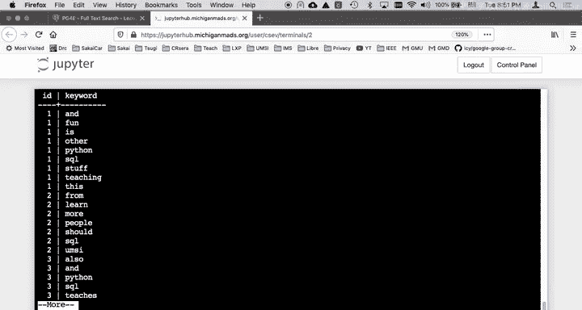

首先，我们创建并填充一个停用词表。

```sql
CREATE TABLE stop_words (word TEXT);
INSERT INTO stop_words (word) VALUES ('is'), ('and'), ('the');
```

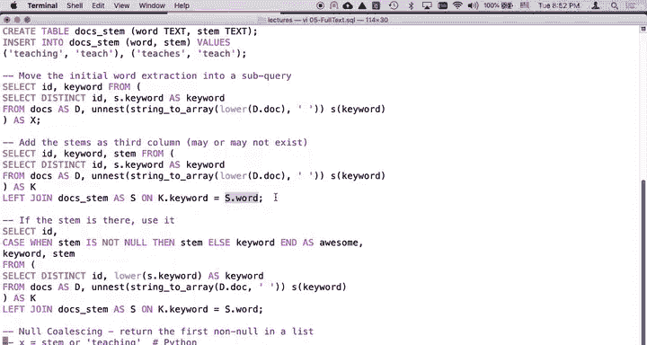

接下来，我们在生成倒排索引时，通过`WHERE`子句过滤掉这些停用词。

```sql
INSERT INTO docs_gin (keyword, doc_id)
SELECT DISTINCT keyword, id
FROM docs,
     unnest(string_to_array(lower(doc), ' ')) AS keyword
WHERE keyword NOT IN (SELECT word FROM stop_words);
```

通过对比可以发现，应用停用词过滤后，索引的行数减少了，索引变得更加精简。

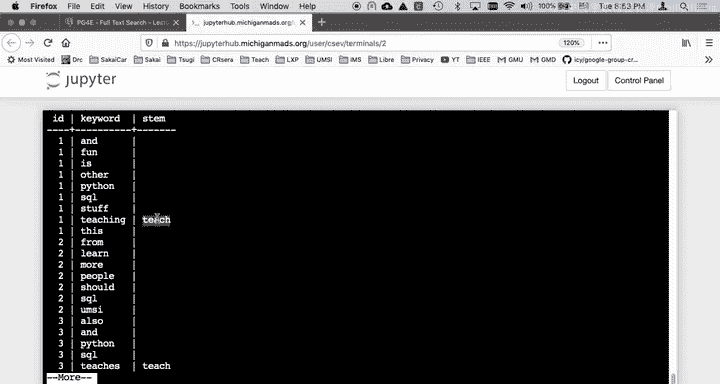

## 词干提取

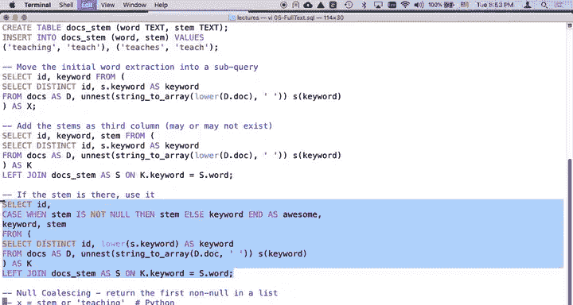

词干提取是将不同形态的单词（如“teaching”、“teaches”）归并到其基本形式（如“teach”）的过程。这能帮助搜索引擎理解这些词本质上是相同的概念。

我们创建一个词干映射表`docs_stem`。

```sql
CREATE TABLE docs_stem (word TEXT, stem TEXT);
INSERT INTO docs_stem (word, stem) VALUES
('teaching', 'teach'),
('teaches', 'teach');
```

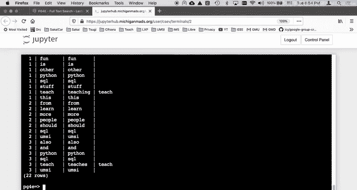

为了将原始关键词映射到其词干形式，我们需要使用`LEFT JOIN`和条件逻辑。

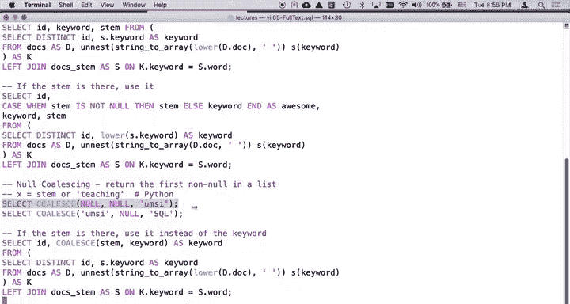

以下是使用`CASE WHEN`语句实现词干优先的查询：

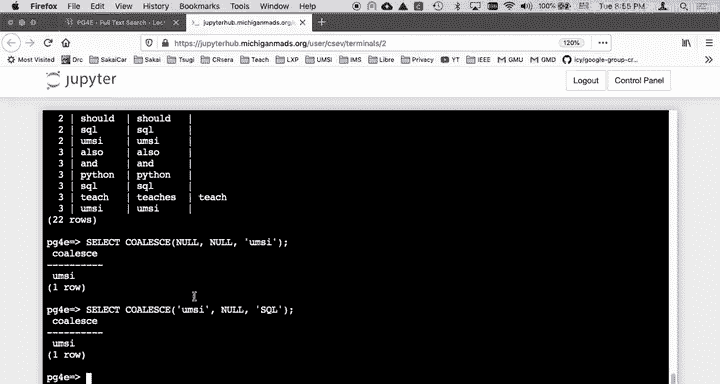

```sql
SELECT
    id,
    CASE
        WHEN s.stem IS NOT NULL THEN s.stem
        ELSE k.keyword
    END AS awesome
FROM (
    SELECT DISTINCT id, keyword
    FROM docs,
         unnest(string_to_array(lower(doc), ' ')) AS keyword
    WHERE keyword NOT IN (SELECT word FROM stop_words)
) AS k
LEFT JOIN docs_stem AS s ON k.keyword = s.word;
```

还有一种更优雅的方式是使用`COALESCE()`函数，它返回参数列表中第一个非NULL的值。

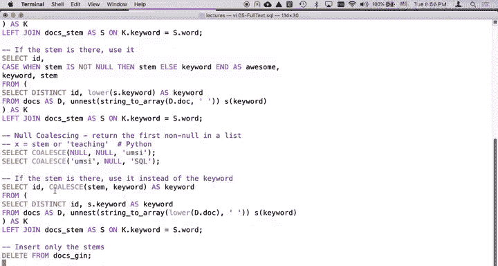

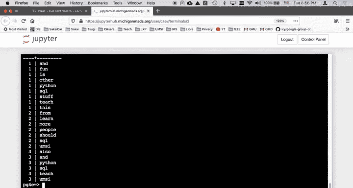

```sql
SELECT
    id,
    COALESCE(s.stem, k.keyword) AS awesome
FROM (
    SELECT DISTINCT id, keyword
    FROM docs,
         unnest(string_to_array(lower(doc), ' ')) AS keyword
    WHERE keyword NOT IN (SELECT word FROM stop_words)
) AS k
LEFT JOIN docs_stem AS s ON k.keyword = s.word;
```

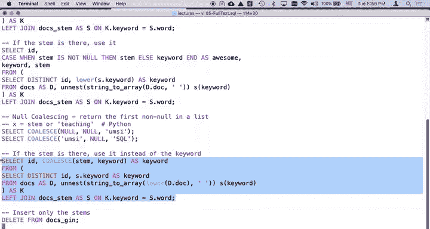

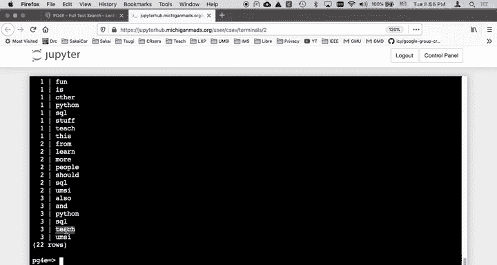

`COALESCE(s.stem, k.keyword)` 的含义是：如果`s.stem`存在（非NULL），就使用词干；否则，回退使用原始关键词。

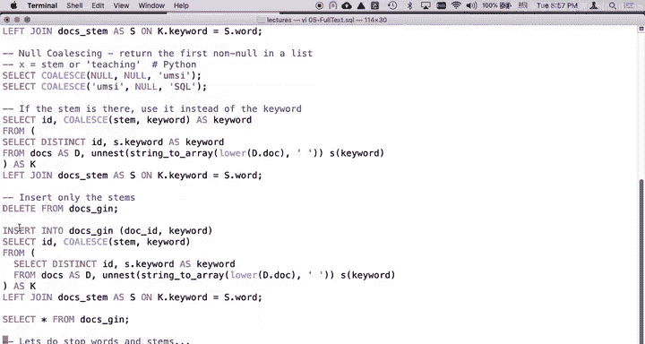

## 构建最终的优化索引

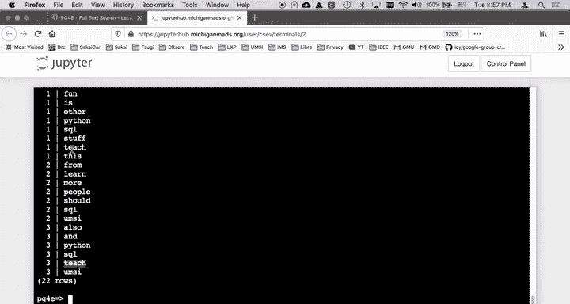

现在，我们将整合了停用词移除和词干提取的查询结果，插入到最终的倒排索引表中。

```sql
DELETE FROM docs_gin; -- 清空旧数据

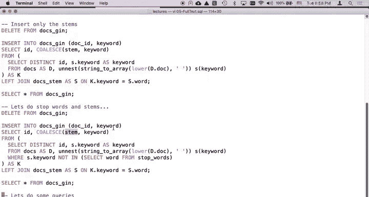

INSERT INTO docs_gin (keyword, doc_id)
SELECT
    id,
    COALESCE(s.stem, k.keyword) AS awesome
FROM (
    SELECT DISTINCT id, keyword
    FROM docs,
         unnest(string_to_array(lower(doc), ' ')) AS keyword
    WHERE keyword NOT IN (SELECT word FROM stop_words)
) AS k
LEFT JOIN docs_stem AS s ON k.keyword = s.word;
```

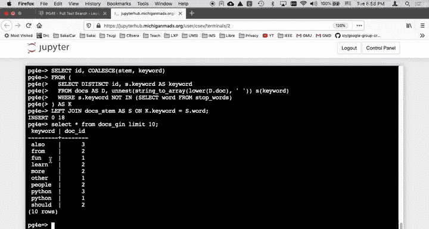

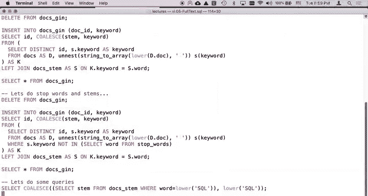

现在，`docs_gin`表中存储的就是经过小写转换、停用词过滤和词干提取后的优化倒排索引。

## 使用优化索引进行查询

在进行搜索时，我们也需要对查询词应用相同的处理逻辑（小写转换和词干提取），以便与索引匹配。

例如，搜索“teaching”时，我们应优先使用其词干“teach”进行查找。

```sql
SELECT DISTINCT d.id, d.doc
FROM docs d
JOIN docs_gin g ON d.id = g.doc_id
WHERE g.keyword = COALESCE(
    (SELECT stem FROM docs_stem WHERE word = LOWER('teaching')),
    LOWER('teaching')
);
```

这个查询会找到包含“teaching”或其词干形式“teach”的所有文档。这种将搜索词转换为其词干的过程，在技术上称为“归并”。

## 总结

本节课中我们一起学习了如何构建一个强大的自然语言倒排索引。我们通过三个关键步骤优化了索引：
1.  **统一小写**：消除了大小写差异。
2.  **移除停用词**：过滤了无实际搜索意义的常见词，使索引更精简。
3.  **词干提取**：将不同词形的单词归并到其基本形式，提升了搜索的召回率。

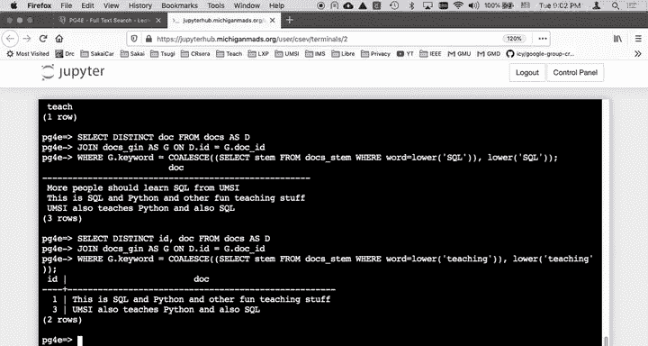

这些技术共同作用，使得基于SQL的全文搜索能够更智能、更高效地处理人类自然语言。